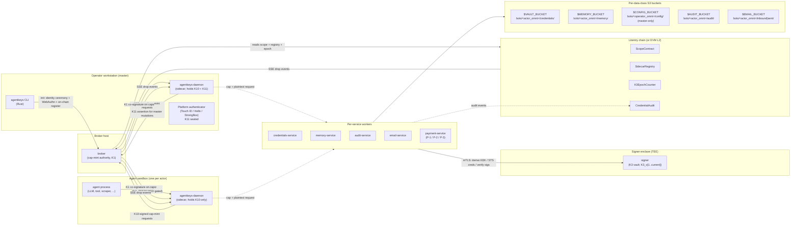
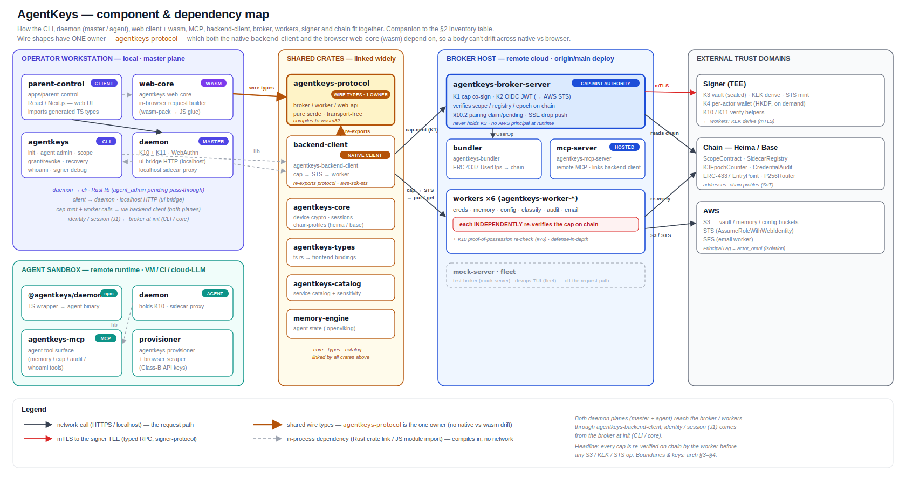
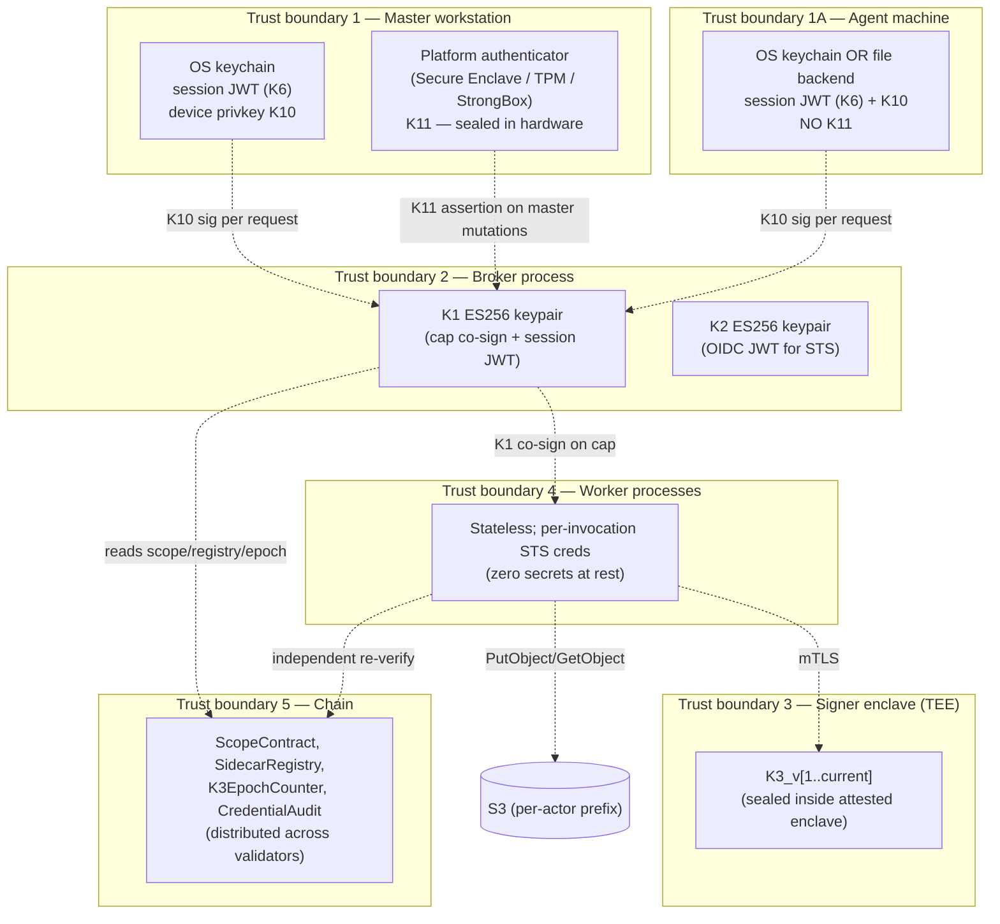
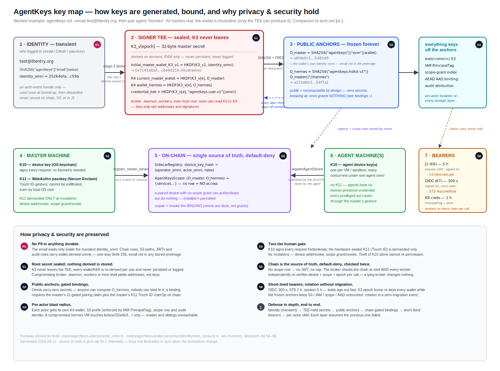
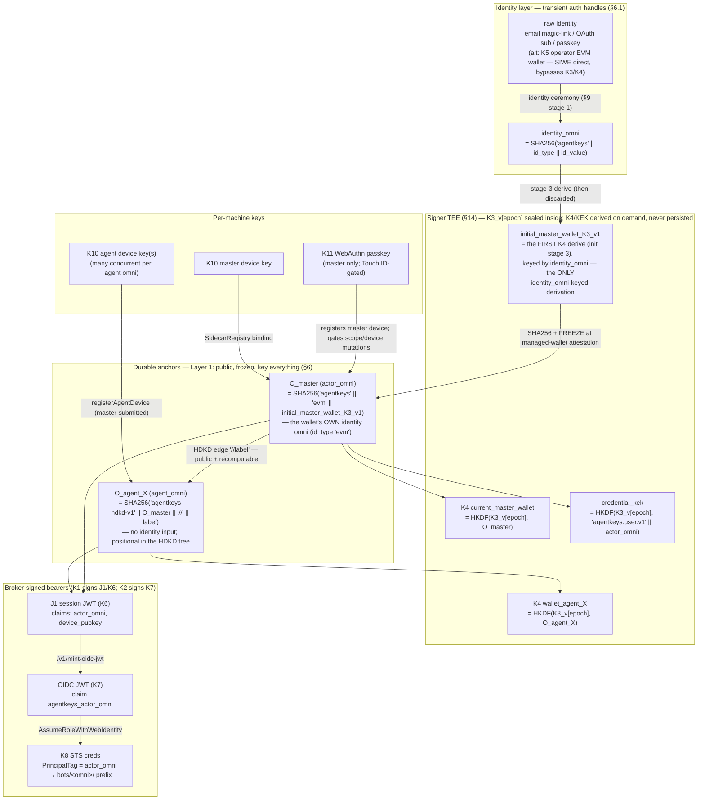

# AgentKeys — Architecture v2

**Audience:** anyone who needs to reason about AgentKeys end-to-end — new contributors, security reviewers, ops, design partners. Single visual + textual reference. Diagrams are Mermaid where possible so they render in GitHub and copy cleanly into Figma.

**Status:** canonical v2. This revision reflects the **completed** state of:

- **issue #89** — v2 stage 1: sovereign sidecar + on-chain identity + credentials-service worker + K11 WebAuthn enforcement for master mutations
- **issue #90** — v2 stage 2: multi-master-device M-of-N recovery quorum + audit/memory/email workers + K3 rotation operational runbook
- **issue #88** — payment-service worker (P-1 / P-2 / P-3 modes)

This doc supersedes the pre-v2 architecture revision (which described a single-binary mock-server / `S3CredentialBackend` deployment that has been retired). Anything labelled "pre-v2" is historical.

**Companion docs** (canonical for their narrow surface; this doc links to them rather than duplicating):

- [`signer-protocol.md`](spec/signer-protocol.md) — typed RPC over mTLS to the signer
- [`threat-model-key-custody.md`](spec/threat-model-key-custody.md) — retroactive-confidentiality + key custody position
- [`credential-backend-interface.md`](spec/credential-backend-interface.md) — `CredentialBackend` trait surface (now backed by the sidecar)
- [`agent-background-job-harness.md`](spec/agent-background-job-harness.md) — portable, agent-agnostic contract for running/streaming/controlling on-device background work (task = process group; deterministic `/v1/jobs` list + group-kill; #340)
- `plan/v2-issues/issue-v2-stage-1-foundation.md` (operator-internal) — stage 1 deliverable inventory (shipped)
- `plan/v2-issues/issue-v2-stage-2-hardening.md` (operator-internal) — stage 2 deliverable inventory (shipped)
- `plan/v2-issues/issue-payment-service-deferred.md` (operator-internal) — payment-service design (shipped per modes P-1/P-2/P-3)

---

## 1. System overview



**Five independent trust boundaries, five independent products:**

| Service | Public hostname (typical) | Holds | Role |
|---|---|---|---|
| **Broker** | `broker.litentry.org` | K1 (cap co-sign + session JWT keypair), K2 (OIDC JWT keypair), audit DB | Mints cap-tokens after on-chain scope / registry / epoch verification; mints OIDC JWTs for AWS STS; never holds K3, no AWS principals at runtime |
| **Signer** (TEE) | `signer.litentry.org` | K3_v[1..current] (sealed in enclave) | KEK derivation, STS-credential minting, K10/K11 verification helpers; replaceable across TEE vendors via attested mTLS |
| **Workers** (per data class) | `creds.litentry.org`, `memory.litentry.org`, `audit.litentry.org`, `mail.litentry.org`, `pay.litentry.org` | None at rest (stateless executors); per-invocation STS creds | Per-data-class operations; verify caps against on-chain truth before touching S3 / SES / payment rails |
| **Daemon (sidecar)** | localhost only (Unix socket / pod IP) | K10 device key; K11 WebAuthn (master only); plaintext credential cache (TTL-bounded) | Caller authentication; cap-token minting on agent's behalf; credential injection at localhost; per-call host-local controls |
| **Chain** | Litentry parachain (or EVM L2 fallback) | ScopeContract, SidecarRegistry, K3EpochCounter, CredentialAudit | Single source of truth for "who is bound to which actor", "what scope this agent has", "which K3 epoch is current", and "what audit anchors have landed" |

**Why five?** Compromise of any one boundary yields bounded damage. The blast-radius table in §3 enumerates this; the design's headline property is "any single trust root compromised yields bounded damage, never a system-wide takeover."

> **Deployed stacks (one hostname set per stack):** the table above shows the Heima prod hostnames. The same five-boundary unit set is replicated per environment with a suffix on every hostname/IAM/bucket identifier — the CI/test fleet (`-test`, `-test-N`; #265) and the **Base prod partner-tier stack** (`-base`, e.g. `broker-base.litentry.org`, on its own EC2 with `AGENTKEYS_CHAIN=base`; #282 D5 dual-stack — Heima stays the consumer free tier). Stack inventory + naming matrix: the internal cloud-bootstrap operator runbook §0.2–§0.4 (`operator-docs/`, not in the OSS mirror).

---

## 2. Component inventory

[](assets/component-architecture.svg)

The map above ([`assets/component-architecture.svg`](assets/component-architecture.svg)) is the visual companion to the table below: it groups every crate/app by the trust zone it runs in (operator workstation · agent sandbox · shared crates · broker host · external domains) and draws the four edge classes — **network** (HTTPS/localhost), **mTLS** (signer), **shared wire types** (`agentkeys-protocol` is the one owner, so a body can't drift across native vs wasm — see the [issue #203 rule](../AGENTS.md)), and **in-process dependency** (Rust crate link / JS import). Note `agentkeys-daemon` links `agentkeys-cli` as a library (the `agent_admin` pending pass-through), and the React client builds protocol-correct requests through the `agentkeys-web-core` wasm module; both daemon planes reach the broker/workers via `agentkeys-backend-client`. Keep it in sync with this table when a crate or edge changes.

| # | Component | Where it runs | Primary job |
|---|---|---|---|
| 1 | `agentkeys` CLI | Operator's workstation (master device) | Init, agent management, scope grant/revoke, recovery, whoami, signer debug |
| 2 | `agentkeys-daemon` (master) | Operator's workstation | Holds K10 + K11; mints master-only cap requests; runs WebAuthn ceremonies; localhost sidecar proxy |
| 3 | `agentkeys-daemon` (agent) | Agent sandbox (VM / container / CI runner / cloud LLM env) | Holds K10 (no K11); localhost sidecar proxy; cap-mint per agent operation |
| 4 | Broker | EC2 / Cloud Run / equivalent | Cap-mint authority; reads scope/registry/epoch from chain; SSE drop event push |
| 5 | Signer | TEE (AMD SEV-SNP / Intel TDX / AWS Nitro Enclave) | K3 vault; KEK derivation; STS minting; K10/K11 verification |
| 6 | `credentials-service` worker | Lambda + API Gateway OR axum microservice OR Cloudflare Worker | Encrypt/decrypt API credentials; AES-256-GCM under per-user KEK |
| 7 | `memory-service` worker | Same form-factors | R/W agent state in S3; high-frequency reads via STS |
| 8 | `audit-service` worker | Same form-factors | Append to per-actor audit log; chain-anchor Merkle roots (tier A) or direct-write per event (tier C) |
| 9 | `email-service` worker | Lambda + SES routing | Send via SES from operator's domain; receive via S3-backed inbox |
| 10 | `payment-service` worker | Same form-factors + mode-dependent payment rails | Execute payments via P-1 (service-pool), P-2 (escrow), or P-3 (direct) modes; strict one-shot CAS-burn |
| 11 | Chain | Litentry parachain (deploy target); EVM L2 fallback | ScopeContract, SidecarRegistry, K3EpochCounter, CredentialAudit |
| 12 | Provisioner orchestrator | Inside agent sandbox, subprocess of daemon | Spawns browser automation to provision per-service API keys |
| 13 | Browser scraper | Subprocess of #12 | Playwright/CDP signup flows for Class-B upstreams |
| 14 | `@agentkeys/daemon` npm package | Cloud LLM environments (ChatGPT / Claude.ai) | TS wrapper around prebuilt #3 binary |

---

## 3. Trust boundaries (where keys live, who can see them)



**Compromise-blast-radius table:**

| Boundary breached | What attacker gains | What they CANNOT do |
|---|---|---|
| **Master workstation** (host root, no biometric presence) | Stolen J1 session JWT (replay until TTL); stolen K10 (cap-mint as that actor until rotation). Caps bounded by per-actor scope and host-local quotas. | **Cannot complete WebAuthn ceremony** — K11 sealed in hardware requires biometric/PIN. Cannot mutate scope, bind a new device, or rotate K10. Cannot reach other operators' material. **(Holds for *hardware*-registered masters only; a master enrolled with a software P-256 passkey has a file-key blast radius — CI/test only — until attestation verification lands, §22b.1.)** |
| **Master workstation** (full compromise WITH biometric presence) | Above plus: mutate scope, bind new master device, rotate K10. Bounded to this human's actor tree only. Visible on chain (sovereign mode) — every mutation is auditable. | Cannot reach other operators. Recovery via surviving master devices revokes attacker's bindings within ~60s. |
| **Agent machine** (sandbox root) | Stolen agent K10; stolen session JWT (TTL-bounded). Per-actor binding (Codex finding #1) means caps minted under this K10 are tagged for THIS actor only — cannot impersonate a sibling agent. | Cannot rebind without a fresh pairing the master claims; cannot mutate scope; cannot reach master wallet's material; cannot reach sibling agents. PrincipalTag at STS prevents cross-agent S3 access. |
| **Broker process** | Mint session JWTs; co-sign caps with K1. Caps still require valid K10 sig from a registered device AND valid K11 assertion for master mutations — broker compromise alone cannot fabricate a usable master-mutation cap. | Cannot derive K4 wallets (no K3); cannot decrypt credentials (no KEK access without mTLS + chain epoch check); cannot reach AWS (no IAM principal). |
| **Signer enclave (TEE)** (assuming attestation defeated) | Derive any K4 wallet; derive any KEK. Catastrophic for credentials. | Cannot mint session JWTs (no K1); cannot mint caps (no K1); cannot bypass per-actor binding on chain (registry is authoritative); cannot reach S3 directly. TEE attestation is the threat-model floor — see §13. |
| **One worker** (e.g., credentials-service compromised) | Decrypt credentials for that data class for callers presenting valid caps (cannot forge caps). Cannot read other data classes (separate workers, separate IAM, separate prefixes — §17). | Cannot mutate scope; cannot bind devices; cannot mint own caps; cannot reach memory / audit / email / payment data; cannot escalate to other workers. |
| **AWS account** | This operator's data scope only. Per-actor PrincipalTag prefix isolation contains it: agent A's S3 prefix is inaccessible from agent B's STS session. | None of the chain-anchored boundaries above. AWS compromise is its own incident class; mitigated by independent chain anchoring of audit. |
| **One chain validator** (one out of N) | Standard chain-security properties (≤51% honest); ScopeContract / SidecarRegistry / K3EpochCounter remain authoritative as long as honest-majority holds. | Cannot bypass on-chain verification at workers (workers re-verify against the chain on every cap). |

**Headline guarantee:** every cap-bearing request is independently re-verified against the chain by the worker before any S3 / KEK / STS / payment operation. A cap carries a **K10 proof-of-possession** the worker re-verifies independently of the broker (issue #76, §22b.4) — the K10 private key never reaches the broker, so once enforcement is on (`AGENTKEYS_WORKER_REQUIRE_CAP_POP=1`, after every actor's K10 is registered) **broker-only compromise cannot mint a usable cap**; during the staged rollout the PoP is verified-when-present (the agent path is already covered); chain-only compromise cannot bypass K10 / K11 / actor-binding gates; signer-only compromise cannot escape the chain's scope assertions.

---

## 4. Key inventory

| # | Key | Type | Lives in | Role | Lifecycle |
|---|---|---|---|---|---|
| K1 | Broker session + cap keypair | ES256 (P-256) | Broker process; pinned file at `BROKER_SESSION_KEYPAIR_PATH` (mode 0600); pubkey published at `<broker>/.well-known/jwks.json` | Signs session JWTs; co-signs cap-tokens after on-chain verification | Generated at first broker boot; preserved across re-deploys; rotation procedure documented in operator runbook |
| K2 | Broker OIDC keypair | ES256 (P-256) | Broker process; pinned file at `BROKER_OIDC_KEYPAIR_PATH` (mode 0600); pubkey published at `<broker>/.well-known/jwks.json` | Signs OIDC JWTs minted by `/v1/mint-oidc-jwt`; consumed by AWS STS / GCP WIF / Tencent CAM via `AssumeRoleWithWebIdentity` | Generated at first broker boot; rotation requires re-registering OIDC provider in cloud IAM |
| K3 | Signer master secret | 32 raw bytes per epoch | Sealed inside attested TEE (AMD SEV-SNP / Intel TDX / AWS Nitro Enclave); never exfiltrated to host | HKDF input for K4 derivation (per-actor wallet) and KEK derivation (per-user credential key) | Generated once at signer-attested-launch; rotatable per K3EpochCounter on chain (§16); historical epochs retained inside enclave for decrypt of pre-rotation blobs |
| K4 | Per-actor derived wallet | secp256k1 | Signer process (in memory only, derived on demand from K3_v[epoch] + actor_omni; never persisted, never logged, never returned over wire) | The managed EVM wallet for one node in the HDKD actor tree. Used by signer to mint STS credentials for that actor; never directly held by daemon / broker / worker | Deterministic: same `(K3_v[epoch], actor_omni)` → same wallet; rotates with K3 epoch |
| K5 | EVM-wallet (operator-held) | secp256k1 | Operator's MetaMask / hardware wallet / `cast wallet` | Identity authenticator for `identity_type = evm`; signs SIWE directly. Bypasses K3/K4 entirely for EVM-identity operators. | Operator-managed; outside AgentKeys' lifecycle |
| K6 | Session JWT | JWT (ES256 by K1) | OS keychain on the operator's workstation; daemon memory at runtime | Bearer credential for `/v1/cap/*`, `/v1/mint-oidc-jwt`, `/v1/wallet/*` | TTL = `BROKER_SESSION_JWT_TTL_SECONDS` (default 18000s = 5h); re-mint requires re-running identity ceremony |
| K7 | OIDC JWT | JWT (ES256 by K2) | Daemon memory only (transient — fetched per mint) | Web-identity token for `AssumeRoleWithWebIdentity` against AWS STS | TTL = `BROKER_OIDC_JWT_TTL_SECONDS` (bounded `[60, 3600]`, default 300s) |
| K8 | AWS / cloud temp credentials | STS access key + secret + session token | Daemon or worker memory only (transient — refetched per operation) | Direct AWS API access scoped by PrincipalTag = `agentkeys_actor_omni` | 1-hour TTL (STS default); short by design |
| K9 | DKIM keypair (per outbound domain) | Ed25519 | email-service worker (sealed in same TEE / KMS pattern as K3) | DKIM signing for outbound mail from operator's domain (`bots.litentry.org` etc.); pubkey published as DNS TXT at `<selector>._domainkey.<domain>` | Generated per-domain at deployment; rotation per CAA / DKIM operational practice |
| K10 | Device key | secp256k1 | **Master**: OS keychain (TouchID/Hello-backed); **Agent**: OS keychain when available, else file backend at `~/.agentkeys/daemon-<wallet>/session.json` (mode 0600) per §11.2. Pubkey registered on chain via `SidecarRegistry.register_*_device(...)`. | Per-request signature on cap-mint requests — gates broker AND worker call surface | Generated at init stage 0 (§9); bound by master init (§10.1) OR agent bootstrap (§10.2); rotated via `agentkeys device rotate` (§10.3.2) or via re-init |
| K11 | WebAuthn platform-authenticator credential | Per-RP credential (EC P-256 on macOS Secure Enclave / Windows TPM / Android StrongBox) | **Master only.** Sealed inside the platform authenticator's hardware boundary; cannot be exfiltrated even by host-OS root. Credential ID registered on chain via `SidecarRegistry`. | Hardware-attested user-presence proof at **master mutations**: scope grant/revoke, device add/revoke, K10 rotation. NOT used per-request — K10 covers per-call signing without biometric. | Created at master init; survives K10 rotations; revoked by destroying the credential or removing it from `SidecarRegistry`. Multiple K11s register concurrently for multi-master-device deployments (§10.5). |

**Notation throughout the rest of this doc:** the K1–K11 indices are referenced directly so any flow can be unambiguously mapped back to which key signed/verified/wrapped what.

### 4.1 Key relationship map — what derives what, what vouches for what

[](assets/key-map.svg)

The annotated poster above ([`assets/key-map.svg`](assets/key-map.svg)) adds the privacy/security rationale (P1, S1–S6) to the derivation graph below; keep both in sync when a derivation changes.



Reading the map: **identity flows into the anchors exactly once.** The email's `identity_omni` seeds one derivation (the initial wallet, init stage 3) and is then discarded; the frozen `O_master` is that wallet's *own* identity omni (same `SHA256(client_id || id_type || id_value)` shape, with the wallet as the identity — `identity/omni_account.rs`); every later derivation (agent omnis, K4 wallets, KEK) keys off anchors, never off the email. Agents have no identity input at all — their omni is positional. K9 (DKIM) is standalone per-domain mail signing, deliberately outside this graph.

Worked example — `agentkeys init --email test@litentry.org`, then pair agent `hermes` (wallet illustrative since only the TEE can produce it; all hashes real):

```text
identity_omni = SHA256("agentkeys"||"email"||"test@litentry.org")
              = 25264bfa70c1ca14236e31ca55e84dcba6aed6fb7d8663b748f21fafcc0ac59b   (transient)
initial_master_wallet_K3_v1  (signer-internal HKDF keyed by identity_omni; illustrative)
              = 0x7c41e8a3b5d2f0c694a1d8e2b37f5a09c6e4d21b
O_master      = SHA256("agentkeys"||"evm"||"0x7c41e8a3b5d2f0c694a1d8e2b37f5a09c6e4d21b")
              = a8fde0c55de542e2c7e151cefa670697569fefc4abf784b9a732f5ac3b5d81d9   (FROZEN)
O_hermes      = SHA256("agentkeys-hdkd-v1" || O_master_raw32 || "//hermes")
              = a152e6b37b01bc48b609efbb32e33055eb2cb555f60166784a1b81020a54f7a1
wallet_hermes = HKDF(K3_v[epoch], O_hermes)                  (signer-internal, on demand)
S3 prefixes:    bots/a8fde0c5…/ (master)        bots/a152e6b3…/ (hermes)
```

---

## 5. Canonical names (one concept, one canonical spelling)

Pinned to disambiguate the same value showing up under different labels across components. **Use the canonical column** in every new doc, runbook, CLI output, and commit message; the alias column lists every spelling that exists today so a reader chasing one of them can find their way back. Per `AGENTS.md` → "Terminology-source-of-truth rule", if you introduce a name not in this table, either add the alias row here or rename the call site to match the canonical name in the same change.

> **Deployed addresses** for every contract named here live in the chain profile [`crates/agentkeys-core/chain-profiles/heima.json`](../crates/agentkeys-core/chain-profiles/heima.json) (`.contracts[]` + `contract_set_version`) — the machine source of truth (#251), mirrored to `scripts/operator-workstation.env` for shell tooling. Test-set addresses live in `scripts/operator-workstation.test.env` (authoritative; synced one-way to the `TEST_*` GitHub secrets by `scripts/ci-set-github-secrets.sh`); wallet EOAs live in the env files. The human registry — design/version/ABI/cutover prose + the full **source-of-truth hierarchy** — is [`spec/deployed-contracts.md`](spec/deployed-contracts.md). Docs **anchor** to those sources, never copy: a literal contract address in any tracked `.md` is CI-rejected by the doc-literal gate in `scripts/check-deployed-contracts-sync.sh`. The operator-facing **wallet/contract/funding map** (key custody tiers, prod-vs-test sets side by side, the funding-flow diagram, "which wallet do I fund") is [`chain-setup.md` §Wallets](chain-setup.md#wallets-contracts--funding-map-prod--test).

| Canonical name | Identity | Aliases seen in the codebase / docs |
|---|---|---|
| `actor_omni` | **The durable per-actor cryptographic anchor.** `SHA256("agentkeys" \|\| "evm" \|\| initial_master_wallet_K3_v1)`. **Frozen at the first managed-wallet attestation** (the wallet-bind); never rotates with K3, never changes with wallet rotation. The Layer 1 identifier per §6. | `omni_account` (JWT claim + CLI `whoami` field), `agentkeys_actor_omni` (AWS PrincipalTag key), `OMNI_A` / `OMNI_B` (demo shell vars). |
| `managed-wallet attestation` | **The stage-3 proof that the operator controls the derived managed wallet (K4).** The signer (TEE) produces an EIP-191 signature over the broker's challenge *on the wallet's behalf*; the broker verifies and mints the long-lived session JWT (J1); **`actor_omni` freezes here**. The operator never holds the wallet key — this is NOT a user-wallet sign-in. Distinct from the **K5 / `evm`-identity path** (§4 K5, §10.1), where the operator signs SIWE *directly* with their own MetaMask / hardware wallet (genuine Sign-In With Ethereum). | User-facing: **"activate your managed wallet"**. Small technical note: **SIWE / EIP-191, signer-performed** (the broker round-trip is SIWE-shaped). Aliases seen today: `SIWE → J1`, `SIWE round-trip`, `SIWE-bind`, "wallet attestation". |
| `current_master_wallet` | **The current chain identity** = `HKDF(K3_v[current_epoch], O_master)`. Rotates each K3 epoch. Appears on chain as `msg.sender` in sovereign mode. The Layer 2 identifier per §6. | `master_wallet`, `wallet_address` (JWT claim shape pre-rotation), `MASTER_WALLET` (demo shell var). When historical K3 epochs are in scope, qualify with `master_wallet_K3_v[N]`. |
| `identity_omni` | **The transient identity omni** — `SHA256("agentkeys" \|\| identity_type \|\| identity_value)`. Used internally by the broker between init and the managed-wallet attestation; never carried in a post-attestation JWT (J1). | `identity_omni_email` / `identity_omni_oauth2` (when narrowing to a specific identity type), `identity omni` (init-flow CLI log line). |
| `agent_omni` | **A child actor omni** = `SHA256("agentkeys-hdkd-v1" \|\| O_master \|\| "//<label>")` (issue #144). **Public + recomputable** — anyone with the parent omni + label recomputes it; unforgeability is the master-gated `/v1/agent/pairing/claim` + the master-submitted on-chain binding, NOT a secret. (The "cannot be computed without the parent's master secret" property lives one layer down, at the K4 wallet `HKDF(K3_v[epoch], agent_omni)` in the signer.) Distinct from `master_omni`; both are valid actor_omnis. | `O_master//agent-A`, `O_agent_A` (HDKD-tree notation). |
| `operator` / `master` | **The owner control identity** (master-hub topology, #295/#339): owns the canonical creds + memory + the absorption inbox, authorizes every grant (K11), sees all audit — and **never proxies, never hosts an application** (to consume caps for app work you must be a `delegate`). "operator" is the technical spelling, "master" the role word; both name the same entity. | `master`, `operator_omni`, `O_master`, `operatorMasterWallet`. |
| `delegate` | **A scoped app-serving identity** = `(actor_omni + K10) ⊗ exactly one application` (an MCP server / AI runtime); **always runs a daemon** (the fusion of its cap-proxy + the app host). The spoke in the master-hub topology — it *pulls* the creds/memory it was granted and *pushes* learnings back to the master's inbox. **Code + on-chain selectors keep `agent`** (a full rename is a deferred major-version cutover, master-hub-topology.md §10/§14); `delegate` is the canonical prose/UX word. | `agent`, `agent_omni`, `registerAgentDevice`, `SidecarRegistry` (code / contract — frozen aliases). |
| `AI runtime` | **The external AI application** a `delegate` equips (the thing that reads/writes *through* AgentKeys) — never our own identity. Canonical is **AI runtime**, not bare "runtime" (which already means a worker / a chain / the tokio runtime / a wire arg). | Claude Code, Hermes, xiaozhi; bare "agent" (ambiguous — avoid for the external AI); bare "runtime" (overloaded — avoid). |
| `agentkeys-pair://claim` | **The §10.2 pairing deep-link the device shows as a QR.** `agentkeys-pair://claim?code=<pairing_code>&broker=<broker_url>` — the master scans it (or reads the `code`) and claims via parent-control → `/v1/agent/pairing/claim` against `broker`. Built once in the daemon (`build_pair_deep_link` → `request_artifact.deep_link`); the probe TUI `p` view + the daemon log render it. | pairing deep-link, claim URL, pairing-QR payload. (Removed demo placeholder `agentkeys-pair://device/<uuid>`.) |
| `K3` | The 32 bytes inside the signer enclave that K4 + KEK derivation HKDFs against. Per-epoch via `K3EpochCounter`. | `K3_v[N]` to disambiguate epoch; `master_secret` (signer-internal log term — discouraged). |
| `session JWT` (= K6) | The bearer token at `~/.agentkeys/<id>/session.json` (or OS keychain). Signed by K1. Carries `agentkeys.actor_omni`, `agentkeys.device_pubkey`, `agentkeys.webauthn_cred_id` (master only). The desktop **master** plane (daemon ui-bridge) additionally persists the J1 alongside its coords (`operator_omni` + `device_key_hash`) in `master-session.json` for restart-resume (#220, see the "Restart resumability" note under §22c.3). | `session_jwt`, `J1` (post-attestation bearer), `master-session.json` (the ui-bridge master persistence file, #220), `SESSION_JWT_A` / `SESSION_JWT_B` (demo shell vars). |
| `OIDC JWT` (= K7) | Per-mint short-lived JWT signed by K2; consumed by `AssumeRoleWithWebIdentity`. Carries `agentkeys_actor_omni` claim → AWS session tag. | `oidc_jwt`, `JWT_A` / `JWT_B` (demo shell vars). |
| `cap-token` | The bearer issued by broker authorizing one specific operation (cred-fetch / cred-store / memory-read / audit-append / payment / etc.). Carries K10 sig + K11 assertion (for master mutations) + broker's K1 co-signature. | `cap`, `capability_token`, `op_cap`. |
| `credential_kek` | 32-byte AES-256 key for one operator's credentials. Derived as `HKDF-SHA256(salt="agentkeys.kek-salt.v2", ikm=K3_v[epoch], info="agentkeys.user.v1" \|\| actor_omni)`. | `KEK`, `cred_kek`. |
| `credential_envelope` | Wire format of one stored credential: `1B version (0x04) \|\| 1B k3_epoch \|\| 12B nonce \|\| ciphertext \|\| 16B tag`. Stored at `s3://$VAULT_BUCKET/bots/<operator_omni_hex>/credentials/<service>.enc` — **single-vault, master-sovereign** (`docs/plan/single-vault-credentials.md` (operator-internal)): the operator's vault is the ONLY credentials vault. STORE is master-self only, hard-gated at BOTH the broker (`cred_store_not_master_self`, fires before any chain call) and the worker (defense-in-depth) — the former #228 agent-own vault was removed because a service-granular `cred:<svc>` fetch grant also implied store mintability, letting an agent vault a same-named key that silently shadowed the master-authorized one. A **fetch** — master-self or **delegated** (actor ≠ operator, #216) — reads that one vault: the delegated cap's verified on-chain `cred:<service>` grant is the agent's authorization, and the S3 read runs under the caller-relayed operator-tagged STS (layer-3 IAM unchanged; agent-tagged STS cannot read the operator prefix). AAD binds `(operator_omni, vault_owner_omni = operator_omni, service, k3_epoch)`. Teardown/list stay actor-keyed (list is master-self-only; delegated teardown remains the cleanup verb for legacy pre-single-vault agent prefixes). | `envelope`, `AEAD blob`, `<service>.enc` (S3 key suffix). |
| `vault_bucket` / `memory_bucket` / `config_bucket` / `audit_bucket` / `email_bucket` / `payment_audit_bucket` | One S3 bucket per data class per §17. Per-actor prefix at `bots/<actor_omni_hex>/` (config is per-operator + master-only, #201). | `$VAULT_BUCKET`, `$MEMORY_BUCKET`, `$CONFIG_BUCKET`, `$AUDIT_BUCKET`, `$EMAIL_BUCKET`, `$PAYMENT_AUDIT_BUCKET`. |
| `AGENTKEYS_WORKER_<svc>_URL` | **The canonical env-var family for a worker's base URL** — `AGENTKEYS_WORKER_MEMORY_URL`, `AGENTKEYS_WORKER_AUDIT_URL`, `AGENTKEYS_WORKER_CONFIG_URL`, … Defined in `scripts/operator-workstation.env`; read by the daemon, MCP server, and CLI. (`AGENTKEYS_BROKER_URL` stays bare — the broker is not a worker.) | Legacy bare `AGENTKEYS_MEMORY_URL` / `AGENTKEYS_AUDIT_URL` — retired in code; the hosted MCP server still **accepts them as a fallback** until `setup-mcp-host.sh` rewrites its `mcp.env`. |
| `policy` / `scope` / `namespace` / `category` / `service` (the authorization vocabulary) | **Distinct pipeline stages, NOT synonyms:** **policy** (human intent, off-chain, `DataClass::Config`) → COMPILE → **scope** (on-chain `(operator, actor, serviceHash)` grant, `AgentKeysScope` §19) over **categories/attributes** (the classifier's tag) → **service** (the signed cap string; for memory `service = memory:<ns>`, where **namespace** = the memory category). The unifying unit is the **policy attribute (category)** (`research/universal-gate-pattern.md` (operator-internal) four primitives). Full table + pipeline: [`wiki/policy-scope-namespace.md`](wiki/policy-scope-namespace.md). | Confusions this resolves: "scope" used to mean "namespace" or "policy"; **"tag" = classifier *category*** (≠ the AWS **PrincipalTag** of §17 / [`wiki/tag-based-access.md`](wiki/tag-based-access.md)). |

The most common confusion this table resolves: **`actor_omni` ≠ `current_master_wallet`**. The first is the immutable cryptographic anchor (Layer 1); the second is the rotation-volatile chain identity (Layer 2). Both are derived from K3, but only `actor_omni` survives K3 rotation unchanged. PrincipalTag, S3 paths, AAD, scope index — everywhere v2 keys identity off — uses `actor_omni`, never `current_master_wallet`.

---

## 6. Identity model — three layers + HDKD actor tree

The system uses **three identity layers** to separate concerns that earlier designs collapsed.

### 6.1 Three identity layers

**Layer 1 — Cryptographic anchor (immutable)**

```
actor_omni = SHA256("agentkeys" || "evm" || initial_master_wallet_K3_v1)
```

Frozen at the first managed-wallet attestation (the wallet-bind; SIWE / EIP-191, signer-performed — see §5). For `evm`-identity the bind is a direct operator SIWE instead. Never changes for the lifetime of the account. Survives K3 rotation, wallet rotation, device-set changes, master device replacement. This is the operator's durable identity at the cryptographic anchor.

**Layer 2 — Current chain identity (rotatable)**

```
current_master_wallet = HKDF(K3_v[current_epoch], O_master)
```

Rotates each K3 epoch. The operator's identity on a public chain. In sovereign mode (v2 default per §17): appears as `msg.sender` of operator-signed transactions. Block-explorer + ENS lookups work on this wallet.

**Layer 3 — Operational uses (each identifier where natural)**

| Operational use | Identifier | Why |
|---|---|---|
| Signer-internal K4 derivation | `actor_omni` (L1) | Canonical K4 derivation domain |
| Signer-internal KEK derivation | `actor_omni` (L1) | Stable across K3 rotation; epoch handled by in-blob byte |
| AAD in credential blob envelopes | `actor_omni` (L1) | Binds blob to stable location |
| S3 path: `bots/<X>/<class>/...` | `actor_omni_hex` (L1) | Stable; **ZERO migration on K3 rotation** |
| AWS PrincipalTag | `agentkeys_actor_omni = <actor_omni_hex>` (L1) | Stable; bucket policy never rotates |
| Cap-token `operator_omni` + `agent_omni` fields | `actor_omni` (L1) | Matches scope-index key |
| Scope index in ScopeContract | `actor_omni` (L1) | Stable on-chain key |
| SidecarRegistry entries | `device_pubkey_hash → (operator_omni, actor_omni, ...)` (L1 as value) | Per-actor binding per §3 finding #1 |
| Chain tx signer (`msg.sender`) | Mode-dependent: sovereign → `current_master_wallet` (L2); hosted-relay → relay-wallet | Mode decision per §17 |
| Block-explorer audit trail | Sovereign-only: `current_master_wallet` (L2) | Hosted-relay omits operator wallet by design |
| Payment-from address (on-chain) | Mode-dependent: P-1 service-pool / P-2 escrow / P-3 `current_master_wallet` | Per-mode per §15.5 |

The separation is the design's main conceptual win: Layer 1 stays operationally invariant; Layer 2 decisions (sovereign vs hosted) flip only the chain-submission side; Layer 3 spans both consistently.

### 6.2 HDKD actor tree

Actor omnis form a hard-derived tree rooted at the master. Every node has its own derived wallet:


```
O_master                                wallet_master = HKDF(K3_v[epoch], O_master)
├── O_master//agent-A                   wallet_agent_A = HKDF(K3_v[epoch], O_master//agent-A)
├── O_master//agent-B                   wallet_agent_B = HKDF(K3_v[epoch], O_master//agent-B)
│   └── O_master//agent-B//task-1       (sub-actors under agents)
└── ...
```

The omni-tree edge `//<label>` is **public + recomputable** (issue #144): `O_child = SHA256("agentkeys-hdkd-v1" || O_parent || "//" || label)`. What "cannot be computed without the parent's master secret" is the per-node **wallet** (K4 = `HKDF(K3_v[epoch], O_node)`, derived in the signer) — not the omni node itself. Each node's wallet is a different EVM address; AWS PrincipalTag is per-actor `actor_omni` for prefix isolation. Only the master can *create* a binding for a child omni (the master-gated `/v1/agent/pairing/claim` + the master-submitted `registerAgentDevice`), so a public omni derivation never lets anyone bind a sibling.

**Why per-agent omni (not shared with master):**

1. Per-agent compromise containment — leaked agent K10 touches only that agent's wallet/prefix.
2. First-class audit attribution — audit rows carry `acting_actor_omni`, `parent_chain`, `derivation_path`.
3. Atomic revocation — revoke `O_master//agent-A` alone; master and sibling agents untouched.
4. Tree topology IS the data model — no binding-table abstraction needed.

### 6.3 Identity ≠ actor ≠ machine ≠ capability

| Axis | What it answers | Realized by | Lifecycle |
|---|---|---|---|
| **Identity** | Who is the human? | identity omni (email / OAuth / EVM / passkey) | Recoverable via linked authenticators; identity omnis are ephemeral, masters are durable |
| **Actor** | Master, or which agent? | actor_omni — a node in the HDKD tree | Master derived from identity at first init; agents derived from master via `//<label>` |
| **Machine** | Which physical box is signing right now? | K10 device pubkey (per-machine, per-actor); K11 WebAuthn (master only) | Per-box at init/rotation |
| **Capability** | What is this actor allowed to do? | On-chain `ScopeContract[operator_omni][agent_omni] → {services, read_only}` + host-local sidecar policy (method/path/spend) | Master-issued via `set_scope_with_webauthn(...)`; chain-stored; revocable |

**Roles — master vs agent:** master and agent are distinct **roles on the actor axis**, not separate axes. Differences:

| | Master | Agent |
|---|---|---|
| HDKD position | Root | `//<label>` child of master |
| K11 (WebAuthn) | Yes — needed for master mutations | No — agents have no human-presence credential |
| Bootstrap | Identity ceremony + WebAuthn enrollment | **Link-code from master, only** |
| Spawns other actors | Yes (claims agent pairing requests + grants scope) | No |
| Recovery on lost device | M-of-N quorum across surviving master devices (§11) | Re-bootstrap via a fresh pairing the master claims |
| `SidecarRegistry.role` bitfield | `CAP_MINT \| RECOVERY \| SCOPE_MGMT` (first device) / `CAP_MINT \| RECOVERY` (subsequent) | `CAP_MINT` only |

**Key non-conflations:**

- Identity ≠ actor — one human has many actors (master + N agents); HDKD tree expresses the relationship.
- Actor ≠ machine — one actor can run on many machines (master on laptop + phone); each machine has its own K10 under that actor's omni.
- Master ≠ agent — same axis (actor), distinct roles. Bootstrap path, K11 ownership, and revocation authority differ.

For agent-specific operator reference, see [`wiki/agent-role-and-usage-hdkd-per-agent-omni.md`](wiki/agent-role-and-usage-hdkd-per-agent-omni.md).

---

## 7. Upstream backend classes — exercise vs distribution

Per-upstream design splits into two independent security concerns. Pin the class per upstream so future integrations pick the right pattern.

| Concern | Question | Whose job |
|---|---|---|
| **Exercise** | On every API call, is this caller authorized to do this exact thing? | Depends on upstream's auth model |
| **Distribution** | How does the right credential reach the right agent, and only that agent? | Always ours (sidecar + workers + STS rail) |

### 7.1 Class A — Per-request authorization (AWS-native)

Upstream re-validates every API call independently. Examples: AWS S3, SES, KMS, AWS Lambda invokes.

- **Exercise** is enforced by AWS itself — `aws:PrincipalTag/agentkeys_actor_omni` checked against resource ARN on every request.
- **Distribution** IS exercise — no separable "credential" sits in the vault; the STS-signed request is the auth. Agent uses STS creds directly against the upstream; broker is off the hot path.
- **Granularity ceiling:** IAM-policy expressive power (prefix gates, tag conditions, action filters, time windows).
- **Adding a new Class-A upstream:** define the resource, write an IAM policy gated by `agentkeys_actor_omni`, add it to the daemon's allow-list. The §15 worker pipeline carries it for free.

### 7.2 Class B — Bearer-token authorization

Upstream issues an opaque token; subsequent API calls present the token; upstream trusts the bearer for whatever scope the token was minted with. Examples: OpenRouter, Anthropic, Groq, Brave Search, any third-party SaaS API.

- **Exercise** is provider-bounded — only what the upstream exposes per-key (spend cap, model allowlist, rate limit, expiry).
- **Distribution** rides the sidecar: provisioner scrapes a per-grant key; credentials-service worker encrypts and stores at `s3://$VAULT_BUCKET/bots/<actor_omni>/credentials/<service>.enc`; daemon fetches via cap-token, decrypts at the worker, injects at the localhost proxy.
- **Granularity ceiling:** provider-side per-key settings + one-key-per-grant blast bound + host-local sidecar policy (method/path/spend) gating at injection time.
- **Adding a new Class-B upstream:** write a Playwright scraper at [`provisioner-scripts/src/scrapers/<service>.ts`](../provisioner-scripts/src/scrapers/) that signs up, mints an API key, sets provider-side caps from scope fields. Scraper is the enforcement point — missing limits = leaked key has broader blast radius than scope authorizes.

### 7.3 Class C — On-chain / payment-rail operations (irreversible)

Operations whose upstream effect cannot be reversed. Example: USDC transfer, Stripe charge, Substrate extrinsic.

- **Exercise** + **distribution** = strict one-shot CAS-burn cap-tokens (§19); broker mints unique nonce, payment-service redeems via atomic CAS, worker quota table provides defense in depth.
- **K11 required** above operator-configurable per-payment-value threshold.
- Per-mode wallet exposure: P-1 service-pool, P-2 escrow, P-3 direct. See §15.5.

### 7.4 Why this split matters

Operators reading the §15 worker design alone cannot tell whether the payload they retrieve from S3 *is* the action (Class A) or *enables* an out-of-band action (Class B) or is *irreversible on commit* (Class C). The three cases have different revocation semantics, different blast radii, different requirements on the provisioner / worker. Pin the class per upstream in the per-service docs.

Full design rationale, granularity matrix per class, bucket-layout consequences: [`wiki/upstream-backend-classes-exercise-vs-distribution.md`](wiki/upstream-backend-classes-exercise-vs-distribution.md).

---

## 8. Mental model — four orthogonal axes

The system separates four concepts that earlier drafts collapsed. Each axis has its own object, lifecycle, and compromise boundary:

| Axis | Object | Lives in | Compromise radius |
|---|---|---|---|
| **Identity** | identity omni | Broker memory (transient) | Identity-only — caps gate on actor omni, which is locked at the first managed-wallet attestation |
| **Actor** | actor_omni | Chain (SidecarRegistry, ScopeContract), session JWT, OIDC JWT, AWS PrincipalTag, S3 path, AAD | Per-actor (one HDKD tree node) |
| **Machine** | K10 device key + K11 WebAuthn (master only) | Per-machine OS keychain / TPM / SE / TEE; pubkey registered on chain | Per-machine + per-actor (per-actor binding limits cross-actor reach) |
| **Capability** | ScopeContract entry + cap-token + host-local policy | Chain (scope) + broker (cap-mint state) + sidecar (host-local policy) | Per-(actor, service); host-local policy bypassable but bounded by cloud scope |

The four axes compose: a cap-mint request is "this identity bound to this actor, signed by this machine, requesting this capability." Every axis is independently verifiable on chain.

---

## 9. Cold-start (master device bootstrap)

> **Four easily-conflated terms (read first).** **WebAuthn** is the *protocol* (a P-256 challenge/response). **K11** is the WebAuthn *credential* — a per-RP P-256 key. **Touch ID / Hello / StrongBox** is the *user-presence gate* that unlocks K11 inside the platform authenticator's hardware. **Email magic-link / OAuth / SIWE** is the **identity** check (stage 1) — it is **NOT** WebAuthn; it proves *who* you are, while the stage-2 WebAuthn binding proves *which hardware* holds K11. Finally, the **software P-256 passkey** (`agentkeys k11 software-{keygen,sign}`, Rust) speaks the **same WebAuthn protocol with the same assertion _format_** — but it signs with **its own keypair held in a file** (not the Secure Enclave) and has **no biometric gate**. It is **not** a forgery of a hardware K11: WebAuthn security is "the private key is bound to the authenticator," **not** "assertions can only come from hardware," and the on-chain registry binds to a **specific public key** — so a software passkey **cannot impersonate a hardware-registered master** (it's a different key the attacker would have to already possess). It is a **CI / headless / throwaway-TEST stand-in ONLY**; real local + web flows use the hardware authenticator (Touch ID). The defense that **refuses a software credential at master enrollment is WebAuthn _attestation verification_** — a **stage-2 (#90)** item (enrollment is `attestation:"none"` today, §22b.1), so until it lands the software path is fenced by **policy + a loud CLI `WARN`**, not yet by cryptographic enforcement. See §22b.1.

Master init has four stages.

| Stage | What | Where |
|---|---|---|
| **0 — Device-key generation** | Daemon generates `(D_priv, D_pub) = K10` at startup. No network traffic. | Local (master OS keychain) |
| **1 — Identity ceremony** | Verify the human via email link / OAuth callback / EVM SIWE / passkey. Returns `binding_nonce` to the broker. | Master ↔ broker |
| **2 — Master binding ceremony (WebAuthn)** | Platform authenticator generates K11; commits D_pub atomically inside WebAuthn challenge `SHA256(binding_nonce \|\| D_pub)`. | Master ↔ platform authenticator ↔ broker |
| **3 — Wallet derivation + managed-wallet attestation → J1** | Derive wallet via signer; link at broker; **managed-wallet attestation** (SIWE / EIP-191, signer-performed) → mint long-lived J1; **actor_omni freezes here**. | Master ↔ broker ↔ signer |
| **4 — On-chain SidecarRegistry binding** | Register the first master device on chain (grants `CAP_MINT \| RECOVERY \| SCOPE_MGMT`). **Canonical path = the #164 passkey-account ERC-4337 register** (`erc4337-register-master.sh` → a **P-256 WebAuthn UserOp** through `EntryPoint.handleOps`, so `operatorMasterWallet[O_master]` = the passkey-controlled `P256Account` and `msg.sender == P256Account`). `device_key_hash = keccak(O_master)`; `cap.rs` requires `device.operator_omni == J1.omni_account`. The passkey has **two implementations of the same flow**, both in the Rust CLI (**no python**; `crates/agentkeys-cli/src/k11_webauthn.rs`): a **hardware authenticator** (Touch ID / Secure Enclave — `agentkeys k11 webauthn-{keygen,userop-sign}`, which sign the `userOpHash` via a localhost WebAuthn ceremony) and a **software P-256 passkey** (`agentkeys k11 software-{keygen,sign}` — a file key, no biometric). **The harness picks by run mode: LOCAL (no flag) → HARDWARE Touch ID** (the secure, real ceremony); **`--ci` → SOFTWARE** (CI/headless only — weaker key custody, the CLI prints a `WARN`; §22b.1). Both emit byte-identical assertions the live mainnet K11Verifier accepts (the software path verified `true` on mainnet; the hardware ceremony is operator-verified — it can't run headlessly). The **old-model EOA register** (`heima-register-first-master.sh`, the local deployer key as `msg.sender` — issue option α) is **DEPRECATED**: it does not follow the #164 pattern and is **never an automatic fallback**, surviving only as a loud explicit escape (`AGENTKEYS_REGISTER_MODE=eoa`). **Web flow (#196):** the daemon ui-bridge un-stubs `chain_tx_hash` on K11-finish (`GET /v1/onboarding/state` → `chain: master-registered`); the **browser** passkey-account register (the same hardware path, driven from `ceremony.tsx`) is still display-only — wiring the browser Touch ID to the UserOp is the remaining **E7 frontend** item (the CLI hardware register above is built). **#278 D6 (one-op collapse):** the broker now exposes `/v1/register/{build,submit}` — a single paymaster-sponsored UserOp = `initCode` (counterfactual `P256AccountFactory.createAccount`) + `executeBatch([registerFirstMasterDevice])`, gated by one master K11 Touch ID, that replaces the deployer `createAccount` + `depositTo` + self-funded-register triple (**zero deployer txs in the user path** — the deployer only tops up the paymaster). The build handler derives the omni-keyed values (cred-id / CREATE2 salt / device-key hashes, `actor_omni == operator_omni`) from the J1 session omni and skip-gates an already-registered operator (409) before any ceremony; the live RIP-7212 precompile (#170/#288, via the already-live `P256Router` = D3) drops the register `verificationGasLimit` to a profile-driven ~200k on precompile chains (`base.json`; Heima stays 1.5M until profiled live). The daemon web onboarding (`ui_bridge.rs`) + the harness/CLI proof adopt this broker API as the consumer wiring; the deployer-funded 3-tx path above stays the default until they switch. Master-self memory then needs **no** scope grant (§12.4). One-time local `heima-fund-master.sh` funds the gas payer. | Master → chain |

```mermaid
sequenceDiagram
  autonumber
  participant Op as Operator
  participant CLI as agentkeys CLI
  participant KC as OS Keychain
  participant Brk as Broker
  participant PA as Platform authenticator (K11)
  participant Sig as Signer (TEE)
  participant Chain as Chain

  Note over CLI,KC: Stage 0 — generate K10 locally (no network)
  Op->>CLI: agentkeys init --email demo-1@bots.litentry.org
  CLI->>KC: persist (D_priv, D_pub) = K10

  Note over CLI,Brk: Stage 1 — identity ceremony (master only)
  CLI->>Brk: POST /v1/auth/email/request {email}
  Brk-->>CLI: {request_id, binding_nonce}
  Op-->>Brk: clicks magic link → identity verified

  Note over CLI,PA: Stage 2 — master binding ceremony (WebAuthn)
  CLI->>PA: navigator.credentials.create({challenge: SHA256(binding_nonce || D_pub)})
  PA-->>CLI: WebAuthn attestation (K11 hardware-attested)
  CLI->>Brk: POST /v1/auth/bind/<request_id> {webauthn_attestation, D_pub}
  Brk-->>CLI: J0 (claims: agentkeys.device_pubkey=D_pub, agentkeys.webauthn_cred=K11_id)

  Note over CLI,Sig: Stage 3 — derive + link + managed-wallet attestation → J1 (signer calls keyed by identity_omni — O_master exists only after the freeze)
  CLI->>Sig: POST /derive-address {identity_omni} (mTLS via broker; Bearer J0)
  Sig-->>CLI: {address: initial_master_wallet}
  CLI->>Brk: POST /v1/wallet/link {evm, initial_master_wallet} (Bearer J0)
  CLI->>Brk: POST /v1/auth/wallet/start {address}
  Brk-->>CLI: {siwe_message: M}
  CLI->>Sig: POST /sign/siwe {identity_omni, hex(M)}
  Sig-->>CLI: {signature: sig}
  CLI->>Brk: POST /v1/auth/wallet/verify {request_id, sig}
  Brk-->>CLI: J1 (long-lived; claims: actor_omni FROZEN, device_pubkey, webauthn_cred, wallet_at_freeze)
  CLI->>KC: persist J1

  Note over CLI,Chain: Stage 4 — on-chain SidecarRegistry binding
  CLI->>PA: WebAuthn get() over SHA256(D_pub || actor_omni || nonce)
  PA-->>CLI: K11 assertion
  CLI->>Chain: SidecarRegistry.register_master_device(D_pub_hash, O_master, O_master, k11_cred_id, attestation, roles=CAP_MINT|RECOVERY|SCOPE_MGMT, k11_assertion)
  Note over Chain: msg.sender = current_master_wallet (sovereign mode default)
```

**J1 is the long-lived bearer the master uses for all subsequent operations.** It carries the frozen `actor_omni`, the bound `device_pubkey`, and the `webauthn_cred_id`. Worker independent re-verification cross-checks J1's claims against the on-chain SidecarRegistry on every cap.

---

## 10. Per-actor binding ceremonies

Canonical reference for binding K10 to an actor — first-time init and re-binding flows. Roles split per §6.3:

- **Master** = device with platform authenticator. Holds K11. Runs identity ceremony + WebAuthn binding. Spawns agents. Submits master-mutation chain transactions.
- **Agent** = VM / Linux / CI / `agent-infra/sandbox` container. No K11. **Bootstraps via agent-initiated pairing claimed by a master, only.**

YubiKey-on-Linux as a master tier (roaming-authenticator binding lets a Linux box be a master) is deferred — see [issue #79](https://github.com/litentry/agentKeys/issues/79).

### 10.1 Master init (first device)

Per §9 stages 0–4. Identity ceremonies vary per identity type but converge on the same WebAuthn binding ceremony at stage 2:

| Identity type | Stage 1 (identity ceremony) | Output | Stage 3 note |
|---|---|---|---|
| `email-link` | Broker emails magic link; operator clicks; broker confirms single-use within TTL | `(email, binding_nonce)` | Standard (derive + link + managed-wallet attestation → J1) |
| `oauth2_google` | Broker redirects to Google; OAuth2 callback returns code; broker exchanges for ID token | `(google_sub, binding_nonce)` | Standard |
| `evm` | Broker generates SIWE-shaped identity-only payload; operator signs with their own EVM key (genuine SIWE — *not* a managed-wallet attestation); broker ecrecover | `(evm_address, binding_nonce)` | **Collapses** — the user's own EVM key IS the wallet, no signer derivation; broker mints J1 directly |
| `passkey-as-identity` | WebAuthn assertion against an existing platform-authenticator credential | `(webauthn_user_handle, binding_nonce)` | Standard (re-auth case) |

**Q7 fix:** email-account compromise alone cannot rebind. An attacker who phished the email account can complete the identity ceremony but cannot complete the WebAuthn ceremony on the legitimate user's hardware.

**Operator-readable intent on the K11 confirmation page.** WebAuthn's OS-level Touch ID prompt is fixed by the platform — it cannot display application text. AgentKeys closes that gap on the **localhost confirmation page** served before `navigator.credentials.get()` fires: every master-mutation call (scope grant/revoke, device add/revoke, K10 rotation, recovery, audit-row mint, typed-data sign) provides a `K11IntentContext { text, fields }` rendered prominently above the raw challenge hex. The cryptographic binding is unchanged (`challenge = sha256(message)`); the intent text is display-only AND populates `AuditEnvelope.intent_text` + `intent_commitment` so the chain commitment binds to what the operator actually saw. See [`wiki/k11-webauthn-intent-rendering.md`](wiki/k11-webauthn-intent-rendering.md) for the API + worked examples; implementation in [`crates/agentkeys-cli/src/k11_webauthn.rs`](../crates/agentkeys-cli/src/k11_webauthn.rs) (`assert_webauthn_with_intent`, `assert_webauthn_for_chain_with_intent`).

### 10.1a Touch-ID-gated (sensitive) operations — the canonical list

**Rule: every operation that mutates master authority is a `P256Account` UserOp, and every `P256Account` UserOp is gated by Touch ID (K11).** The account's `validateUserOp` verifies a WebAuthn (K11) assertion whose challenge **is** the `userOpHash` (§22b.1), so the passkey signs the *complete* intent — no sensitive UserOp executes without a live Touch ID (or its software-passkey CI stand-in, §22b.1). "Sensitive" = "mutates master authority." The canonical list (the inline enumeration above, formalized — keep this table in sync when a new master mutation is added):

| Sensitive operation | On-chain call (executed by the `P256Account`) | UI trigger | Touch-ID gate status |
|---|---|---|---|
| Register first master | `SidecarRegistry.registerFirstMasterDevice` | onboarding | ✅ CLI hardware; browser E7 pending |
| Add a master device | `SidecarRegistry.registerAdditionalMasterDevice` | multi-master | ✅ `msg.sender == account` |
| **Bind an agent** | `SidecarRegistry.registerAgentDevice` | **accept pairing** | ✅ #225 E7 — the web accept is ONE master `P256Account.executeBatch([registerAgentDevice, setScope])` UserOp, K11-signed (Touch ID) via broker `/v1/accept/{build,submit}` → bundler → `handleOps`. The operator picks the granted namespaces in the accept card (#249); a zero-grant accept needs an explicit confirm. |
| **Unbind an agent** | `SidecarRegistry.revokeAgentDevice` | **unpair** + **reset fleet teardown** | ✅ — the web unpair is a master `P256Account.executeBatch([revokeAgentDevice × N])` UserOp, K11-signed (Touch ID) via broker `/v1/revoke/{build,submit}` (N=1 per-agent; N=fleet for the #260 master-reset teardown — ONE Touch ID revokes every paired agent BEFORE the unbind, since clearing `operatorMasterWallet` would strand the bindings). The broker skips already-revoked/unregistered hashes (the contract reverts the whole batch on them) and rejects cross-operator ones; the daemon flips local state only after re-reading the registry (`revoked == true`). The contract enforces `msg.sender == operatorMasterWallet`, so NO EOA (incl. the deployer) can sign it for an account-master operator — `heima-device-revoke.sh` reverts `NotAuthorized` there and remains valid only for legacy EOA-master operators. |
| Revoke a master device | `SidecarRegistry.revokeMasterDevice` (M-of-N) | recovery | ✅ on-chain |
| Set recovery threshold | `SidecarRegistry.setRecoveryThreshold` | recovery config | ✅ on-chain |
| **Reset master (unbind)** | `SidecarRegistry.resetMaster` (owner-only) | **reset master** (re-onboard a lost passkey) | 🔧 **deployer-gated dev escape hatch** — NOT Touch-ID. First-master-only makes `operatorMasterWallet` immutable, so a lost/deleted master passkey is unrecoverable without this; the registry deployer unbinds in place (the reset-master helper, operator-internal, ← daemon `POST /v1/master/reset`). The daemon's reset also tears down the FLEET (#243, #260): declines every pending pairing at the broker, revokes every paired agent device on chain, and clears the local actor + K11-enroll state; outcomes (incl. anything NOT torn down) ride the response's `fleet` field. The agent revokes are master-model-aware (#260): an **account master**'s agents ride the web UI's pre-reset Touch-ID fleet UserOp (the Unbind-an-agent row, N=fleet) and the daemon verifies `revoked` from chain — if any agent is still bound it ABORTS before the unbind (`ok:false, needs_fleet_revoke`) instead of stranding the bindings; a **legacy EOA master**'s agents are revoked inline via the agent-tier device-revoke helper (operator-internal) (no K11). Production would gate this on M-of-N guardian recovery (`P256Account.recover`) instead. |
| **Grant / replace scope** | `AgentKeysScope.setScope` | **scope grant** | ✅ #225/#248 — granted at accept (the batch above), and RE-granted any time from the permissions panel: stage toggles → **commit · Touch ID** → `executeBatch([setScope])` UserOp via broker `/v1/scope/{build,submit}` (set-replace; the panel echoes unmatched on-chain service ids so a memory commit can't wipe `cred:*` grants). CLI equivalent: `heima-scope-set.sh --webauthn`. |
| **Revoke scope** | `AgentKeysScope.revokeScope` | scope revoke | ⏳ #225 — post-cutover |
| Add / remove passkey | `P256Account.addSigner` / `removeSigner` | signer mgmt | ✅ account-self UserOp |
| Guardian recovery | `P256Account.recover` (M-of-N guardians) | recovery | ✅ guardian K11s |
| Audit-row mint | `CredentialAudit.appendRoot` | audit append | ✅ master-gated |
| Typed-data sign (EIP-712/191) | off-chain (signer) | signing | ✅ K11 intent ceremony |

**Status key:** ✅ = the gate is real (an account UserOp, or K11-gated on-chain). `accept`, `scope grant`, and `unpair` all migrated to the master-account UserOp (#225 E7, #248, and the unpair revoke flow); **⏳ #225** marks the remaining post-cutover row (`revokeScope` — the panel's empty-services `setScope` covers the same effect today).

**Deliberately NOT per-op Touch-ID-gated:** cap-mint + worker reads/writes (memory/cred/config) are gated by the **session J1** + the broker-signed **cap-token**, not a per-call Touch ID — they are high-frequency agent operations and re-prompting Touch ID per memory read would be unusable. K11 is the **authority boundary** (who may *change* what an agent can do), not the **usage boundary** (the agent *using* its granted scope). The lone exception: payments above `ScopeContract.payment_k11_threshold` require K11 at cap-mint (§13 "K11 user-presence required for high-value payments").

### 10.2 Agent bootstrap (agent-initiated pairing — single path)

**Agents have exactly one bootstrap path:** the agent shows a one-time pairing code; an authenticated master claims it (issue #144, method A — the Matter/HomeKit IoT model). There is no agent-runs-its-own-identity-ceremony, no agent-recovers-via-OAuth, no shared-bearer alternative. One path = one test surface, one threat model.

> **Data model:** the identifiers + flow (`pairing_code` vs `request_id` vs the attested `device_key_hash`/D_pub, what's secret/public, declared-vs-attested, and what the master UI shows) are specified in [`spec/agent-pairing-data-model.md`](spec/agent-pairing-data-model.md).

**Why agent-initiated (not master-initiated):** a no-keyboard physical device (an AI companion in a box) can *show* a QR/setup code but cannot accept a master-minted code typed *into* it — so the agent must initiate. It stays **Sybil-safe** because the request is *unbound* (names no master) and **inert** until a master deliberately claims the code: the master's claim is the sole binder, exactly as the master's mint was under the older master-initiated design. (Device-initiated unbind / factory-reset → re-pair to a new owner is deferred: client lifecycle → issue #156, on-chain agent self-revoke → issue #155.)

```
ON AGENT MACHINE (any VM / container / CI runner / cloud sandbox / no-input device):
1. Stage 0: daemon generates (D_priv_agent, D_pub_agent) IN THE SANDBOX
            persists D_priv per §10.5 (reused on retry — never auto-regenerated)
2. agentkeys-daemon --request-pairing --broker-url B
3. Daemon → broker: POST /v1/agent/pairing/request
     { device_pubkey: D_pub_agent,
       pop_sig: EIP-191( keccak256("agentkeys-agent-pop:" || device_key_hash) ) }
     [no bearer — the agent has no session yet; device_key_hash = keccak256(D_pub_agent
      address bytes), the DEPLOYED preimage; pop_sig proves device-key possession]
4. Broker:
   - Verify pop_sig BEFORE storing (a bad sig creates no row — no DoS amplification
     on the unauthenticated endpoint; rate-limit + TTL + pool cap bound the rest)
   - SUPERSEDE any prior OPEN (unclaimed) request for THIS device_pubkey, then
     store an UNBOUND pairing request (names NO master; operator/child_omni = ∅;
     TTL 600s). The supersede (#224) means re-running --request-pairing/--force
     leaves exactly ONE open request per device — no duplicate pending cards
     accumulate on the master; claimed rows are untouched (the master's bind queue).
   - Return { request_id (the agent's SECRET retrieval ticket),
              pairing_code (high-entropy; the agent DISPLAYS this),
              expires_at (created_at + TTL; the master card counts down to it, #224) }
5. Daemon: DISPLAY pairing_code (QR / screen text) to the owner; begin polling (step 9).

ON MASTER (already initialized; holds J1_master; master ≠ agent machine):
6. The owner scans/enters the displayed code:
   agentkeys agent claim --pairing-code <code> --label agent-A --services memory:travel
7. CLI → broker: POST /v1/agent/pairing/claim
                  { pairing_code, label: "agent-A", requested_scope: "memory:travel" }
                  Authorization: Bearer J1_master
8. Broker (J1_master bearer is the gate; K11 is NOT presented here — agents are
   K10-only per the contract, so there is nothing for the broker to K11-verify):
   - Verify J1_master; look up the UNBOUND request by pairing_code (atomic single-claim)
   - Derive O_agent_A = SHA256(HDKD_DOMAIN || O_master || "//agent-A")
     [public + recomputable per §6.2 — the master "adopts" the agent under its omni
      tree; unforgeability is the J1_master claim + the master-submitted on-chain binding]
   - Bind the request to THIS operator_omni + O_agent_A + label + requested_scope;
     mark it claimed; record (D_pub_agent, pop_sig) as a PENDING BINDING for the master
   - Return the device artifact (D_pub_agent, pop_sig, device_key_hash) so the master
     can REVIEW the device before binding. Does NOT mint J1, does NOT write chain.

ON AGENT MACHINE (continues polling from step 5):
9.  agentkeys-daemon --retrieve-pairing  (resolves request_id; re-proves possession)
10. Daemon → broker: POST /v1/agent/pairing/poll { request_id, device_pubkey, pop_sig }
    - Pending → keep polling; Claimed → broker verifies the fresh pop_sig against the
      request's bound device key, then mints J1_agent FRESH (at retrieval — so no bearer
      secret sits at rest, and the JWT TTL starts when the agent actually fetches it):
      J1_agent { actor_omni=O_agent_A, parent_omni=O_master,
                 derivation_path="//agent-A", device_pubkey=D_pub_agent }
11. Daemon: persist J1_agent; emit the binding artifact. The agent now authenticates
    but has NO scope yet (installed-but-not-yet-permitted).

MASTER APPROVAL (async; the iOS/Android "first launch → grant permissions" moment):
12. The master pulls the pending binding (GET /v1/agent/pending-bindings, J1_master-gated)
    → sees D_pub_agent + pop_sig it never generated (also returned inline at claim, step 8).
13. The master, with ONE K11/Touch ID approval, submits BOTH on chain as a single
    master-account UserOp — P256Account.executeBatch([
    - SidecarRegistry.registerAgentDevice(D_pub_hash, O_master, O_agent_A,
        link_code_redemption, agent_pop_sig)   [msg.sender == operatorMasterWallet;
        tier=AGENT, roles=CAP_MINT, k11_cred_id=0]
    - AgentKeysScope.setScope(O_master, O_agent_A, services…)   [the SAME UserOp]
    ]) — K11 signs the userOpHash (the Touch ID); broker /v1/accept/{build,submit}
    assembles + relays it (#225 E7). The services are the operator's selection in
    the accept card (default = the requested `memory:<ns>` tokens, #249). The CLI
    exposes register + grant as two deterministic steps (test automation); the
    operator experiences one approval. Install + permissions = one gesture.
14. Master acks the binding (POST /v1/agent/pending-bindings/ack, by request_id) → the
    broker marks it bound so it drops out of the pending list (the rendezvous self-cleans;
    re-bootstraps are idempotent).
15. Agent's J1_agent now has scope; cap-mint works (§12).
```

**Trust chain:** `master human → master K11 (at the approval) → master J1 + master-submitted on-chain binding → agent K10 binding`. The agent never holds K11 or any user-presence credential; the K11 gesture is the master's, exercised at step 13 (binding + scope), not at the broker.

The agent's `pop_sig` proves K10 possession (at both request and retrieval); the **pairing code** is the high-entropy, TTL-bounded, claim-by-code authorization (whoever holds it binds — display it only to the intended owner). Per-actor binding (§14) ensures the agent's K10 cannot mint caps under a sibling agent's omni. **The broker never writes chain** (decision: issue #144) — it stores the pairing request, mints `J1_agent` at retrieval, and records the pending binding; the master submits `registerAgentDevice` + the scope grant. (A faithful "broker binds at claim" variant would need a contract change + a broker chain key — deferred.)

### 10.3 Master device switch + device-key rotation

#### 10.3.1 New master device (operator gets a new laptop)

```
ON NEW MASTER:
1. Stage 0: generate fresh (D_priv', D_pub') = K10' at daemon startup
2. CLI: agentkeys init --email demo-1@bots.litentry.org  (or any identity at an SES-verified domain)
3. Run stages 1–3 per §9 — WebAuthn enrollment binds NEW K11' on new hardware
4. Cross-device confirmation: broker observes pre-existing K11_old; requires
   WebAuthn get() against K11_old (push notification to existing master)
   before binding K11' — defeats email-account-compromise → device-takeover
5. CLI: submit SidecarRegistry.register_master_device(D_pub_hash',
        O_master, O_master, k11_cred_id', attestation,
        roles=CAP_MINT | RECOVERY,  ← SCOPE_MGMT opt-in to prevent mobile-mgmt sprawl
        k11_assertion_from_existing_master)
6. New master persists J1'
```

**Operator-configurable `recovery_threshold`** (in SidecarRegistry per-operator metadata): default 1; prompt to bump to 2 on third-device add. Above the threshold, recovery (§11) requires M-of-N quorum.

#### 10.3.2 Master device-key rotation (no identity re-auth)

```
ON MASTER (still has J1 + D_priv_old + K11):
1. CLI: agentkeys device rotate
2. CLI: generate (D_priv_new, D_pub_new); persist D_priv_new
3. CLI: WebAuthn get() against K11 over SHA256(D_pub_old || D_pub_new || rotation_nonce)
4. CLI → chain: SidecarRegistry.rotate_device_key(D_pub_hash_old, D_pub_hash_new,
                                                  k11_assertion, sig_new)
5. Broker observes K3Rotated chain event (SSE) → drops cached caps that bound to
   D_pub_old; subsequent caps re-mint against the new binding
6. CLI: persist J1_new; clear D_priv_old
```

If both D_priv_old AND K11 are lost on this master device → fall back to §11 (recovery via surviving master devices).

### 10.4 Agent re-bootstrap

```
ON NEW AGENT:
1. agentkeys-daemon --request-pairing  (fresh D_pub in the new sandbox; shows a new code)
   → old D_pub_agent_old binding remains until explicit revoke (defensive cleanup,
     not required for security — old pop_sig cannot be re-issued without the old D_priv)

ON MASTER:
2. agentkeys agent claim --pairing-code <code> --label agent-A  (reuse the existing label
   → same O_agent_A), then §10.2 steps 8–15 bind the new D_pub under the same O_agent_A
```

Multiple concurrent device pubkeys under the same agent omni is the default — many concurrent VMs are typical for ephemeral-sandbox patterns. Per-actor binding bounds each one independently.

### 10.5 Where D_priv lives on an agent machine

OS keychain when available (Linux GNOME Keyring, Windows Credential Locker). When unavailable — `agent-infra/sandbox`'s default Docker container exposes none — [`keyring-rs`](https://crates.io/crates/keyring) falls back to a file backend at `~/.agentkeys/daemon-<actor_omni>/session.json` (mode 0600).

| Agent lifecycle | D_priv behavior | Operator action |
|---|---|---|
| **Long-lived sandbox** (single container instance for hours/days) | File persists across daemon restarts within the container | None |
| **Ephemeral sandbox** (container destroyed between sessions, e.g. nightly CI) | D_priv vanishes with the container | Agent re-requests pairing per §10.4; master re-claims. **No human re-presence required** — the master's daemon can auto-claim on an agent-restart signal |
| **Hardened sandbox** (TPM / Secure Enclave passthrough, AWS Nitro Enclave) | D_priv pinned to hardware OR sealed to boot measurement | Survives container destruction |

**Why this is the right answer (not a workaround):** the master holds the long-lived authority; agents are short-lived consumers. The pairing-per-restart pattern mirrors `agent-infra/sandbox`'s two-tier orchestrator model — orchestrator holds the long-lived signing key; sandbox holds only short-TTL bearer credentials. Leaked sandbox env = at most one pairing-TTL of access, scoped to that agent's permissions.

### 10.6 Trust shape across actor roles

| Compromise | Blast radius |
|---|---|
| **Master K10 leaked** (host root, no biometric presence) | Cap-mint under `O_master` until rotation. **Cannot mutate scope, rebind, or rotate K10** (requires K11). **Cannot mint agent omnis** (master-mutation, gated by K11). |
| **Master K10 + biometric presence** | Above plus: mutate scope, bind new master device, rotate K10, mint new agent omnis. Bounded to this human's actor tree. Visible on chain (sovereign mode default). Recovery (§11) revokes within ~60s. |
| **Agent K10 leaked** (sandbox host root) | Cap-mint under `O_agent_A` until re-pairing/rotation or session-JWT TTL expiry. **Per-actor binding** prevents impersonating siblings. Cannot rebind, mutate scope, or escalate to master. PrincipalTag at STS prevents cross-agent S3 access. |

### 10.7 Permission-grant ceremony — the mobile-OS analog (added 2026-05-31)

The strategy doc ([agent-iam-strategy.md §2.7](agent-iam-strategy.md)) frames the whole product as the mobile-OS app-permission model: install → first-launch permission prompt → per-permission grant → OS-enforced at the syscall boundary → revoke in Settings. This section records how that UX maps onto the **existing** v2 primitives. It introduces no new contract, key, or wire change — it is a naming + composition layer over what §10.2, §16.1, §19, and §22d already ship.

**Mapping to shipped primitives:**

| Mobile-OS step | AgentKeys mechanism | Where it already lives |
|---|---|---|
| Install app | Agent onboarding | §10.2 link-code bootstrap |
| First-launch permission prompt | Master grant ceremony — K11 WebAuthn on master, with operator-readable intent | §10.1 K11 ceremony + intent-rendering |
| Grant / deny per permission | `set_scope_with_webauthn(operator, agent, Scope, k10_sig, k11_assertion)` | §16.1 `AgentKeysScope` |
| Bounded grant (≤ ¥50, read-only) | `Scope.{read_only, max_per_call, max_per_period, max_total, payment_k11_threshold}` + cap-token `namespaces_allowed` | §16.1 + §19 cap shape |
| OS enforces at the syscall boundary | **non-LLM gate → `permission.check`** — `PreToolUse` hook for hook-capable runtimes, certified-stack in-path endpoint for device stacks | §22d IAM guarantee |
| Runtime re-prompt | `permission.check → ask_parent` | deterministic policy engine (§22d tool layer) |
| Revoke in Settings | `revoke_scope_with_webauthn` / `cap.revoke` | §16.1 + Act-3 demo |
| Per-app sandbox | per-actor isolation | §14, §17 |

**The one-step-vs-two-step UX nuance.** Today §10.2 (agent bootstrap via link-code) and the scope grant (`set_scope_with_webauthn`) are *two* master actions. The mobile-OS model unifies them into *one* onboarding moment: when the master runs `agentkeys agent create` (or `agentkeys wire <runtime>` per strategy §3.7), the CLI presents the requested capabilities and captures a single K11 assertion authorizing both the device binding and the initial scope grant. This is a CLI/UX composition of two existing chain calls — **not** a protocol change. The two underlying transactions stay separate and independently auditable on chain.

**Identified gap — per-category structured grants (additive, future).** The current `AgentKeysScope.Scope` (§16.1) expresses a grant as a *flat* `services[]` list, *one* global `read_only` bool covering all services, and *payment-specific* bounds (`max_per_call` etc.). The mobile-OS model wants *per-category* grants — "read-only travel memory AND no health memory AND payment ≤ ¥50 AND these two IoT devices" — which needs each category to carry its own operation + bound rather than a single global `read_only` + payment-only caps.

The conservative path is **additive**: a future `Scope.grants` field — `PermissionGrant[] { category, operation, bound }` — layered alongside the existing fields, not replacing them. Existing fields stay for back-compat (the cap verifier already ignores unknown fields gracefully by design); v0 ships the flat model; the structured model lands when the parent-control UI needs per-category toggles (the mobile-OS Settings screen). **No v0 contract change is implied by this section** — it records the direction so the eventual `Scope` extension is a known, bounded addition rather than a surprise rewrite. Tracked against the Phase-4 capability-depth work (strategy §5 Phase 4).

**The scope recommender (advisory — composes, doesn't gate).** Onboarding pre-fills the grant from three existing master-side inputs, then asks the master to confirm:
- **`presets.rs`** (#207 default-preset bootstrap) — the deterministic starter scope.
- **`agentkeys-worker-classify`** (#207) — classifies the new agent's role → candidate capability categories.
- **master/global `config`** (#201, master-self-only + audited) — the policy ceiling (caps, sensitive-namespace denylist) plus, accrued over time, the master's grant/deny history. An optional 2–3 question profile seeds it; it is never a precondition for first use.

The recommender emits a proposed `Scope.grants` (the deferred field above) — so it is the *consumer* that motivates that extension. **Invariants:** it runs daemon-side in the master's trust domain (never broker-decides-for-you); it is LLM/heuristic-assisted and so lives on the *advisory* side of §3.6 — the deterministic cap-mint + non-LLM gate is untouched; and a recommendation grants nothing, **only the master's K11 assertion does**. The learning loop is **asymmetric** — sensitive categories (health, payment, credentials) re-prompt every time regardless of history, and high-impact learned defaults resurface for periodic re-confirmation — so accrued preferences can never silently widen a live scope.

**arch.md compatibility check (no contradictions, verified 2026-05-31):**
- ✅ §10.2 link-code bootstrap unchanged — the ceremony composes the existing two chain calls; it alters neither.
- ✅ §16.1 `AgentKeysScope` contract unchanged — the per-category `grants` field is explicitly deferred + additive; the shipped struct is untouched.
- ✅ §22d IAM-guarantee enforcement unchanged — this section names the non-LLM gate as the syscall-analog enforcement point; hooks and certified-stack in-path endpoints are packaging choices, not competing authority primitives.
- ✅ §3.6 IAM-guarantee posture unchanged — the recommender is advisory (LLM/heuristic); cap-mint + the non-LLM gate stay deterministic, and only the master's K11 assertion grants.
- ✅ §6.3 identity ≠ actor ≠ capability separation unchanged — grants attach to the (operator, agent) scope edge, exactly as `AgentKeysScope` already keys them.
- ✅ Canonical names (§5) — "permission-grant ceremony" and "permission category" are UX terms layered on existing canonical names (`agent_omni`, `cap-token`, `Scope`); no new identity/key spelling introduced.

**Cross-references:**
- [strategy §2.7](agent-iam-strategy.md) — consumer-facing framing + the permission-category vocabulary
- [§10.2](#102-agent-bootstrap-link-code-only--single-path) — the bootstrap the ceremony composes with the scope grant
- [§16.1](#161-contracts) — the `AgentKeysScope.Scope` struct the grant writes
- [§22d](#22d-iam-guarantee-delivery--hooks-and-the-certified-stack-in-path-endpoint) — the non-LLM enforcement that turns the grant into an IAM guarantee
- [#110](https://github.com/litentry/agentKeys/issues/110) — parent-control UI where per-category toggles surface

---

## 11. Recovery — M-of-N device quorum (no anchor wallet, no seed phrase)

The recovery flow uses only the operator's own master devices, each carrying K10 + K11. No anchor wallet, no seed phrase, no third party.

```
TIMELINE: Operator loses their laptop (master device A).

t=0:    Operator notices laptop is stolen / lost / compromised.
t=0:    Operator picks up surviving master device B (e.g., phone).
        Phone holds: K10_B (device key), K11_B (sealed in StrongBox/SE).

t=+30s: Operator opens agentkeys mobile app → "Lost device — revoke & rotate".

t=+60s: App constructs revoke + rotate payload:
          revoke {device_pubkey_hash_A}
          (optionally) rotate K10_B → K10_B_new
        Signs with K10_B; biometric prompt for K11_B WebAuthn assertion.

t=+90s: If recovery_threshold ≥ 2: app waits for additional master device's
        K11 assertion (e.g., desktop at home, tablet, partner's signed
        co-approval). Quorum met when total signatures ≥ recovery_threshold.

t=+2m:  Relay (or sovereign-direct in sovereign mode) submits:
          SidecarRegistry.revoke_device(D_pub_hash_A, k11_assertions[])
          + WalletRotated audit event (if K10 was rotated)

t=+2m:  Chain emits DeviceRevoked event.

t=+2m+1s: Broker receives chain event over SSE; drops cached caps tied to
          D_pub_hash_A; rejects new cap-mint requests with that K10.

t=+2m+1s: All daemons under operator_omni receive SSE drop event from broker;
          zero the credential cache for the revoked device.

t=+~60s post-revoke: Cached creds in agent processes expire on cred_cache_ttl
                     (5 min default). Attacker can no longer perform any
                     authorized operation under operator_omni.
```

**Key design choices:**

- **K11 is the gate.** A stolen K10 alone cannot trigger recovery — that would let any compromise-of-one-machine trigger DoS on the operator. K11 user-presence (biometric / PIN) on a surviving device is required.
- **No anchor wallet.** Earlier designs reserved a hardware wallet or seed-phrase for recovery; v2 retires this. The master devices themselves are the quorum.
- **No third-party recovery.** No friends, no email-based recovery, no recovery code. The only thing that proves "I am this operator" is biometric presence on a surviving device that's still on the SidecarRegistry.
- **Recovery_threshold is per-operator.** Default 1; prompt to bump to 2 on third-device add. Setting threshold = M with N total master devices = M-of-N quorum.

If ALL master devices are lost simultaneously (entire household lost / stolen, fire, theft of every device at once) → operator has lost access to their actor tree. This is the trade-off for not introducing third-party recovery surfaces. Mitigations:

- Diversify devices across locations (laptop at home, phone in pocket, tablet at office).
- Provision a recovery-only master device that lives offline (kept in safe, biometric-locked).
- For high-stakes operators: pre-position a relationship with the signer's TEE-attested key-recovery service that publishes an emergency override path on chain — designed but not deployed by default.

---

## 12. Sidecar daemon

The daemon is the trust boundary between agent processes and the cap-token system. It holds K10 + K11 (master) or K10 (agent), runs the localhost proxy, manages the credential cache, and enforces host-local policy.

### 12.1 Localhost proxy surface

Three deployment shapes:

| Shape | Bind address | Caller authentication | Use case |
|---|---|---|---|
| **E1 — Unix socket** | `$XDG_RUNTIME_DIR/agentkeys-proxy.sock` (default) | `SO_PEERCRED` — kernel returns caller's `(uid, pid, gid)`; daemon checks against `allowed_callers` config | Default for laptop / VM deployments |
| **E2 — Pod-internal TCP** | `localhost:9090` | Pod network namespace boundary; daemon refuses connections from outside the pod IP range | Kubernetes / container deployments |
| **E3 — TEE-internal IPC** | Enclave-local channel | TEE-attested caller pinning | TEE-deployed agents (rare, but supported) |

### 12.2 Host-local policy

Per call, the sidecar enforces:

| Control | Source | What it checks |
|---|---|---|
| **Caller auth** | SO_PEERCRED / pod ns / TEE caller pin | Caller is allow-listed |
| **Per-caller scope binding** | `~/.config/agentkeys/policy.toml` | `(uid, binary_path) → allowed_services` |
| **Service / method / path allowlist** | Same | E.g., `openrouter` allows `POST /v1/chat/completions` only |
| **Spend quotas** | Same | Req/min, req/hour, daily $ budget per `(caller, service)` |
| **Per-call audit** | Local SQLite log + audit-service worker batch | Every call logged with `(timestamp, caller, actor, service, method, request_hash, cost_estimate, result)` |
| **Fail-closed on stale broker** | Broker SSE heartbeat | Drop all caps + refuse new mints if broker stale > 60s |

**Cloud-enforced vs host-local distinction (Codex review amendment):** ScopeContract on chain is the cloud-authoritative source for *"what service is in scope"*. Per-method, per-path, per-spend lives in host-local sidecar config — bypassable by compromised sidecar, but bounded by cloud-enforced per-actor binding. A compromised sidecar can drive any allowed service within the cap-cache TTL, but cannot escape the actor's scoped service set.

### 12.3 Credential cache

| Property | Default | Notes |
|---|---|---|
| TTL | 5 minutes | Bounded re-derivation work; bounded blast radius on sidecar compromise |
| Storage | In-memory only | Never written to disk; zeroed on process exit |
| Eviction | TTL expiry + chain SSE drop event | Both signals; chain wins |
| Capacity | `cred_cache_size` (default 256 entries) | Per-(caller, service) keyed |

### 12.4 Cap-mint flow

```mermaid
sequenceDiagram
  autonumber
  participant Agent as Agent process
  participant Dmn as Daemon (sidecar)
  participant Brk as Broker
  participant Chain as Chain
  participant Worker as credentials-service
  participant Sig as Signer (TEE)

  Agent->>Dmn: GET /openrouter/v1/chat/completions (via localhost proxy)
  Note over Dmn: Caller auth (SO_PEERCRED), host-local policy check
  alt Cache hit (TTL not expired)
    Dmn-->>Agent: Forward to upstream with bearer injected
  else Cache miss
    Dmn->>Dmn: K10 sig over cap-mint request payload
    Dmn->>Brk: POST /v1/cap/cred-fetch {request, k10_sig, agent_omni, service}
    Brk->>Chain: read ScopeContract, SidecarRegistry, K3EpochCounter
    Chain-->>Brk: scope, device-binding, current_epoch
    Brk->>Brk: Verify K10 sig + per-actor binding + scope contains service + epoch consistent
    Brk-->>Dmn: cap-token (request + k10_sig + broker_sig + expiry)
    Dmn->>Worker: POST /fetch-cred {cap, service}
    Worker->>Chain: re-verify scope + binding + epoch (defense in depth)
    Worker->>Sig: derive_cred_kek(operator_omni, k3_epoch) [mTLS]
    Sig-->>Worker: KEK (32 bytes)
    Worker->>Worker: GetObject s3://vault_bucket/bots/<operator_omni>/credentials/<service>.enc (single-vault — the operator/master vault is the only one; delegated cap reads it too, #216/#286)
    Worker->>Worker: AES-256-GCM decrypt under KEK
    Worker-->>Dmn: plaintext credential
    Dmn->>Dmn: Cache plaintext (TTL 5 min)
    Dmn-->>Agent: Forward to upstream with bearer injected
  end
```

The agent process never sees the plaintext credential. The bearer is injected at the localhost proxy at request-forward time; the agent only ever talks to the sidecar's localhost address.

> **Master-self scope skip (`operator_omni == actor_omni`).** The scope check at steps 732 (broker) + 735 (worker) is **skipped when the operator is acting on its own actor** — the master reading/writing its **own** data classes (memory / credentials / email). Scope gates *agents*; the operator owns its own data, so it needs no self-grant. **Bounded-safe**: the per-actor device binding in the same steps already pins `device.actor_omni == request.actor_omni`, so the skip only ever opens `bots/<O_master>/…` — never an agent's or another operator's prefix, and never widens cross-actor. It is a deliberate **skip**, NOT a removal of the scope-grant mechanism (that path is retained; a future design may re-introduce an explicit master-self grant). Enforced symmetrically in [`handlers/cap.rs`](../crates/agentkeys-broker-server/src/handlers/cap.rs) (broker cap-mint) and [`verify.rs`](../crates/agentkeys-worker-creds/src/verify.rs) (`check_chain_scope`, worker re-verify) — defense-in-depth must agree, or the worker would reject a cap the broker minted.

### 12.5 Bootstrap output

Daemon writes `~/.config/agentkeys/env` on first run:

```bash
# Operator adds `source ~/.config/agentkeys/env` to shell rc (one-time)
export OPENROUTER_API_KEY=local-placeholder-no-real-secret
export OPENROUTER_BASE_URL=http://localhost:9090/openrouter
export ANTHROPIC_API_KEY=local-placeholder-no-real-secret
export ANTHROPIC_BASE_URL=http://localhost:9090/anthropic
# ...
```

Agents reading `OPENROUTER_API_KEY` from env get a placeholder string; the actual key materializes only at the sidecar at request-forward time.

---

## 13. Broker

The broker is the cap-mint authority. It does NOT hold credentials, K3, or any cloud-IAM principal at runtime. It holds K1 (cap co-signing + session JWT keypair), K2 (OIDC JWT keypair), and a local audit DB.

### 13.1 Responsibilities

- Mint session JWTs after identity ceremony (§9 stage 3)
- Mint OIDC JWTs for AWS STS `AssumeRoleWithWebIdentity` (carries `agentkeys_actor_omni` claim → session tag)
- Mint cap-tokens after on-chain verification:
  - K10 signature is valid
  - Device is registered in SidecarRegistry with `actor_omni` matching the cap's `agent_omni` field (per-actor binding)
  - Requested service is in `ScopeContract[operator_omni][agent_omni].services`
  - `K3EpochCounter.current_epoch` matches the requested epoch
  - For **master mutations**: K11 WebAuthn assertion is valid + cred ID matches registered K11 in SidecarRegistry
- Push drop events to daemons over SSE when chain state changes (scope revoke, device revoke, K3 rotation)
- Relay interactive auth flows that can't go on-chain (email-link, OAuth2 callbacks)

### 13.2 What the broker does NOT do

- Hold credentials — workers do this
- Hold K3 — signer (in TEE) does this
- Derive K4 wallets — signer does this
- Decrypt credentials — workers do this (via signer-derived KEK over mTLS)
- Reach AWS — daemons + workers do this directly via STS
- Mutate scope — masters do this on chain
- Trust agent K10 to vouch for arbitrary actors — per-actor binding check on every cap

### 13.3 Endpoints

```
/v1/auth/email/{request,verify,status}        — email-link flow (stage 1)
/v1/auth/oauth2/{start,callback,status}       — OAuth2 flow (stage 1)
/v1/auth/wallet/{start,verify}                — managed-wallet attestation round-trip (stage 3; SIWE / EIP-191, signer-performed)
/v1/auth/passkey/{start,verify}               — master passkey re-auth (#242): the bound K11 signs a broker challenge; verified against operatorMasterWallet + the account's live signer set via the on-chain K11Verifier (view call) → session JWT scoped to the chain-verified omni. The no-email web re-login after a logout.
/v1/auth/bind/<request_id>                    — WebAuthn enrollment (stage 2)
/v1/agent/pairing/request                     — agent opens an UNBOUND pairing request → {request_id, pairing_code} (§10.2 method A; no bearer, pop_sig-gated)
/v1/agent/pairing/claim                       — master claims the pairing_code → binds HDKD child omni (J1_master-gated; K11 NOT at broker — §10.2 method A)
/v1/agent/pairing/poll                        — agent polls by request_id → J1_agent once claimed (§10.2 method A; no bearer, pop_sig-gated)
/v1/agent/pending-bindings                    — master pulls claimed-but-unbound agents to approve (§10.2; GET)
/v1/agent/pending-bindings/ack                — master acks an on-chain binding (by request_id) → clears it from pending (§10.2; POST, J1_master)
/v1/wallet/link                               — link wallet to identity (post-derive, pre-attestation)
/v1/wallet/device/rotate                      — K10 rotation (§10.3.2; K11 required)
/v1/cap/cred-fetch                            — cap-mint for credential fetch
/v1/cap/cred-store                            — cap-mint for credential store (provisioner)
/v1/cap/memory-{read,write}                   — cap-mint for memory ops
/v1/cap/audit-append                          — cap-mint for audit appends
/v1/cap/email-{send,receive}                  — cap-mint for email ops
/v1/cap/payment                               — cap-mint for payments (CAS-burn, K11 if high-value)
/v1/accept/{build,submit}                     — Touch-ID accept (#225 E7): build assembles the master executeBatch([registerAgentDevice, setScope]) UserOp + returns the userOpHash K11 signs; submit relays the signed op → bundler → EntryPoint.handleOps (J1_master)
/v1/scope/{build,submit}                      — Touch-ID scope RE-grant for a bound agent (#248): same shape, scope-only executeBatch([setScope]) (set-replace; submit shares the accept relay) (J1_master)
/v1/revoke/{build,submit}                     — Touch-ID agent UNPAIR: executeBatch([revokeAgentDevice]) (the registry requires msg.sender == operatorMasterWallet — no EOA can sign it; submit shares the accept relay) (J1_master)
/v1/sse/operator/<actor_omni>                 — drop event stream to daemons
/v1/mint-oidc-jwt                             — OIDC JWT for STS
/.well-known/jwks.json                        — K1 + K2 pubkeys
/.well-known/openid-configuration             — OIDC discovery
/healthz, /readyz, /metrics                   — ops endpoints
```

---

## 14. Signer (TEE-protected K3 vault)

The signer holds K3 — the master secret from which K4 wallets and credential KEKs are derived. Compromise of K3 is catastrophic for credentials, so K3 is sealed inside an attested TEE (AMD SEV-SNP / Intel TDX / AWS Nitro Enclave).

### 14.1 Responsibilities

- Retain historical `K3_v[1..current]` inside the enclave for decrypt of pre-rotation blobs
- Derive `K4 = HKDF(K3_v[epoch], actor_omni)` on demand
- Derive `credential_kek = HKDF-SHA256(salt="agentkeys.kek-salt.v2", ikm=K3_v[epoch], info="agentkeys.user.v1" || actor_omni)` for credential encryption
- Mint STS credentials by signing OIDC token with K4 (`current_master_wallet`) for STS exchange
- Verify K10 signatures and K11 WebAuthn assertions on behalf of workers (verification helpers)
- On every typed call, read `K3EpochCounter.current_epoch` from chain and verify the requested epoch is consistent (defense in depth)

### 14.2 Typed RPC over mTLS

Callers: broker + workers only. Daemons never talk to the signer directly — all signer access is mediated through the broker (cap-mint) or workers (credential / STS derivation).

```
/derive-address {operator_omni}                       → K4 derivation
/derive-cred-kek {operator_omni, k3_epoch}            → KEK
/sts-credentials {actor_omni, role_arn, ttl}          → AWS STS creds
/sign/siwe {actor_omni, siwe_message}                 → EIP-191 sig
/sign/typed-data {actor_omni, typed_data}             → EIP-712 sig + digest + type_hash + domain_sep (issue #82)
/sign/audit-row {actor_omni, audit_row}               → audit-chain sig
/verify/k10-sig {device_pubkey, payload, sig}         → bool
/verify/k11-assertion {cred_id, payload, assertion}   → bool
```

The mock-server backend exposes `/sign/typed-data` under the legacy
`/dev/sign-typed-data` path alongside `/dev/sign-message`. TEE-worker
swap-in MUST preserve both shapes; see [`signer-protocol.md`](spec/signer-protocol.md).

### 14.3 K3 rotation handling

The signer is the only component that needs to hold historical K3 versions. Per K3 rotation (§16):

- New `K3_v[N+1]` is generated **inside the enclave** during a key-rotation ceremony — never extracted, never logged
- Historical `K3_v[1..N]` are retained in the enclave for decrypt of pre-rotation blobs
- All new writes use `K3_v[current_epoch]`
- Lazy on-read re-encryption (optional): blob read → decrypt under old K3 → re-encrypt under new K3 → upload to same S3 path
- Eager re-encryption: operator runs `agentkeys-rotate-creds --operator-omni <X>` to walk all blobs

### 14.4 Attestation

On every cold start, the signer publishes its attestation report (per TEE vendor — AMD SEV-SNP cert chain, Intel TDX quote, Nitro PCR digest) to the broker and to workers. Both parties pin the expected attestation hash; mTLS handshake fails if the signer's measurement doesn't match the pinned value. Compromised host root cannot mint a fake signer — the attestation chain roots in the CPU vendor's hardware.

---

## 15. Workers (per-service)

Each data class gets its own worker — independent IAM, independent deploy lifecycle, independent compromise blast radius. Common worker shape:

1. Accept cap-token + operation payload over HTTPS
2. Verify cap's K10 sig against on-chain SidecarRegistry (per-actor binding)
3. Verify cap's broker_sig against broker's K1 pubkey
4. Verify on-chain scope independently of broker's claim (defense in depth)
5. Verify K3 epoch consistency before any K3-dependent op
6. Execute service operation
7. Emit audit row (local log + chain-anchored batch via audit-service tier choice)

**Implementations:** AWS Lambda + API Gateway (managed), Rust microservice with axum (vendor-neutral), Cloudflare Worker + R2 (edge / global), Tencent SCF + COS (China deployment).

### 15.1 credentials-service

- **IAM:** `s3:GetObject` + `s3:PutObject` on `bots/<actor_omni_hex>/credentials/*`; signer mTLS for KEK derivation
- **`master_wallet` on chain?** No — S3 only, no chain submissions (audit events flow through audit-service)
- **Operations:** `fetch-cred(cap, service)` → plaintext; `store-cred(cap, service, plaintext)` → ack; `teardown-actor(cap, target_actor)` → wipes prefix
- **OIDC federation (issue #90):** Caller passes agent-side OIDC-minted STS creds via `X-Aws-Access-Key-Id` / `X-Aws-Secret-Access-Key` / `X-Aws-Session-Token` headers. Worker uses those for the S3 call so the AWS IAM PrincipalTag scoping fires at the AWS layer (defense in depth on top of the cap-token verify). With `AGENTKEYS_WORKER_REQUIRE_STS=1` (production setting), header-less requests get HTTP 401 — closes the [codex downgrade attack vector](#175-per-data-class-cap-token-binding-issue-90).

### 15.2 memory-service

- **IAM:** `s3:GetObject` + `s3:PutObject` on `bots/<actor_omni_hex>/memory/*`
- **`master_wallet` on chain?** No
- **Operations:** R/W agent state at high frequency. **STS session policies enable direct S3 access** from the agent process for the duration of the session — the worker is NOT in the LLM-call hot path. The worker mints a TTL-bounded STS session at session start; the agent's localhost SDK uses STS creds for many ops within the TTL.
- **OIDC federation (issue #90):** Same `X-Aws-*` header passthrough as creds. Each data-class has its own IAM role (`agentkeys-memory-role`); memory-role STS creds are rejected at the vault bucket and vice versa. See §17.5.
- **Namespace = signed service (issue #147):** the memory `service` carries the namespace as **`memory:<namespace>`** (e.g. `memory:travel`). Because `service` is a signed cap field, the namespace is tamper-proof and is authorized by the existing on-chain `isServiceInScope(operator, actor, keccak("memory:<ns>"))` gate. The worker keys storage (`bots/<actor_omni_hex>/memory/memory:<ns>.enc`), the envelope AAD, and the scope check all off that one signed field — so two namespaces are physically segregated with no new mechanism. Minted in `crates/agentkeys-mcp-server/src/tools/memory.rs`; enforced in `crates/agentkeys-worker-memory/src/handlers.rs`.
- **Default-key selection is OFF-chain (issue #216):** the scope stores only `keccak(service)` HASHES, so the chain can *verify* a known service name (`isServiceInScope`) but cannot *enumerate* names nor designate a default. The agent's authorized service NAMES + the master-designated default LLM key therefore live in an off-chain **cred manifest** (`agentkeys cred manifest|list|fetch`, `agentkeys_types::CredManifest` — public names only, never a secret); a bare `cred fetch` (no service) resolves the master default (the no-UI path a screenless device relies on), `--select N` overrides. This is **discovery only** — every fetch still re-verifies `cred:<service>` on-chain, so the manifest never widens authorization. Putting names/a-default on-chain (a contract change) is unnecessary: the master already holds the plaintext at grant time. On-chain = the verification gate; off-chain = discovery.
- **Memory engine — pluggable seam + OpenViking adapter shipped; worker stays store+gate-only (Position C):** the `MemoryEngine` adapter trait (`crates/agentkeys-memory-engine`, `extract` / `rank` / `synthesize`) and the canonical reference adapter **OpenViking** (`crates/agentkeys-memory-openviking`) are **built**; the worker itself stays **store + gate only** (deterministic, no ranking, no LLM in its hot path). Ranking / extraction / consolidation is delegated to the external engine; delivery via the `pre_llm_call` hook (#141), never a runtime `memory.provider`. Full design + Hermes-provider compatibility strategy: the memory-design plan (operator-internal; §6a engine seam, §22 pluggable-axis row). Background: `research/ai-memory-systems-survey.md` (operator-internal), decision record `research/memory-build-vs-gate-decision.md` (operator-internal), `research/universal-gate-pattern.md` (operator-internal). Operator test guide (OpenViking behind the gate): the internal OpenViking operator runbook (`operator-docs/`, not in the OSS mirror). Construction + cross-device sync + the rebuild cost model (data plane vs engine re-index, the compute-once artifact cache, embeddings-optional, the namespace-ownership rule): the memory-construction design (operator-internal); user/integrator explainer: [`wiki/memory-providers-and-agents.md`](wiki/memory-providers-and-agents.md).
- **Classifier-service — write-side dual of the engine (§15.6; substrate landed #207 items 2-3-6):** the engine ranks at *read*; the **classifier-service** compiles natural-language intent → the structured policy attribute the gate enforces (memory→namespace, creds→service-category, IoT→device-tier), and tags novel requests — *NL-programmable, deterministically-enforced* authorization fleet-wide, with no model on the gate's hot path. **Landed:** the `agentkeys-worker-classify` crate (a **COMPUTE** gate — same cap + chain-verify chain as the storage workers via `agentkeys_worker_creds::verify`, but NO S3 bucket/KEK; port 9097, `classify.<zone>`), `CapOp::Classify` + `/v1/cap/classify` (data-class-bound), and the bundled **category catalog** (`catalog.rs` — entity→category + sensitivity floor + signed vendor overlays). The classify engine is the deterministic **tier-0** (catalog lookup + a small keyword-rules COMPILE); the LLM-backed engine is the deferred enhancement (no model on the gate, ever). **Daemon bridge + auto-distribution (#207 items 5/7/8, landed):** the catalog is a shared `agentkeys-catalog` crate the daemon also uses; the daemon's `--classify-url` bridge (mint a master-self `Classify` cap → worker TAG, with the local catalog tier-0 as fallback) backs `POST /v1/master/classify/tag` (cred auto-categorize) + `POST /v1/master/classify/propose` (classify an agent's surface → scopes tiered `auto`/`k11` by the catalog sensitivity floor). `propose` writes no scope — only the K11-gated grant path does, so an unconfirmed sensitive category never becomes a grant (§3 invariant). Design + three-phase plan + caching/efficiency model: `plan/classifier-service.md` (operator-internal).

### 15.3 audit-service

Three tiers, operator-selected per deployment.

| Tier | Substrate | `current_master_wallet` on chain? | Trust model |
|---|---|---|---|
| **A — Hosted shared relay** (opt-in for gas subsidy) | Service provider runs relay; batches across many operators; Merkle root on chain | No (only shared service-relay-wallet) | Operator trusts service not to omit events; chain-anchored Merkle root catches forgery |
| **B — Self-hosted relay** (privacy-preserving sovereignty) | Operator runs own audit-relay binary; relay-wallet (separate from `current_master_wallet`) signs batches | No (operator's relay-wallet appears, separable burner) | Operator owns the relay; no third-party trust |
| **C — Direct-write per event** (sovereign default) | Worker submits each audit event as a separate chain tx, signed by operator's K3-derived key | **YES** — `current_master_wallet` (or K4 derived for the actor) signs every audit tx | Operator fully self-custodial; pays per-event gas; full block-explorer audit trail |

V2 default: tier C. Tier A is the gas-subsidy escape hatch. Tier B is for operators who want self-sovereignty without `current_master_wallet` exposure.

The audit-service worker is stateless for tier C (every event independently signed); maintains a relay batcher for tiers A/B that drains to chain at configurable cadence (default 1 minute or 256 events, whichever first).

**Audit-row schema with intent commitment (issue #82).** Each audit row carries two optional fields when the underlying event was a typed-data sign (`/sign/typed-data` on the signer):

| Field | Type | Source | Use |
|---|---|---|---|
| `signed_intent_text` | string | rendered ERC-7730 `interpolatedIntent` (e.g. `"Approve USDC 1000.00 to Uniswap v4 router"`) | Operator-readable record of *what was authorized*, not just *that something was signed* |
| `signed_intent_hash` | 32-byte hex | `keccak256(intent_text || "\|" || digest)` | Cryptographically commits the rendered intent to the EIP-712 digest the signer produced. Auditors verifying a sign event re-render the intent from the same ERC-7730 file and check the commitment matches. |

Backward compatible: pre-#82 audit rows have these fields absent; tier C
chain events keep their current shape (the commitment is stored in
`signed_intent_hash` only — the rendered text is off-chain in the worker's
S3 row). A future contract revision will extend `CredentialAudit.append`
to take the commitment hash as a 33rd byte; until then, tier C chain
events index the audit-row by `signed_intent_hash` via S3 path.

### 15.3a Unified audit envelope — `AuditEnvelope v1`

The schema documented above (`signed_intent_text` + `signed_intent_hash`) is
specific to **typed-data signs**. The rest of the audit surface today
carries only the narrow `(actor_omni, service_hash, op_type ∈ {0,1,2}, payload_hash)`
shape that [`CredentialAudit.sol`](../crates/agentkeys-chain/src/CredentialAudit.sol)
takes — sufficient for credentials CRUD, useless for sign events, scope
mutations, device mutations, payments, memory ops, or email. An external
explorer (e.g. [`litentry/subscan-essentials`](https://github.com/litentry/subscan-essentials)
per §22a.6) wanting to render a uniform timeline across all audit-producing
surfaces has to know N different shapes today.

`AuditEnvelope v1` is the canonical abstract format that every audit-producing
surface MUST emit going forward, and that the chain + explorer + indexer
consume.

#### Wire shape (off-chain, served by `agentkeys-worker-audit`)

```
AuditEnvelope {
  version:          u8,                // = 1
  ts_unix:          u64,               // server-side at queue time
  actor_omni:       [u8; 32],          // who performed the op
  operator_omni:    [u8; 32],          // whose data-class boundary it touched
  op_kind:          u8,                // see canonical table below
  op_body:          CBOR_bytes,        // op-kind-specific (opaque to chain + old indexers)
  result:           u8,                // 0=Success, 1=Failure, 2=NotPermitted
  intent_text:      Option<String>,    // operator-readable (PR #95)
  intent_commitment: Option<[u8; 32]>, // keccak256(intent_text || 0x7c || op_payload_digest)
}
```

Encoded canonically as deterministic CBOR (CTAP2 / RFC 8949 §4.2.1). The
worker computes `envelope_hash = keccak256(canonical_cbor(envelope))` and
exposes:

- `POST /v1/audit/append` — accept envelope, queue, return `envelope_hash`.
- `GET /v1/audit/envelope/<hash>` — return the full envelope (used by the
  explorer to fetch the body after seeing the on-chain hash).

#### On-chain commitment

`CredentialAudit.appendV2(operatorOmni, actorOmni, opKind, envelopeHash)`
lands alongside the v1 `append` shape (additive — no break). For tier A
(Merkle batched), `appendRootV2(operatorOmni, merkleRoot, opKindBitmap)`
carries an `opKindBitmap` (`bytes32`, each bit indexes one of 256 possible
op_kinds present in the batch) so explorers can filter without fetching
every leaf.

Events:

```
event AuditAppendedV2(
  bytes32 indexed operatorOmni,
  bytes32 indexed actorOmni,
  uint8   indexed opKind,
  bytes32 envelopeHash
);

event AuditRootAppendedV2(
  bytes32 indexed operatorOmni,
  bytes32 indexed merkleRoot,
  bytes32 opKindBitmap,
  uint64  entryCount
);
```

V2 is event-only — no on-chain storage of entries or roots. The chain's
canonical history is the indexed event log; indexers reconstruct the
per-operator timeline by filtering `AuditAppendedV2` topics. Position
within the operator's stream (an `entryIndex` analog) is derivable from
block number + log index pairs, so the contract doesn't need to carry it
explicitly.

The `indexed opKind` topic lets the explorer query "show all this operator's
typed-data signs in chain history" with a single `eth_getLogs` filter,
without scanning every audit row.

#### Canonical `op_kind` byte assignments

PRs adding new op_kinds MUST append a row here; **numbers are never reused
and never reordered**. Grouped by 10s leaves room for related ops.

| Kind | Byte | `op_body` schema | Worker that emits |
|---|---|---|---|
| `CredStore` | 0 | `{service: string, payload_hash: [u8;32]}` | credentials-service |
| `CredFetch` | 1 | `{service: string, cap_hash: [u8;32]}` | credentials-service |
| `CredTeardown` | 2 | `{actor_target: [u8;32]}` | credentials-service |
| `MemoryPut` | 10 | `{key: string, payload_hash: [u8;32]}` | memory-service |
| `MemoryGet` | 11 | `{key: string, cap_hash: [u8;32]}` | memory-service |
| `MemoryTeardown` | 12 | `{actor_target: [u8;32]}` | memory-service |
| `MemoryInboxAppend` | 13 | `{key: string, payload_hash: [u8;32]}` | memory-service (#339 P2 — delegate→master absorption push) |
| `SignEip191` | 20 | `{message_digest: [u8;32], wallet: [u8;20]}` | CLI sign orchestrator (`agentkeys signer sign`, #97) |
| `SignEip712` | 21 | `{chain_id: u64, verifying_contract: [u8;20], primary_type: string, type_hash: [u8;32], domain_separator: [u8;32], digest: [u8;32]}` | CLI sign orchestrator (`agentkeys signer sign-typed-data`, #97) |
| `PaymentEscrowRedeem` | 30 | `{escrow_addr: [u8;20], amount: U256, recipient: [u8;20], chain_id: u64}` | payment-service (P-2 mode) |
| `PaymentDirect` | 31 | `{rail: enum, ref: string, amount_minor: u64, currency: string}` | payment-service (P-1/P-3) |
| `ScopeGrant` | 40 | `{agent_omni: [u8;32], service_ids: [[u8;32]], read_only: bool, max_per_call: U128, max_per_period: U128, max_total: U128, period_seconds: u32}` | broker submit relay (#97) |
| `ScopeRevoke` | 41 | `{agent_omni: [u8;32]}` | broker submit relay (#97) |
| `DeviceAdd` | 50 | `{device_key_hash: [u8;32], role_bits: u8, attestation_hash: [u8;32]}` | broker submit relay (#97) |
| `DeviceRevoke` | 51 | `{device_key_hash: [u8;32]}` | broker submit relay (#97) |
| `K10Rotate` | 52 | `{old_device_key_hash: [u8;32], new_device_key_hash: [u8;32]}` | SidecarRegistry hook |
| `EmailSend` | 60 | `{to_hash: [u8;32], subject_hash: [u8;32], message_id: string}` | email-service |
| `EmailReceive` | 61 | `{from_hash: [u8;32], message_id: string, payload_hash: [u8;32]}` | email-service |
| `K3EpochAdvance` | 70 | `{old_epoch: u64, new_epoch: u64, gov_tx: [u8;32]}` | K3EpochCounter hook |
| `ConfigPut` | 80 | `{key: string, payload_hash: [u8;32]}` | config-service (#201, #229) |
| `ConfigGet` | 81 | `{key: string, cap_hash: [u8;32]}` | config-service (#201, #229) |
| `ConfigTeardown` | 82 | `{actor_target: [u8;32]}` | config-service (#201, #229) |

Byte ranges `3-9`, `14-19`, `22-29`, `32-39`, `42-49`, `53-59`, `62-69`, `71-79`, `83-89`, `90-255` are reserved for future extensions in the same family (config claimed `80-89` per #229; the memory family claimed `13` for `MemoryInboxAppend` per #339).

**Data-plane emit sites are LIVE (#229).** The cred / memory / config workers
emit one envelope per store / fetch / teardown — after cap-verify, before the
success response releases data — via the shared
[`AuditEmitter`](../crates/agentkeys-worker-creds/src/audit.rs)
(`AGENTKEYS_AUDIT_WORKER_URL`, default the co-located audit worker). Bodies
carry the service/S3 key + a `cap_hash` (reads) or ciphertext `payload_hash`
(writes) — **never plaintext**; failures after cap-verify emit `result:
Failure`. Worker responses return the `envelope_hash` as `audit_envelope_hash`
(the operator's audit receipt). Cap-verify *failures* do NOT emit (an
unauthenticated request must not be able to flood the feed). Posture is staged
like the K10 cap-PoP: best-effort by default (loud WARN on emit failure);
`AGENTKEYS_WORKER_REQUIRE_AUDIT=1` fails closed — no success response without
a durable append. The audit worker queues every V2 envelope hash per operator
and its flush emits the `appendRootV2(operatorOmni, merkleRoot, opKindBitmap,
entryCount)` inputs (each Merkle leaf IS an `envelope_hash`), committed
on-chain by the operator master — exercised end-to-end by
the worker-smoke helper (operator-internal) and
asserted per-data-class in `harness/v2-stage3-demo.sh` steps 11-12.

**Control-plane emit sites are LIVE (#97).** Two sites cover the sign /
scope / device families:

- **Broker submit relay** ([`handlers/audit_emit.rs`](../crates/agentkeys-broker-server/src/handlers/audit_emit.rs)):
  after a confirmed `/v1/{accept,scope,revoke}/submit` receipt, the broker
  decodes the `executeBatch` calldata that actually landed (via
  `agentkeys_core::erc4337::decode_execute_batch` + the pinned-selector
  `audit::calldata` decoder — on-chain truth, never client-claimed fields)
  and emits one envelope per inner call: `registerAgentDevice` →
  `DeviceAdd` (role_bits = `ROLE_CAP_MINT`, the registry's fixed agent
  role; attestation hash zero); `setScope` with services → `ScopeGrant`
  carrying the FULL replacement set (set-replace per #248 — auditors diff
  consecutive grants); `setScope` empty → `ScopeRevoke` (agent-wide; no
  per-service revoke exists in the set-replace model); `revokeAgentDevice`
  → `DeviceRevoke` (actor = operator: the master performed the unpair; the
  subject device is in the body). Omnis come from the calldata where
  present — a confirmed receipt guarantees their authenticity because both
  contracts enforce `msg.sender == operatorMasterWallet`. The submit
  response carries the `audit_envelope_hashes` receipts. Posture is
  best-effort + loud WARN by design (NOT the #229 `REQUIRE_AUDIT` flag):
  the chain tx is already final when the emit happens, so failing the
  response can't un-land it, and the indexed event log remains the
  authoritative trail. Unknown inner selectors are skipped with a WARN
  (forward-compat).
- **CLI sign orchestrator** (`agentkeys signer sign` /
  `sign-typed-data`): one envelope per completed sign, actor = operator =
  the signing account's omni (the CLI session carries no separate operator
  identity). The `SignEip712` envelope carries `intent_text` +
  `intent_commitment` from the PR #95 ERC-7730 preview when
  `--preview-7730` rendered one. Output gains `audit_envelope_hash`
  (`unavailable` on a best-effort miss, with a stderr warning).

The receipts surface end-to-end in the operator UI: the daemon's submit
proxies attach `tx_hash` + `audit_envelope_hashes` to the audit-feed events
they record (accept → `device.paired`, scope commit → `scope.grant`; the
verified unpair threads them through `revoke_device`), and the daemon's
`/v1/audit/:id/decode` **fetches the REAL envelope(s) by those hashes** from
the audit worker (`--audit-worker-url` / `AGENTKEYS_AUDIT_WORKER_URL`,
default the public worker) instead of synthesizing the #153 preview —
falling back to the preview when no receipt exists or the worker is
unreachable. Operator-facing behavior:
[`docs/user-manual.md`](./user-manual.md) §"Audit receipts".

The `ScopeGrant`/`ScopeRevoke` `op_body` schemas above were ALIGNED to the
post-#164/#225 set-replace `setScope` reality in the same change that wired
the emit sites — bytes 40/41 had never been emitted under the older
per-service draft shape, so this is a pre-first-emit schema fix, not a
break (invariant #7 forbids reusing/reordering *numbers*; it does not
freeze a never-emitted body draft).

#### Forward-compat / non-break design

The trade-off when a new op_kind lands is **"uglier UI temporarily for old
explorers" — never "broken explorer / dropped event"**. Eight design
invariants make this work:

1. **`op_kind` is a `u8`, not a sealed enum.** Indexers/explorers MUST treat
   unknown values as `Unknown(byte)` with a generic fallback renderer.
   Panicking, dropping, or 5xx-ing on an unknown op_kind is a bug, not
   correct behavior.

2. **Envelope-level fields are stable across all op_kinds.** CBOR-decoding
   `(version, ts_unix, actor_omni, operator_omni, op_kind, intent_text,
   intent_commitment, result)` works for **any** op_kind. Only `op_body` is
   op-kind-specific. The explorer can ALWAYS render a meaningful row from
   envelope-level fields, even if it can't decode the body.

3. **`version` is gated on envelope-level breakage only.** Bump `version`
   when the top-level fields change (adding a required field, removing
   one). Adding a new op_kind does NOT bump version. Old indexers seeing
   `version: 1` keep working; `version: 2` they skip with a "needs
   upgrade" log line.

4. **Explorer ships a generic fallback renderer.** Default UI for unknown
   op_kind: shows the op_kind byte + actor + operator + timestamp +
   `intent_text` (if present) + a "raw body" expander. New op_kinds never
   break the timeline page — they just look generic until the explorer
   ships a kind-specific renderer.

5. **Worker passes through opaque `op_body` bytes.** Older workers that
   don't recognize a new op_kind variant still know to forward the CBOR
   blob untouched in `GET /v1/audit/envelope`. Indexers consuming the
   JSON get `op_body` as base64-encoded opaque bytes (with `intent_text`
   + `intent_commitment` still readable from envelope level).

6. **Chain contract is op_kind-agnostic.** `appendV2` takes `opKind` as
   `uint8` and `envelopeHash` as `bytes32`. No on-chain decode of
   `op_body`. New op_kinds need ZERO contract redeploys.

7. **Canonical op_kind table lives in arch.md.** PRs adding new op_kinds
   MUST append a row to the table above. Numbers never reused and never
   reordered. Reviewer can grep arch.md for the new byte to confirm it's
   not a collision before merging.

8. **Test contract per new op_kind.** Every PR adding an op_kind ships
   THREE tests minimum:
   - **Worker**: CBOR encode + decode roundtrip on canonical fixtures.
   - **Explorer**: "old explorer + envelope with new op_kind →
     graceful unknown render, no crash, no dropped event."
   - **Doc**: arch.md table row appended; no number collision.

#### Migration sequencing

| Phase | Where | What lands | Backwards-compat property |
|---|---|---|---|
| A | `arch.md` (this section) | The schema + table + non-break invariants. **Lands in PR #95.** | None — doc only. |
| B | `agentkeys-worker-audit` + `agentkeys-core` | New `AuditEnvelope` struct; existing call sites migrated to emit it; `/v1/audit/envelope/<hash>` endpoint; old `AuditEvent` retained for one cycle. | Old indexers using `/v1/audit/append` v1 shape keep working; envelope-level fields readable from the new endpoint. |
| C | `crates/agentkeys-chain/src/CredentialAudit.sol` | `appendV2(operatorOmni, actorOmni, opKind, envelopeHash)` + `appendRootV2(... opKindBitmap)` + the two events. Contract redeploy on Heima Mainnet. **Old `append` and `appendRoot` retained on the same contract**, so existing indexers keep working until they migrate. | Old `AuditAppended` event still emitted by `append` callers; new indexers watch `AuditAppendedV2`. |
| D | [`litentry/subscan-essentials`](https://github.com/litentry/subscan-essentials) — tracked as [subscan-essentials#12](https://github.com/litentry/subscan-essentials/issues/12) | Decoder for `AuditAppendedV2` + `AuditRootAppendedV2` events; HTTP client to fetch `GET /v1/audit/envelope/<hash>` from the worker; per-op_kind renderer plug-in interface. | Old `AuditAppended` decoder retained. |
| E | [`litentry/subscan-essentials-ui-react`](https://github.com/litentry/subscan-essentials-ui-react) | Per-op_kind renderer components + the generic `Unknown(byte)` fallback. Routes `/agentkeys/audit/<operator_omni>` use the V2 envelope feed. | Old route shapes preserved. |
| F | Sign / scope / device / payment / email / K3 worker call sites | Each emits its own op_kind via `AuditEnvelope`; the bytes are claimed via PRs that each touch the table in arch.md exactly once. | None — each row is additive. |

Phases B / C / F are tracked at [agentKeys#97](https://github.com/litentry/agentKeys/issues/97).
Phases D / E are tracked at [subscan-essentials#12](https://github.com/litentry/subscan-essentials/issues/12).

Phases B-E are **independent** once A lands — they can ship in parallel
across the three repos. Phase A is the lock-in moment; everything else
follows the canonical table.

### 15.3b How to add a new op_kind — the 5-step ritual

Adding a new audit op_kind (e.g. a new worker emits something the
canonical table doesn't yet cover) is a deliberately small + repeatable
change. Per the non-break invariants above, each new op_kind costs at
most "uglier UI temporarily for old explorers" — never "broken explorer
/ dropped event." Five steps, in this exact order:

1. **Pick the byte.** Claim the next unused byte in the appropriate
   family range from the canonical table in §15.3a (creds 0-9,
   memory 10-19, signs 20-29, payments 30-39, scope 40-49, device
   50-59, email 60-69, K3 70-79). If your op is in a NEW family,
   claim the next unused 10-block (80-89, 90-99, …). Never reuse a
   number; never reorder existing rows.

2. **Append a row to §15.3a canonical op_kind table.** Format:
   `\| KindName \| Byte \| {field: type, …} schema \| Worker that emits \|`.
   The schema lists every field in the typed `op_body` — exactly the
   shape the corresponding `XxxBody` struct in
   [`agentkeys-core::audit::bodies`](../crates/agentkeys-core/src/audit/bodies.rs)
   serializes to.

3. **Add the Rust variant.** Three files in
   [`crates/agentkeys-core/src/audit/`](../crates/agentkeys-core/src/audit/):
   - `op_kind.rs`: new variant in the `AuditOpKind` enum at the byte
     you claimed + arm in `from_u8` + arm in `label`.
   - `bodies.rs`: new `XxxBody` struct with serde derives, fields
     matching the arch.md table row.
   - `mod.rs`: new variant in the `TypedAuditBody` enum + arm in
     `TypedAuditBody::from_envelope`.

4. **Wire the emit site.** The component that performs the op
   (credentials-service / memory-service / signer / broker / payment-
   service / email-service / SidecarRegistry hook / K3EpochCounter
   hook) calls
   [`agentkeys_core::audit::envelope_for(...)`](../crates/agentkeys-core/src/audit/client.rs)
   to build the envelope, then `AuditClient::append(...)` to emit it
   to the audit-service worker. The worker stores the envelope by hash
   and (separately, batched) commits the hash on-chain via
   `CredentialAudit.appendV2(...)` (after Phase C redeploy).

5. **Ship the three required tests.** Each new op_kind PR MUST ship:
   - **Worker test**: CBOR encode + decode roundtrip on a canonical
     fixture for the new body shape.
   - **Explorer test**: old explorer + envelope with the new op_kind
     → graceful `Unknown(byte)` fallback render, no crash, no dropped
     event. Lives in [`subscan-essentials`](https://github.com/litentry/subscan-essentials).
   - **Doc test / lint**: the new arch.md row's `Byte` is unique
     across the table (the existing
     [`audit::op_kind::tests::all_byte_values_unique`](../crates/agentkeys-core/src/audit/op_kind.rs)
     enforces this from the Rust side — keep the doc + code in sync).

**Critically:** never bump `ENVELOPE_VERSION` for a new op_kind. The
version field is reserved for envelope-level changes (adding /
removing top-level fields). Adding a new op_kind goes through this
ritual at v1 — that's the whole point of the open-enum design.

**Operator-facing detailed guide:** see [`wiki/audit-envelope-add-op-kind.md`](wiki/audit-envelope-add-op-kind.md)
for a worked example + the full PR checklist.

### 15.4 email-service

- **IAM:** `ses:SendRawEmail` from operator's domain (e.g., `bots.litentry.org`); `s3:GetObject` + `s3:PutObject` on `bots/<actor_omni_hex>/{inbound,sent}/*`
- **K9 (DKIM) lives here**, sealed inside same TEE / KMS pattern as K3
- **Send:** worker accepts cap-token + email payload; DKIM-signs; submits to SES; writes a copy to `sent/<yyyymm>/<message_id>`
- **Receive:** SES routing Lambda (extension of existing #83 infrastructure) routes inbound mail to `inbound/<message_id>`; worker exposes `list-inbox(cap)` + `read-message(cap, msg_id)`
- **Per-actor inbox:** `bots/<actor_omni_hex>/inbound/*` is keyed on actor; aliasing happens at the SES routing layer (e.g., `agent-a@bots.litentry.org` → `bots/<O_master//agent-A>/inbound/*`)

### 15.5 payment-service

Payment is structurally different from other workers — operations are **irreversible** upstream. This requires distinct security primitives. Operators pick one of three operational modes per payment-service deployment.

| Mode | Wallet that signs payments | `current_master_wallet` on chain? | Trust model | Best for |
|---|---|---|---|---|
| **P-1 — Service-account-wallet** (default) | Service-operated payment-pool wallet; operator pre-deposits funds | Once at deposit, then never | Operator trusts service-wallet operator with custody float; mitigate via multisig pool or TEE-attested smart contract | Routine LLM API payments (low value, high frequency) |
| **P-2 — On-chain escrow + signer-signed redemption** | Operator's `current_master_wallet` deposits to escrow contract once; payment-service redeems via signer-signed token | Once at deposit, then escrow contract is visible mover | Operator controls escrow; signer signs each redemption with K4 derived from operator's K3 | Medium-value payments where operator wants self-custody without ongoing wallet exposure |
| **P-3 — Direct from operator wallet** | `current_master_wallet` directly signs each payment tx | EVERY payment | Operator fully custodial; payments fully transparent on chain | High-value one-off payments where on-chain transparency is required |

**Required security properties (all modes):**

1. **Strict one-shot CAS-burn semantics** — Every payment cap carries a unique nonce. Broker mints; payment-service redeems via atomic CAS against `payment_cap_burns` table. Replay attempts return `cap_already_consumed`. The cap-token shape in §19 makes the nonce explicit and the CAS atomic.
2. **Tight per-cap + per-period quotas** — ScopeContract entry for payment-service includes `max_per_call` + `max_per_period` + `max_total`. Quotas enforced at broker on cap-mint AND at payment-service on cap-redeem (defense in depth).
3. **K11 user-presence required for high-value payments** — Operator-configurable threshold via `ScopeContract.payment_k11_threshold`. Above it, cap-mint requires K11 WebAuthn assertion in addition to K10 device-key sig.

**Wire shape:**

```
payment-service /v1/pay
  Body: {
    cap: {request, k10_sig, broker_sig, k11_assertion_if_high_value},
    payment_intent: {recipient, amount, asset, idempotency_key, memo}
  }

payment-service:
  1. Verify cap signatures (K10 + broker_sig)
  2. If payment_intent.amount > scope.payment_k11_threshold:
       verify cap.k11_assertion is present and valid over payment_intent hash
  3. CAS-burn cap.nonce against payment-service's burn-table
  4. Quota check: spend_window[operator_omni].current + amount <= scope.max_per_period
  5. Execute payment (mode-dependent):
     - P-1: charge service-pool wallet (multisig signs from pool)
     - P-2: signer redeems escrow slot via signer-signed token
     - P-3: signer signs payment tx with K4 derived from operator's K3
  6. Record audit event: PaymentExecuted(operator_omni, recipient, amount, asset,
                                         idempotency_key, tx_hash, k3_epoch)
  7. Return receipt
```

Specific upstream integrations (Stripe, USDC ERC-20, Solana SOL, etc.) layer on top of this primitive shape. Each upstream has its own per-service signup + capability config; the payment-service worker is the universal cap-redeem + execute layer.

---

## 16. On-chain layer (single source of truth)

V2 ships four contracts on the chain layer (deployment target: Litentry parachain; reserve EVM L2 as fallback).

### 16.1 Contracts

```solidity
contract AgentKeysScope {
    mapping(bytes32 => mapping(bytes32 => Scope)) public scope;
    // scope[operator_omni][agent_omni] = {services, read_only, payment_k11_threshold, updated_at}
    struct Scope {
        string[] services;
        bool     read_only;
        uint256  payment_k11_threshold;  // wei or cents; 0 = always require K11
        uint256  max_per_call;
        uint256  max_per_period;
        uint256  max_total;
        uint256  updated_at;
    }

    event ScopeUpdated(bytes32 indexed operator_omni, bytes32 indexed agent_omni,
                       string[] services, bool read_only,
                       uint256 payment_k11_threshold);
    event ScopeRevoked(bytes32 indexed operator_omni, bytes32 indexed agent_omni);

    function set_scope_with_webauthn(
        bytes32 operator_omni, bytes32 agent_omni,
        Scope calldata new_scope,
        bytes calldata k10_device_sig,
        bytes calldata k11_webauthn_assertion
    ) external { /* verify K10 + K11; require both */ }

    function revoke_scope_with_webauthn(
        bytes32 operator_omni, bytes32 agent_omni,
        bytes calldata k10_device_sig,
        bytes calldata k11_webauthn_assertion
    ) external { /* same dual-sig gate */ }
}

contract SidecarRegistry {
    mapping(bytes32 => DeviceBinding) public device;
    mapping(bytes32 => uint256) public recovery_threshold;  // per-operator

    struct DeviceBinding {
        bytes32 operator_omni;   // who owns
        bytes32 actor_omni;      // WHICH actor this device serves (per-actor binding)
        uint8   tier;            // 1=master-with-K11, 2=agent-no-K11, 3=TEE-sealed
        uint8   roles;           // bitfield: CAP_MINT (0x01) | RECOVERY (0x02) | SCOPE_MGMT (0x04)
        bytes32 k11_cred_id;     // WebAuthn cred ID — zero for agent devices
        bytes   attestation;
        uint256 registered_at;
        uint256 revoked_at;      // 0 if active
    }

    event DeviceRegistered(bytes32 indexed device_pubkey_hash,
                           bytes32 indexed operator_omni,
                           bytes32 indexed actor_omni,
                           uint8 tier, uint8 roles);
    event DeviceRevoked(bytes32 indexed device_pubkey_hash, uint256 revoked_at);
    event DeviceKeyRotated(bytes32 indexed old_pubkey_hash,
                           bytes32 indexed new_pubkey_hash);

    function register_master_device(
        bytes32 device_pubkey_hash,
        bytes32 operator_omni, bytes32 actor_omni,
        bytes32 k11_cred_id, bytes calldata attestation,
        uint8 roles,
        bytes calldata authorization_proof  // first device: managed-wallet attestation (SIWE/EIP-191 sig; direct SIWE for evm); later: K11 sig from existing master
    ) external;

    function register_agent_device(
        bytes32 device_pubkey_hash,
        bytes32 operator_omni, bytes32 actor_omni,
        bytes calldata link_code_redemption,  // K11-signed by master
        bytes calldata agent_pop_sig
    ) external;

    function revoke_device(
        bytes32 device_pubkey_hash,
        bytes[] calldata k11_assertions  // M-of-N quorum on master devices
    ) external;

    function rotate_device_key(
        bytes32 old_pubkey_hash, bytes32 new_pubkey_hash,
        bytes calldata k11_assertion,
        bytes calldata new_pubkey_pop_sig
    ) external;

    function set_recovery_threshold(
        bytes32 operator_omni, uint256 new_threshold,
        bytes calldata k11_assertion
    ) external;
}

contract K3EpochCounter {
    uint256 public current_epoch;
    address public signer_governance;

    event K3Rotated(uint256 indexed new_epoch, uint256 effective_block);

    function bump_epoch() external {
        require(msg.sender == signer_governance, "unauthorized");
        current_epoch++;
        emit K3Rotated(current_epoch, block.number);
    }
}

contract CredentialAudit {
    event CredentialUpdated(bytes32 indexed operator_omni, string indexed service,
                            bytes32 blob_hash, bytes32 updater_actor_omni, uint256 k3_epoch);
    event CapMintedBatch(bytes32 merkle_root, uint256 block_number, uint256 count);
    event PaymentExecuted(bytes32 indexed operator_omni, bytes32 indexed recipient,
                          uint256 amount, bytes32 asset,
                          bytes32 idempotency_key, bytes32 tx_hash, uint256 k3_epoch);
}
```

### 16.2 Operations

| Operation | Caller | Signature requirements |
|---|---|---|
| `ScopeContract.set_scope_with_webauthn` | Master | K10 + K11 |
| `ScopeContract.revoke_scope_with_webauthn` | Master | K10 + K11 |
| `SidecarRegistry.register_master_device` | First master: managed-wallet attestation; later masters: existing K11 | First: attestation proof (SIWE/EIP-191, signer-performed; direct SIWE for evm); later: K11 from existing |
| `SidecarRegistry.register_agent_device` | Agent (via master-claimed pairing) | Master K11 baked into link_code_redemption; agent pop_sig |
| `SidecarRegistry.revoke_device` | M-of-N surviving masters | `recovery_threshold` K11 assertions |
| `SidecarRegistry.rotate_device_key` | Master (the device being rotated) | K11 + new-key pop_sig |
| `SidecarRegistry.set_recovery_threshold` | Master | K11 |
| `K3EpochCounter.bump_epoch` | Signer-governance multisig | Multisig threshold (operational governance) |
| `CredentialAudit.*` events | Workers | Worker-signed (tier C) OR audit-relay batched (tier A/B) |

### 16.3 Sovereign default + hosted-relay opt-in

V2 default mode is **sovereign**: operator's `current_master_wallet` signs chain submissions directly. Block-explorer + ENS lookups work. Zero third-party trust required.

**Hosted-relay** mode is opt-in for **gas subsidy + tx batching** only. Not for privacy — `actor_omni` is a SHA-256 hash; its on-chain exposure does not weaken K3 (2^160 effective search space makes rainbow-table inversion infeasible).

The mode flips the chain submitter identity (Layer 2 per §6.1); Layer 1 (`actor_omni`) is the same across modes. Workers re-verify against the chain regardless of how the tx landed.

### 16.4 K3 rotation flow

K3 is the signer's per-epoch master secret (§14). The on-chain `K3EpochCounter.currentEpoch()` is a monotonic counter that signals "what's the current K3 version?"; the K3 secret itself is held privately inside the signer enclave and never appears on chain.

**What rotates and what doesn't.** Rotation advances the on-chain epoch counter and notifies workers via `K3Rotated(newEpoch, timestamp)` events. Nothing else changes:

| Item | Behaviour on K3 rotation |
|---|---|
| Contract addresses | Unchanged |
| Operator omni, registered devices, scopes, recovery threshold | Unchanged |
| Existing S3 blobs | Still decryptable via signer-retained K3_v[old] |
| New cap-tokens minted post-rotation | Carry `k3_epoch: N+1` |
| New credential/memory blob writes | KEK derived from K3_v[N+1] (stage 3+; current stage 1–2 deployments derive KEK from `AGENTKEYS_WORKER_KEK_HEX` per §22b.2 — rotation is forward-compatible but not yet driving worker re-key) |
| Workers | Subscribe to `K3Rotated` SSE, swap to the new epoch for new writes within ~30s |

**Operator action.**

```bash
# Quarterly hygiene OR TEE-compromise indicator
bash scripts/heima-k3-rotate.sh
```

The script (idempotent, supports `--target-epoch N` for multi-step advance) wraps `K3EpochCounter.advanceEpoch()`. Only the address stored at the contract's `signerGovernance` field can call this — stage 2 ships with the deployer EOA as governance; stage 3 swaps in an M-of-N multisig (the contract's `setSignerGovernance(newGov)` makes this a one-tx migration when ready).

Operators do NOT need to re-deploy contracts, re-enroll K11, re-register devices, or migrate S3 data when rotating. The full operational walkthrough is in the internal K3-rotation operator runbook (`operator-docs/`, not in the OSS mirror).

**Eager re-encryption.** On a confirmed TEE compromise, operators want existing K3_v[old]-encrypted blobs purged ASAP, not just on-next-read. The eager-re-encrypt tool (`scripts/heima-k3-reencrypt-eager.sh` — stage 3 follow-up tracked in §22b.5) scans all blobs for an operator, decrypts under K3_v[old] in the signer enclave, re-encrypts under K3_v[new]. Without it, rotation is lazy: blobs re-encrypt only on next worker write.

---

## 17. Storage layout — per-data-class buckets, per-actor prefixes

Per-actor isolation lives at the **prefix** layer (`actor_omni_hex` via PrincipalTag). Per-data-class isolation lives at the **bucket** layer. The actor does not replace the bucket; they're orthogonal axes, both required.

```
bucket  = (data class) × (operator deployment) × (environment)
prefix  = (actor_omni_hex)            ← per-actor isolation here
object  = the unit of data
```

**Cloud axis (PR [#371](https://github.com/litentry/agentKeys/pull/371), issue [#373](https://github.com/litentry/agentKeys/issues/373)):** the storage/credential plane runs on **AWS** (default) or **Volcano Engine** (cn-beijing mirror — TOS S3-compat endpoint + `AssumeRoleWithOIDC`, where a per-actor **inline session policy** replaces AWS PrincipalTags; full port + live cross-actor-denial proof in [`spec/ve-broker-runtime-port.md`](spec/ve-broker-runtime-port.md)). A deployment **stack** is therefore a **(chain, cloud/broker)** pair — Heima-AWS, Base-AWS, Heima-VE — the same chain can be served by different brokers/data planes. Every stack-aware surface keys on the pair, never on the chain alone: the fleet console `c` picker + board, the daemon's `/v1/stack/list` (fed by `AGENTKEYS_STACKS_JSON`, derived from the `scripts/operator-workstation*.env` inventory), and the browser's master-identity pointers (`<key>:<chain>@<broker-host>` — a Heima-VE session never reads Heima-AWS state).

### 17.1 Why one bucket is not enough

S3 exposes the following only at the **bucket** level — they cannot be set per-prefix. Different data classes need conflicting settings on these axes:

| Setting | `vault_bucket` (creds) | `memory_bucket` (agent state) | `audit_bucket` (anchor log) | `email_bucket` (mail) | `payment_audit_bucket` (payments) |
|---|---|---|---|---|---|
| Versioning | Off | On (rollback) | On + MFA-delete | On (mail retention) | On + MFA-delete |
| Default encryption | SSE-KMS w/ CMK | SSE-S3 | SSE-KMS w/ CMK | SSE-S3 | SSE-KMS w/ CMK |
| Object Lock | No | No | **Compliance mode, WORM** | No | **Compliance mode, WORM** |
| Lifecycle | Short TTL → expire on rotate | Glacier transition after 90d | Never expire | 90d retention | Never expire |
| CloudTrail data events | Every Get/Put | Sampled or off | Every Get/Put + integrity check | Every Get/Put (PII risk) | Every Get/Put + integrity check |
| Replication | None | Cross-region for DR | Cross-region for durability | Cross-region for DR | Cross-region for durability |

Folding these into one bucket forces the loosest setting on every dimension. Separate buckets is the only way.

### 17.2 Why each bucket gets its own IAM role

Each worker's IAM role line is `Resource: arn:aws:s3:::${BUCKET}/<actor_omni_hex>/*`. Sharing one role across vault + memory + audit + email + payment-audit means:

- A bug widening one role's access widens all data classes' access — blast radii collapse.
- Audit's append-only property has to be expressed by IAM action filtering inside the same role — fiddly.
- Trust levels across data classes become uniform — no least-privilege gradient.

Separate buckets → separate roles → independent policy surfaces. `agentkeys-vault-role`, `agentkeys-memory-role`, `agentkeys-config-role` (#201), `agentkeys-audit-role`, `agentkeys-email-role`, `agentkeys-payment-role`. Each role's OIDC JWT is minted by the broker scoped to what the call actually needs.

### 17.3 Bucket layout

```
$VAULT_BUCKET           bots/<actor_omni_hex>/credentials/<service>.enc
$MEMORY_BUCKET          bots/<actor_omni_hex>/memory/<key>
$AUDIT_BUCKET           bots/<actor_omni_hex>/audit/<batch>
$EMAIL_BUCKET           bots/<actor_omni_hex>/inbound/<msg_id>
                        bots/<actor_omni_hex>/sent/<yyyymm>/<msg_id>
$PAYMENT_AUDIT_BUCKET   bots/<actor_omni_hex>/payments/<yyyymm>/<idempotency_key>
$CONFIG_BUCKET          bots/<operator_omni_hex>/config/<service>.enc   (#201 — first object: memory-taxonomy.enc; master-only, see below)
```

AWS PrincipalTag `agentkeys_actor_omni = <actor_omni_hex>` scopes IAM access to a single actor's prefix across all five buckets.

**Landed (substrate) — `$CONFIG_BUCKET` (the permission/policy config data class, #201).** The permission config (the natural-language policy specs, the category taxonomy, device/service→category labels, and the readable scope grants the classifier-service compiles) is **more** sensitive than individual data lines — it maps a whole household/business. It is stored as **just another gated, encrypted data class** (K3-KEK, own bucket + IAM role per §17.2): own `$CONFIG_BUCKET` at `bots/<operator_omni_hex>/config/<service>.enc`, own `agentkeys-config-role`, the `agentkeys-worker-config` crate (mirror of `agentkeys-worker-memory`, `config/` prefix, port 9096), and the `Config` cap data class (§17.5). Keyed by the **operator** omni and **master-only**: the agent a policy governs holds **no cap** for it (access-control on the access-control), so its cap-mint + worker scope checks ride the §10.2.x master-self skip (`operator == actor`) — no on-chain scope grant. The first config object is `config/memory-taxonomy.enc` (the memory types `[{ns, label}]`). This is the off-chain half of the policy; the on-chain scope (§19 / `AgentKeysScope`) is the minimal enforcement half. **Landed** (#201 Phases 4-5): the daemon (`ui_bridge.rs`, `--config-url` + `--config-role-arn` / env `AGENTKEYS_WORKER_CONFIG_URL` + `CONFIG_ROLE_ARN`) writes the taxonomy on plant via config-store and reads it via config-fetch to drive the web `GET /v1/master/memory` **category** list (zero memory decryption, cache fallback when the substrate is absent); per-namespace entries decrypt lazily via `GET /v1/master/memory/entry?ns=&key=`. The plant now writes **per-namespace JSON arrays** (`memory:<ns>.enc` = `[{key,title,body,updated,bytes}]`, fixing the lossy single-body overwrite) as a **read-modify-write merge** under a plant lock (durable blob ∪ request, content-hash deduped — durable entries are never dropped on a restart-stale cache or a concurrent plant), taxonomy written last (no drift). To make the merge safe, the memory + config workers now return **404** (not 502) on `NoSuchKey`, so the daemon tells "never written" from a real failure; `GET /v1/master/memory` **502s** on a configured-but-broken Config rather than masking it as empty, and `plant` returns a `taxonomy_status`. Agent-read parity: CLI `hook memory-inject` renders the array shape, single-body blobs still inject. **Authored taxonomy (#207 item 1A, landed):** the taxonomy now also has a real *authored* source distinct from the test-only plant — `GET /v1/master/config/presets` + `POST /v1/master/config/init` write `config/memory-taxonomy.enc` directly from a bundled role preset (~10 presets in [`crates/agentkeys-daemon/src/presets.rs`](../crates/agentkeys-daemon/src/presets.rs); default = the rich adult-household profile), **master-self** (the category index, NOT scope grants → no K11, same posture as the plant reconcile). Both `init` and `plant` reconcile the taxonomy as a read-modify-write **merge** (`reconcile_taxonomy`), so an authored taxonomy survives a later plant (a plant adds its namespaces, never drops the authored ones). The `apps/parent-control` empty state renders the two config-init entry points — **A · default preset** (live) and **B · NL → COMPILE** (a deferred placeholder; entry point B needs the classifier-service worker, #207 item 1B). Design: `plan/web-flow/config-data-class-memory-list.md` (operator-internal) + `plan/web-flow/onboarding-classifier-distribution.md` (operator-internal) (#207) + `plan/classifier-service.md` (operator-internal) §7. The on-chain `serviceHash` is currently `keccak256(service)` (unsalted, low-entropy → brute-forceable, so the chain leaks the grant set); a **salted commitment** (`keccak256(operator_salt ‖ service)`, K3-derived salt) is the planned privacy hardening — phase 3, not early.

### 17.4 Why `$<CLASS>_BUCKET` is a variable

S3 bucket names are **globally unique across AWS**. Each operator account picks its own (`acme-agentkeys-vault-prod`, `litentry-agentkeys-vault-dev`, etc.). The bucket-name-as-variable absorbs global-namespace + multi-env reality, totally independent of per-actor isolation.

### 17.5 Per-data-class cap-token binding (issue #90)

The cap-token carries a signed `data_class: Credentials | Memory | Config | Audit` field. The broker mints one cap endpoint per (data-class, op-type) pair:

| Endpoint | Mints CapPayload |
|---|---|
| `POST /v1/cap/cred-store` | `{ op: Store, data_class: Credentials, ... }` |
| `POST /v1/cap/cred-fetch` | `{ op: Fetch, data_class: Credentials, ... }` |
| `POST /v1/cap/memory-put` | `{ op: Store, data_class: Memory, ... }` |
| `POST /v1/cap/memory-get` | `{ op: Fetch, data_class: Memory, ... }` |
| `POST /v1/cap/config-store` | `{ op: Store, data_class: Config, ... }` (#201, master-only) |
| `POST /v1/cap/config-fetch` | `{ op: Fetch, data_class: Config, ... }` (#201, master-only) |
| `POST /v1/cap/audit-append` | `{ op: Append, data_class: Audit, ... }` |
| `POST /v1/cap/memory-canonical-get` | `{ op: CanonicalFetch, data_class: Memory, ... }` (#295 P1 — delegated canonical READ; minted by the **delegate**, `session == actor`) |
| `POST /v1/cap/memory-append` | `{ op: Append, data_class: Memory, ... }` (#339 P2 — delegated absorption-inbox PUSH; minted by the **delegate**, `session == actor`; gated by the distinct on-chain `inbox:<ns>` grant) |

Each worker rejects caps whose `data_class` doesn't match its bucket with HTTP 403 `cap_data_class_mismatch`. This is the cap-layer isolation gate — symmetric with the AWS IAM cross-bucket gate (§17.2) but enforced at the broker-signed capability layer, **before** the worker touches AWS at all.

**Four-layer defense in depth:**

| Layer | Invariant | Enforced by | Canonical test |
|---|---|---|---|
| 1. Broker cap-mint | session JWT's omni == request's operator_omni; device-binding; ROLE_CAP_MINT; service in scope | `handlers/cap.rs` | `harness/v2-stage3-demo.sh` step 13 |
| 2. Worker chain-verify | independent re-check of broker_sig + device + scope + k3_epoch + **data_class** | `verify::check_*` | steps 11+12+14+15 |
| 3. AWS IAM PrincipalTag | per-actor STS creds scope S3 ARN via `${aws:PrincipalTag/agentkeys_actor_omni}` + `s3:prefix` condition on ListBucket | role inline + v3 bucket policy | steps 4-9 (cred + memory); step 19 (config) |
| 4. Per-data-class buckets | vault-role can't reach memory bucket; memory-role can't reach vault bucket; config-role can't reach either (#201) | per-data-class IAM roles | step 10 (cred ↔ memory); step 19 (config) |

**Test discipline:** any PR adding a new data class (e.g., payments-audit) MUST extend the cap-token enum, add two new broker endpoints, and extend the stage-3 demo with negative isolation tests for all four layers. AGENTS.md codifies this rule.

**Landed data class — `Config`** (the permission/policy config, §17.3; #201): the broker mints `/v1/cap/config-store` + `/v1/cap/config-fetch` → `{ op, data_class: Config, ... }`, the `agentkeys-worker-config` worker accepts only `DataClass::Config` (rejecting cred/memory caps with `cap_data_class_mismatch`, and symmetrically rejected by the cred/memory workers). **Master-only** (the governed agents hold no `Config` cap), so cap-mint + worker scope checks ride the §10.2.x master-self skip. Stage-3 negatives: step 20 (config cap → memory + cred workers) + step 21 (memory + cred cap → config worker), all master-self. **Landed compute-gate cap — `CapOp::Classify` + `/v1/cap/classify` (#207 items 2-3):** the 7th cap endpoint; unlike the storage endpoints the route does NOT fix the data class — `data_class` is an explicit signed request field (a classify cap spans data classes), and the `agentkeys-worker-classify` worker rejects a non-`Classify` op (the storage workers reject `op: Classify`) and a classify cap whose signed `data_class` differs from the surface being classified. Design: `plan/web-flow/config-data-class-memory-list.md` (operator-internal) + `plan/classifier-service.md` (operator-internal).

**Sanctioned cross-actor channel — canonical-memory READ (#295 P1, master-hub distribution):** the one place a cap intentionally spans actors — a delegate reading the master's canonical memory (`bots/<operator>/memory/<ns>`). The delegate mints a `CapOp::CanonicalFetch` / `Memory` cap with its OWN session (`session == actor`, `operator = master`), authorized by the on-chain `memory:<ns>` grant (`operator != actor` ⇒ the §10.2.x master-self skip is bypassed, so `isServiceInScope` is consulted at BOTH cap-mint and the worker's layer-2 re-verify). Crucially the read is performed **server-side by the worker**, not by handing the delegate STS: the delegate presents the cap to the worker and receives only **plaintext** — never AWS creds. The worker obtains an STS scoped to `s3:GetObject` on the single `bots/<operator>/memory/<ns>.enc` object (issued *to the worker*), reads, decrypts (it holds the KEK), and emits the audit row. This keeps all four layers intact for a cross-actor read: the delegate holds **no** S3 credential (it can't bypass the worker's verify+audit+revocation), layer 3 narrows to one **exact object** under an operator tag (so a compromised memory-worker's blast radius is one object, not the operator prefix), and the broker never sees plaintext (no memory KEK). The namespace is rejected if it contains `*` `?` `/` `..` before it is used as an S3 key or IAM `Resource`. Stage-3 step 23 exercises it through the real `agentkeys memory canonical-get` CLI. Design + rationale (incl. the rejected "hand the delegate a scoped STS" first cut that the Codex review killed): `plan/master-hub-topology.md` §7a (operator-internal).

**Sanctioned cross-actor channel — absorption-inbox APPEND (#339 P2, master-hub absorption / "push"):** the write-side twin of the canonical READ — a delegate PUSHing a *proposal* into the master's staging inbox (`bots/<operator>/inbox/<delegate>/<service>/<hash>.enc`), which the master later **curates** into canonical (a pull-request model, never a blind write into `memory:<ns>`). The delegate mints a `CapOp::Append` / `Memory` cap with its OWN session (`session == actor`, `operator = master`), authorized by a **distinct** on-chain `inbox:<ns>` grant — NOT the `memory:<ns>` read grant (`keccak("inbox:<ns>") != keccak("memory:<ns>")`, so granting read never grants push; this is how the asymmetry the dead `readOnly` flag *should* carry on-chain is carried off-chain). Like the READ, the WRITE is performed **server-side by the worker**: the delegate presents the cap to `/v1/memory/inbox-append` and receives only a **receipt** — never AWS creds. The worker obtains an STS scoped to `s3:PutObject` on the single delegate's inbox sub-prefix `bots/<operator>/inbox/<delegate>/<service>/*` (issued *to the worker* by `/v1/cap/inbox-sts`), then encrypts + writes. **Provenance (`source_delegate_omni`) is stamped by the worker from the cap-signed `actor_omni`, never from a delegate-supplied field** (§8 — the delegate controls the bytes, so it must not control its own attribution). The master reads/curates/GCs its OWN inbox (`/v1/memory/inbox-{list,get,delete}`, master-self, `operator == actor`); a delegate can never read another delegate's proposals (hub-and-spoke, never mesh). All four layers hold: the delegate holds **no** S3 credential, layer 3 narrows to one **write-only sub-prefix** (a compromised worker can only ADD proposals for that one delegate+namespace, never read/clobber canonical memory or another delegate's inbox), and the broker never sees plaintext. Curate-into-canonical reuses the existing master memory plant; the inbox is staging only. Design: `plan/master-hub-topology.md` §6b/§8 (operator-internal).

**Why route-per-class beats a single endpoint with a `data_class` parameter:** the broker statically derives the variant from the URL, so a programmer error in the cap-mint handler cannot produce a cap with the wrong class. A query-param would carry the variant through user input, expanding the attack surface for nothing.

**Why agent-side STS creds (not operator-side):** the cap binds to `actor_omni` (the agent's), so the S3 PUT path is `bots/<agent>/...`. The IAM PrincipalTag on the STS creds must match — only the agent's session JWT produces STS creds tagged with the agent's omni. The operator authorises via cap-mint; the agent identifies via its own session JWT (J1) → STS. Both must agree on actor_omni for the IAM resource ARN to allow the op.

### 17.6 Master-as-hub topology (the two channels — #295 / #339)

The two sanctioned cross-actor channels above are the substrate for the product's **master-as-hub** shape (epic #295). The mental model is **git**: the **master** (`operator`) is `origin` — the bare, canonical, authoritative store + the authorizer; each **delegate** (`agent`) is a working clone that **pulls** the paths it was granted and **pushes** learnings back for a curated merge.

- **Master (hub).** Owns the canonical creds + memory + the absorption inbox; reads/authors/curates them via its **own** master-self caps (it needs *global visibility*); signs every grant (K11); sees all audit. **Never runs a proxy, never hosts an application** — to consume caps for app work you must be a delegate. Daemon-optional (phone/web is the `agentkeys-web-core` host; desktop is the `ui-bridge` for visibility).
- **Delegate (spoke).** A scoped identity that equips exactly one AI runtime and **always runs a daemon** (its cap-proxy + the app host). ⇒ **the daemon is the delegate's runtime, never the master's cap-vendor.**
- **Two channels, both landed:** **distribution / pull** = the canonical-memory READ (#295 P1, §17.5) — `pull` the granted `memory:<ns>`; **absorption / push** = the inbox APPEND + master curate (#339 P2, §17.5) — `push` to a staging inbox, master **merges** (a PR model, never a blind fast-forward — the injection-vector defense). Cross-delegate sharing is **always hub-mediated** (hub-and-spoke, never mesh).
- **Isolation survives** because both channels are worker-mediated, cap-gated, server-side-STS exceptions to default-deny — not a weakening of §17.2/§17.5. The stage-3 cross-actor `AccessDenied` negatives stay valid (a delegate's own actor-tagged STS still can't reach the master prefix; the sanctioned path is the cap → worker → scoped-STS one).

This resolves the three §17 contradictions the topology raised: (1) "cross-actor = AccessDenied" becomes **default-deny + explicit cap-gated doors**; (2) memory keeps **three spaces** — delegate own-memory (`bots/<delegate>/memory/`, untouched), master canonical (`bots/<operator>/memory/`), and the new master inbox (`bots/<operator>/inbox/`) — the per-actor key is **not** "converged"; (3) the daemon belongs to the **delegate**, the master never vends caps. Full design, the role×host orthogonality matrix, and the absorption-integrity threat model: `plan/master-hub-topology.md` (operator-internal), tracked by [#295](https://github.com/litentry/agentKeys/issues/295) / [#339](https://github.com/litentry/agentKeys/issues/339).

---

## 18. Encryption envelope

The credentials-service worker writes one AES-256-GCM blob per stored credential.

### 18.1 Per-user KEK derivation

```
KEK_for(actor_omni, k3_epoch) = HKDF-SHA256(
    salt = "agentkeys.kek-salt.v2",
    ikm  = K3_v[k3_epoch],
    info = "agentkeys.user.v1" || actor_omni
)
```

Worker calls `signer.derive_cred_kek(operator_omni, k3_epoch)` over mTLS. Signer verifies chain epoch (defense in depth), retrieves the right K3 version from TEE, HKDFs, returns the 32-byte KEK.

### 18.2 AES-256-GCM envelope

```
Offset  Bytes   Field
0       1       version (0x04 for v2)
1       1       k3_epoch (which K3 generation encrypted this blob)
2       12      AES-GCM nonce (random per encryption)
14      N       ciphertext
14+N    16      GCM authentication tag

AAD = "agentkeys.cred.aad.v2|" || actor_omni_hex || "|" || service
```

The version + epoch + nonce + AAD pattern makes any swap detectable at decrypt time: a misrouted blob (different actor or service) fails authentication; a wrong-epoch read finds the correct K3 by reading the epoch byte; a tampered blob fails the GCM tag check.

### 18.3 K3 rotation effects (zero migration)

| What changes on K3 rotation | Why |
|---|---|
| `K3EpochCounter.current_epoch` | Bumped once on chain (1 tx, O(1) regardless of operator count) |
| Signer's `K3_v[current]` | New version generated inside enclave |
| New writes' envelope `k3_epoch` byte | Marks which K3 to use on decrypt |
| **NOTHING ELSE** | S3 path keyed on actor_omni (stable); PrincipalTag = actor_omni (stable); AAD = actor_omni + service (stable); IAM = bucket+prefix (stable) |

Lazy on-read re-encryption (optional): blob read → decrypt under old K3 → re-encrypt under new K3 → upload to same S3 path. Eager re-encryption: operator runs the per-operator migration tool to walk all blobs.

---

## 19. Cap-token shape + lifecycle

Cap-tokens are the bearer artifact authorizing one operation. They have a uniform shape across all workers; the `op` discriminator tells the worker which operation to execute.

### 19.1 Wire shape

```json
{
  "ver": 2,
  "op": "cred-fetch",
  "operator_omni": "<actor_omni_hex>",
  "agent_omni": "<actor_omni_hex>",
  "actor_omni": "<actor_omni_hex>",
  "service": "openrouter",
  "issued_at": 1715000000,
  "expires_at": 1715000300,
  "nonce": "<base64-16B>",
  "k3_epoch": 5,
  "request_hash": "<base64-32B-blake3-of-canonical-request-body>",
  "device_pubkey": "<hex>",
  "k10_sig": "<hex secp256k1 sig>",
  "k11_assertion": "<base64-WebAuthn-assertion-or-omitted>",
  "broker_sig": "<hex ES256 sig over the above>"
}
```

### 19.2 Cap categories

| Category | Examples | `k11_assertion` required? | One-shot CAS-burn? | TTL |
|---|---|---|---|---|
| **Read-only fetch** | `cred-fetch`, `memory-read`, `email-read` | No | No (TTL-bounded multi-use within window) | 5 min |
| **Write — non-financial** | `cred-store`, `memory-write`, `audit-append`, `email-send` | No | No | 5 min |
| **Master mutation** | `scope-set`, `device-bind`, `device-revoke`, `k10-rotate` | **YES** | Effectively one-shot (chain tx) | 60s |
| **Payment** | `payment` | **YES** if `amount > scope.payment_k11_threshold` | **YES** (strict CAS-burn) | 60s |

### 19.3 Verification sequence at workers

```
1. cap.broker_sig valid against broker K1 pubkey (from /.well-known/jwks.json)
2. cap.k10_sig valid against cap.device_pubkey for canonical(cap minus broker_sig)
3. SidecarRegistry.device[hash(device_pubkey)].actor_omni == cap.agent_omni     ← per-actor binding
4. SidecarRegistry.device[hash(device_pubkey)].revoked_at == 0                   ← not revoked
5. (master mutation only) SidecarRegistry.device[hash(device_pubkey)].roles & SCOPE_MGMT != 0
6. (master mutation only) cap.k11_assertion valid against SidecarRegistry.device[...].k11_cred_id
                                                          over canonical(cap)
7. ScopeContract.scope[cap.operator_omni][cap.agent_omni].services contains cap.service
8. K3EpochCounter.current_epoch == cap.k3_epoch                                  ← epoch fresh
9. cap.expires_at > now() AND cap.issued_at < now()                              ← TTL window
10. (CAS-burn caps only) cap.nonce not in worker.burned_nonces; CAS-burn nonce atomically
11. (payment only) request.amount <= ScopeContract.scope[...].max_per_call;
                   spend_window.current + request.amount <= max_per_period;
                   spend_total + request.amount <= max_total
```

Step 3 is the per-actor binding gate. Steps 5+6 are the K11 gate for master mutations. Step 10 is the strict one-shot gate for payments. Steps 7–8 are independent chain re-verification (defense in depth — broker already verified them at mint time).

---

## 20. Mode selection — sovereign default, hosted-relay opt-in

The chain-tx submitter identity (Layer 2 per §6.1) is configurable per-operator-deployment.

### 20.1 Sovereign mode (v2 default)

- **Submitter:** operator's `current_master_wallet` (= `HKDF(K3_v[epoch], O_master)`, signed by the signer)
- **`msg.sender` on chain:** `current_master_wallet`
- **Block-explorer trail:** every mutation visible against the operator's wallet
- **ENS / wallet-name lookups:** work
- **Gas:** operator pays per-tx
- **Privacy:** wallet visible on chain; `actor_omni` (hash of initial wallet) is also visible but cryptographically opaque

### 20.2 Hosted-relay mode (opt-in)

- **Submitter:** shared service-relay-wallet
- **`msg.sender` on chain:** shared service-relay-wallet (no operator-wallet exposure)
- **Block-explorer trail:** events still emit `actor_omni` in the payload; the operator's wallet doesn't appear
- **Gas:** subsidized by the service (operator pays per-batch surcharge in service-tokens or fiat)
- **Privacy:** stronger — observer cannot directly link mutations to an operator's wallet
- **Trust:** operator trusts the relay not to omit events. Mitigation: workers re-verify scope against the chain on every cap. Forgery is detectable.

### 20.3 Self-hosted-relay (alternative for sovereignty + privacy)

- **Submitter:** operator runs `agentkeys-relay` binary; uses a per-operator relay-wallet (separable burner, not `current_master_wallet`)
- Combines sovereign-mode trust with hosted-mode privacy: no third party, no `current_master_wallet` exposure
- Best for operators who want both properties at once

Per-data-class tier choices (audit-service per §15.3 tier A/B/C; payment-service per §15.5 P-1/P-2/P-3) are independent of this top-level mode choice.

---

## 21. K3 rotation

The signer holds K3 inside a TEE. The chain holds the epoch counter. Workers and brokers read the epoch from chain on every operation.

```
TIMELINE: Operator (or operations team) decides to rotate K3.

t=0:     Signer governance multisig signs and submits:
           K3EpochCounter.bump_epoch()
         Chain processes; emits K3Rotated event with new_epoch=N+1.

t=+1s:   Signer's chain-event listener observes K3Rotated.
         Inside enclave: generates K3_v[N+1]. Adds to retained set.
         current_epoch field updated.

t=+1s:   Broker observes K3Rotated. Pushes SSE drop event to all daemons.
         All cached caps tagged with k3_epoch=N invalidated by daemons.

t=+1s:   All workers observe K3Rotated. New cap-mint requests minted with
         k3_epoch=N+1 by the broker. Workers refuse caps with stale epoch.

t=ongoing: New credential writes encrypted under KEK derived from K3_v[N+1].
           Reads of old blobs (k3_epoch=N byte) still work: signer retains
           K3_v[N..N+1].

t=optional: Operator (or scheduled task) runs `agentkeys-rotate-creds
            --operator-omni <X>` to eagerly re-encrypt blobs under K3_v[N+1].
            Each blob: read under old KEK → decrypt → re-encrypt under new
            KEK → write to same S3 path.

t=after-eager: If operator has fully migrated, signer governance MAY remove
               K3_v[N] from retained set. (Optional — historical retention
               cost is a few bytes per epoch; conservative deployments keep all.)
```

**What does NOT change on K3 rotation:**

- S3 paths (keyed on `actor_omni`, stable)
- AWS PrincipalTags (`agentkeys_actor_omni`, stable)
- Bucket policies (key on `actor_omni`, stable)
- IAM role policies (key on `actor_omni`, stable)
- AAD bindings (key on `actor_omni`, stable)
- Operator's `actor_omni` (Layer 1, frozen)

The only things that change: `K3EpochCounter.current_epoch` (1 chain tx), signer's retained set (1 enclave operation), new blobs' epoch byte (per-write). O(1) operational cost regardless of operator count.

---

## 22. Pluggable surfaces

The architecture is intentionally pluggable on eight axes. Each axis has a default v2 implementation and a documented swap-in path.

| Axis | v2 default | Future swap | Swap mechanism |
|---|---|---|---|
| **Auth method** | `email-link` + `oauth2_google` + `wallet_sig` (SIWE) | passkey-as-identity, OAuth2/Apple, OAuth2/GitHub, custom OIDC | Trait-implementing plugin in [`crates/agentkeys-broker-server/src/plugins/auth/`](../crates/agentkeys-broker-server/src/plugins/auth/); enabled via `BROKER_AUTH_METHODS` env var |
| **Signer backend** | TEE worker (AMD SEV-SNP / Intel TDX / AWS Nitro) with attested mTLS | Threshold-MPC signer; HSM-backed; FROST | Replaces the binary behind `signer.<zone>` URL; wire shape pinned by [`signer-protocol.md`](spec/signer-protocol.md) |
| **Audit destination** | Tier C direct-write (default) / Tier A hosted relay / Tier B self-hosted relay | TEE-attested append-only log; AWS CloudTrail | Trait surface in audit-service worker; per-operator config |
| **Chain layer** | Litentry/Heima parachain (built-in profile `heima`, chain ID 212013) | Any EVM-compatible chain (Base, Ethereum, Optimism, Arbitrum, Moonbeam, Astar, permissioned substrates like Aliyun BaaS / Hyperledger / Quorum) | **Named chain profiles** — `crates/agentkeys-core/src/chain_profile.rs` ships 7 built-ins (heima, heima-paseo, base, base-sepolia, ethereum, sepolia, anvil); operator-custom chains via `$AGENTKEYS_CHAIN_PROFILE_FILE` JSON. CLI `--chain <name>`; daemon / broker / workers all read the same profile. See §22a below. |
| **Worker runtime** | AWS Lambda + API Gateway | axum microservice (vendor-neutral); Cloudflare Worker (edge); Tencent SCF (China) | Worker shape per §15 is uniform across runtimes |
| **Payment rail** | Per mode: P-1 service-pool / P-2 escrow / P-3 direct | Mode + upstream (Stripe, USDC, SOL, fiat) | Per-mode plugins layer on the §15.5 wire shape |
| **Clear-signing metadata** (issue #82) | Bundled ERC-7730 v2 set under `agentkeys-core::clear_signing::fixtures/` (USDC permit + curated DEX routers + permit2) | Registry fetch from `github.com/ethereum/clear-signing-erc7730-registry` at daemon startup; on-chain registry / IPFS-pinned + signature-verified | `ClearSigningCatalog` trait in [`crates/agentkeys-core/src/clear_signing/`](../crates/agentkeys-core/src/clear_signing/); bundled → registry-cached → on-chain progression. Operator-custom files via `$AGENTKEYS_7730_DIR` env var |
| **Category catalog** (bundled landed #207 item 6 — `agentkeys-worker-classify/src/catalog.rs`) | bundled defaults (entity → category + a sensitivity floor per category): service catalog for creds, with MCC/device-type the same shape when payments/IoT land | **signed vendor overlays** (P-256, bounded by the catalog sensitivity floor — a vendor can raise a tier, never lower it) landed; registry fetch / community / on-chain, versioned, planned | the deterministic **tier-0** of the classifier's classify cascade (catalog → embedding → LLM); **same bundled → registry → community progression as `ClearSigningCatalog`.** The catalog is shared "what category"; per-tenant grants stay private in the `Config` data class (§17.3). Design: `plan/classifier-service.md` (operator-internal) §8.1 |
| **Memory engine** (issue #147) | None *by default* — `agentkeys-worker-memory` stays **store + gate only** (deterministic, no ranking); the seam + **OpenViking** adapter are **shipped** (opt-in) | OpenViking (canonical) / Holographic / mem0-self-hosted / Hermes-native / Claude memory tool / agentmemory | External-engine adapter trait (`crates/agentkeys-memory-engine` — `extract` / `rank` / `synthesize`) over the cap-gated store; **OpenViking adapter built** (`crates/agentkeys-memory-openviking`). Delivery via the `pre_llm_call` injection hook (#141), **not** a runtime `memory.provider` (which would hand the LLM memory-enumeration tools). Local engines: own-store + gate-the-read; cloud engines: gate-the-egress + audit. See `plan/agentkeys-memory-design.md` §6a (operator-internal) |

**Pluggability is the point.** No single backend is load-bearing for the architecture; the contracts (auth-plugin trait, signer-protocol, audit trait, worker shape, chain ABI) are. This is what lets:

- A China-deployment operator point chain at a permissioned substrate without touching the rest.
- A self-hosted operator skip the hosted-relay entirely (tier B + sovereign mode + self-hosted workers is a complete v2 stack).
- The signer TEE vendor swap (AMD ↔ Intel ↔ AWS) with zero daemon/CLI/worker code change — only attestation pin changes.

---

## 22a. Chain profiles — how to switch between EVM backbones

The chain layer is the most commonly-switched pluggable surface (operators frequently move between testnets / staging chains / production chains; some operators run multiple chains in parallel for tenant-isolation reasons). v2 ships a named-profile system so the cost of switching is one flag, not a recompile.

### 22a.1 Resolution order + production-vs-development convention

Every chain-aware component (CLI, daemon, broker, workers) resolves the active profile via `ChainProfile::resolve(...)` in this order — first match wins:

1. `$AGENTKEYS_CHAIN_PROFILE_FILE` env var → load a JSON file (for operator-custom chains)
2. `--chain <name>` CLI flag → load a built-in by name
3. `$AGENTKEYS_CHAIN` env var → load a built-in by name
4. Built-in default → `heima`

**Convention:**

| Environment | Default profile | Why |
|---|---|---|
| **Production** | `heima` (Litentry/Heima mainnet, chain ID 212013) | No sudo; chain submissions in sovereign mode bind to operator's `current_master_wallet`; production-grade finality via parachain GRANDPA. The built-in default. |
| **Development** | `heima-paseo` (Heima Paseo testnet) | `pallet_sudo` enabled with the well-known Substrate dev account **Alice** as the sudoer. Anyone can sign as Alice and call `sudo.sudo(call)` for testnet bring-up convenience (pre-fund deployer, force-bump K3 epoch, etc.). Found programmatically via `ChainProfile::development_default_name()`. |
| **Local tests** | `anvil` | Local Foundry node; instant finality; zero gas. Used for CI + unit/integration tests. |

**Dual-chain production (#282 D5):** production runs **one full broker stack per chain** — the Heima stack (the consumer free tier; the built-in default above) and the Base stack (the partner tier, on its own EC2 with `-base` resource names and `AGENTKEYS_CHAIN=base` baked into its units). Each stack is single-chain per process; there is no per-request chain routing. `DEFAULT_PROFILE` stays `heima` — flipping it is a deliberate post-cutover change, not implied by the second stack existing. Per-stack naming + bring-up: the internal cloud-bootstrap operator runbook §0.4 (`operator-docs/`, not in the OSS mirror).

The development-vs-production split is encoded directly in the profile JSON via the optional `dev_environment` field. Production-shaped profiles (`heima`, `base`, `ethereum`, …) omit it; testnets / local-dev profiles set `dev_environment.is_development_default = true` (only `heima-paseo` carries this flag among built-ins). The `dev_environment.sudo` sub-object documents the Substrate sudoer for the chain, surfaced to operators via `agentkeys chain show <name> | jq .dev_environment`. See §22a.5a below for the full Alice/sudo background.

### 22a.2 Profile schema

One profile bundles everything a component needs to know about a chain. The schema (Rust `ChainProfile` struct + serde-json wire format):

```jsonc
{
  "name": "base",                                // unique slug
  "display_name": "Base Mainnet (Coinbase L2)",  // operator-facing
  "chain_id": 8453,                              // EIP-155 / eth_chainId
  "chain_kind": "optimism-l2",                   // substrate-frontier | ethereum-l1 | optimism-l2 | arbitrum | local-dev
  "rpc": {
    "http": "https://mainnet.base.org",
    "wss": "wss://base-rpc.publicnode.com",
    "substrate_wss": null                        // only set for substrate-frontier
  },
  "explorer": {
    "url": "https://basescan.org",
    "tx_url_template": "https://basescan.org/tx/{tx_hash}",
    "address_url_template": "https://basescan.org/address/{address}"
  },
  "token": { "symbol": "ETH", "decimals": 18 },
  "finality": {
    "default_block_tag": "safe",                 // latest | safe | finalized
    "confirmation_blocks": 0,
    "confirmation_seconds": 600,
    "notes": "Base has tiered finality. 'latest' = sequencer (~2s, reorgs); 'safe' = L1 batch posted (~5-10 min); 'finalized' = Ethereum sign-off (~15-20 min)."
  },
  "gas": {
    "model": "eip1559",                          // eip1559 | legacy
    "max_priority_fee_gwei": 1,
    "max_fee_gwei": 50
  },
  "deploy": {
    "deployer_env_var": "AGENTKEYS_BASE_DEPLOYER_KEY",  // env var holding hot-key for Foundry deploys
    "foundry_chain_arg": "base",                        // forge script --chain <arg>
    "faucet_url": null,                                 // populated on testnets
    "default_test_key": null                            // populated on local-dev
  }
}
```

### 22a.3 Built-in profiles

Seven profiles ship embedded in the binary via `include_str!`. Adding a new built-in is a one-file change under `crates/agentkeys-core/chain-profiles/<name>.json` plus one entry in the `BUILTIN_PROFILES` slice:

| Profile | Chain ID | Kind | Default block tag | Notes |
|---|---|---|---|---|
| `heima` | 212013 | substrate-frontier | `latest` | Default. Litentry/Heima mainnet — HashedAddressMapping makes EVM accounts first-class on-chain identities. |
| `heima-paseo` | auto-detect (0 sentinel) | substrate-frontier | `latest` | Heima Paseo testnet. |
| `base` | 8453 | optimism-l2 | `safe` (5-10 min L1) | Coinbase L2. |
| `base-sepolia` | 84532 | optimism-l2 | `safe` | Base testnet. |
| `ethereum` | 1 | ethereum-l1 | `finalized` (~12.8 min) | Highest-cost, highest-assurance chain. |
| `sepolia` | 11155111 | ethereum-l1 | `finalized` | Ethereum testnet. |
| `anvil` | 31337 | local-dev | `latest` (instant) | Local Foundry node for tests + demo bring-up. Ships default test key. |

### 22a.4 Operator-custom chains

For chains AgentKeys doesn't ship by default (Moonbeam, Astar, Polygon, Avalanche, Arbitrum, BSC, Aliyun BaaS, permissioned Quorum, …), write a JSON file matching the schema and point `$AGENTKEYS_CHAIN_PROFILE_FILE` at it:

```bash
export AGENTKEYS_CHAIN_PROFILE_FILE=/etc/agentkeys/moonbeam.json
agentkeys chain show
# (prints the moonbeam profile)
agentkeys device register --registry-address 0x...   # uses moonbeam
```

No recompile. All four contracts (`AgentKeysScope`, `SidecarRegistry`, `K3EpochCounter`, `CredentialAudit`) are plain Solidity, deployable on any EVM-compatible chain via Foundry / Hardhat.

### 22a.5 What `chain_kind` controls at runtime

The `chain_kind` enum is read by chain-aware components to pick the right finality + gas + signing strategy:

| `chain_kind` | Finality strategy | Gas strategy | Notes |
|---|---|---|---|
| `substrate-frontier` | Time-based (parachain relay-chain GRANDPA finality, ~6s) — wait `confirmation_seconds` | EIP-1559; also exposes `substrate_wss` for Polkadot.js Apps + Substrate-side extrinsic inspection | Heima, Moonbeam, Astar, any Frontier-based parachain |
| `ethereum-l1` | Block-tag-based (`safe` / `finalized` tags signed by validators) | EIP-1559; high gas — default to `finalized` for cap-mint | Ethereum mainnet, Sepolia |
| `optimism-l2` | Block-tag-based with tiered finality: `latest` sequencer (~2s) → `safe` L1-posted (~5-10 min) → `finalized` Ethereum-signed (~15-20 min) | EIP-1559; default to `safe` to avoid sequencer reorg windows | Base, Optimism, Mode, Zora |
| `arbitrum` | Similar to OP-stack but with Arbitrum-specific gas model | Pre-2316 nitro gas; some calls deferred to L1 | Arbitrum, Arbitrum Nova |
| `local-dev` | Instant finality | Zero-gas; ships default test key | Anvil, Hardhat |

### 22a.5a Alice + sudo on dev-default chains (heima-paseo)

The `heima-paseo` profile carries `dev_environment.sudo` metadata documenting that the Heima Paseo runtime ships `pallet_sudo` with the well-known Substrate dev account **Alice** as the sudoer. This is standard Substrate testnet practice — Alice's keypair is intentionally public so any developer can immediately have a god-mode account on the testnet for unblocking common bring-up tasks. Production chains (`heima`, `base`, `ethereum`) carry no sudo metadata by design.

Alice's well-known dev key (subkey docs):

| Property | Value |
|---|---|
| Seed phrase | `bottom drive obey lake curtain smoke basket hold race lonely fit walk//Alice` |
| Public key | `0xd43593c715fdd31c61141abd04a99fd6822c8558854ccde39a5684e7a56da27d` |
| SS58 (generic prefix 42) | `5GrwvaEF5zXb26Fz9rcQpDWS57CtERHpNehXCPcNoHGKutQY` |
| SS58 on Heima (prefix 31) | re-encode of the same pubkey under prefix 31 — needs confirmation from Heima dev team |

**What Alice + sudo do for AgentKeys dev workflows:**

- Pre-fund a contract deployer wallet without chasing faucet tokens (`sudo.sudo(balances.forceTransfer(Alice → deployer, X HEI))`).
- Force-set `K3EpochCounter.current_epoch` to a non-1 value for K3-rotation testing.
- Force-register a `SidecarRegistry` entry without going through the K11 ceremony, for testing worker re-verification under controlled inputs.
- Force-deploy or upgrade contracts as if the runtime owner.

**What Alice + sudo do NOT do:**

- They do NOT run on Heima mainnet (`heima` profile). Production has no sudo — confirmed absent or held by a governance multisig (pending [heima-open-questions.md Q15](spec/heima-open-questions.md#q15-heima-mainnet--confirm-sudo-is-not-in-the-runtime)).
- They do NOT replace AgentKeys's K10 / K11 ceremonies. `agentkeys device register`, `agentkeys scope add`, etc. still go through the normal cap-mint + on-chain ceremony on Paseo too. Sudo is a Substrate root-bypass, not an AgentKeys auth path.
- They do NOT work via Foundry / `cast` / web3.js. Sudo is a Substrate extrinsic; only Substrate-aware toolchains (Polkadot.js Apps, subxt, @polkadot/api, subkey) can construct it.

**The Substrate↔EVM bridge for sudo:** when you want sudo to call an EVM contract function (e.g., bootstrap `SidecarRegistry` from Alice as if msg.sender were the runtime root), the sudo extrinsic wraps `pallet_ethereum.transact(...)` — the Substrate-side primitive that submits an EVM transaction. This is the only mechanism that lets a Substrate root sign bypass interact with the Frontier EVM side.

Full background (educational + open questions for the Heima dev team) lives in [heima-open-questions.md §3a](spec/heima-open-questions.md#3a-chain-backbone--evm-paseo-sudo-added-2026-05-18-after-heima-dev-info-handoff).

### 22a.6 Explorer integration target

Each profile carries an optional `explorer.subscan_source` pointer at the open-source explorer codebase that hosts (or will host) agentkeys-specific event indexing. The shipped `heima` profile points at the Litentry-forked Subscan stack:

| Repo | Purpose |
|---|---|
| [`github.com/litentry/subscan-essentials`](https://github.com/litentry/subscan-essentials) | Backend (Go) — chain indexer + REST API. Stage-2/3 work adds per-contract decoders for `AgentKeysScope.ScopeUpdated`, `SidecarRegistry.DeviceRegistered`/`DeviceRevoked`/`DeviceKeyRotated`, `K3EpochCounter.K3Rotated`, `CredentialAudit.*` — all cross-indexed by `actor_omni` so operators can filter by their own omni. |
| [`github.com/litentry/subscan-essentials-ui-react`](https://github.com/litentry/subscan-essentials-ui-react) | Frontend (React) — list + detail views. Stage-2/3 work adds routes `/agentkeys/scope/<actor_omni>`, `/agentkeys/registry/<device_pubkey>`, `/agentkeys/audit/<operator_omni>`. |

These integrations are **stage-2/3 deliverables** (workers + sidecar + chain contracts ship first; explorer indexing follows). Pinning the integration target in the profile JSON means: when explorer work begins, it lands in those two repos, not a third-party hosted explorer. The profile field is the canonical pointer downstream tools (CLI `agentkeys explore` subcommand, operator dashboards, audit reporters) use to discover where to plug in.

Other chain profiles can populate `subscan_source` with their own explorer codebase as integrations land (Etherscan / Blockscout for Ethereum / Base; chain-specific forks for others).

### 22a.7 Cap-mint freshness across chains

Because workers re-verify on-chain scope independently of the broker (defense in depth per §15), they need a consistent view of "the chain". The `default_block_tag` + `confirmation_seconds` in the profile bound how stale a worker's chain read can be:

| Chain | Worst-case cap-mint latency (scope-grant ack → first cap usable) |
|---|---|
| `anvil` | <1s (instant finality) |
| `heima` | ~6s (parachain block + GRANDPA) |
| `base` | ~5-10 min (waits for `safe`, which is L1 batch posting) |
| `ethereum` | ~12.8 min (waits for `finalized`, which is 2-epoch finalization) |

Operators choosing Ethereum mainnet as the chain backbone for stage-1 contracts accept higher cap-mint latency in exchange for the strongest chain-security floor. Operators choosing Base or Heima get sub-10-minute (or sub-10-second) cap-mint freshness at the cost of weaker (but still adequate per Codex review) finality.

For payment caps specifically (per §15.5), the operator can override the per-call block tag — e.g., default to `safe` for routine payments but require `finalized` for payments above `payment_k11_threshold`. This is enforced at the worker level using `cap.required_block_tag` field.

---

## 22b. Stage-1 simplifications inventory

Stage 1 ships a working end-to-end credential-management flow against the live Heima EVM contracts. Some pieces of the full architecture (§5a K11 ceremony, §11 mTLS-derived KEK, §15 worker independent re-verify) are intentionally simplified to keep stage 1 demoable on a developer workstation without an HSM, a TEE-attested signer, or browser-side WebAuthn integration. Every such simplification is listed here with the explicit stage-2 hardening pointer.

Codebase rule: any source file that takes a stage-1 shortcut **must** cite this section by name (`per arch.md §22b stage-1 simplifications inventory`) **and** point at the corresponding hardening issue. Drift (citing a non-existent section, omitting the issue link, or shipping a shortcut without an entry here) is treated as a must-fix in code review.

### 22b.1 K11 assertion bytes — stub by default, real Touch ID ceremony via `--webauthn`

**What ships in stage 1**:
- `agentkeys k11 enroll/assert` CLI subcommand defaults to a deterministic stub that produces the bytes `"stage1-k11-stub:" || sha256(label || omni || ":" || message)`. The on-chain `SidecarRegistry`/`AgentKeysScope` contracts gate on `k11Assertion.length != 0` only — they do NOT verify a P-256 signature, so the stub bytes satisfy the gate.
- **Real WebAuthn ceremony available via `--webauthn`** — `agentkeys k11 enroll --webauthn` brings up a localhost axum server, opens the operator's default browser, and runs the platform-authenticator ceremony. On macOS this triggers the Touch ID prompt against the Secure Enclave-resident passkey; on Windows it triggers Windows Hello; on Linux it depends on the available authenticator. `agentkeys k11 assert --webauthn --message-hex 0x...` produces a real WebAuthn assertion cryptographically bound to the message via the WebAuthn challenge = `sha256(message)` trick.
- The bash helpers (`heima-scope-set.sh`, `heima-agent-create.sh`, etc.) still pass stub bytes for now — wiring them to the `--webauthn` flow is a stage-1.5 follow-up so the demo runs in CI / non-attested envs by default. (The master *register* no longer rides this path: every orchestrator registers via the #164 passkey-account ERC-4337 flow — `register_first_master` in `harness/scripts/_lib.sh` — where the passkey itself signs the UserOp.)

**What stage 2 (#90) adds**:
- On-chain P-256 verification via the EIP-7212 P-256 precompile (when Heima ships it; tracked at the Heima parachain level).
- M-of-N multi-master-device recovery flow via WebAuthn-bound master rotations.
- Bash helpers default to `--webauthn` and require it to be present + valid before submitting any master-mutation tx.

**Fail-loud guarantee**: when stub mode is active AND `AGENTKEYS_CHAIN=heima` (production mainnet), the CLI prints a WARN to stderr explaining that the bytes are not a real WebAuthn assertion and pointing at this section + issue #90.

**Software P-256 passkey — `agentkeys k11 software-{keygen,sign}` (the #164 ERC-4337 register signer) and the attestation gap.** The harness/CI register a master via a P-256 **WebAuthn UserOp** without a human at the keyboard, so the UserOp is signed by a **software authenticator**: a P-256 key in a PKCS#8 file, no Secure Enclave, no biometric. This is **real crypto** (a valid assertion the on-chain `K11Verifier` accepts), NOT the stub — but the key custody is weak. Three things make this safe *as scoped* and one thing is the open gap:

- **It does NOT forge a hardware K11.** A software passkey signs with **its own keypair**; the on-chain `SidecarRegistry` binds each master to a **specific public key**. So a malicious app cannot use the software signer to impersonate a *hardware-registered* master — it would need that master's Secure-Enclave private key, which is non-exfiltratable. WebAuthn's guarantee is "the private key is bound to the authenticator," **not** "assertions can only originate from hardware" — a software authenticator is a spec-legitimate (weaker) authenticator, not a break.
- **The risk it introduces** is a master *registered with* a software passkey: its key is a file, so anyone who can read the file can sign as that master — i.e. it has the same blast radius as a stolen on-disk K10/EOA key (already in the §7 threat table), and it silently **does not deliver** the "host root cannot complete the WebAuthn ceremony" guarantee (§7, master-workstation row) that a *hardware* K11 gives. That guarantee holds **only for hardware-registered masters**.
- **The cryptographic defense that REFUSES a software credential at master enrollment is WebAuthn _attestation verification_** — verifying the registration's attestation statement chains to genuine platform hardware (Apple/MS/Android anchors via FIDO MDS3). Enrollment is **`attestation:"none"` today** (see the module doc in [`k11_webauthn.rs`](../crates/agentkeys-cli/src/k11_webauthn.rs)), so the system **cannot yet distinguish a hardware K11 from a software one at registration**. This is the **stage-2 (#90)** hardening.
- **Interim fence (until #90):** the harness **enforces the split by run mode** — `register_first_master` (`harness/scripts/_lib.sh`) uses the **HARDWARE** signer (`k11 webauthn-{keygen,userop-sign}`, Touch ID) for a **LOCAL** run and the **SOFTWARE** signer (`k11 software-{keygen,sign}`) only under **`--ci`**. So the software passkey is no longer the silent local default; it's CI/headless-only by construction. **Plus** a loud, unconditional `WARN` to stderr on every `software-keygen`/`software-sign` invocation (`crates/agentkeys-cli/src/main.rs`), symmetric with stub mode's mainnet WARN. A real operator master signs with the **hardware** path. (This is the building block; #90 adds the *cryptographic* refusal — attestation verification — so a software credential is rejected at enrollment, not merely fenced by run-mode + policy.)

The **port from `erc4337-webauthn-sign.py` to Rust changed none of this** — the software-authenticator capability shipped with #164/#171; the Rust port is byte-identical and merely added the WARN + this inventory entry.

### 22b.2 Worker KEK — `AGENTKEYS_WORKER_KEK_HEX` / `AGENTKEYS_MEMORY_KEK_HEX` env var instead of mTLS-derived

**What ships in stage 1**:
- `agentkeys-worker-creds` and `agentkeys-worker-memory` read their AES-256-GCM key from `AGENTKEYS_WORKER_KEK_HEX` / `AGENTKEYS_MEMORY_KEK_HEX` env at boot.
- Length-check at startup (must be 32 bytes hex-encoded); otherwise fail-fast.

**What stage 2 (#91) adds**:
- mTLS-attested KEK derivation from the signer per §15.1. Worker presents its attestation-issued cert; signer accepts only attested workers; signer derives KEK from K3 (per-operator + per-data-class) and returns it over the mTLS channel.
- Per-K3-epoch rotation of the KEK without re-encrypting old blobs (via the envelope's k3_epoch field; mismatch → re-derive via mTLS).

**Fail-loud guarantee**: worker prints a WARN at startup citing this section + issue #91 when KEK is from env (NOT mTLS-derived).

### 22b.3 Attestation bytes — empty `0x` blob on master/agent device registration

**What ships in stage 1**:
- `SidecarRegistry.registerMasterDevice` and `registerAgentDevice` accept an `attestation` bytes parameter. Stage 1 passes `0x` (empty) — the contract stores it but doesn't verify it.
- For master devices, `k11CredId` is also `bytes32(0)` in stage 1; the stored value is meaningful only once K11 enrollment is webauthn-real (§22b.1).

**What stage 2 adds**:
- For master devices: a real attestation blob (webauthn-rs attestation statement) covering both K10 device-key authenticity and K11 platform-passkey binding.
- For agent devices: a fresh `link_code_redemption` authorization the master submits at `registerAgentDevice` (the broker/agent never writes chain — §10.2); on-chain check that the redemption matches the per-operator unspent set.

### 22b.4 Cap-mint K10 proof-of-possession — **mechanism landed (issue #76); enforcement is a staged flip**

**Status: mechanism shipped, enforcement opt-in.** This was the stage-1
simplification (session JWT + on-chain device binding only, no K10 signature on the
request) — the gap that made the broker a true single point of compromise for the
data plane: a compromised broker could mint a valid cap for any already-registered
device + in-scope service (`device_key_hash` is a public identifier, and the only
signature the worker checked was the broker's own `broker_sig`).

**What landed (issue #76):**
- A cap-mint request MAY carry a `client_sig`: an EIP-191 signature by the caller's
  **K10 device key** over `device_crypto::cap_pop_payload(operator, actor, service,
  op, data_class, client_nonce, client_ts)` (domain-separated, request-bound). The
  cap-mint clients (MCP server, daemon ui-bridge, daemon proxy) sign via the shared
  `agentkeys-backend-client` (`BackendClient::with_device_key`) **when a K10 is
  available**.
- The **broker** (`handlers/cap.rs::verify_cap_pop`) validates a supplied `client_sig`
  recovers to an address whose `keccak == device_key_hash` (which the on-chain device
  check independently binds to the operator/actor) + freshness.
- The **worker** (`verify::enforce_client_pop`, shared across the cred/memory/config/
  classify workers) **always verifies a supplied PoP** (a present-but-invalid PoP →
  `cap_pop_invalid`), and **rejects a MISSING PoP only when
  `AGENTKEYS_WORKER_REQUIRE_CAP_POP=1`** (default off). The K10 private key never
  reaches the broker, so once enforcement is on a compromised broker cannot forge it
  → cannot mint a usable cap.
- **Why staged, not default-on:** agents already register `device_key_hash =
  keccak(K10 addr)`, so the agent path signs + is verified immediately. The **master**
  registers `device_key_hash = keccak(operator_omni)` (the #164 passkey account) and
  needs its secp256k1 K10 registered as an additional CAP_MINT device first
  (`harness/scripts/heima-register-master-k10.sh`, `registerAdditionalMasterDevice`,
  K11-gated; `setup-heima.sh` step 15). Enabling `REQUIRE_CAP_POP=1` before that
  rollout completes would break master-self cap-mint. **Flipping the flag once every
  actor's K10 is registered is the point at which the broker SPOF is fully closed.**

**Residual hardening (follow-ups):** per-`client_nonce` replay LRU at the worker
(the freshness window bounds it today); the master-K10 on-chain registration is
authored but **needs live verification** (the `cast`/ABI run + the EOA-vs-#164-UserOp
`msg.sender` path — see the script header); signer-call K10 PoP on the signer's own
sign endpoints (original #76 step 1c — deferred, the signer is slated for TEE
replacement #74).

### 22b.5 Audit chain anchoring — direct tx per audit entry (tier C)

**What ships in stage 1**:
- `CredentialAudit.append(operatorOmni, actorOmni, serviceHash, opType, payloadHash)` is open-append (any caller; gas is the spam-resistance).
- Each audit entry is a fresh tx, not a Merkle-batched root.

**What stage 2 adds**:
- Audit-relay worker (per arch.md §15.3 tier A) batches audit entries into a Merkle tree; submits one tx per batch with the root. Workers + brokers consume the tier-A relay; tier C (direct append per entry) remains as the sovereign fallback.

### 22b.6 Cross-references from code

Every source file or doc that takes a stage-1 shortcut **must** include a comment citing this section by name. Search the codebase for `arch.md §22b` to find them. Drift (a shortcut citing a non-existent section or omitting the issue link) is must-fix at code review.

Known sites at HEAD:
- `crates/agentkeys-cli/src/k11.rs` — stub assertion bytes (§22b.1).
- `crates/agentkeys-cli/src/k11_webauthn.rs` — real WebAuthn ceremony (§22b.1).
- `crates/agentkeys-worker-creds/src/state.rs` — `AGENTKEYS_WORKER_KEK_HEX` (§22b.2).
- `crates/agentkeys-worker-memory/src/state.rs` — `AGENTKEYS_MEMORY_KEK_HEX` (§22b.2).
- `crates/agentkeys-broker-server/src/handlers/cap.rs` — K10 cap-PoP **validated when present** (`verify_cap_pop`); the worker re-verifies + enforces presence under `AGENTKEYS_WORKER_REQUIRE_CAP_POP` (`verify::enforce_client_pop`). The shortcut is closed once that flag is flipped after the master-K10 rollout (§22b.4) — staged, not a permanent stage-1 omission.
- `scripts/heima-device-register.sh` — empty attestation + empty K11 assertion on first call (§22b.1, §22b.3). **DEPRECATED escape-only** (old-model EOA wrapper, no orchestrator callers): the supported register is the #164 passkey-account path (`register_first_master` → `harness/scripts/erc4337-register-master.sh`).
- `scripts/heima-agent-create.sh` — empty K11 / link-code-redemption stubs (§22b.3).
- `scripts/heima-scope-set.sh` — stub K11 assertion (§22b.1).

---

## 22c. AgentKeys app surface — CLI + web UI + daemon as one distribution

The user-facing "AgentKeys app" is **one distribution with three surfaces**, modeled on the agentmemory app shape but with AgentKeys' multi-user + multi-device + trust-core requirements. The three surfaces share state via the daemon (§12) and present coherent UX across the consumer flow (parent dashboard, vendor onboarding), the power-user flow (CLI + local web UI), and the developer flow (LLM-host wiring like `agentkeys connect claude-code`).

This section is the operator-facing companion to the broker / signer / worker layers below — it defines what the **operator actually installs and uses**. The trust-plane sections (§12 daemon, §13 broker, §14 signer, §15 workers) define what runs to make it secure; this section defines how the operator interacts.

### 22c.1 Three surfaces, one daemon

```
┌─────────────────────────────────────────────────────────────────────────┐
│  AgentKeys app  (Rust binary + bundled web UI, one distribution)         │
│                                                                          │
│   ┌─────────────────┐  ┌───────────────────────┐  ┌──────────────────┐  │
│   │   CLI           │  │   Web UI              │  │   MCP server     │  │
│   │   `agentkeys`   │  │   localhost:3113      │  │   stdio + http   │  │
│   │                 │  │   (or agentkeys.io)   │  │   + mcp-endpoint │  │
│   │  init           │  │                       │  │                  │  │
│   │  connect <host> │  │   Parent dashboard    │  │  See §22.MCP      │  │
│   │  pair <device>  │  │   Vendor onboarding   │  │  pluggable        │  │
│   │  daemon         │  │   Device pairing      │  │  surface; backend │  │
│   │  web            │  │   Audit feed          │  │  variant per      │  │
│   │  provision      │  │   Backend wiring      │  │  §22c.2 below     │  │
│   │  doctor         │  │                       │  │                  │  │
│   └────────┬────────┘  └──────────┬────────────┘  └────────┬─────────┘  │
│            │                       │                        │            │
│            └───────────────────────┼────────────────────────┘            │
│                                    ▼                                     │
│                       ┌──────────────────────────┐                       │
│                       │  daemon (sidecar; §12)    │                       │
│                       │  K10 + K11 (master)       │                       │
│                       │  K10 only (agent)         │                       │
│                       │  localhost Unix socket    │                       │
│                       │  + per-call host policy   │                       │
│                       └────────────┬─────────────┘                       │
└────────────────────────────────────┼─────────────────────────────────────┘
                                     │
                                     ▼
                          broker / signer / workers
                          (trust plane — §13-§15)
```

**One binary, three surfaces.** Per [#134](https://github.com/litentry/agentKeys/issues/134), the canonical install is `cargo install --git https://github.com/litentry/agentKeys agentkeys` (M6 ships GH Releases + Homebrew). The binary multiplexes via subcommand:

| Surface | Invocation | When operator runs it |
|---|---|---|
| **CLI** | `agentkeys <cmd>` directly | First-run setup, day-to-day power-user ops |
| **Daemon** | `agentkeys daemon` (or autostarted by CLI on first use) | Always running once installed; trust core |
| **Web UI** | `agentkeys web` (local) OR a hosted instance at `agentkeys.io` (consumer flow) | Consumer onboarding, parent dashboard, device pairing |
| **MCP server** | `agentkeys mcp-server` (subcommand of the same binary, or separately via `cargo install --git ... agentkeys-mcp-server` per the legacy split) | One LLM host wires it up; one MCP server instance per LLM host |

The MCP server's backend variant (chosen at boot — `DaemonBackend` when co-located with a daemon, `HttpBackend` when talking to a remote broker, `InMemoryBackend` for dev fixtures) decides where its tool calls resolve. Same MCP protocol surface to the LLM either way; see §22c.2 for the four runtime kinds.

### 22c.2 Backend wiring — four agent runtimes

A single user-actor (master or child) can have its tool calls routed through any of four backend kinds, depending on where the LLM lives and what the agent is doing:

| Backend | Where the LLM runs | Where the daemon runs | Use case |
|---|---|---|---|
| **Hosted LLM** | Vendor cloud (xiaozhi, Doubao, OpenAI plugin host, Volcano Ark) | No daemon on vendor device; broker is the trust mediator | Voice agents, smart speakers, vendor-hosted assistants. Trust runs vendor JWT → broker → workers per the §17.5 four-layer isolation invariants. |
| **Local LLM** | Operator's machine (Claude Code, Codex CLI, Claude Desktop, Cursor, Cline, Roo, Windsurf, Gemini CLI) | Co-located with LLM | Power-user + developer flow. MCP server uses DaemonBackend; cap-mint is in-process (sub-millisecond). Full §12.2 host-local policy applies. |
| **Task agent** | Sandboxed VM (aiosandbox / operator-managed pod / TEE-attested enclave) | In the sandbox alongside the LLM | Long-running autonomous workloads — research bot, multi-step DevOps, code interpreter. The agent runs *untrusted code* it receives from upstreams; the daemon is the security boundary. Per [§10.5](#105-where-d_priv-lives-on-an-agent-machine), D_priv lifecycle depends on sandbox-ephemerality. |
| **Chat agent** | Operator-direct chat session, hosted by us | Operator's local daemon (talking to our chat-agent service) | The "talk to AgentKeys" surface for managing your own agents — what's been spent, what's been audited, what to revoke. Backed by an LLM we control (DeepSeek / Doubao / a tuned model) and proxied through the same cap-token machinery. |

These aren't separate codebases — they're four configurations of the same MCP server + backend trait. The web UI exposes a "Backend" picker per-(actor, service) pair, surfacing what would otherwise be invisible plumbing. M4 deliverable per [#110](https://github.com/litentry/agentKeys/issues/110) comment.

### 22c.3 Multi-device master pairing — phone + desktop as masters

§10.3.1 already specifies the cryptographic flow: a new master device registers via `SidecarRegistry.register_master_device(...)` with a `k11_assertion_from_existing_master`, defeating email-account-compromise → device-takeover. What this section adds is the **operator UX**:

| Pairing mode | UX | Cryptographic anchor |
|---|---|---|
| **Desktop + phone, both as masters** | Add-master flow in the web UI: desktop shows QR; user scans with phone (or vice versa). Both devices get a separately-registered K10/K11 pair under the same `O_master` actor omni. `recovery_threshold` defaults to 1; prompt to bump to 2 when third device is added (per §10.3.1). | Existing K11 on device A signs over `D_pub_B` to bind device B under same `O_master`. |
| **Replace master device** | "I lost my laptop" flow: §11 multi-device recovery quorum. Web UI walks operator through quorum-sign on surviving masters; chain UPSERTs new K10. | M-of-N quorum per §11. |
| **Rotate K10 on the same master** | "Periodic key rotation" flow: web UI prompts after 90d. Single-tap `agentkeys device rotate` per §10.3.2. | Existing K11 signs over `D_pub_old || D_pub_new || rotation_nonce`. |

The cryptographic plumbing is shipped; the UX is M3 per [#110](https://github.com/litentry/agentKeys/issues/110)'s phased roadmap.

**Master control-plane host model (phone-first).** Most operators will have **only a phone**, no desktop — so the master control plane (pairing approval + management) cannot depend on a localhost daemon. The decision (full rationale + the verified on-chain gating constraint in `docs/plan/web-flow/wire-real-paths.md` (operator-internal) §0.5 + §11): factor the orchestration into **one portable `agentkeys-core`** hosted three ways behind the same `lib/client` contract — **WASM** (web), a **native lib** (mobile, primary future, via UniFFI), and the **daemon binary** (desktop/agent). The master plane is event-driven + biometric-gated (push-woken, never always-on); the broker is the only always-on component. Key-custody is the dividing line: every master write is `msg.sender`-bound to the operator's secp256k1 key (`SidecarRegistry`/`AgentKeysScope`), which a phone holds in the Keychain (biometric ACL — secp256k1 can't be Secure-Enclave-sealed; SE is P-256-only, so it holds the K11 passkey) but a browser cannot safely custody it. **Implemented (#171, "Solution A"): the master is an ERC-4337 P-256 smart-contract account** — every host (web / mobile / desktop) signs UserOps with its SE-sealed K11/P-256 passkey and a bundler broadcasts; no client holds a secp256k1 key, and `SidecarRegistry.master` is the account address (multiple authorized passkeys + quorum recovery). EntryPoint v0.7 + `P256AccountFactory` + `P256Account` + `VerifyingPaymaster` are **live on Heima mainnet**; Heima executes **Cancun** (#168, not London) with a pure-Solidity P-256 verifier (no RIP-7212 precompile, no chain change) — the full Heima-vs-Ethereum EVM divergence inventory (the `evm_version=london` simulator pin, `eth_estimateGas`-reverts-on-`handleOps`, mixHash-less receipts) + a Heima→Ethereum migration checklist live in [`spec/heima-eth-gap.md`](spec/heima-eth-gap.md). First-master bootstrap front-run fixed in #166. Canonical plan: `docs/plan/chain/erc4337-master-account.md` (operator-internal); web wiring + onboarding binding (E7): `wire-real-paths.md` (operator-internal) §4.3/§5a/§11. The `VerifyingPaymaster` deposit pays the gas (Sybil-gated by the broker co-sign); the optional prepaid-credit/reimbursement **business layer** that can sit atop this sponsorship (fiat → credits → `deposit()` top-up) is specced in [`spec/sponsored-gas-credit-model.md`](spec/sponsored-gas-credit-model.md) — on-chain sponsorship LIVE, the credit/fiat layer DESIGN.

**Restart resumability (#220).** Because the master plane is event-driven (never always-on), a host restart MUST NOT force re-onboarding. The desktop daemon persists the master session coordinates — `operator_omni`, the on-chain `device_key_hash` (= `keccak(operator_omni)`, see [`device_crypto::device_key_hash_from_omni`](../crates/agentkeys-core/src/device_crypto.rs)), and the J1 while valid — to `~/.agentkeys/daemon-<wallet>/master-session.json` (mode 0600, the §11.2 file pattern) and rehydrates them on startup: a still-valid J1 restores with **zero** prompts (no re-onboarding, no `--master-device-key-hash`); an expired J1 needs **exactly one** passkey re-auth (`passkey-as-identity`, §10.2 "Standard (re-auth case)"), never a full re-onboarding. The on-chain `SidecarRegistry` binding is the source of truth — the file is a convenience cache, and `keccak(operator_omni)` reproduces the device key with no cache at all (`/v1/onboarding/state` exposes the `session` signal `active` / `expired` / `none` so the `lib/client` decides zero- / one- / full-ceremony). The WASM/native hosts reuse the same `lib/client` shape with IndexedDB / Keychain in place of the file. Implementation: [`crates/agentkeys-daemon/src/master_session.rs`](../crates/agentkeys-daemon/src/master_session.rs) + `ui_bridge::{rehydrate_master_session, persist_master_session}`.

### 22c.4 Vendor device pairing — child device → actor binding

When a user buys a vendor AI device (xiaozhi MagicLick, Doubao smart speaker, future smart glasses), it needs to be bound to one of the user's actors (typically an `O_agent_*` child of the user's `O_master`). The pairing flow:

```
1. User signs into agentkeys.io (or local web UI) with their existing identity
   (OAuth via Google / Apple, or K11 WebAuthn re-auth for sensitive bind)
2. User adds a vendor device:
   - Pastes the vendor's MCP接入点 URL (or scans QR from vendor's app)
   - Backend mints a per-actor xiaozhi-vendor-token bound to the chosen
     O_agent_X with the scope the user authorized
   - Backend either:
     a) POSTs the token directly to the vendor's API (if vendor exposes one), or
     b) Shows the token to the user for paste-back into the vendor's app
3. Vendor device's traffic now carries a JWT with claims:
     agentkeys.omni_account = O_agent_X
     agentkeys.vendor       = magiclick | doubao | …
     iat / exp / aud         = standard JWT fields
   Our broker validates the JWT signature against K1 on every cap-mint.
4. Per-actor IAM scoping (§17.5 "four-layer defense in depth")
   enforces that this vendor device can only read its own actor's S3 prefix.
```

This is the missing piece between [iam.md §4.3](agent-iam-strategy.md) (three-act demo) and a real consumer product. The MCP server authenticates vendors with per-vendor bearer tokens; the `in-memory` fixture backend that once seeded the three-act storyboard was removed in #207 (real-data-only — the server now always talks to the real broker/worker chain via `agentkeys-backend-client`).

### 22c.5 What the daemon does NOT become

The daemon stays a **local trust core** — it does NOT become the agent runtime. It doesn't run LLM inference; doesn't execute untrusted task-agent code; doesn't host a model. Its job per §12 is unchanged: hold K10+K11, run the localhost proxy, enforce host-local policy, mint caps. The four backend kinds in §22c.2 are about *where the LLM runs* relative to the daemon; the daemon's responsibilities are constant.

Likewise the web UI is **not a trust plane** — per the #107 PR thread, the trust plane is signer + workers + on-chain scope + cap-token chain. The web UI is the operator's view into that trust plane. A web UI compromise leaks the operator's UI-bound JWT (TTL ≤ 5h, single-actor scoped) — it does not leak K10, K11, K3, KEK, or any dormant credential.

### 22c.6 Cross-references

- [§10.3](#103-master-device-switch--device-key-rotation) — cryptographic flow for multi-device master pairing (this section is the UX wrapper)
- [§11](#11-recovery--m-of-n-device-quorum-no-anchor-wallet-no-seed-phrase) — recovery quorum when master devices are lost
- [§12](#12-sidecar-daemon) — daemon as the trust core under all three surfaces
- [§22](#22-pluggable-surfaces) — MCP backend variant is one of the pluggable axes
- [docs/agent-iam-strategy.md §4.4](agent-iam-strategy.md) — certified-stack Phase 1 deliverables (device binding, in-path endpoint, tool/API surface, management view)
- [#110](https://github.com/litentry/agentKeys/issues/110) — phased web UI roadmap (M1 parent dashboard → M2 onboarding → M3 multi-master → M4 backend wiring)
- [#133](https://github.com/litentry/agentKeys/issues/133) — Phase 3 hooks that fire when tools are invoked through any of these surfaces
- [#134](https://github.com/litentry/agentKeys/issues/134) — M6 distribution: GH Releases + Homebrew + `curl | sh` installer

### 22c.7 Prior art

- **[`rohitg00/agentmemory`](https://github.com/rohitg00/agentmemory)** — the closest-in-spirit single-operator app: CLI + persistent daemon + web viewer + plugin-marketplace `connect <host>` model. The shape we mirror in §22c.1; differences are the multi-user / multi-device / trust-core requirements AgentKeys carries that agentmemory doesn't.
- **[`iii-hq/iii`](https://github.com/iii-hq/iii)** — composable service runtime (Rust engine + Node/Python/Rust SDKs; sibling of Temporal / Inngest / Restate). We **borrow vocabulary only** — iii's Trigger taxonomy (`direct call` / `HTTP endpoint` / `cron schedule` / `queue subscription` / `state change` / `stream event`) is the internal dispatch model for [#133](https://github.com/litentry/agentKeys/issues/133)'s `agentkeys hook` subcommand. We do **NOT** adopt iii as a runtime — its live worker registry would break the per-data-class worker isolation in [§15](#15-workers-per-service) and the §17.5 four-layer per-actor invariants. Engine is Elastic License 2.0; we avoid the legal entanglement by not importing it.
- **[`huangjunsen0406/xiaozhi-mcphub`](https://github.com/huangjunsen0406/xiaozhi-mcphub)** — multi-MCP aggregator for xiaozhi vendors (Node/TS + React + Postgres+pgvector). Solves "compose N MCP servers behind one xiaozhi endpoint" — a real problem when an operator runs many MCPs, which we're not yet at. If we need this in M4+, the right move is an `AggregateBackend` variant in [`agentkeys-mcp-server`](../crates/agentkeys-mcp-server/) per the §22c.2 backend-wiring pattern, not adopting an external JS/TS stack into the trust path.

---

## 22d. IAM-guarantee delivery — hooks and the certified-stack in-path endpoint

Recorded 2026-05-28; revised 2026-06-19 (the generic OpenAI-compatible proxy fallback was dropped — agent-first direction; see §22d.3). AgentKeys exposes IAM **tools** through the MCP server (§22c.1, §22c.2). Turning a tool into an IAM **guarantee** — a check the LLM cannot bypass — is a separate concern delivered through **two agent-first non-LLM seams**: **hooks** for hook-capable Task Hosts (§22d.2) and the **certified-stack in-path endpoint** for device stacks (§22d.3). Each is primary for its deployment shape.

### 22d.1 IAM tool vs IAM guarantee — the architecture-level distinction

| | Definition | Whether the check runs is decided by... | Failure mode |
|---|---|---|---|
| **IAM tool** | Function in the LLM's tool registry, surfaced via MCP per §22c | The LLM (prompt + context + sampling) | LLM skips / is jailbroken → unauthorized action proceeds |
| **IAM guarantee** | Non-LLM gate in the execution path, runtime-invoked deterministically | The runtime — hook system, certified-stack in-path endpoint, or OS capability | Gate fails closed; action cannot proceed without an allow verdict |

The authority tools enumerated in [docs/agent-iam-strategy.md §4.2](agent-iam-strategy.md) (`identity.whoami`, `memory.get`, `memory.put`, `permission.check`, `cap.mint`, `cap.revoke`, `audit.append`) are **tools** by themselves. They become **guarantees** only when wrapped by one of the two enforcement seams below. This is the architecture-level framing for the §3.1 bounded-revocation commitment in the strategy doc: *high-risk = always-online permission check + fresh cap-token mint per call* is deliverable only when there's a non-LLM gate, which is what §22d.2 (hooks) and §22d.3 (the certified-stack in-path endpoint) provide.

### 22d.2 Primary for hook-capable Task Hosts — hook reference configs ([#133](https://github.com/litentry/agentKeys/issues/133))

Task Host runtimes (Claude Code, Codex, Hermes, OpenClaw) fire lifecycle hooks (`PreToolUse`, `PostToolUse`, `Stop`, `SessionEnd`) that synchronously invoke AgentKeys MCP tool calls. The runtime guarantees the hook fires; the LLM cannot bypass.

| Tier-1 host | Hooks? | Notable | Verified |
|---|---|---|---|
| Claude Code | ✅ richest (~24 events) | `~/.claude/settings.json` config; reference shape (`{decision, reason, hookSpecificOutput, …}`) | 2026-05-28 via [code.claude.com/docs/en/hooks](https://code.claude.com/docs/en/hooks) |
| Codex (OpenAI) | ✅ 10 events | `~/.codex/hooks.json` or `~/.codex/config.toml`; thin `decision ↔ continue` shim needed | 2026-05-28 via [developers.openai.com/codex/hooks](https://developers.openai.com/codex/hooks) |
| Hermes (NousResearch) | ✅ `pre_tool_call`, `post_tool_call`, `pre_llm_call`, `on_session_end`, `subagent_stop` | `~/.hermes/config.yaml`; **explicitly Claude-Code-compatible JSON shape** ("either shape accepted; normalised internally" per `agent/shell_hooks.py`) | 2026-05-28 via live `hermes hooks --help` + source |
| OpenClaw | ⚠️ likely (inferred from Hermes lineage — `hermes claw` is the migration tool) | Probably mirrors Hermes config | inferred — verify with live install |

Tier-1 coverage means one reference script bundle ports across four hosts with thin shims. Issue #133 is the canonical track: ship reference hook configs + `agentkeys hook check` CLI helper + cap-mint pre-warming for sub-50ms p99 latency.

**Operator-facing delivery: `agentkeys wire <runtime>`** (per [`docs/agent-iam-strategy.md`](agent-iam-strategy.md) §3.7). The reference hook configs from #133 are not hand-installed by users. AgentKeys ships a single CLI command — `agentkeys wire hermes`, `agentkeys wire claude-code`, etc. — that idempotently writes the hook scripts (under `~/.<runtime>/agent-hooks/`), appends the `hooks:` block to the runtime's config, pre-approves first-use consent, fetches the LLM API key from the credential broker, and verifies via the runtime's own `hooks doctor` equivalent. Output follows the AGENTS.md `ok proceeding / skip <reason> / fail <reason>` convention; re-runs are no-ops modulo drift. Per-runtime adapter trait lives in `crates/agentkeys-cli/src/wire/adapters/`. Full plan: `docs/plan/phase-1-fresh-user-wire-onboarding.md` (operator-internal).

### 22d.3 Primary for certified device stacks — the in-path endpoint

Certified device stacks have no agent-runtime hook surface, but they do expose one point where the LLM turn is resolved. In the Volcano device stack, RTC CustomLLM calls AgentKeys as the turn endpoint: AgentKeys runs cap-check + memory-inject + audit, then calls Ark/Doubao. The endpoint sits in the agent's execution path by construction, so the gate cannot be skipped — the same non-LLM-guarantee property hooks give a Task Host. Because the seam is scoped to a *certified* stack, we validate latency, auth, and billing end-to-end without becoming a generic gateway. This is the **Phase-1 primary seam** (strategy §3.6/§4); it is not a fallback.

**Dropped (2026-06-19) — the generic OpenAI-compatible proxy.** An earlier revision kept a fallback seam for hooks-less *unmanaged* hosts (xiaozhi-server — verified 2026-05-28: only plugin/MCP tool registration, no hooks — vendor mobile chatbots, plain `openai.ChatCompletion` scripts): an AgentKeys-hosted `OPENAI_BASE_URL` the client points at, intercepting every prompt + `tool_calls` + completion. **No longer a planned track.** AgentKeys is agent-first — a host earns an IAM guarantee by being an agent runtime (hooks) or a certified device stack (in-path endpoint), not by routing a bare chatbot through a gateway. Rationale: (1) strategy §2.4 mission-creep — a proxy in the path of every byte invites retry/fallback/caching asks that drift toward Task-Host territory; (2) competitive crowding — Vercel AI Gateway, Helicone, Portkey, OpenRouter, Cloudflare AI Gateway; (3) weak differentiation — hooks + certified stacks cover the strategically-important paths, and non-agent hosts are better reached via SDK/MCP/direct adapter.

> **Disambiguation.** This dropped seam is the *IAM-guarantee* proxy only. It is unrelated to (a) the daemon's **localhost credential proxy** (§12 — the sidecar that injects minted credentials at a Unix socket; shipped, unaffected) and (b) the **"broker-not-proxy" principle** (we mint credentials, never proxy per-operation reads/writes). Those two keep the word "proxy" and are untouched.

### 22d.4 Why this matters at the architecture level

Per [strategy §2.4](agent-iam-strategy.md) zero task-orchestration hard line, AgentKeys must not become a Task Host — or a generic LLM gateway. Both seams respect that boundary, but differently:

- **Hooks** sit *inside* the Task Host (Claude Code, Codex, Hermes, OpenClaw). The Task Host owns lifecycle; AgentKeys provides the policy-check tool body. No request-path orchestration on AgentKeys' side.
- **The certified-stack in-path endpoint** sits at the one point where the stack resolves the LLM turn (Volcano RTC CustomLLM → AgentKeys → Ark/Doubao). AgentKeys touches that turn — cap-check + memory-inject + audit — not the whole task loop. Discipline is "no retry, no fallback, no caching, no orchestration"; scoping the seam to one *certified* vendor (not an open `OPENAI_BASE_URL` gateway) is what keeps the §2.4 risk bounded.

Both seams are agent-first and bounded — neither makes AgentKeys a Task Host or a generic LLM gateway. The generic OpenAI-compatible proxy that would have served *non-agent* hosts was dropped 2026-06-19 (§22d.3) precisely because it lacked that bound.

### 22d.5 Cross-references

- [docs/agent-iam-strategy.md §3.6](agent-iam-strategy.md) — strategic-anchor record of the same decision
- [docs/wiki/agent-iam-guarantee-glossary.md](wiki/agent-iam-guarantee-glossary.md) — standalone glossary with the full two-seam (hooks / certified in-path endpoint) trade-off + the dropped-proxy decision record + verified hook-availability table across six runtimes
- [docs/wiki/agent-iam-guarantee-glossary.md](wiki/agent-iam-guarantee-glossary.md) — standalone glossary with the two-seam (hooks / certified in-path endpoint) trade-off + the dropped-proxy decision record + verified hook-availability table across six runtimes. (The previous operator-facing summary at `docs/demo-aiosandbox-runbook.md` §6 was archived 2026-05-28; a new operator runbook lands with the `agentkeys wire` follow-up.)
- [§22c.2](#22c2-backend-wiring--four-agent-runtimes) — four backend variants of the MCP server (Tools layer; the layer §22d wraps with guarantees)
- [#133](https://github.com/litentry/agentKeys/issues/133) — Phase 3 LLM-host hook integration (the hook-track deliverable)
- [#107](https://github.com/litentry/agentKeys/issues/107) — Phase 1 MCP server (the tool-layer deliverable; the substrate hooks call into)

---

## 23. Cargo workspace

```
agentkeys/                                  # repo root
├── crates/
│   ├── agentkeys-types/                    # shared types (Session, WalletAddress, Scope, ...)
│   ├── agentkeys-core/                     # CredentialBackend trait, signer_client,
│   │                                       #   init_flow, sidecar_client, session_store,
│   │                                       #   actor_omni helper
│   ├── agentkeys-broker-server/            # K1/K2 cap-mint authority; auth ceremonies;
│   │                                       #   chain reader; SSE drop events
│   ├── agentkeys-bundler/                  # thin in-house ERC-4337 v0.7 bundler (#230)
│   │                                       #   — eth_sendUserOperation → signed legacy
│   │                                       #   handleOps tx; loopback-only, broker-fed
│   ├── agentkeys-signer/                   # TEE-attested signer binary (replaces
│   │                                       #   dev_key_service from pre-v2);
│   │                                       #   typed RPC over mTLS
│   ├── agentkeys-worker-creds/             # credentials-service worker
│   ├── agentkeys-worker-memory/            # memory-service worker
│   ├── agentkeys-worker-config/            # config-service worker (#201 — the
│   │                                       #   Config data class; master-only)
│   ├── agentkeys-worker-audit/             # audit-service worker (tiers A/B/C)
│   ├── agentkeys-worker-email/             # email-service worker (SES integration)
│   ├── agentkeys-worker-payment/           # payment-service worker (modes P-1/P-2/P-3)
│   ├── agentkeys-cli/                      # agentkeys binary (init, agent claim,
│   │                                       #   scope, device, recovery, whoami, ...)
│   ├── agentkeys-daemon/                   # sidecar daemon (master + agent variants
│   │                                       #   under one binary, role decided at init)
│   ├── agentkeys-mcp/                      # legacy MCP adapter library (in-process,
│   │                                       #   used by daemon for the M0 sidecar loop)
│   ├── agentkeys-mcp-server/                # MCP server binary — standalone Rust
│   │                                       #   process exposing AgentKeys tools to
│   │                                       #   LLM hosts over stdio / HTTP / xiaozhi
│   │                                       #   mcp-endpoint WS relay (issue #107)
│   ├── agentkeys-provisioner/              # Rust orchestrator that spawns TS scrapers
│   ├── agentkeys-protocol/                 # The wire TYPES half of the #203 one-owner
│   │                                       #   split (#215 re-land): pure serde, wasm-safe
│   │                                       #   — cap-mint + worker bodies, UserOp build/
│   │                                       #   submit shapes, the web_api plant contract
│   │                                       #   (#275). Shared by backend-client (native)
│   │                                       #   AND web-core (browser); ts-rs generates
│   │                                       #   the frontend's lib/generated/*.ts from it
│   ├── agentkeys-backend-client/           # The native CLIENT half (issue #203):
│   │                                       #   cap-mint (6 data-class endpoints:
│   │                                       #   cred/memory/config store+fetch), STS
│   │                                       #   relay, worker calls, memory:<ns>
│   │                                       #   builder, 0x-omni normalize. Re-exports
│   │                                       #   agentkeys-protocol as ::protocol; the MCP
│   │                                       #   server + daemon ui_bridge call it
│   └── agentkeys-chain/                    # Solidity contracts + Rust ABI bindings
│       ├── contracts/
│       │   ├── AgentKeysScope.sol
│       │   ├── SidecarRegistry.sol
│       │   ├── K3EpochCounter.sol
│       │   └── CredentialAudit.sol
│       └── src/                            # Rust bindings (alloy / subxt)
└── provisioner-scripts/                    # TypeScript + Playwright scrapers
    └── src/scrapers/<service>.ts           # one file per upstream
```

**One language per process, never per process.** All trust-boundary code is Rust. Browser automation is the one TypeScript exception — it runs as a subprocess of the provisioner and never sees crypto material. Cross-language interaction at the process boundary (stdin/stdout JSON), never in-process FFI.

| Crate | Purpose |
|---|---|
| `agentkeys-types` | Shared types — `Session`, `WalletAddress`, `Scope`, `ActorOmni`, audit + provision events |
| `agentkeys-core` | The library: `CredentialBackend` trait (now backed by sidecar), `SignerClient`, `SidecarClient`, `init_flow`, `session_store`, `actor_omni` helper |
| `agentkeys-broker-server` | Broker: `/v1/auth/*`, `/v1/cap/*`, `/v1/accept/*`, `/v1/mint-oidc-jwt`, `/v1/sse/*`, `/.well-known/*` |
| `agentkeys-bundler` | Thin in-house ERC-4337 v0.7 bundler (#230): the broker relays signed accept UserOps to it via the standard `eth_sendUserOperation`; it owns the submitter EOA, nonce, gas (pinned — Heima can't estimate `handleOps`), and the `EntryPoint.handleOps` broadcast as a raw-signed legacy tx. PRIVATE (loopback `:9098`, broker-fed, `--unsafe`-equivalent — Heima has no `debug` namespace for ERC-7562 validation). Swappable behind `AGENTKEYS_BUNDLER_URL` for a stock/3rd-party bundler with no broker change. On a host without sponsorship provisioning (no submitter key / no EntryPoint in env — e.g. the CI test stack) it boots DEGRADED, mirroring the broker's unsponsored degradation: `/healthz` 200 + `ready:false`, RPC answers an actionable not-configured error; malformed values still fail fast. |
| `agentkeys-signer` | TEE-attested signer: `/derive-address`, `/derive-cred-kek`, `/sts-credentials`, `/sign/*`, `/verify/*` |
| `agentkeys-worker-{creds,memory,audit,email,payment}` | Per-data-class workers per §15 |
| `agentkeys-cli` | The `agentkeys` binary — `init`, `agent claim`, `scope`, `device`, `recovery`, `whoami`, `signer ...` |
| `agentkeys-daemon` | Sidecar daemon (master / agent role per init); localhost proxy |
| `agentkeys-mcp` | Legacy in-process MCP adapter library — used by `agentkeys-daemon`'s sidecar stdio loop (M0). |
| `agentkeys-mcp-server` | Standalone Rust MCP server binary (issue #107). Three transports: stdio (Claude Desktop / Claude Code / Codex / Cursor / Cline / Roo / Windsurf / Gemini CLI), HTTP (broker-direct), xiaozhi `mcp-endpoint` WS relay. **One backend: `http`** (real broker + memory + audit workers — the production backend IS the shared `agentkeys-backend-client::BackendClient`). The `in-memory` fixture backend was **removed in #207 (real-data-only)**; transport/protocol conformance is now proven by the Rust `tests/transport_conformance.rs` (subprocess MCP client over HTTP + stdio against the real backend). Installed via `cargo install --git https://github.com/litentry/agentKeys agentkeys-mcp-server`. |
| `agentkeys-provisioner` | Spawns TS scraper, encrypts obtained creds, submits via cap-store |
| `agentkeys-chain` | Solidity contracts + Rust ABI bindings |

---

## 24. Deployment topology

```mermaid
flowchart TB
  subgraph LAPTOP["Operator workstation (master)"]
    CLI2["agentkeys CLI"]
    DMN_M2["daemon (sidecar)<br/>K10 + K11"]
    PA2["Platform authenticator"]
  end

  subgraph SBX2["Agent sandbox (per actor)"]
    DMN_A2["daemon (sidecar)<br/>K10 only"]
    APP["agent process"]
  end

  subgraph EDGE["nginx (broker host, :443 with Let's Encrypt)"]
    BRK_HOST["broker.litentry.org"]
    SIG_HOST["signer.litentry.org<br/>(TEE attested)"]
    CREDS_HOST["creds.litentry.org"]
    MEM_HOST["memory.litentry.org"]
    AUD_HOST["audit.litentry.org"]
    MAIL_HOST["mail.litentry.org"]
    PAY_HOST["pay.litentry.org"]
  end

  subgraph BACKEND["broker / worker hosts (loopback)"]
    BRK2["broker :8091"]
    SIG2["signer :8092 (TEE)"]
    CREDS2["credentials-service Lambda / microservice"]
    MEM2["memory-service Lambda"]
    AUD2["audit-service Lambda"]
    MAIL2["email-service Lambda + SES"]
    PAY2["payment-service Lambda"]
  end

  subgraph CHAIN_DEP["Litentry chain (or EVM L2)"]
    CONTRACTS["ScopeContract, SidecarRegistry,<br/>K3EpochCounter, CredentialAudit"]
  end

  CLI2 -->|HTTPS| BRK_HOST
  DMN_M2 -->|HTTPS| BRK_HOST
  DMN_M2 -.->|HTTPS via cap| CREDS_HOST
  DMN_A2 -->|HTTPS| BRK_HOST
  DMN_A2 -.->|HTTPS via cap| CREDS_HOST
  DMN_A2 -.->|HTTPS via cap| MEM_HOST
  DMN_A2 -.->|HTTPS via cap| MAIL_HOST
  DMN_A2 -.->|HTTPS via cap| PAY_HOST
  APP -->|localhost only| DMN_A2
  CLI2 -->|"chain tx (sovereign)"| CHAIN_DEP
  BRK2 -->|chain reads| CHAIN_DEP
  CREDS2 -->|chain reads| CHAIN_DEP
  CREDS2 -->|mTLS| SIG2
  MEM2 -->|chain reads| CHAIN_DEP
  AUD2 -->|"chain writes (tier C direct)"| CHAIN_DEP
  PAY2 -->|chain reads + writes| CHAIN_DEP
```



**Hard rules:**

- Public listeners are nginx-fronted only. Host firewall drops anything except `:443`.
- Each public hostname routes to one logical service (broker, signer, or one worker). They route to different loopback ports / Lambda triggers.
- Signer host is TEE-attested. Brokers and workers pin the signer's attestation hash; mTLS handshake fails if measurement drifts.
- Daemons reach broker + workers over public TLS. Caller authentication at workers is by cap-token, not by IP.

The full bring-up runbook lives in the broker-host setup entry point (operator-internal; idempotent; the single entry point per AGENTS.md "Remote broker host" rule). Historical stage-7 operator commentary is archived at [`docs/archived/operator-runbook-stage7-2026-04.md`](archived/operator-runbook-stage7-2026-04.md) for reference only.

---

## 25. Cross-references

- **Typed signer RPC** — [`signer-protocol.md`](spec/signer-protocol.md)
- **K3 threat model + TEE attestation** — [`threat-model-key-custody.md`](spec/threat-model-key-custody.md)
- **CredentialBackend trait surface** — [`credential-backend-interface.md`](spec/credential-backend-interface.md)
- **Stage 1 deliverable inventory** — `plan/v2-issues/issue-v2-stage-1-foundation.md` (operator-internal)
- **Stage 2 deliverable inventory** — `plan/v2-issues/issue-v2-stage-2-hardening.md` (operator-internal)
- **Payment-service design** — `plan/v2-issues/issue-payment-service-deferred.md` (operator-internal)
- **Migration from pre-v2** — the internal v2-stage1 migration-and-demo operator runbook (`operator-docs/`, not in the OSS mirror) (historical; the migration window closed when stage 1 shipped)
- **Operator runbook** — the broker-host setup entry point (operator-internal; idempotent). Historical: [`docs/archived/operator-runbook-stage7-2026-04.md`](archived/operator-runbook-stage7-2026-04.md).
- **Milestone roadmap (M1-M7)** — `plan/milestones-roadmap.md` (operator-internal)
- **Cloud-side IAM + DNS + cert** — the internal cloud-bootstrap operator runbook (`operator-docs/`, not in the OSS mirror)
- **Parallel CI test fleet (multi-broker, #265)** — [`spec/ci-parallel-test-fleet.md`](spec/ci-parallel-test-fleet.md) (shared-vs-per-slot topology, why the chain contract set is shared across slots, slot lifecycle, delivery phases)
- **Per-actor reference (agent role)** — [`wiki/agent-role-and-usage-hdkd-per-agent-omni.md`](wiki/agent-role-and-usage-hdkd-per-agent-omni.md)
- **Upstream backend classes (per-upstream design)** — [`wiki/upstream-backend-classes-exercise-vs-distribution.md`](wiki/upstream-backend-classes-exercise-vs-distribution.md)

---

## 26. What v2 guarantees

| Property | How it's enforced |
|---|---|
| No seed phrase required for daily use | K10 in OS keychain; K11 sealed in platform authenticator; no operator-managed seed |
| Recovery via M-of-N device quorum | Per §11 multi-device flow; no friends, no third parties, no anchor wallet |
| No IdP lock-in after Day 0 | Email/OAuth is one-time sybil check; `actor_omni` is bound to the first managed-wallet-attestation wallet hash (the wallet-bind), NOT IdP identifier |
| Agent never holds credential bytes | Sidecar holds plaintext only; agent sees localhost proxy URL + placeholder token |
| Device key bound to specific actor | SidecarRegistry per-actor binding; compromised agent K10 cannot mint caps as siblings |
| K11 user-presence required for master mutations | Scope, device-bind, K10-rotation, device-revoke all require fresh K11 WebAuthn |
| K3-rotation tolerance with ZERO S3 migration | S3 path keyed on `actor_omni`; K3EpochCounter is global O(1) |
| Chain as single source of truth | ScopeContract, SidecarRegistry, K3EpochCounter, CredentialAudit; workers re-verify on every cap |
| Wallet privacy options | Sovereign default (transparent) / self-hosted relay (private + sovereign) / hosted relay (private + subsidized) per-deployment |
| Per-data-class compromise isolation | Workers per service; one worker compromise = one data class leaked |
| Vendor pluggability | AWS / Cloudflare / Tencent / self-hosted; mTLS + HTTPS + chain signatures only |
| Strict one-shot CAS-burn on irreversible ops | Payment caps use unique nonce + atomic CAS; replay returns `cap_already_consumed` |
| K11 for high-value payments | Operator-configurable threshold per `ScopeContract.payment_k11_threshold` |
| Audit hosted-but-checkable OR self-hosted OR direct-write | Three tiers per §15.3 |
| Three payment modes for wallet-exposure choice | P-1 service-pool / P-2 escrow / P-3 direct per §15.5 |

---

## 27. What's NOT in this doc

- **Per-endpoint request/response shapes.** Each endpoint surface has its own canonical doc — broker endpoints in `plan/v2-issues/issue-v2-stage-1-foundation.md`; signer in `signer-protocol.md`; workers in per-worker READMEs under each crate.
- **Per-step environment-variable inventory.** That's `operator-runbook.md`.
- **Detailed threat model for K3 retroactive confidentiality.** That's `threat-model-key-custody.md`.
- **Stage-by-stage build progression history.** That's `plan/milestones-roadmap.md` §1 (Phase 0, which links onward to the archived stage plan) + `plan/v2-issues/`.
- **MetaMask / Foundry tooling instructions.** Retired in v2 — operators no longer hold local EVM keys unless they want to (`identity_type = evm` is supported but not required).
- **v3+ hardening** (per-(user, service) KEK, wrap-and-rewrap, ZK-proven cap minting, threshold-MPC signer, per-operator K3) — tracked separately as v3+ issues. v2 ships the design described here.

---

*This is a living document. Update it when the component map, key inventory, trust-boundary table, or deployment topology changes. For Figma-design use: the K-numbered key inventory (§4) and the identity-model diagram (§6) are the most directly transferable. The doc reads top-down: §1–§8 are foundational (what the system is); §9–§11 cover bootstrap + recovery; §12–§16 cover each component in depth; §17–§21 cover data layout, encryption, capabilities, modes, and rotation; §22–§24 cover pluggability and deployment.*
