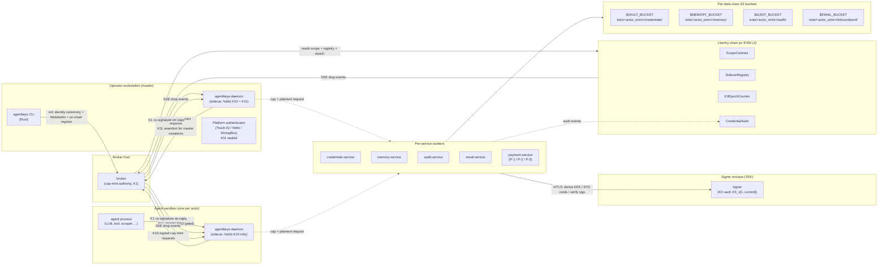
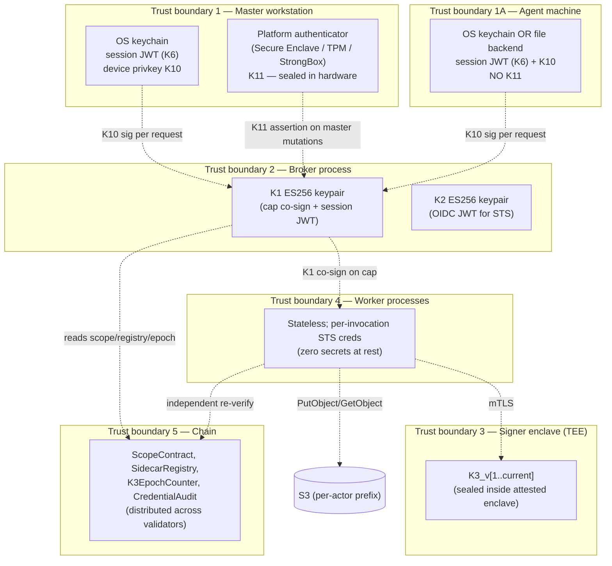
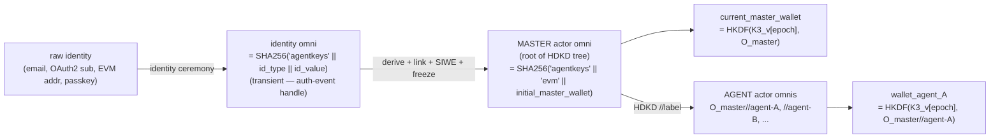
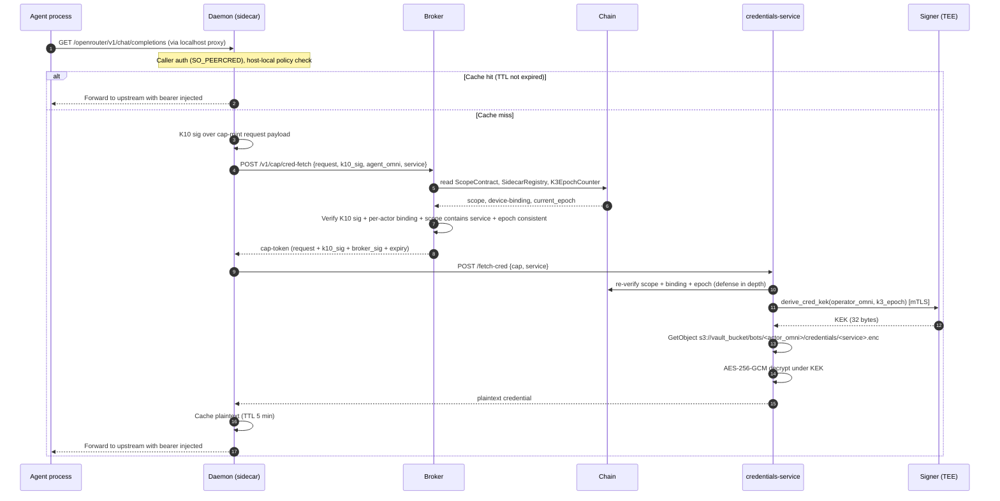

# AgentKeys — Architecture v2

**Audience:** anyone who needs to reason about AgentKeys end-to-end — new contributors, security reviewers, ops, design partners. Single visual + textual reference. Diagrams are Mermaid where possible so they render in GitHub and copy cleanly into Figma.

**Status:** canonical v2. This revision reflects the **completed** state of:

- **issue #89** — v2 stage 1: sovereign sidecar + on-chain identity + credentials-service worker + K11 WebAuthn enforcement for master mutations
- **issue #90** — v2 stage 2: multi-master-device M-of-N recovery quorum + audit/memory/email workers + K3 rotation operational runbook
- **issue #88** — payment-service worker (P-1 / P-2 / P-3 modes)

This doc supersedes the pre-v2 architecture revision (which described a single-binary mock-server / `S3CredentialBackend` deployment that has been retired). Anything labelled "pre-v2" is historical.

**Companion docs** (canonical for their narrow surface; this doc links to them rather than duplicating):

- [`signer-protocol.md`](spec/signer-protocol.md) — typed RPC over mTLS to the signer
- [`threat-model-key-custody.md`](spec/threat-model-key-custody.md) — retroactive-confidentiality + key custody position
- [`credential-backend-interface.md`](spec/credential-backend-interface.md) — `CredentialBackend` trait surface (now backed by the sidecar)
- [`spec/plans/v2-issues/issue-v2-stage-1-foundation.md`](spec/plans/v2-issues/issue-v2-stage-1-foundation.md) — stage 1 deliverable inventory (shipped)
- [`spec/plans/v2-issues/issue-v2-stage-2-hardening.md`](spec/plans/v2-issues/issue-v2-stage-2-hardening.md) — stage 2 deliverable inventory (shipped)
- [`spec/plans/v2-issues/issue-payment-service-deferred.md`](spec/plans/v2-issues/issue-payment-service-deferred.md) — payment-service design (shipped per modes P-1/P-2/P-3)

---

## 1. System overview



**Five independent trust boundaries, five independent products:**

| Service | Public hostname (typical) | Holds | Role |
|---|---|---|---|
| **Broker** | `broker.litentry.org` | K1 (cap co-sign + session JWT keypair), K2 (OIDC JWT keypair), audit DB | Mints cap-tokens after on-chain scope / registry / epoch verification; mints OIDC JWTs for AWS STS; never holds K3, no AWS principals at runtime |
| **Signer** (TEE) | `signer.litentry.org` | K3_v[1..current] (sealed in enclave) | KEK derivation, STS-credential minting, K10/K11 verification helpers; replaceable across TEE vendors via attested mTLS |
| **Workers** (per data class) | `creds.litentry.org`, `memory.litentry.org`, `audit.litentry.org`, `mail.litentry.org`, `pay.litentry.org` | None at rest (stateless executors); per-invocation STS creds | Per-data-class operations; verify caps against on-chain truth before touching S3 / SES / payment rails |
| **Daemon (sidecar)** | localhost only (Unix socket / pod IP) | K10 device key; K11 WebAuthn (master only); plaintext credential cache (TTL-bounded) | Caller authentication; cap-token minting on agent's behalf; credential injection at localhost; per-call host-local controls |
| **Chain** | Litentry parachain (or EVM L2 fallback) | ScopeContract, SidecarRegistry, K3EpochCounter, CredentialAudit | Single source of truth for "who is bound to which actor", "what scope this agent has", "which K3 epoch is current", and "what audit anchors have landed" |

**Why five?** Compromise of any one boundary yields bounded damage. The blast-radius table in §3 enumerates this; the design's headline property is "any single trust root compromised yields bounded damage, never a system-wide takeover."

---

## 2. Component inventory

| # | Component | Where it runs | Primary job |
|---|---|---|---|
| 1 | `agentkeys` CLI | Operator's workstation (master device) | Init, agent management, scope grant/revoke, recovery, whoami, signer debug |
| 2 | `agentkeys-daemon` (master) | Operator's workstation | Holds K10 + K11; mints master-only cap requests; runs WebAuthn ceremonies; localhost sidecar proxy |
| 3 | `agentkeys-daemon` (agent) | Agent sandbox (VM / container / CI runner / cloud LLM env) | Holds K10 (no K11); localhost sidecar proxy; cap-mint per agent operation |
| 4 | Broker | EC2 / Cloud Run / equivalent | Cap-mint authority; reads scope/registry/epoch from chain; SSE drop event push |
| 5 | Signer | TEE (AMD SEV-SNP / Intel TDX / AWS Nitro Enclave) | K3 vault; KEK derivation; STS minting; K10/K11 verification |
| 6 | `credentials-service` worker | Lambda + API Gateway OR axum microservice OR Cloudflare Worker | Encrypt/decrypt API credentials; AES-256-GCM under per-user KEK |
| 7 | `memory-service` worker | Same form-factors | R/W agent state in S3; high-frequency reads via STS |
| 8 | `audit-service` worker | Same form-factors | Append to per-actor audit log; chain-anchor Merkle roots (tier A) or direct-write per event (tier C) |
| 9 | `email-service` worker | Lambda + SES routing | Send via SES from operator's domain; receive via S3-backed inbox |
| 10 | `payment-service` worker | Same form-factors + mode-dependent payment rails | Execute payments via P-1 (service-pool), P-2 (escrow), or P-3 (direct) modes; strict one-shot CAS-burn |
| 11 | Chain | Litentry parachain (deploy target); EVM L2 fallback | ScopeContract, SidecarRegistry, K3EpochCounter, CredentialAudit |
| 12 | Provisioner orchestrator | Inside agent sandbox, subprocess of daemon | Spawns browser automation to provision per-service API keys |
| 13 | Browser scraper | Subprocess of #12 | Playwright/CDP signup flows for Class-B upstreams |
| 14 | `@agentkeys/daemon` npm package | Cloud LLM environments (ChatGPT / Claude.ai) | TS wrapper around prebuilt #3 binary |

---

## 3. Trust boundaries (where keys live, who can see them)



**Compromise-blast-radius table:**

| Boundary breached | What attacker gains | What they CANNOT do |
|---|---|---|
| **Master workstation** (host root, no biometric presence) | Stolen J1 session JWT (replay until TTL); stolen K10 (cap-mint as that actor until rotation). Caps bounded by per-actor scope and host-local quotas. | **Cannot complete WebAuthn ceremony** — K11 sealed in hardware requires biometric/PIN. Cannot mutate scope, bind a new device, or rotate K10. Cannot reach other operators' material. |
| **Master workstation** (full compromise WITH biometric presence) | Above plus: mutate scope, bind new master device, rotate K10. Bounded to this human's actor tree only. Visible on chain (sovereign mode) — every mutation is auditable. | Cannot reach other operators. Recovery via surviving master devices revokes attacker's bindings within ~60s. |
| **Agent machine** (sandbox root) | Stolen agent K10; stolen session JWT (TTL-bounded). Per-actor binding (Codex finding #1) means caps minted under this K10 are tagged for THIS actor only — cannot impersonate a sibling agent. | Cannot rebind without a fresh master-issued link code; cannot mutate scope; cannot reach master wallet's material; cannot reach sibling agents. PrincipalTag at STS prevents cross-agent S3 access. |
| **Broker process** | Mint session JWTs; co-sign caps with K1. Caps still require valid K10 sig from a registered device AND valid K11 assertion for master mutations — broker compromise alone cannot fabricate a usable master-mutation cap. | Cannot derive K4 wallets (no K3); cannot decrypt credentials (no KEK access without mTLS + chain epoch check); cannot reach AWS (no IAM principal). |
| **Signer enclave (TEE)** (assuming attestation defeated) | Derive any K4 wallet; derive any KEK. Catastrophic for credentials. | Cannot mint session JWTs (no K1); cannot mint caps (no K1); cannot bypass per-actor binding on chain (registry is authoritative); cannot reach S3 directly. TEE attestation is the threat-model floor — see §13. |
| **One worker** (e.g., credentials-service compromised) | Decrypt credentials for that data class for callers presenting valid caps (cannot forge caps). Cannot read other data classes (separate workers, separate IAM, separate prefixes — §17). | Cannot mutate scope; cannot bind devices; cannot mint own caps; cannot reach memory / audit / email / payment data; cannot escalate to other workers. |
| **AWS account** | This operator's data scope only. Per-actor PrincipalTag prefix isolation contains it: agent A's S3 prefix is inaccessible from agent B's STS session. | None of the chain-anchored boundaries above. AWS compromise is its own incident class; mitigated by independent chain anchoring of audit. |
| **One chain validator** (one out of N) | Standard chain-security properties (≤51% honest); ScopeContract / SidecarRegistry / K3EpochCounter remain authoritative as long as honest-majority holds. | Cannot bypass on-chain verification at workers (workers re-verify against the chain on every cap). |

**Headline guarantee:** every cap-bearing request is independently re-verified against the chain by the worker before any S3 / KEK / STS / payment operation. Broker-only compromise cannot mint a usable cap; chain-only compromise cannot bypass K10 / K11 / actor-binding gates; signer-only compromise cannot escape the chain's scope assertions.

---

## 4. Key inventory

| # | Key | Type | Lives in | Role | Lifecycle |
|---|---|---|---|---|---|
| K1 | Broker session + cap keypair | ES256 (P-256) | Broker process; pinned file at `BROKER_SESSION_KEYPAIR_PATH` (mode 0600); pubkey published at `<broker>/.well-known/jwks.json` | Signs session JWTs; co-signs cap-tokens after on-chain verification | Generated at first broker boot; preserved across re-deploys; rotation procedure documented in operator runbook |
| K2 | Broker OIDC keypair | ES256 (P-256) | Broker process; pinned file at `BROKER_OIDC_KEYPAIR_PATH` (mode 0600); pubkey published at `<broker>/.well-known/jwks.json` | Signs OIDC JWTs minted by `/v1/mint-oidc-jwt`; consumed by AWS STS / GCP WIF / Tencent CAM via `AssumeRoleWithWebIdentity` | Generated at first broker boot; rotation requires re-registering OIDC provider in cloud IAM |
| K3 | Signer master secret | 32 raw bytes per epoch | Sealed inside attested TEE (AMD SEV-SNP / Intel TDX / AWS Nitro Enclave); never exfiltrated to host | HKDF input for K4 derivation (per-actor wallet) and KEK derivation (per-user credential key) | Generated once at signer-attested-launch; rotatable per K3EpochCounter on chain (§16); historical epochs retained inside enclave for decrypt of pre-rotation blobs |
| K4 | Per-actor derived wallet | secp256k1 | Signer process (in memory only, derived on demand from K3_v[epoch] + actor_omni; never persisted, never logged, never returned over wire) | The managed EVM wallet for one node in the HDKD actor tree. Used by signer to mint STS credentials for that actor; never directly held by daemon / broker / worker | Deterministic: same `(K3_v[epoch], actor_omni)` → same wallet; rotates with K3 epoch |
| K5 | EVM-wallet (operator-held) | secp256k1 | Operator's MetaMask / hardware wallet / `cast wallet` | Identity authenticator for `identity_type = evm`; signs SIWE directly. Bypasses K3/K4 entirely for EVM-identity operators. | Operator-managed; outside AgentKeys' lifecycle |
| K6 | Session JWT | JWT (ES256 by K1) | OS keychain on the operator's workstation; daemon memory at runtime | Bearer credential for `/v1/cap/*`, `/v1/mint-oidc-jwt`, `/v1/wallet/*` | TTL = `BROKER_SESSION_JWT_TTL_SECONDS` (default 18000s = 5h); re-mint requires re-running identity ceremony |
| K7 | OIDC JWT | JWT (ES256 by K2) | Daemon memory only (transient — fetched per mint) | Web-identity token for `AssumeRoleWithWebIdentity` against AWS STS | TTL = `BROKER_OIDC_JWT_TTL_SECONDS` (bounded `[60, 3600]`, default 300s) |
| K8 | AWS / cloud temp credentials | STS access key + secret + session token | Daemon or worker memory only (transient — refetched per operation) | Direct AWS API access scoped by PrincipalTag = `agentkeys_actor_omni` | 1-hour TTL (STS default); short by design |
| K9 | DKIM keypair (per outbound domain) | Ed25519 | email-service worker (sealed in same TEE / KMS pattern as K3) | DKIM signing for outbound mail from operator's domain (`bots.litentry.org` etc.); pubkey published as DNS TXT at `<selector>._domainkey.<domain>` | Generated per-domain at deployment; rotation per CAA / DKIM operational practice |
| K10 | Device key | secp256k1 | **Master**: OS keychain (TouchID/Hello-backed); **Agent**: OS keychain when available, else file backend at `~/.agentkeys/daemon-<wallet>/session.json` (mode 0600) per §11.2. Pubkey registered on chain via `SidecarRegistry.register_*_device(...)`. | Per-request signature on cap-mint requests — gates broker AND worker call surface | Generated at init stage 0 (§9); bound by master init (§10.1) OR agent bootstrap (§10.2); rotated via `agentkeys device rotate` (§10.3.2) or via re-init |
| K11 | WebAuthn platform-authenticator credential | Per-RP credential (EC P-256 on macOS Secure Enclave / Windows TPM / Android StrongBox) | **Master only.** Sealed inside the platform authenticator's hardware boundary; cannot be exfiltrated even by host-OS root. Credential ID registered on chain via `SidecarRegistry`. | Hardware-attested user-presence proof at **master mutations**: scope grant/revoke, device add/revoke, K10 rotation. NOT used per-request — K10 covers per-call signing without biometric. | Created at master init; survives K10 rotations; revoked by destroying the credential or removing it from `SidecarRegistry`. Multiple K11s register concurrently for multi-master-device deployments (§10.5). |

**Notation throughout the rest of this doc:** the K1–K11 indices are referenced directly so any flow can be unambiguously mapped back to which key signed/verified/wrapped what.

---

## 5. Canonical names (one concept, one canonical spelling)

Pinned to disambiguate the same value showing up under different labels across components. **Use the canonical column** in every new doc, runbook, CLI output, and commit message; the alias column lists every spelling that exists today so a reader chasing one of them can find their way back. Per `CLAUDE.md` → "Terminology-source-of-truth rule", if you introduce a name not in this table, either add the alias row here or rename the call site to match the canonical name in the same change.

| Canonical name | Identity | Aliases seen in the codebase / docs |
|---|---|---|
| `actor_omni` | **The durable per-actor cryptographic anchor.** `SHA256("agentkeys" \|\| "evm" \|\| initial_master_wallet_K3_v1)`. **Frozen at first SIWE-bind**; never rotates with K3, never changes with wallet rotation. The Layer 1 identifier per §6. | `omni_account` (JWT claim + CLI `whoami` field), `agentkeys_actor_omni` (AWS PrincipalTag key), `OMNI_A` / `OMNI_B` (demo shell vars). |
| `current_master_wallet` | **The current chain identity** = `HKDF(K3_v[current_epoch], O_master)`. Rotates each K3 epoch. Appears on chain as `msg.sender` in sovereign mode. The Layer 2 identifier per §6. | `master_wallet`, `wallet_address` (JWT claim shape pre-rotation), `MASTER_WALLET` (demo shell var). When historical K3 epochs are in scope, qualify with `master_wallet_K3_v[N]`. |
| `identity_omni` | **The transient identity omni** — `SHA256("agentkeys" \|\| identity_type \|\| identity_value)`. Used internally by the broker between init and SIWE-verify; never carried in a post-SIWE JWT. | `identity_omni_email` / `identity_omni_oauth2` (when narrowing to a specific identity type), `identity omni` (init-flow CLI log line). |
| `agent_omni` | **A child actor omni** = `HDKD(O_master, "//<label>")`. Hard derivation; child cannot be computed without parent's master secret. Distinct from `master_omni`; both are valid actor_omnis. | `O_master//agent-A`, `O_agent_A` (HDKD-tree notation). |
| `K3` | The 32 bytes inside the signer enclave that K4 + KEK derivation HKDFs against. Per-epoch via `K3EpochCounter`. | `K3_v[N]` to disambiguate epoch; `master_secret` (signer-internal log term — discouraged). |
| `session JWT` (= K6) | The bearer token at `~/.agentkeys/<id>/session.json` (or OS keychain). Signed by K1. Carries `agentkeys.actor_omni`, `agentkeys.device_pubkey`, `agentkeys.webauthn_cred_id` (master only). | `session_jwt`, `J1` (post-SIWE bearer), `SESSION_JWT_A` / `SESSION_JWT_B` (demo shell vars). |
| `OIDC JWT` (= K7) | Per-mint short-lived JWT signed by K2; consumed by `AssumeRoleWithWebIdentity`. Carries `agentkeys_actor_omni` claim → AWS session tag. | `oidc_jwt`, `JWT_A` / `JWT_B` (demo shell vars). |
| `cap-token` | The bearer issued by broker authorizing one specific operation (cred-fetch / cred-store / memory-read / audit-append / payment / etc.). Carries K10 sig + K11 assertion (for master mutations) + broker's K1 co-signature. | `cap`, `capability_token`, `op_cap`. |
| `credential_kek` | 32-byte AES-256 key for one operator's credentials. Derived as `HKDF-SHA256(salt="agentkeys.kek-salt.v2", ikm=K3_v[epoch], info="agentkeys.user.v1" \|\| actor_omni)`. | `KEK`, `cred_kek`. |
| `credential_envelope` | Wire format of one stored credential: `1B version (0x04) \|\| 1B k3_epoch \|\| 12B nonce \|\| ciphertext \|\| 16B tag`. Stored at `s3://$VAULT_BUCKET/bots/<actor_omni_hex>/credentials/<service>.enc`. AAD binds `(actor_omni, service)`. | `envelope`, `AEAD blob`, `<service>.enc` (S3 key suffix). |
| `vault_bucket` / `memory_bucket` / `audit_bucket` / `email_bucket` / `payment_audit_bucket` | One S3 bucket per data class per §17. Per-actor prefix at `bots/<actor_omni_hex>/`. | `$VAULT_BUCKET`, `$MEMORY_BUCKET`, `$AUDIT_BUCKET`, `$EMAIL_BUCKET`, `$PAYMENT_AUDIT_BUCKET`. |

The most common confusion this table resolves: **`actor_omni` ≠ `current_master_wallet`**. The first is the immutable cryptographic anchor (Layer 1); the second is the rotation-volatile chain identity (Layer 2). Both are derived from K3, but only `actor_omni` survives K3 rotation unchanged. PrincipalTag, S3 paths, AAD, scope index — everywhere v2 keys identity off — uses `actor_omni`, never `current_master_wallet`.

---

## 6. Identity model — three layers + HDKD actor tree

The system uses **three identity layers** to separate concerns that earlier designs collapsed.

### 6.1 Three identity layers

**Layer 1 — Cryptographic anchor (immutable)**

```
actor_omni = SHA256("agentkeys" || "evm" || initial_master_wallet_K3_v1)
```

Frozen at first SIWE-bind. Never changes for the lifetime of the account. Survives K3 rotation, wallet rotation, device-set changes, master device replacement. This is the operator's durable identity at the cryptographic anchor.

**Layer 2 — Current chain identity (rotatable)**

```
current_master_wallet = HKDF(K3_v[current_epoch], O_master)
```

Rotates each K3 epoch. The operator's identity on a public chain. In sovereign mode (v2 default per §17): appears as `msg.sender` of operator-signed transactions. Block-explorer + ENS lookups work on this wallet.

**Layer 3 — Operational uses (each identifier where natural)**

| Operational use | Identifier | Why |
|---|---|---|
| Signer-internal K4 derivation | `actor_omni` (L1) | Canonical K4 derivation domain |
| Signer-internal KEK derivation | `actor_omni` (L1) | Stable across K3 rotation; epoch handled by in-blob byte |
| AAD in credential blob envelopes | `actor_omni` (L1) | Binds blob to stable location |
| S3 path: `bots/<X>/<class>/...` | `actor_omni_hex` (L1) | Stable; **ZERO migration on K3 rotation** |
| AWS PrincipalTag | `agentkeys_actor_omni = <actor_omni_hex>` (L1) | Stable; bucket policy never rotates |
| Cap-token `operator_omni` + `agent_omni` fields | `actor_omni` (L1) | Matches scope-index key |
| Scope index in ScopeContract | `actor_omni` (L1) | Stable on-chain key |
| SidecarRegistry entries | `device_pubkey_hash → (operator_omni, actor_omni, ...)` (L1 as value) | Per-actor binding per §3 finding #1 |
| Chain tx signer (`msg.sender`) | Mode-dependent: sovereign → `current_master_wallet` (L2); hosted-relay → relay-wallet | Mode decision per §17 |
| Block-explorer audit trail | Sovereign-only: `current_master_wallet` (L2) | Hosted-relay omits operator wallet by design |
| Payment-from address (on-chain) | Mode-dependent: P-1 service-pool / P-2 escrow / P-3 `current_master_wallet` | Per-mode per §15.5 |

The separation is the design's main conceptual win: Layer 1 stays operationally invariant; Layer 2 decisions (sovereign vs hosted) flip only the chain-submission side; Layer 3 spans both consistently.

### 6.2 HDKD actor tree

Actor omnis form a hard-derived tree rooted at the master. Every node has its own derived wallet:



```
O_master                                wallet_master = HKDF(K3_v[epoch], O_master)
├── O_master//agent-A                   wallet_agent_A = HKDF(K3_v[epoch], O_master//agent-A)
├── O_master//agent-B                   wallet_agent_B = HKDF(K3_v[epoch], O_master//agent-B)
│   └── O_master//agent-B//task-1       (sub-actors under agents)
└── ...
```

Hard derivation (`//N`) — child secret cannot be computed without the parent's master secret. Substrate / SLIP-0010 standard. Each node's wallet is a different EVM address; AWS PrincipalTag is per-actor `actor_omni` for prefix isolation.

**Why per-agent omni (not shared with master):**

1. Per-agent compromise containment — leaked agent K10 touches only that agent's wallet/prefix.
2. First-class audit attribution — audit rows carry `acting_actor_omni`, `parent_chain`, `derivation_path`.
3. Atomic revocation — revoke `O_master//agent-A` alone; master and sibling agents untouched.
4. Tree topology IS the data model — no binding-table abstraction needed.

### 6.3 Identity ≠ actor ≠ machine ≠ capability

| Axis | What it answers | Realized by | Lifecycle |
|---|---|---|---|
| **Identity** | Who is the human? | identity omni (email / OAuth / EVM / passkey) | Recoverable via linked authenticators; identity omnis are ephemeral, masters are durable |
| **Actor** | Master, or which agent? | actor_omni — a node in the HDKD tree | Master derived from identity at first init; agents derived from master via `//<label>` |
| **Machine** | Which physical box is signing right now? | K10 device pubkey (per-machine, per-actor); K11 WebAuthn (master only) | Per-box at init/rotation |
| **Capability** | What is this actor allowed to do? | On-chain `ScopeContract[operator_omni][agent_omni] → {services, read_only}` + host-local sidecar policy (method/path/spend) | Master-issued via `set_scope_with_webauthn(...)`; chain-stored; revocable |

**Roles — master vs agent:** master and agent are distinct **roles on the actor axis**, not separate axes. Differences:

| | Master | Agent |
|---|---|---|
| HDKD position | Root | `//<label>` child of master |
| K11 (WebAuthn) | Yes — needed for master mutations | No — agents have no human-presence credential |
| Bootstrap | Identity ceremony + WebAuthn enrollment | **Link-code from master, only** |
| Spawns other actors | Yes (mints derivation certs + link codes) | No |
| Recovery on lost device | M-of-N quorum across surviving master devices (§11) | Re-bootstrap via fresh link-code from master |
| `SidecarRegistry.role` bitfield | `CAP_MINT \| RECOVERY \| SCOPE_MGMT` (first device) / `CAP_MINT \| RECOVERY` (subsequent) | `CAP_MINT` only |

**Key non-conflations:**

- Identity ≠ actor — one human has many actors (master + N agents); HDKD tree expresses the relationship.
- Actor ≠ machine — one actor can run on many machines (master on laptop + phone); each machine has its own K10 under that actor's omni.
- Master ≠ agent — same axis (actor), distinct roles. Bootstrap path, K11 ownership, and revocation authority differ.

For agent-specific operator reference, see [`wiki/agent-role-and-usage-hdkd-per-agent-omni.md`](wiki/agent-role-and-usage-hdkd-per-agent-omni.md).

---

## 7. Upstream backend classes — exercise vs distribution

Per-upstream design splits into two independent security concerns. Pin the class per upstream so future integrations pick the right pattern.

| Concern | Question | Whose job |
|---|---|---|
| **Exercise** | On every API call, is this caller authorized to do this exact thing? | Depends on upstream's auth model |
| **Distribution** | How does the right credential reach the right agent, and only that agent? | Always ours (sidecar + workers + STS rail) |

### 7.1 Class A — Per-request authorization (AWS-native)

Upstream re-validates every API call independently. Examples: AWS S3, SES, KMS, AWS Lambda invokes.

- **Exercise** is enforced by AWS itself — `aws:PrincipalTag/agentkeys_actor_omni` checked against resource ARN on every request.
- **Distribution** IS exercise — no separable "credential" sits in the vault; the STS-signed request is the auth. Agent uses STS creds directly against the upstream; broker is off the hot path.
- **Granularity ceiling:** IAM-policy expressive power (prefix gates, tag conditions, action filters, time windows).
- **Adding a new Class-A upstream:** define the resource, write an IAM policy gated by `agentkeys_actor_omni`, add it to the daemon's allow-list. The §15 worker pipeline carries it for free.

### 7.2 Class B — Bearer-token authorization

Upstream issues an opaque token; subsequent API calls present the token; upstream trusts the bearer for whatever scope the token was minted with. Examples: OpenRouter, Anthropic, Groq, Brave Search, any third-party SaaS API.

- **Exercise** is provider-bounded — only what the upstream exposes per-key (spend cap, model allowlist, rate limit, expiry).
- **Distribution** rides the sidecar: provisioner scrapes a per-grant key; credentials-service worker encrypts and stores at `s3://$VAULT_BUCKET/bots/<actor_omni>/credentials/<service>.enc`; daemon fetches via cap-token, decrypts at the worker, injects at the localhost proxy.
- **Granularity ceiling:** provider-side per-key settings + one-key-per-grant blast bound + host-local sidecar policy (method/path/spend) gating at injection time.
- **Adding a new Class-B upstream:** write a Playwright scraper at [`provisioner-scripts/src/scrapers/<service>.ts`](../provisioner-scripts/src/scrapers/) that signs up, mints an API key, sets provider-side caps from scope fields. Scraper is the enforcement point — missing limits = leaked key has broader blast radius than scope authorizes.

### 7.3 Class C — On-chain / payment-rail operations (irreversible)

Operations whose upstream effect cannot be reversed. Example: USDC transfer, Stripe charge, Substrate extrinsic.

- **Exercise** + **distribution** = strict one-shot CAS-burn cap-tokens (§19); broker mints unique nonce, payment-service redeems via atomic CAS, worker quota table provides defense in depth.
- **K11 required** above operator-configurable per-payment-value threshold.
- Per-mode wallet exposure: P-1 service-pool, P-2 escrow, P-3 direct. See §15.5.

### 7.4 Why this split matters

Operators reading the §15 worker design alone cannot tell whether the payload they retrieve from S3 *is* the action (Class A) or *enables* an out-of-band action (Class B) or is *irreversible on commit* (Class C). The three cases have different revocation semantics, different blast radii, different requirements on the provisioner / worker. Pin the class per upstream in the per-service docs.

Full design rationale, granularity matrix per class, bucket-layout consequences: [`wiki/upstream-backend-classes-exercise-vs-distribution.md`](wiki/upstream-backend-classes-exercise-vs-distribution.md).

---

## 8. Mental model — four orthogonal axes

The system separates four concepts that earlier drafts collapsed. Each axis has its own object, lifecycle, and compromise boundary:

| Axis | Object | Lives in | Compromise radius |
|---|---|---|---|
| **Identity** | identity omni | Broker memory (transient) | Identity-only — caps gate on actor omni, which is locked at first SIWE |
| **Actor** | actor_omni | Chain (SidecarRegistry, ScopeContract), session JWT, OIDC JWT, AWS PrincipalTag, S3 path, AAD | Per-actor (one HDKD tree node) |
| **Machine** | K10 device key + K11 WebAuthn (master only) | Per-machine OS keychain / TPM / SE / TEE; pubkey registered on chain | Per-machine + per-actor (per-actor binding limits cross-actor reach) |
| **Capability** | ScopeContract entry + cap-token + host-local policy | Chain (scope) + broker (cap-mint state) + sidecar (host-local policy) | Per-(actor, service); host-local policy bypassable but bounded by cloud scope |

The four axes compose: a cap-mint request is "this identity bound to this actor, signed by this machine, requesting this capability." Every axis is independently verifiable on chain.

---

## 9. Cold-start (master device bootstrap)

Master init has four stages.

| Stage | What | Where |
|---|---|---|
| **0 — Device-key generation** | Daemon generates `(D_priv, D_pub) = K10` at startup. No network traffic. | Local (master OS keychain) |
| **1 — Identity ceremony** | Verify the human via email link / OAuth callback / EVM SIWE / passkey. Returns `binding_nonce` to the broker. | Master ↔ broker |
| **2 — Master binding ceremony (WebAuthn)** | Platform authenticator generates K11; commits D_pub atomically inside WebAuthn challenge `SHA256(binding_nonce \|\| D_pub)`. | Master ↔ platform authenticator ↔ broker |
| **3 — Wallet derivation + SIWE → J1** | Derive wallet via signer; link at broker; SIWE round-trip → mint long-lived J1; **actor_omni freezes here**. | Master ↔ broker ↔ signer |
| **4 — On-chain SidecarRegistry binding** | Submit `SidecarRegistry.register_master_device(...)` to chain. First device gets `CAP_MINT \| RECOVERY \| SCOPE_MGMT` roles. | Master → chain |

```mermaid
sequenceDiagram
  autonumber
  participant Op as Operator
  participant CLI as agentkeys CLI
  participant KC as OS Keychain
  participant Brk as Broker
  participant PA as Platform authenticator (K11)
  participant Sig as Signer (TEE)
  participant Chain as Chain

  Note over CLI,KC: Stage 0 — generate K10 locally (no network)
  Op->>CLI: agentkeys init --email demo-1@bots.litentry.org
  CLI->>KC: persist (D_priv, D_pub) = K10

  Note over CLI,Brk: Stage 1 — identity ceremony (master only)
  CLI->>Brk: POST /v1/auth/email/request {email}
  Brk-->>CLI: {request_id, binding_nonce}
  Op-->>Brk: clicks magic link → identity verified

  Note over CLI,PA: Stage 2 — master binding ceremony (WebAuthn)
  CLI->>PA: navigator.credentials.create({challenge: SHA256(binding_nonce || D_pub)})
  PA-->>CLI: WebAuthn attestation (K11 hardware-attested)
  CLI->>Brk: POST /v1/auth/bind/<request_id> {webauthn_attestation, D_pub}
  Brk-->>CLI: J0 (claims: agentkeys.device_pubkey=D_pub, agentkeys.webauthn_cred=K11_id)

  Note over CLI,Sig: Stage 3 — derive + link + SIWE → J1
  CLI->>Sig: POST /derive-address {O_master} (mTLS via broker; Bearer J0)
  Sig-->>CLI: {address: initial_master_wallet}
  CLI->>Brk: POST /v1/wallet/link {evm, initial_master_wallet} (Bearer J0)
  CLI->>Brk: POST /v1/auth/wallet/start {address}
  Brk-->>CLI: {siwe_message: M}
  CLI->>Sig: POST /sign/siwe {O_master, hex(M)}
  Sig-->>CLI: {signature: sig}
  CLI->>Brk: POST /v1/auth/wallet/verify {request_id, sig}
  Brk-->>CLI: J1 (long-lived; claims: actor_omni FROZEN, device_pubkey, webauthn_cred, wallet_at_freeze)
  CLI->>KC: persist J1

  Note over CLI,Chain: Stage 4 — on-chain SidecarRegistry binding
  CLI->>PA: WebAuthn get() over SHA256(D_pub || actor_omni || nonce)
  PA-->>CLI: K11 assertion
  CLI->>Chain: SidecarRegistry.register_master_device(D_pub_hash, O_master, O_master, k11_cred_id, attestation, roles=CAP_MINT|RECOVERY|SCOPE_MGMT, k11_assertion)
  Note over Chain: msg.sender = current_master_wallet (sovereign mode default)
```

**J1 is the long-lived bearer the master uses for all subsequent operations.** It carries the frozen `actor_omni`, the bound `device_pubkey`, and the `webauthn_cred_id`. Worker independent re-verification cross-checks J1's claims against the on-chain SidecarRegistry on every cap.

---

## 10. Per-actor binding ceremonies

Canonical reference for binding K10 to an actor — first-time init and re-binding flows. Roles split per §6.3:

- **Master** = device with platform authenticator. Holds K11. Runs identity ceremony + WebAuthn binding. Spawns agents. Submits master-mutation chain transactions.
- **Agent** = VM / Linux / CI / `agent-infra/sandbox` container. No K11. **Bootstraps via link-code from a master, only.**

YubiKey-on-Linux as a master tier (roaming-authenticator binding lets a Linux box be a master) is deferred — see [issue #79](https://github.com/litentry/agentKeys/issues/79).

### 10.1 Master init (first device)

Per §9 stages 0–4. Identity ceremonies vary per identity type but converge on the same WebAuthn binding ceremony at stage 2:

| Identity type | Stage 1 (identity ceremony) | Output | Stage 3 note |
|---|---|---|---|
| `email-link` | Broker emails magic link; operator clicks; broker confirms single-use within TTL | `(email, binding_nonce)` | Standard (derive + link + SIWE → J1) |
| `oauth2_google` | Broker redirects to Google; OAuth2 callback returns code; broker exchanges for ID token | `(google_sub, binding_nonce)` | Standard |
| `evm` | Broker generates SIWE-shaped identity-only payload; operator signs with EVM key; broker ecrecover | `(evm_address, binding_nonce)` | **Collapses** — the user's own EVM key IS the wallet, no signer derivation; broker mints J1 directly |
| `passkey-as-identity` | WebAuthn assertion against an existing platform-authenticator credential | `(webauthn_user_handle, binding_nonce)` | Standard (re-auth case) |

**Q7 fix:** email-account compromise alone cannot rebind. An attacker who phished the email account can complete the identity ceremony but cannot complete the WebAuthn ceremony on the legitimate user's hardware.

**Operator-readable intent on the K11 confirmation page.** WebAuthn's OS-level Touch ID prompt is fixed by the platform — it cannot display application text. AgentKeys closes that gap on the **localhost confirmation page** served before `navigator.credentials.get()` fires: every master-mutation call (scope grant/revoke, device add/revoke, K10 rotation, recovery, audit-row mint, typed-data sign) provides a `K11IntentContext { text, fields }` rendered prominently above the raw challenge hex. The cryptographic binding is unchanged (`challenge = sha256(message)`); the intent text is display-only AND populates `AuditEnvelope.intent_text` + `intent_commitment` so the chain commitment binds to what the operator actually saw. See [`wiki/k11-webauthn-intent-rendering.md`](wiki/k11-webauthn-intent-rendering.md) for the API + worked examples; implementation in [`crates/agentkeys-cli/src/k11_webauthn.rs`](../crates/agentkeys-cli/src/k11_webauthn.rs) (`assert_webauthn_with_intent`, `assert_webauthn_for_chain_with_intent`).

### 10.2 Agent bootstrap (link-code only — single path)

**Agents have exactly one bootstrap path:** a one-time link code minted by an authenticated master. There is no agent-runs-its-own-identity-ceremony, no agent-recovers-via-OAuth, no shared-bearer alternative. One path = one test surface, one threat model.

```
ON MASTER (already initialized; holds J1_master):
1. CLI: agentkeys agent create --label agent-A
2. CLI → broker: POST /v1/agent/create
                  { parent_omni: O_master, label: "agent-A", k11_assertion }
                  Authorization: Bearer J1_master
3. Broker:
   - Verify J1_master + K11 assertion (master-mutation gate)
   - Derive O_agent_A = HDKD(O_master, "//agent-A")  [hard derivation]
   - Persist (parent: O_master, child: O_agent_A, deriv_cert)
   - Mint one-time link code bound to O_agent_A (TTL 600s)
4. CLI: print link code (or auto-pipe to agent provisioner)

ON AGENT MACHINE (any VM / container / CI runner / cloud sandbox):
5. Stage 0: daemon generates (D_priv_agent, D_pub_agent) at startup
            persists D_priv per §10.5
6. agentkeys-daemon --init-link-code <code> --broker-url B --signer-url S
7. Daemon → broker: POST /v1/auth/link-code/redeem
                     { link_code, device_pubkey: D_pub_agent,
                       pop_sig: sign(D_priv_agent, link_code || D_pub_agent) }
8. Broker:
   - Verify pop_sig
   - Mark link code consumed (single-use)
   - Bind (O_agent_A, D_pub_agent) on chain via
     SidecarRegistry.register_agent_device(D_pub_hash, O_master, O_agent_A,
                                            link_code_redemption, agent_pop_sig)
     [tier=2, roles=CAP_MINT only, k11_cred_id=0]
   - Mint J1_agent with claims:
       actor_omni      = O_agent_A
       parent_omni     = O_master
       derivation_path = "//agent-A"
       device_pubkey   = D_pub_agent
9. Daemon: persist J1_agent; enter MCP-stdio loop + sidecar proxy
```

**Trust chain:** `master human → master K11 → master J1 + K10 sig → link-code-derivation-cert → agent K10 binding`. The agent never holds K11 or any user-presence credential.

The agent's `pop_sig` is sufficient on its own (no WebAuthn equivalent) because the link code is single-use, TTL-bounded, and bound to a specific agent omni at mint time. Per-actor binding (§14) ensures the agent's K10 cannot mint caps under a sibling agent's omni.

### 10.3 Master device switch + device-key rotation

#### 10.3.1 New master device (operator gets a new laptop)

```
ON NEW MASTER:
1. Stage 0: generate fresh (D_priv', D_pub') = K10' at daemon startup
2. CLI: agentkeys init --email demo-1@bots.litentry.org  (or any identity at an SES-verified domain)
3. Run stages 1–3 per §9 — WebAuthn enrollment binds NEW K11' on new hardware
4. Cross-device confirmation: broker observes pre-existing K11_old; requires
   WebAuthn get() against K11_old (push notification to existing master)
   before binding K11' — defeats email-account-compromise → device-takeover
5. CLI: submit SidecarRegistry.register_master_device(D_pub_hash',
        O_master, O_master, k11_cred_id', attestation,
        roles=CAP_MINT | RECOVERY,  ← SCOPE_MGMT opt-in to prevent mobile-mgmt sprawl
        k11_assertion_from_existing_master)
6. New master persists J1'
```

**Operator-configurable `recovery_threshold`** (in SidecarRegistry per-operator metadata): default 1; prompt to bump to 2 on third-device add. Above the threshold, recovery (§11) requires M-of-N quorum.

#### 10.3.2 Master device-key rotation (no identity re-auth)

```
ON MASTER (still has J1 + D_priv_old + K11):
1. CLI: agentkeys device rotate
2. CLI: generate (D_priv_new, D_pub_new); persist D_priv_new
3. CLI: WebAuthn get() against K11 over SHA256(D_pub_old || D_pub_new || rotation_nonce)
4. CLI → chain: SidecarRegistry.rotate_device_key(D_pub_hash_old, D_pub_hash_new,
                                                  k11_assertion, sig_new)
5. Broker observes K3Rotated chain event (SSE) → drops cached caps that bound to
   D_pub_old; subsequent caps re-mint against the new binding
6. CLI: persist J1_new; clear D_priv_old
```

If both D_priv_old AND K11 are lost on this master device → fall back to §11 (recovery via surviving master devices).

### 10.4 Agent re-bootstrap

```
ON MASTER:
1. agentkeys agent create --label agent-A  (or reuse existing label)
   → mints fresh link code; old D_pub_agent_old binding remains until
     explicit revoke (defensive cleanup, not required for security — old
     pop_sig cannot be re-issued without the agent's old D_priv)

ON NEW AGENT:
2-9. Same as §10.2 steps 5–9 (new D_pub binds under same O_agent_A)
```

Multiple concurrent device pubkeys under the same agent omni is the default — many concurrent VMs are typical for ephemeral-sandbox patterns. Per-actor binding bounds each one independently.

### 10.5 Where D_priv lives on an agent machine

OS keychain when available (Linux GNOME Keyring, Windows Credential Locker). When unavailable — `agent-infra/sandbox`'s default Docker container exposes none — [`keyring-rs`](https://crates.io/crates/keyring) falls back to a file backend at `~/.agentkeys/daemon-<actor_omni>/session.json` (mode 0600).

| Agent lifecycle | D_priv behavior | Operator action |
|---|---|---|
| **Long-lived sandbox** (single container instance for hours/days) | File persists across daemon restarts within the container | None |
| **Ephemeral sandbox** (container destroyed between sessions, e.g. nightly CI) | D_priv vanishes with the container | Master mints fresh link code per §10.4; agent re-bootstraps. **No human re-presence required** — master's daemon can auto-mint on agent-restart signal |
| **Hardened sandbox** (TPM / Secure Enclave passthrough, AWS Nitro Enclave) | D_priv pinned to hardware OR sealed to boot measurement | Survives container destruction |

**Why this is the right answer (not a workaround):** the master holds the long-lived authority; agents are short-lived consumers. The link-code-per-restart pattern mirrors `agent-infra/sandbox`'s two-tier orchestrator model — orchestrator holds the long-lived signing key; sandbox holds only short-TTL bearer credentials. Leaked sandbox env = at most one link-code-TTL of access, scoped to that agent's permissions.

### 10.6 Trust shape across actor roles

| Compromise | Blast radius |
|---|---|
| **Master K10 leaked** (host root, no biometric presence) | Cap-mint under `O_master` until rotation. **Cannot mutate scope, rebind, or rotate K10** (requires K11). **Cannot mint agent omnis** (master-mutation, gated by K11). |
| **Master K10 + biometric presence** | Above plus: mutate scope, bind new master device, rotate K10, mint new agent omnis. Bounded to this human's actor tree. Visible on chain (sovereign mode default). Recovery (§11) revokes within ~60s. |
| **Agent K10 leaked** (sandbox host root) | Cap-mint under `O_agent_A` until link-code rotation or session-JWT TTL expiry. **Per-actor binding** prevents impersonating siblings. Cannot rebind, mutate scope, or escalate to master. PrincipalTag at STS prevents cross-agent S3 access. |

---

## 11. Recovery — M-of-N device quorum (no anchor wallet, no seed phrase)

The recovery flow uses only the operator's own master devices, each carrying K10 + K11. No anchor wallet, no seed phrase, no third party.

```
TIMELINE: Operator loses their laptop (master device A).

t=0:    Operator notices laptop is stolen / lost / compromised.
t=0:    Operator picks up surviving master device B (e.g., phone).
        Phone holds: K10_B (device key), K11_B (sealed in StrongBox/SE).

t=+30s: Operator opens agentkeys mobile app → "Lost device — revoke & rotate".

t=+60s: App constructs revoke + rotate payload:
          revoke {device_pubkey_hash_A}
          (optionally) rotate K10_B → K10_B_new
        Signs with K10_B; biometric prompt for K11_B WebAuthn assertion.

t=+90s: If recovery_threshold ≥ 2: app waits for additional master device's
        K11 assertion (e.g., desktop at home, tablet, partner's signed
        co-approval). Quorum met when total signatures ≥ recovery_threshold.

t=+2m:  Relay (or sovereign-direct in sovereign mode) submits:
          SidecarRegistry.revoke_device(D_pub_hash_A, k11_assertions[])
          + WalletRotated audit event (if K10 was rotated)

t=+2m:  Chain emits DeviceRevoked event.

t=+2m+1s: Broker receives chain event over SSE; drops cached caps tied to
          D_pub_hash_A; rejects new cap-mint requests with that K10.

t=+2m+1s: All daemons under operator_omni receive SSE drop event from broker;
          zero the credential cache for the revoked device.

t=+~60s post-revoke: Cached creds in agent processes expire on cred_cache_ttl
                     (5 min default). Attacker can no longer perform any
                     authorized operation under operator_omni.
```

**Key design choices:**

- **K11 is the gate.** A stolen K10 alone cannot trigger recovery — that would let any compromise-of-one-machine trigger DoS on the operator. K11 user-presence (biometric / PIN) on a surviving device is required.
- **No anchor wallet.** Earlier designs reserved a hardware wallet or seed-phrase for recovery; v2 retires this. The master devices themselves are the quorum.
- **No third-party recovery.** No friends, no email-based recovery, no recovery code. The only thing that proves "I am this operator" is biometric presence on a surviving device that's still on the SidecarRegistry.
- **Recovery_threshold is per-operator.** Default 1; prompt to bump to 2 on third-device add. Setting threshold = M with N total master devices = M-of-N quorum.

If ALL master devices are lost simultaneously (entire household lost / stolen, fire, theft of every device at once) → operator has lost access to their actor tree. This is the trade-off for not introducing third-party recovery surfaces. Mitigations:

- Diversify devices across locations (laptop at home, phone in pocket, tablet at office).
- Provision a recovery-only master device that lives offline (kept in safe, biometric-locked).
- For high-stakes operators: pre-position a relationship with the signer's TEE-attested key-recovery service that publishes an emergency override path on chain — designed but not deployed by default.

---

## 12. Sidecar daemon

The daemon is the trust boundary between agent processes and the cap-token system. It holds K10 + K11 (master) or K10 (agent), runs the localhost proxy, manages the credential cache, and enforces host-local policy.

### 12.1 Localhost proxy surface

Three deployment shapes:

| Shape | Bind address | Caller authentication | Use case |
|---|---|---|---|
| **E1 — Unix socket** | `$XDG_RUNTIME_DIR/agentkeys-proxy.sock` (default) | `SO_PEERCRED` — kernel returns caller's `(uid, pid, gid)`; daemon checks against `allowed_callers` config | Default for laptop / VM deployments |
| **E2 — Pod-internal TCP** | `localhost:9090` | Pod network namespace boundary; daemon refuses connections from outside the pod IP range | Kubernetes / container deployments |
| **E3 — TEE-internal IPC** | Enclave-local channel | TEE-attested caller pinning | TEE-deployed agents (rare, but supported) |

### 12.2 Host-local policy

Per call, the sidecar enforces:

| Control | Source | What it checks |
|---|---|---|
| **Caller auth** | SO_PEERCRED / pod ns / TEE caller pin | Caller is allow-listed |
| **Per-caller scope binding** | `~/.config/agentkeys/policy.toml` | `(uid, binary_path) → allowed_services` |
| **Service / method / path allowlist** | Same | E.g., `openrouter` allows `POST /v1/chat/completions` only |
| **Spend quotas** | Same | Req/min, req/hour, daily $ budget per `(caller, service)` |
| **Per-call audit** | Local SQLite log + audit-service worker batch | Every call logged with `(timestamp, caller, actor, service, method, request_hash, cost_estimate, result)` |
| **Fail-closed on stale broker** | Broker SSE heartbeat | Drop all caps + refuse new mints if broker stale > 60s |

**Cloud-enforced vs host-local distinction (Codex review amendment):** ScopeContract on chain is the cloud-authoritative source for *"what service is in scope"*. Per-method, per-path, per-spend lives in host-local sidecar config — bypassable by compromised sidecar, but bounded by cloud-enforced per-actor binding. A compromised sidecar can drive any allowed service within the cap-cache TTL, but cannot escape the actor's scoped service set.

### 12.3 Credential cache

| Property | Default | Notes |
|---|---|---|
| TTL | 5 minutes | Bounded re-derivation work; bounded blast radius on sidecar compromise |
| Storage | In-memory only | Never written to disk; zeroed on process exit |
| Eviction | TTL expiry + chain SSE drop event | Both signals; chain wins |
| Capacity | `cred_cache_size` (default 256 entries) | Per-(caller, service) keyed |

### 12.4 Cap-mint flow



The agent process never sees the plaintext credential. The bearer is injected at the localhost proxy at request-forward time; the agent only ever talks to the sidecar's localhost address.

### 12.5 Bootstrap output

Daemon writes `~/.config/agentkeys/env` on first run:

```bash
# Operator adds `source ~/.config/agentkeys/env` to shell rc (one-time)
export OPENROUTER_API_KEY=local-placeholder-no-real-secret
export OPENROUTER_BASE_URL=http://localhost:9090/openrouter
export ANTHROPIC_API_KEY=local-placeholder-no-real-secret
export ANTHROPIC_BASE_URL=http://localhost:9090/anthropic
# ...
```

Agents reading `OPENROUTER_API_KEY` from env get a placeholder string; the actual key materializes only at the sidecar at request-forward time.

---

## 13. Broker

The broker is the cap-mint authority. It does NOT hold credentials, K3, or any cloud-IAM principal at runtime. It holds K1 (cap co-signing + session JWT keypair), K2 (OIDC JWT keypair), and a local audit DB.

### 13.1 Responsibilities

- Mint session JWTs after identity ceremony (§9 stage 3)
- Mint OIDC JWTs for AWS STS `AssumeRoleWithWebIdentity` (carries `agentkeys_actor_omni` claim → session tag)
- Mint cap-tokens after on-chain verification:
  - K10 signature is valid
  - Device is registered in SidecarRegistry with `actor_omni` matching the cap's `agent_omni` field (per-actor binding)
  - Requested service is in `ScopeContract[operator_omni][agent_omni].services`
  - `K3EpochCounter.current_epoch` matches the requested epoch
  - For **master mutations**: K11 WebAuthn assertion is valid + cred ID matches registered K11 in SidecarRegistry
- Push drop events to daemons over SSE when chain state changes (scope revoke, device revoke, K3 rotation)
- Relay interactive auth flows that can't go on-chain (email-link, OAuth2 callbacks)

### 13.2 What the broker does NOT do

- Hold credentials — workers do this
- Hold K3 — signer (in TEE) does this
- Derive K4 wallets — signer does this
- Decrypt credentials — workers do this (via signer-derived KEK over mTLS)
- Reach AWS — daemons + workers do this directly via STS
- Mutate scope — masters do this on chain
- Trust agent K10 to vouch for arbitrary actors — per-actor binding check on every cap

### 13.3 Endpoints

```
/v1/auth/email/{request,verify,status}        — email-link flow (stage 1)
/v1/auth/oauth2/{start,callback,status}       — OAuth2 flow (stage 1)
/v1/auth/wallet/{start,verify}                — SIWE round-trip (stage 3)
/v1/auth/bind/<request_id>                    — WebAuthn enrollment (stage 2)
/v1/auth/link-code/redeem                     — agent bootstrap (§10.2)
/v1/agent/create                              — mint agent link-code (master mutation, K11 required)
/v1/wallet/link                               — link wallet to identity (post-derive, pre-SIWE)
/v1/wallet/device/rotate                      — K10 rotation (§10.3.2; K11 required)
/v1/cap/cred-fetch                            — cap-mint for credential fetch
/v1/cap/cred-store                            — cap-mint for credential store (provisioner)
/v1/cap/memory-{read,write}                   — cap-mint for memory ops
/v1/cap/audit-append                          — cap-mint for audit appends
/v1/cap/email-{send,receive}                  — cap-mint for email ops
/v1/cap/payment                               — cap-mint for payments (CAS-burn, K11 if high-value)
/v1/scope/{set,revoke}                        — relay to ScopeContract (sovereign-direct alt)
/v1/sse/operator/<actor_omni>                 — drop event stream to daemons
/v1/mint-oidc-jwt                             — OIDC JWT for STS
/.well-known/jwks.json                        — K1 + K2 pubkeys
/.well-known/openid-configuration             — OIDC discovery
/healthz, /readyz, /metrics                   — ops endpoints
```

---

## 14. Signer (TEE-protected K3 vault)

The signer holds K3 — the master secret from which K4 wallets and credential KEKs are derived. Compromise of K3 is catastrophic for credentials, so K3 is sealed inside an attested TEE (AMD SEV-SNP / Intel TDX / AWS Nitro Enclave).

### 14.1 Responsibilities

- Retain historical `K3_v[1..current]` inside the enclave for decrypt of pre-rotation blobs
- Derive `K4 = HKDF(K3_v[epoch], actor_omni)` on demand
- Derive `credential_kek = HKDF-SHA256(salt="agentkeys.kek-salt.v2", ikm=K3_v[epoch], info="agentkeys.user.v1" || actor_omni)` for credential encryption
- Mint STS credentials by signing OIDC token with K4 (`current_master_wallet`) for STS exchange
- Verify K10 signatures and K11 WebAuthn assertions on behalf of workers (verification helpers)
- On every typed call, read `K3EpochCounter.current_epoch` from chain and verify the requested epoch is consistent (defense in depth)

### 14.2 Typed RPC over mTLS

Callers: broker + workers only. Daemons never talk to the signer directly — all signer access is mediated through the broker (cap-mint) or workers (credential / STS derivation).

```
/derive-address {operator_omni}                       → K4 derivation
/derive-cred-kek {operator_omni, k3_epoch}            → KEK
/sts-credentials {actor_omni, role_arn, ttl}          → AWS STS creds
/sign/siwe {actor_omni, siwe_message}                 → EIP-191 sig
/sign/typed-data {actor_omni, typed_data}             → EIP-712 sig + digest + type_hash + domain_sep (issue #82)
/sign/audit-row {actor_omni, audit_row}               → audit-chain sig
/verify/k10-sig {device_pubkey, payload, sig}         → bool
/verify/k11-assertion {cred_id, payload, assertion}   → bool
```

The mock-server backend exposes `/sign/typed-data` under the legacy
`/dev/sign-typed-data` path alongside `/dev/sign-message`. TEE-worker
swap-in MUST preserve both shapes; see [`signer-protocol.md`](spec/signer-protocol.md).

### 14.3 K3 rotation handling

The signer is the only component that needs to hold historical K3 versions. Per K3 rotation (§16):

- New `K3_v[N+1]` is generated **inside the enclave** during a key-rotation ceremony — never extracted, never logged
- Historical `K3_v[1..N]` are retained in the enclave for decrypt of pre-rotation blobs
- All new writes use `K3_v[current_epoch]`
- Lazy on-read re-encryption (optional): blob read → decrypt under old K3 → re-encrypt under new K3 → upload to same S3 path
- Eager re-encryption: operator runs `agentkeys-rotate-creds --operator-omni <X>` to walk all blobs

### 14.4 Attestation

On every cold start, the signer publishes its attestation report (per TEE vendor — AMD SEV-SNP cert chain, Intel TDX quote, Nitro PCR digest) to the broker and to workers. Both parties pin the expected attestation hash; mTLS handshake fails if the signer's measurement doesn't match the pinned value. Compromised host root cannot mint a fake signer — the attestation chain roots in the CPU vendor's hardware.

---

## 15. Workers (per-service)

Each data class gets its own worker — independent IAM, independent deploy lifecycle, independent compromise blast radius. Common worker shape:

1. Accept cap-token + operation payload over HTTPS
2. Verify cap's K10 sig against on-chain SidecarRegistry (per-actor binding)
3. Verify cap's broker_sig against broker's K1 pubkey
4. Verify on-chain scope independently of broker's claim (defense in depth)
5. Verify K3 epoch consistency before any K3-dependent op
6. Execute service operation
7. Emit audit row (local log + chain-anchored batch via audit-service tier choice)

**Implementations:** AWS Lambda + API Gateway (managed), Rust microservice with axum (vendor-neutral), Cloudflare Worker + R2 (edge / global), Tencent SCF + COS (China deployment).

### 15.1 credentials-service

- **IAM:** `s3:GetObject` + `s3:PutObject` on `bots/<actor_omni_hex>/credentials/*`; signer mTLS for KEK derivation
- **`master_wallet` on chain?** No — S3 only, no chain submissions (audit events flow through audit-service)
- **Operations:** `fetch-cred(cap, service)` → plaintext; `store-cred(cap, service, plaintext)` → ack; `teardown-actor(cap, target_actor)` → wipes prefix
- **OIDC federation (issue #90):** Caller passes agent-side OIDC-minted STS creds via `X-Aws-Access-Key-Id` / `X-Aws-Secret-Access-Key` / `X-Aws-Session-Token` headers. Worker uses those for the S3 call so the AWS IAM PrincipalTag scoping fires at the AWS layer (defense in depth on top of the cap-token verify). With `AGENTKEYS_WORKER_REQUIRE_STS=1` (production setting), header-less requests get HTTP 401 — closes the [codex downgrade attack vector](#175-per-data-class-cap-token-binding-issue-90).

### 15.2 memory-service

- **IAM:** `s3:GetObject` + `s3:PutObject` on `bots/<actor_omni_hex>/memory/*`
- **`master_wallet` on chain?** No
- **Operations:** R/W agent state at high frequency. **STS session policies enable direct S3 access** from the agent process for the duration of the session — the worker is NOT in the LLM-call hot path. The worker mints a TTL-bounded STS session at session start; the agent's localhost SDK uses STS creds for many ops within the TTL.
- **OIDC federation (issue #90):** Same `X-Aws-*` header passthrough as creds. Each data-class has its own IAM role (`agentkeys-memory-role`); memory-role STS creds are rejected at the vault bucket and vice versa. See §17.5.

### 15.3 audit-service

Three tiers, operator-selected per deployment.

| Tier | Substrate | `current_master_wallet` on chain? | Trust model |
|---|---|---|---|
| **A — Hosted shared relay** (opt-in for gas subsidy) | Service provider runs relay; batches across many operators; Merkle root on chain | No (only shared service-relay-wallet) | Operator trusts service not to omit events; chain-anchored Merkle root catches forgery |
| **B — Self-hosted relay** (privacy-preserving sovereignty) | Operator runs own audit-relay binary; relay-wallet (separate from `current_master_wallet`) signs batches | No (operator's relay-wallet appears, separable burner) | Operator owns the relay; no third-party trust |
| **C — Direct-write per event** (sovereign default) | Worker submits each audit event as a separate chain tx, signed by operator's K3-derived key | **YES** — `current_master_wallet` (or K4 derived for the actor) signs every audit tx | Operator fully self-custodial; pays per-event gas; full block-explorer audit trail |

V2 default: tier C. Tier A is the gas-subsidy escape hatch. Tier B is for operators who want self-sovereignty without `current_master_wallet` exposure.

The audit-service worker is stateless for tier C (every event independently signed); maintains a relay batcher for tiers A/B that drains to chain at configurable cadence (default 1 minute or 256 events, whichever first).

**Audit-row schema with intent commitment (issue #82).** Each audit row carries two optional fields when the underlying event was a typed-data sign (`/sign/typed-data` on the signer):

| Field | Type | Source | Use |
|---|---|---|---|
| `signed_intent_text` | string | rendered ERC-7730 `interpolatedIntent` (e.g. `"Approve USDC 1000.00 to Uniswap v4 router"`) | Operator-readable record of *what was authorized*, not just *that something was signed* |
| `signed_intent_hash` | 32-byte hex | `keccak256(intent_text || "\|" || digest)` | Cryptographically commits the rendered intent to the EIP-712 digest the signer produced. Auditors verifying a sign event re-render the intent from the same ERC-7730 file and check the commitment matches. |

Backward compatible: pre-#82 audit rows have these fields absent; tier C
chain events keep their current shape (the commitment is stored in
`signed_intent_hash` only — the rendered text is off-chain in the worker's
S3 row). A future contract revision will extend `CredentialAudit.append`
to take the commitment hash as a 33rd byte; until then, tier C chain
events index the audit-row by `signed_intent_hash` via S3 path.

### 15.3a Unified audit envelope — `AuditEnvelope v1`

The schema documented above (`signed_intent_text` + `signed_intent_hash`) is
specific to **typed-data signs**. The rest of the audit surface today
carries only the narrow `(actor_omni, service_hash, op_type ∈ {0,1,2}, payload_hash)`
shape that [`CredentialAudit.sol`](../crates/agentkeys-chain/src/CredentialAudit.sol)
takes — sufficient for credentials CRUD, useless for sign events, scope
mutations, device mutations, payments, memory ops, or email. An external
explorer (e.g. [`litentry/subscan-essentials`](https://github.com/litentry/subscan-essentials)
per §22a.6) wanting to render a uniform timeline across all audit-producing
surfaces has to know N different shapes today.

`AuditEnvelope v1` is the canonical abstract format that every audit-producing
surface MUST emit going forward, and that the chain + explorer + indexer
consume.

#### Wire shape (off-chain, served by `agentkeys-worker-audit`)

```
AuditEnvelope {
  version:          u8,                // = 1
  ts_unix:          u64,               // server-side at queue time
  actor_omni:       [u8; 32],          // who performed the op
  operator_omni:    [u8; 32],          // whose data-class boundary it touched
  op_kind:          u8,                // see canonical table below
  op_body:          CBOR_bytes,        // op-kind-specific (opaque to chain + old indexers)
  result:           u8,                // 0=Success, 1=Failure, 2=NotPermitted
  intent_text:      Option<String>,    // operator-readable (PR #95)
  intent_commitment: Option<[u8; 32]>, // keccak256(intent_text || 0x7c || op_payload_digest)
}
```

Encoded canonically as deterministic CBOR (CTAP2 / RFC 8949 §4.2.1). The
worker computes `envelope_hash = keccak256(canonical_cbor(envelope))` and
exposes:

- `POST /v1/audit/append` — accept envelope, queue, return `envelope_hash`.
- `GET /v1/audit/envelope/<hash>` — return the full envelope (used by the
  explorer to fetch the body after seeing the on-chain hash).

#### On-chain commitment

`CredentialAudit.appendV2(operatorOmni, actorOmni, opKind, envelopeHash)`
lands alongside the v1 `append` shape (additive — no break). For tier A
(Merkle batched), `appendRootV2(operatorOmni, merkleRoot, opKindBitmap)`
carries an `opKindBitmap` (`bytes32`, each bit indexes one of 256 possible
op_kinds present in the batch) so explorers can filter without fetching
every leaf.

Events:

```
event AuditAppendedV2(
  bytes32 indexed operatorOmni,
  bytes32 indexed actorOmni,
  uint8   indexed opKind,
  bytes32 envelopeHash
);

event AuditRootAppendedV2(
  bytes32 indexed operatorOmni,
  bytes32 indexed merkleRoot,
  bytes32 opKindBitmap,
  uint64  entryCount
);
```

V2 is event-only — no on-chain storage of entries or roots. The chain's
canonical history is the indexed event log; indexers reconstruct the
per-operator timeline by filtering `AuditAppendedV2` topics. Position
within the operator's stream (an `entryIndex` analog) is derivable from
block number + log index pairs, so the contract doesn't need to carry it
explicitly.

The `indexed opKind` topic lets the explorer query "show all this operator's
typed-data signs in chain history" with a single `eth_getLogs` filter,
without scanning every audit row.

#### Canonical `op_kind` byte assignments

PRs adding new op_kinds MUST append a row here; **numbers are never reused
and never reordered**. Grouped by 10s leaves room for related ops.

| Kind | Byte | `op_body` schema | Worker that emits |
|---|---|---|---|
| `CredStore` | 0 | `{service: string, payload_hash: [u8;32]}` | credentials-service |
| `CredFetch` | 1 | `{service: string, cap_hash: [u8;32]}` | credentials-service |
| `CredTeardown` | 2 | `{actor_target: [u8;32]}` | credentials-service |
| `MemoryPut` | 10 | `{key: string, payload_hash: [u8;32]}` | memory-service |
| `MemoryGet` | 11 | `{key: string, cap_hash: [u8;32]}` | memory-service |
| `MemoryTeardown` | 12 | `{actor_target: [u8;32]}` | memory-service |
| `SignEip191` | 20 | `{message_digest: [u8;32], wallet: [u8;20]}` | signer (via daemon callback) |
| `SignEip712` | 21 | `{chain_id: u64, verifying_contract: [u8;20], primary_type: string, type_hash: [u8;32], domain_separator: [u8;32], digest: [u8;32]}` | signer (via daemon callback) |
| `PaymentEscrowRedeem` | 30 | `{escrow_addr: [u8;20], amount: U256, recipient: [u8;20], chain_id: u64}` | payment-service (P-2 mode) |
| `PaymentDirect` | 31 | `{rail: enum, ref: string, amount_minor: u64, currency: string}` | payment-service (P-1/P-3) |
| `ScopeGrant` | 40 | `{agent_omni: [u8;32], service: string, max_calls: u32, max_amount: U256}` | broker (via callback) |
| `ScopeRevoke` | 41 | `{agent_omni: [u8;32], service: string}` | broker (via callback) |
| `DeviceAdd` | 50 | `{device_key_hash: [u8;32], role_bits: u8, attestation_hash: [u8;32]}` | SidecarRegistry hook |
| `DeviceRevoke` | 51 | `{device_key_hash: [u8;32]}` | SidecarRegistry hook |
| `K10Rotate` | 52 | `{old_device_key_hash: [u8;32], new_device_key_hash: [u8;32]}` | SidecarRegistry hook |
| `EmailSend` | 60 | `{to_hash: [u8;32], subject_hash: [u8;32], message_id: string}` | email-service |
| `EmailReceive` | 61 | `{from_hash: [u8;32], message_id: string, payload_hash: [u8;32]}` | email-service |
| `K3EpochAdvance` | 70 | `{old_epoch: u64, new_epoch: u64, gov_tx: [u8;32]}` | K3EpochCounter hook |

Byte ranges `8-9`, `13-19`, `22-29`, `32-39`, `42-49`, `53-59`, `62-69`, `71-79`, `80-255` are reserved for future extensions in the same family.

#### Forward-compat / non-break design

The trade-off when a new op_kind lands is **"uglier UI temporarily for old
explorers" — never "broken explorer / dropped event"**. Eight design
invariants make this work:

1. **`op_kind` is a `u8`, not a sealed enum.** Indexers/explorers MUST treat
   unknown values as `Unknown(byte)` with a generic fallback renderer.
   Panicking, dropping, or 5xx-ing on an unknown op_kind is a bug, not
   correct behavior.

2. **Envelope-level fields are stable across all op_kinds.** CBOR-decoding
   `(version, ts_unix, actor_omni, operator_omni, op_kind, intent_text,
   intent_commitment, result)` works for **any** op_kind. Only `op_body` is
   op-kind-specific. The explorer can ALWAYS render a meaningful row from
   envelope-level fields, even if it can't decode the body.

3. **`version` is gated on envelope-level breakage only.** Bump `version`
   when the top-level fields change (adding a required field, removing
   one). Adding a new op_kind does NOT bump version. Old indexers seeing
   `version: 1` keep working; `version: 2` they skip with a "needs
   upgrade" log line.

4. **Explorer ships a generic fallback renderer.** Default UI for unknown
   op_kind: shows the op_kind byte + actor + operator + timestamp +
   `intent_text` (if present) + a "raw body" expander. New op_kinds never
   break the timeline page — they just look generic until the explorer
   ships a kind-specific renderer.

5. **Worker passes through opaque `op_body` bytes.** Older workers that
   don't recognize a new op_kind variant still know to forward the CBOR
   blob untouched in `GET /v1/audit/envelope`. Indexers consuming the
   JSON get `op_body` as base64-encoded opaque bytes (with `intent_text`
   + `intent_commitment` still readable from envelope level).

6. **Chain contract is op_kind-agnostic.** `appendV2` takes `opKind` as
   `uint8` and `envelopeHash` as `bytes32`. No on-chain decode of
   `op_body`. New op_kinds need ZERO contract redeploys.

7. **Canonical op_kind table lives in arch.md.** PRs adding new op_kinds
   MUST append a row to the table above. Numbers never reused and never
   reordered. Reviewer can grep arch.md for the new byte to confirm it's
   not a collision before merging.

8. **Test contract per new op_kind.** Every PR adding an op_kind ships
   THREE tests minimum:
   - **Worker**: CBOR encode + decode roundtrip on canonical fixtures.
   - **Explorer**: "old explorer + envelope with new op_kind →
     graceful unknown render, no crash, no dropped event."
   - **Doc**: arch.md table row appended; no number collision.

#### Migration sequencing

| Phase | Where | What lands | Backwards-compat property |
|---|---|---|---|
| A | `arch.md` (this section) | The schema + table + non-break invariants. **Lands in PR #95.** | None — doc only. |
| B | `agentkeys-worker-audit` + `agentkeys-core` | New `AuditEnvelope` struct; existing call sites migrated to emit it; `/v1/audit/envelope/<hash>` endpoint; old `AuditEvent` retained for one cycle. | Old indexers using `/v1/audit/append` v1 shape keep working; envelope-level fields readable from the new endpoint. |
| C | `crates/agentkeys-chain/src/CredentialAudit.sol` | `appendV2(operatorOmni, actorOmni, opKind, envelopeHash)` + `appendRootV2(... opKindBitmap)` + the two events. Contract redeploy on Heima Mainnet. **Old `append` and `appendRoot` retained on the same contract**, so existing indexers keep working until they migrate. | Old `AuditAppended` event still emitted by `append` callers; new indexers watch `AuditAppendedV2`. |
| D | [`litentry/subscan-essentials`](https://github.com/litentry/subscan-essentials) — tracked as [subscan-essentials#12](https://github.com/litentry/subscan-essentials/issues/12) | Decoder for `AuditAppendedV2` + `AuditRootAppendedV2` events; HTTP client to fetch `GET /v1/audit/envelope/<hash>` from the worker; per-op_kind renderer plug-in interface. | Old `AuditAppended` decoder retained. |
| E | [`litentry/subscan-essentials-ui-react`](https://github.com/litentry/subscan-essentials-ui-react) | Per-op_kind renderer components + the generic `Unknown(byte)` fallback. Routes `/agentkeys/audit/<operator_omni>` use the V2 envelope feed. | Old route shapes preserved. |
| F | Sign / scope / device / payment / email / K3 worker call sites | Each emits its own op_kind via `AuditEnvelope`; the bytes are claimed via PRs that each touch the table in arch.md exactly once. | None — each row is additive. |

Phases B / C / F are tracked at [agentKeys#97](https://github.com/litentry/agentKeys/issues/97).
Phases D / E are tracked at [subscan-essentials#12](https://github.com/litentry/subscan-essentials/issues/12).

Phases B-E are **independent** once A lands — they can ship in parallel
across the three repos. Phase A is the lock-in moment; everything else
follows the canonical table.

### 15.3b How to add a new op_kind — the 5-step ritual

Adding a new audit op_kind (e.g. a new worker emits something the
canonical table doesn't yet cover) is a deliberately small + repeatable
change. Per the non-break invariants above, each new op_kind costs at
most "uglier UI temporarily for old explorers" — never "broken explorer
/ dropped event." Five steps, in this exact order:

1. **Pick the byte.** Claim the next unused byte in the appropriate
   family range from the canonical table in §15.3a (creds 0-9,
   memory 10-19, signs 20-29, payments 30-39, scope 40-49, device
   50-59, email 60-69, K3 70-79). If your op is in a NEW family,
   claim the next unused 10-block (80-89, 90-99, …). Never reuse a
   number; never reorder existing rows.

2. **Append a row to §15.3a canonical op_kind table.** Format:
   `\| KindName \| Byte \| {field: type, …} schema \| Worker that emits \|`.
   The schema lists every field in the typed `op_body` — exactly the
   shape the corresponding `XxxBody` struct in
   [`agentkeys-core::audit::bodies`](../crates/agentkeys-core/src/audit/bodies.rs)
   serializes to.

3. **Add the Rust variant.** Three files in
   [`crates/agentkeys-core/src/audit/`](../crates/agentkeys-core/src/audit/):
   - `op_kind.rs`: new variant in the `AuditOpKind` enum at the byte
     you claimed + arm in `from_u8` + arm in `label`.
   - `bodies.rs`: new `XxxBody` struct with serde derives, fields
     matching the arch.md table row.
   - `mod.rs`: new variant in the `TypedAuditBody` enum + arm in
     `TypedAuditBody::from_envelope`.

4. **Wire the emit site.** The component that performs the op
   (credentials-service / memory-service / signer / broker / payment-
   service / email-service / SidecarRegistry hook / K3EpochCounter
   hook) calls
   [`agentkeys_core::audit::envelope_for(...)`](../crates/agentkeys-core/src/audit/client.rs)
   to build the envelope, then `AuditClient::append(...)` to emit it
   to the audit-service worker. The worker stores the envelope by hash
   and (separately, batched) commits the hash on-chain via
   `CredentialAudit.appendV2(...)` (after Phase C redeploy).

5. **Ship the three required tests.** Each new op_kind PR MUST ship:
   - **Worker test**: CBOR encode + decode roundtrip on a canonical
     fixture for the new body shape.
   - **Explorer test**: old explorer + envelope with the new op_kind
     → graceful `Unknown(byte)` fallback render, no crash, no dropped
     event. Lives in [`subscan-essentials`](https://github.com/litentry/subscan-essentials).
   - **Doc test / lint**: the new arch.md row's `Byte` is unique
     across the table (the existing
     [`audit::op_kind::tests::all_byte_values_unique`](../crates/agentkeys-core/src/audit/op_kind.rs)
     enforces this from the Rust side — keep the doc + code in sync).

**Critically:** never bump `ENVELOPE_VERSION` for a new op_kind. The
version field is reserved for envelope-level changes (adding /
removing top-level fields). Adding a new op_kind goes through this
ritual at v1 — that's the whole point of the open-enum design.

**Operator-facing detailed guide:** see [`wiki/audit-envelope-add-op-kind.md`](wiki/audit-envelope-add-op-kind.md)
for a worked example + the full PR checklist.

### 15.4 email-service

- **IAM:** `ses:SendRawEmail` from operator's domain (e.g., `bots.litentry.org`); `s3:GetObject` + `s3:PutObject` on `bots/<actor_omni_hex>/{inbound,sent}/*`
- **K9 (DKIM) lives here**, sealed inside same TEE / KMS pattern as K3
- **Send:** worker accepts cap-token + email payload; DKIM-signs; submits to SES; writes a copy to `sent/<yyyymm>/<message_id>`
- **Receive:** SES routing Lambda (extension of existing #83 infrastructure) routes inbound mail to `inbound/<message_id>`; worker exposes `list-inbox(cap)` + `read-message(cap, msg_id)`
- **Per-actor inbox:** `bots/<actor_omni_hex>/inbound/*` is keyed on actor; aliasing happens at the SES routing layer (e.g., `agent-a@bots.litentry.org` → `bots/<O_master//agent-A>/inbound/*`)

### 15.5 payment-service

Payment is structurally different from other workers — operations are **irreversible** upstream. This requires distinct security primitives. Operators pick one of three operational modes per payment-service deployment.

| Mode | Wallet that signs payments | `current_master_wallet` on chain? | Trust model | Best for |
|---|---|---|---|---|
| **P-1 — Service-account-wallet** (default) | Service-operated payment-pool wallet; operator pre-deposits funds | Once at deposit, then never | Operator trusts service-wallet operator with custody float; mitigate via multisig pool or TEE-attested smart contract | Routine LLM API payments (low value, high frequency) |
| **P-2 — On-chain escrow + signer-signed redemption** | Operator's `current_master_wallet` deposits to escrow contract once; payment-service redeems via signer-signed token | Once at deposit, then escrow contract is visible mover | Operator controls escrow; signer signs each redemption with K4 derived from operator's K3 | Medium-value payments where operator wants self-custody without ongoing wallet exposure |
| **P-3 — Direct from operator wallet** | `current_master_wallet` directly signs each payment tx | EVERY payment | Operator fully custodial; payments fully transparent on chain | High-value one-off payments where on-chain transparency is required |

**Required security properties (all modes):**

1. **Strict one-shot CAS-burn semantics** — Every payment cap carries a unique nonce. Broker mints; payment-service redeems via atomic CAS against `payment_cap_burns` table. Replay attempts return `cap_already_consumed`. The cap-token shape in §19 makes the nonce explicit and the CAS atomic.
2. **Tight per-cap + per-period quotas** — ScopeContract entry for payment-service includes `max_per_call` + `max_per_period` + `max_total`. Quotas enforced at broker on cap-mint AND at payment-service on cap-redeem (defense in depth).
3. **K11 user-presence required for high-value payments** — Operator-configurable threshold via `ScopeContract.payment_k11_threshold`. Above it, cap-mint requires K11 WebAuthn assertion in addition to K10 device-key sig.

**Wire shape:**

```
payment-service /v1/pay
  Body: {
    cap: {request, k10_sig, broker_sig, k11_assertion_if_high_value},
    payment_intent: {recipient, amount, asset, idempotency_key, memo}
  }

payment-service:
  1. Verify cap signatures (K10 + broker_sig)
  2. If payment_intent.amount > scope.payment_k11_threshold:
       verify cap.k11_assertion is present and valid over payment_intent hash
  3. CAS-burn cap.nonce against payment-service's burn-table
  4. Quota check: spend_window[operator_omni].current + amount <= scope.max_per_period
  5. Execute payment (mode-dependent):
     - P-1: charge service-pool wallet (multisig signs from pool)
     - P-2: signer redeems escrow slot via signer-signed token
     - P-3: signer signs payment tx with K4 derived from operator's K3
  6. Record audit event: PaymentExecuted(operator_omni, recipient, amount, asset,
                                         idempotency_key, tx_hash, k3_epoch)
  7. Return receipt
```

Specific upstream integrations (Stripe, USDC ERC-20, Solana SOL, etc.) layer on top of this primitive shape. Each upstream has its own per-service signup + capability config; the payment-service worker is the universal cap-redeem + execute layer.

---

## 16. On-chain layer (single source of truth)

V2 ships four contracts on the chain layer (deployment target: Litentry parachain; reserve EVM L2 as fallback).

### 16.1 Contracts

```solidity
contract AgentKeysScope {
    mapping(bytes32 => mapping(bytes32 => Scope)) public scope;
    // scope[operator_omni][agent_omni] = {services, read_only, payment_k11_threshold, updated_at}
    struct Scope {
        string[] services;
        bool     read_only;
        uint256  payment_k11_threshold;  // wei or cents; 0 = always require K11
        uint256  max_per_call;
        uint256  max_per_period;
        uint256  max_total;
        uint256  updated_at;
    }

    event ScopeUpdated(bytes32 indexed operator_omni, bytes32 indexed agent_omni,
                       string[] services, bool read_only,
                       uint256 payment_k11_threshold);
    event ScopeRevoked(bytes32 indexed operator_omni, bytes32 indexed agent_omni);

    function set_scope_with_webauthn(
        bytes32 operator_omni, bytes32 agent_omni,
        Scope calldata new_scope,
        bytes calldata k10_device_sig,
        bytes calldata k11_webauthn_assertion
    ) external { /* verify K10 + K11; require both */ }

    function revoke_scope_with_webauthn(
        bytes32 operator_omni, bytes32 agent_omni,
        bytes calldata k10_device_sig,
        bytes calldata k11_webauthn_assertion
    ) external { /* same dual-sig gate */ }
}

contract SidecarRegistry {
    mapping(bytes32 => DeviceBinding) public device;
    mapping(bytes32 => uint256) public recovery_threshold;  // per-operator

    struct DeviceBinding {
        bytes32 operator_omni;   // who owns
        bytes32 actor_omni;      // WHICH actor this device serves (per-actor binding)
        uint8   tier;            // 1=master-with-K11, 2=agent-no-K11, 3=TEE-sealed
        uint8   roles;           // bitfield: CAP_MINT (0x01) | RECOVERY (0x02) | SCOPE_MGMT (0x04)
        bytes32 k11_cred_id;     // WebAuthn cred ID — zero for agent devices
        bytes   attestation;
        uint256 registered_at;
        uint256 revoked_at;      // 0 if active
    }

    event DeviceRegistered(bytes32 indexed device_pubkey_hash,
                           bytes32 indexed operator_omni,
                           bytes32 indexed actor_omni,
                           uint8 tier, uint8 roles);
    event DeviceRevoked(bytes32 indexed device_pubkey_hash, uint256 revoked_at);
    event DeviceKeyRotated(bytes32 indexed old_pubkey_hash,
                           bytes32 indexed new_pubkey_hash);

    function register_master_device(
        bytes32 device_pubkey_hash,
        bytes32 operator_omni, bytes32 actor_omni,
        bytes32 k11_cred_id, bytes calldata attestation,
        uint8 roles,
        bytes calldata authorization_proof  // first device: SIWE sig; later: K11 sig from existing master
    ) external;

    function register_agent_device(
        bytes32 device_pubkey_hash,
        bytes32 operator_omni, bytes32 actor_omni,
        bytes calldata link_code_redemption,  // K11-signed by master
        bytes calldata agent_pop_sig
    ) external;

    function revoke_device(
        bytes32 device_pubkey_hash,
        bytes[] calldata k11_assertions  // M-of-N quorum on master devices
    ) external;

    function rotate_device_key(
        bytes32 old_pubkey_hash, bytes32 new_pubkey_hash,
        bytes calldata k11_assertion,
        bytes calldata new_pubkey_pop_sig
    ) external;

    function set_recovery_threshold(
        bytes32 operator_omni, uint256 new_threshold,
        bytes calldata k11_assertion
    ) external;
}

contract K3EpochCounter {
    uint256 public current_epoch;
    address public signer_governance;

    event K3Rotated(uint256 indexed new_epoch, uint256 effective_block);

    function bump_epoch() external {
        require(msg.sender == signer_governance, "unauthorized");
        current_epoch++;
        emit K3Rotated(current_epoch, block.number);
    }
}

contract CredentialAudit {
    event CredentialUpdated(bytes32 indexed operator_omni, string indexed service,
                            bytes32 blob_hash, bytes32 updater_actor_omni, uint256 k3_epoch);
    event CapMintedBatch(bytes32 merkle_root, uint256 block_number, uint256 count);
    event PaymentExecuted(bytes32 indexed operator_omni, bytes32 indexed recipient,
                          uint256 amount, bytes32 asset,
                          bytes32 idempotency_key, bytes32 tx_hash, uint256 k3_epoch);
}
```

### 16.2 Operations

| Operation | Caller | Signature requirements |
|---|---|---|
| `ScopeContract.set_scope_with_webauthn` | Master | K10 + K11 |
| `ScopeContract.revoke_scope_with_webauthn` | Master | K10 + K11 |
| `SidecarRegistry.register_master_device` | First master: identity ceremony SIWE; later masters: existing K11 | First: SIWE proof; later: K11 from existing |
| `SidecarRegistry.register_agent_device` | Agent (via master-issued link code) | Master K11 baked into link_code_redemption; agent pop_sig |
| `SidecarRegistry.revoke_device` | M-of-N surviving masters | `recovery_threshold` K11 assertions |
| `SidecarRegistry.rotate_device_key` | Master (the device being rotated) | K11 + new-key pop_sig |
| `SidecarRegistry.set_recovery_threshold` | Master | K11 |
| `K3EpochCounter.bump_epoch` | Signer-governance multisig | Multisig threshold (operational governance) |
| `CredentialAudit.*` events | Workers | Worker-signed (tier C) OR audit-relay batched (tier A/B) |

### 16.3 Sovereign default + hosted-relay opt-in

V2 default mode is **sovereign**: operator's `current_master_wallet` signs chain submissions directly. Block-explorer + ENS lookups work. Zero third-party trust required.

**Hosted-relay** mode is opt-in for **gas subsidy + tx batching** only. Not for privacy — `actor_omni` is a SHA-256 hash; its on-chain exposure does not weaken K3 (2^160 effective search space makes rainbow-table inversion infeasible).

The mode flips the chain submitter identity (Layer 2 per §6.1); Layer 1 (`actor_omni`) is the same across modes. Workers re-verify against the chain regardless of how the tx landed.

### 16.4 K3 rotation flow

K3 is the signer's per-epoch master secret (§14). The on-chain `K3EpochCounter.currentEpoch()` is a monotonic counter that signals "what's the current K3 version?"; the K3 secret itself is held privately inside the signer enclave and never appears on chain.

**What rotates and what doesn't.** Rotation advances the on-chain epoch counter and notifies workers via `K3Rotated(newEpoch, timestamp)` events. Nothing else changes:

| Item | Behaviour on K3 rotation |
|---|---|
| Contract addresses | Unchanged |
| Operator omni, registered devices, scopes, recovery threshold | Unchanged |
| Existing S3 blobs | Still decryptable via signer-retained K3_v[old] |
| New cap-tokens minted post-rotation | Carry `k3_epoch: N+1` |
| New credential/memory blob writes | KEK derived from K3_v[N+1] (stage 3+; current stage 1–2 deployments derive KEK from `AGENTKEYS_WORKER_KEK_HEX` per §22b.2 — rotation is forward-compatible but not yet driving worker re-key) |
| Workers | Subscribe to `K3Rotated` SSE, swap to the new epoch for new writes within ~30s |

**Operator action.**

```bash
# Quarterly hygiene OR TEE-compromise indicator
bash scripts/heima-k3-rotate.sh
```

The script (idempotent, supports `--target-epoch N` for multi-step advance) wraps `K3EpochCounter.advanceEpoch()`. Only the address stored at the contract's `signerGovernance` field can call this — stage 2 ships with the deployer EOA as governance; stage 3 swaps in an M-of-N multisig (the contract's `setSignerGovernance(newGov)` makes this a one-tx migration when ready).

Operators do NOT need to re-deploy contracts, re-enroll K11, re-register devices, or migrate S3 data when rotating. The full operational walkthrough is at [`docs/runbook-k3-rotation.md`](../runbook-k3-rotation.md).

**Eager re-encryption.** On a confirmed TEE compromise, operators want existing K3_v[old]-encrypted blobs purged ASAP, not just on-next-read. The eager-re-encrypt tool (`scripts/heima-k3-reencrypt-eager.sh` — stage 3 follow-up tracked in §22b.5) scans all blobs for an operator, decrypts under K3_v[old] in the signer enclave, re-encrypts under K3_v[new]. Without it, rotation is lazy: blobs re-encrypt only on next worker write.

---

## 17. Storage layout — per-data-class buckets, per-actor prefixes

Per-actor isolation lives at the **prefix** layer (`actor_omni_hex` via PrincipalTag). Per-data-class isolation lives at the **bucket** layer. The actor does not replace the bucket; they're orthogonal axes, both required.

```
bucket  = (data class) × (operator deployment) × (environment)
prefix  = (actor_omni_hex)            ← per-actor isolation here
object  = the unit of data
```

### 17.1 Why one bucket is not enough

S3 exposes the following only at the **bucket** level — they cannot be set per-prefix. Different data classes need conflicting settings on these axes:

| Setting | `vault_bucket` (creds) | `memory_bucket` (agent state) | `audit_bucket` (anchor log) | `email_bucket` (mail) | `payment_audit_bucket` (payments) |
|---|---|---|---|---|---|
| Versioning | Off | On (rollback) | On + MFA-delete | On (mail retention) | On + MFA-delete |
| Default encryption | SSE-KMS w/ CMK | SSE-S3 | SSE-KMS w/ CMK | SSE-S3 | SSE-KMS w/ CMK |
| Object Lock | No | No | **Compliance mode, WORM** | No | **Compliance mode, WORM** |
| Lifecycle | Short TTL → expire on rotate | Glacier transition after 90d | Never expire | 90d retention | Never expire |
| CloudTrail data events | Every Get/Put | Sampled or off | Every Get/Put + integrity check | Every Get/Put (PII risk) | Every Get/Put + integrity check |
| Replication | None | Cross-region for DR | Cross-region for durability | Cross-region for DR | Cross-region for durability |

Folding these into one bucket forces the loosest setting on every dimension. Separate buckets is the only way.

### 17.2 Why each bucket gets its own IAM role

Each worker's IAM role line is `Resource: arn:aws:s3:::${BUCKET}/<actor_omni_hex>/*`. Sharing one role across vault + memory + audit + email + payment-audit means:

- A bug widening one role's access widens all data classes' access — blast radii collapse.
- Audit's append-only property has to be expressed by IAM action filtering inside the same role — fiddly.
- Trust levels across data classes become uniform — no least-privilege gradient.

Separate buckets → separate roles → independent policy surfaces. `agentkeys-vault-role`, `agentkeys-memory-role`, `agentkeys-audit-role`, `agentkeys-email-role`, `agentkeys-payment-role`. Each role's OIDC JWT is minted by the broker scoped to what the call actually needs.

### 17.3 Bucket layout

```
$VAULT_BUCKET           bots/<actor_omni_hex>/credentials/<service>.enc
$MEMORY_BUCKET          bots/<actor_omni_hex>/memory/<key>
$AUDIT_BUCKET           bots/<actor_omni_hex>/audit/<batch>
$EMAIL_BUCKET           bots/<actor_omni_hex>/inbound/<msg_id>
                        bots/<actor_omni_hex>/sent/<yyyymm>/<msg_id>
$PAYMENT_AUDIT_BUCKET   bots/<actor_omni_hex>/payments/<yyyymm>/<idempotency_key>
```

AWS PrincipalTag `agentkeys_actor_omni = <actor_omni_hex>` scopes IAM access to a single actor's prefix across all five buckets.

### 17.4 Why `$<CLASS>_BUCKET` is a variable

S3 bucket names are **globally unique across AWS**. Each operator account picks its own (`acme-agentkeys-vault-prod`, `litentry-agentkeys-vault-dev`, etc.). The bucket-name-as-variable absorbs global-namespace + multi-env reality, totally independent of per-actor isolation.

### 17.5 Per-data-class cap-token binding (issue #90)

The cap-token carries a signed `data_class: Credentials | Memory` field. The broker mints four endpoints, one per (data-class, op-type) pair:

| Endpoint | Mints CapPayload |
|---|---|
| `POST /v1/cap/cred-store` | `op: Store, data_class: Credentials` |
| `POST /v1/cap/cred-fetch` | `op: Fetch, data_class: Credentials` |
| `POST /v1/cap/memory-put` | `op: Store, data_class: Memory` |
| `POST /v1/cap/memory-get` | `op: Fetch, data_class: Memory` |

Each worker rejects caps whose `data_class` doesn't match its bucket with HTTP 403 `cap_data_class_mismatch`. This is the cap-layer isolation gate — symmetric with the AWS IAM cross-bucket gate (§17.2) but enforced at the broker-signed capability layer, **before** the worker touches AWS at all.

**Four-layer defense in depth:**

| Layer | Invariant | Enforced by | Canonical test |
|---|---|---|---|
| 1. Broker cap-mint | session JWT's omni == request's operator_omni; device-binding; ROLE_CAP_MINT; service in scope | `handlers/cap.rs` | `harness/v2-stage3-demo.sh` step 13 |
| 2. Worker chain-verify | independent re-check of broker_sig + device + scope + k3_epoch + **data_class** | `verify::check_*` | steps 11+12+14+15 |
| 3. AWS IAM PrincipalTag | per-actor STS creds scope S3 ARN via `${aws:PrincipalTag/agentkeys_actor_omni}` + `s3:prefix` condition on ListBucket | role inline + v3 bucket policy | steps 4-9 |
| 4. Per-data-class buckets | vault-role can't reach memory bucket; memory-role can't reach vault bucket | per-data-class IAM roles | step 10 |

**Test discipline:** any PR adding a new data class (e.g., payments-audit) MUST extend the cap-token enum, add two new broker endpoints, and extend the stage-3 demo with negative isolation tests for all four layers. CLAUDE.md codifies this rule.

**Why route-per-class beats a single endpoint with a `data_class` parameter:** the broker statically derives the variant from the URL, so a programmer error in the cap-mint handler cannot produce a cap with the wrong class. A query-param would carry the variant through user input, expanding the attack surface for nothing.

**Why agent-side STS creds (not operator-side):** the cap binds to `actor_omni` (the agent's), so the S3 PUT path is `bots/<agent>/...`. The IAM PrincipalTag on the STS creds must match — only the agent's session JWT produces STS creds tagged with the agent's omni. The operator authorises via cap-mint; the agent identifies via SIWE+STS. Both must agree on actor_omni for the IAM resource ARN to allow the op.

---

## 18. Encryption envelope

The credentials-service worker writes one AES-256-GCM blob per stored credential.

### 18.1 Per-user KEK derivation

```
KEK_for(actor_omni, k3_epoch) = HKDF-SHA256(
    salt = "agentkeys.kek-salt.v2",
    ikm  = K3_v[k3_epoch],
    info = "agentkeys.user.v1" || actor_omni
)
```

Worker calls `signer.derive_cred_kek(operator_omni, k3_epoch)` over mTLS. Signer verifies chain epoch (defense in depth), retrieves the right K3 version from TEE, HKDFs, returns the 32-byte KEK.

### 18.2 AES-256-GCM envelope

```
Offset  Bytes   Field
0       1       version (0x04 for v2)
1       1       k3_epoch (which K3 generation encrypted this blob)
2       12      AES-GCM nonce (random per encryption)
14      N       ciphertext
14+N    16      GCM authentication tag

AAD = "agentkeys.cred.aad.v2|" || actor_omni_hex || "|" || service
```

The version + epoch + nonce + AAD pattern makes any swap detectable at decrypt time: a misrouted blob (different actor or service) fails authentication; a wrong-epoch read finds the correct K3 by reading the epoch byte; a tampered blob fails the GCM tag check.

### 18.3 K3 rotation effects (zero migration)

| What changes on K3 rotation | Why |
|---|---|
| `K3EpochCounter.current_epoch` | Bumped once on chain (1 tx, O(1) regardless of operator count) |
| Signer's `K3_v[current]` | New version generated inside enclave |
| New writes' envelope `k3_epoch` byte | Marks which K3 to use on decrypt |
| **NOTHING ELSE** | S3 path keyed on actor_omni (stable); PrincipalTag = actor_omni (stable); AAD = actor_omni + service (stable); IAM = bucket+prefix (stable) |

Lazy on-read re-encryption (optional): blob read → decrypt under old K3 → re-encrypt under new K3 → upload to same S3 path. Eager re-encryption: operator runs the per-operator migration tool to walk all blobs.

---

## 19. Cap-token shape + lifecycle

Cap-tokens are the bearer artifact authorizing one operation. They have a uniform shape across all workers; the `op` discriminator tells the worker which operation to execute.

### 19.1 Wire shape

```json
{
  "ver": 2,
  "op": "cred-fetch",
  "operator_omni": "<actor_omni_hex>",
  "agent_omni": "<actor_omni_hex>",
  "actor_omni": "<actor_omni_hex>",
  "service": "openrouter",
  "issued_at": 1715000000,
  "expires_at": 1715000300,
  "nonce": "<base64-16B>",
  "k3_epoch": 5,
  "request_hash": "<base64-32B-blake3-of-canonical-request-body>",
  "device_pubkey": "<hex>",
  "k10_sig": "<hex secp256k1 sig>",
  "k11_assertion": "<base64-WebAuthn-assertion-or-omitted>",
  "broker_sig": "<hex ES256 sig over the above>"
}
```

### 19.2 Cap categories

| Category | Examples | `k11_assertion` required? | One-shot CAS-burn? | TTL |
|---|---|---|---|---|
| **Read-only fetch** | `cred-fetch`, `memory-read`, `email-read` | No | No (TTL-bounded multi-use within window) | 5 min |
| **Write — non-financial** | `cred-store`, `memory-write`, `audit-append`, `email-send` | No | No | 5 min |
| **Master mutation** | `scope-set`, `device-bind`, `device-revoke`, `k10-rotate` | **YES** | Effectively one-shot (chain tx) | 60s |
| **Payment** | `payment` | **YES** if `amount > scope.payment_k11_threshold` | **YES** (strict CAS-burn) | 60s |

### 19.3 Verification sequence at workers

```
1. cap.broker_sig valid against broker K1 pubkey (from /.well-known/jwks.json)
2. cap.k10_sig valid against cap.device_pubkey for canonical(cap minus broker_sig)
3. SidecarRegistry.device[hash(device_pubkey)].actor_omni == cap.agent_omni     ← per-actor binding
4. SidecarRegistry.device[hash(device_pubkey)].revoked_at == 0                   ← not revoked
5. (master mutation only) SidecarRegistry.device[hash(device_pubkey)].roles & SCOPE_MGMT != 0
6. (master mutation only) cap.k11_assertion valid against SidecarRegistry.device[...].k11_cred_id
                                                          over canonical(cap)
7. ScopeContract.scope[cap.operator_omni][cap.agent_omni].services contains cap.service
8. K3EpochCounter.current_epoch == cap.k3_epoch                                  ← epoch fresh
9. cap.expires_at > now() AND cap.issued_at < now()                              ← TTL window
10. (CAS-burn caps only) cap.nonce not in worker.burned_nonces; CAS-burn nonce atomically
11. (payment only) request.amount <= ScopeContract.scope[...].max_per_call;
                   spend_window.current + request.amount <= max_per_period;
                   spend_total + request.amount <= max_total
```

Step 3 is the per-actor binding gate. Steps 5+6 are the K11 gate for master mutations. Step 10 is the strict one-shot gate for payments. Steps 7–8 are independent chain re-verification (defense in depth — broker already verified them at mint time).

---

## 20. Mode selection — sovereign default, hosted-relay opt-in

The chain-tx submitter identity (Layer 2 per §6.1) is configurable per-operator-deployment.

### 20.1 Sovereign mode (v2 default)

- **Submitter:** operator's `current_master_wallet` (= `HKDF(K3_v[epoch], O_master)`, signed by the signer)
- **`msg.sender` on chain:** `current_master_wallet`
- **Block-explorer trail:** every mutation visible against the operator's wallet
- **ENS / wallet-name lookups:** work
- **Gas:** operator pays per-tx
- **Privacy:** wallet visible on chain; `actor_omni` (hash of initial wallet) is also visible but cryptographically opaque

### 20.2 Hosted-relay mode (opt-in)

- **Submitter:** shared service-relay-wallet
- **`msg.sender` on chain:** shared service-relay-wallet (no operator-wallet exposure)
- **Block-explorer trail:** events still emit `actor_omni` in the payload; the operator's wallet doesn't appear
- **Gas:** subsidized by the service (operator pays per-batch surcharge in service-tokens or fiat)
- **Privacy:** stronger — observer cannot directly link mutations to an operator's wallet
- **Trust:** operator trusts the relay not to omit events. Mitigation: workers re-verify scope against the chain on every cap. Forgery is detectable.

### 20.3 Self-hosted-relay (alternative for sovereignty + privacy)

- **Submitter:** operator runs `agentkeys-relay` binary; uses a per-operator relay-wallet (separable burner, not `current_master_wallet`)
- Combines sovereign-mode trust with hosted-mode privacy: no third party, no `current_master_wallet` exposure
- Best for operators who want both properties at once

Per-data-class tier choices (audit-service per §15.3 tier A/B/C; payment-service per §15.5 P-1/P-2/P-3) are independent of this top-level mode choice.

---

## 21. K3 rotation

The signer holds K3 inside a TEE. The chain holds the epoch counter. Workers and brokers read the epoch from chain on every operation.

```
TIMELINE: Operator (or operations team) decides to rotate K3.

t=0:     Signer governance multisig signs and submits:
           K3EpochCounter.bump_epoch()
         Chain processes; emits K3Rotated event with new_epoch=N+1.

t=+1s:   Signer's chain-event listener observes K3Rotated.
         Inside enclave: generates K3_v[N+1]. Adds to retained set.
         current_epoch field updated.

t=+1s:   Broker observes K3Rotated. Pushes SSE drop event to all daemons.
         All cached caps tagged with k3_epoch=N invalidated by daemons.

t=+1s:   All workers observe K3Rotated. New cap-mint requests minted with
         k3_epoch=N+1 by the broker. Workers refuse caps with stale epoch.

t=ongoing: New credential writes encrypted under KEK derived from K3_v[N+1].
           Reads of old blobs (k3_epoch=N byte) still work: signer retains
           K3_v[N..N+1].

t=optional: Operator (or scheduled task) runs `agentkeys-rotate-creds
            --operator-omni <X>` to eagerly re-encrypt blobs under K3_v[N+1].
            Each blob: read under old KEK → decrypt → re-encrypt under new
            KEK → write to same S3 path.

t=after-eager: If operator has fully migrated, signer governance MAY remove
               K3_v[N] from retained set. (Optional — historical retention
               cost is a few bytes per epoch; conservative deployments keep all.)
```

**What does NOT change on K3 rotation:**

- S3 paths (keyed on `actor_omni`, stable)
- AWS PrincipalTags (`agentkeys_actor_omni`, stable)
- Bucket policies (key on `actor_omni`, stable)
- IAM role policies (key on `actor_omni`, stable)
- AAD bindings (key on `actor_omni`, stable)
- Operator's `actor_omni` (Layer 1, frozen)

The only things that change: `K3EpochCounter.current_epoch` (1 chain tx), signer's retained set (1 enclave operation), new blobs' epoch byte (per-write). O(1) operational cost regardless of operator count.

---

## 22. Pluggable surfaces

The architecture is intentionally pluggable on six axes. Each axis has a default v2 implementation and a documented swap-in path.

| Axis | v2 default | Future swap | Swap mechanism |
|---|---|---|---|
| **Auth method** | `email-link` + `oauth2_google` + `wallet_sig` (SIWE) | passkey-as-identity, OAuth2/Apple, OAuth2/GitHub, custom OIDC | Trait-implementing plugin in [`crates/agentkeys-broker-server/src/plugins/auth/`](../crates/agentkeys-broker-server/src/plugins/auth/); enabled via `BROKER_AUTH_METHODS` env var |
| **Signer backend** | TEE worker (AMD SEV-SNP / Intel TDX / AWS Nitro) with attested mTLS | Threshold-MPC signer; HSM-backed; FROST | Replaces the binary behind `signer.<zone>` URL; wire shape pinned by [`signer-protocol.md`](spec/signer-protocol.md) |
| **Audit destination** | Tier C direct-write (default) / Tier A hosted relay / Tier B self-hosted relay | TEE-attested append-only log; AWS CloudTrail | Trait surface in audit-service worker; per-operator config |
| **Chain layer** | Litentry/Heima parachain (built-in profile `heima`, chain ID 212013) | Any EVM-compatible chain (Base, Ethereum, Optimism, Arbitrum, Moonbeam, Astar, permissioned substrates like Aliyun BaaS / Hyperledger / Quorum) | **Named chain profiles** — `crates/agentkeys-core/src/chain_profile.rs` ships 7 built-ins (heima, heima-paseo, base, base-sepolia, ethereum, sepolia, anvil); operator-custom chains via `$AGENTKEYS_CHAIN_PROFILE_FILE` JSON. CLI `--chain <name>`; daemon / broker / workers all read the same profile. See §22a below. |
| **Worker runtime** | AWS Lambda + API Gateway | axum microservice (vendor-neutral); Cloudflare Worker (edge); Tencent SCF (China) | Worker shape per §15 is uniform across runtimes |
| **Payment rail** | Per mode: P-1 service-pool / P-2 escrow / P-3 direct | Mode + upstream (Stripe, USDC, SOL, fiat) | Per-mode plugins layer on the §15.5 wire shape |
| **Clear-signing metadata** (issue #82) | Bundled ERC-7730 v2 set under `agentkeys-core::clear_signing::fixtures/` (USDC permit + curated DEX routers + permit2) | Registry fetch from `github.com/ethereum/clear-signing-erc7730-registry` at daemon startup; on-chain registry / IPFS-pinned + signature-verified | `ClearSigningCatalog` trait in [`crates/agentkeys-core/src/clear_signing/`](../crates/agentkeys-core/src/clear_signing/); bundled → registry-cached → on-chain progression. Operator-custom files via `$AGENTKEYS_7730_DIR` env var |

**Pluggability is the point.** No single backend is load-bearing for the architecture; the contracts (auth-plugin trait, signer-protocol, audit trait, worker shape, chain ABI) are. This is what lets:

- A China-deployment operator point chain at a permissioned substrate without touching the rest.
- A self-hosted operator skip the hosted-relay entirely (tier B + sovereign mode + self-hosted workers is a complete v2 stack).
- The signer TEE vendor swap (AMD ↔ Intel ↔ AWS) with zero daemon/CLI/worker code change — only attestation pin changes.

---

## 22a. Chain profiles — how to switch between EVM backbones

The chain layer is the most commonly-switched pluggable surface (operators frequently move between testnets / staging chains / production chains; some operators run multiple chains in parallel for tenant-isolation reasons). v2 ships a named-profile system so the cost of switching is one flag, not a recompile.

### 22a.1 Resolution order + production-vs-development convention

Every chain-aware component (CLI, daemon, broker, workers) resolves the active profile via `ChainProfile::resolve(...)` in this order — first match wins:

1. `$AGENTKEYS_CHAIN_PROFILE_FILE` env var → load a JSON file (for operator-custom chains)
2. `--chain <name>` CLI flag → load a built-in by name
3. `$AGENTKEYS_CHAIN` env var → load a built-in by name
4. Built-in default → `heima`

**Convention:**

| Environment | Default profile | Why |
|---|---|---|
| **Production** | `heima` (Litentry/Heima mainnet, chain ID 212013) | No sudo; chain submissions in sovereign mode bind to operator's `current_master_wallet`; production-grade finality via parachain GRANDPA. The built-in default. |
| **Development** | `heima-paseo` (Heima Paseo testnet) | `pallet_sudo` enabled with the well-known Substrate dev account **Alice** as the sudoer. Anyone can sign as Alice and call `sudo.sudo(call)` for testnet bring-up convenience (pre-fund deployer, force-bump K3 epoch, etc.). Found programmatically via `ChainProfile::development_default_name()`. |
| **Local tests** | `anvil` | Local Foundry node; instant finality; zero gas. Used for CI + unit/integration tests. |

The development-vs-production split is encoded directly in the profile JSON via the optional `dev_environment` field. Production-shaped profiles (`heima`, `base`, `ethereum`, …) omit it; testnets / local-dev profiles set `dev_environment.is_development_default = true` (only `heima-paseo` carries this flag among built-ins). The `dev_environment.sudo` sub-object documents the Substrate sudoer for the chain, surfaced to operators via `agentkeys chain show <name> | jq .dev_environment`. See §22a.5a below for the full Alice/sudo background.

### 22a.2 Profile schema

One profile bundles everything a component needs to know about a chain. The schema (Rust `ChainProfile` struct + serde-json wire format):

```jsonc
{
  "name": "base",                                // unique slug
  "display_name": "Base Mainnet (Coinbase L2)",  // operator-facing
  "chain_id": 8453,                              // EIP-155 / eth_chainId
  "chain_kind": "optimism-l2",                   // substrate-frontier | ethereum-l1 | optimism-l2 | arbitrum | local-dev
  "rpc": {
    "http": "https://mainnet.base.org",
    "wss": "wss://base-rpc.publicnode.com",
    "substrate_wss": null                        // only set for substrate-frontier
  },
  "explorer": {
    "url": "https://basescan.org",
    "tx_url_template": "https://basescan.org/tx/{tx_hash}",
    "address_url_template": "https://basescan.org/address/{address}"
  },
  "token": { "symbol": "ETH", "decimals": 18 },
  "finality": {
    "default_block_tag": "safe",                 // latest | safe | finalized
    "confirmation_blocks": 0,
    "confirmation_seconds": 600,
    "notes": "Base has tiered finality. 'latest' = sequencer (~2s, reorgs); 'safe' = L1 batch posted (~5-10 min); 'finalized' = Ethereum sign-off (~15-20 min)."
  },
  "gas": {
    "model": "eip1559",                          // eip1559 | legacy
    "max_priority_fee_gwei": 1,
    "max_fee_gwei": 50
  },
  "deploy": {
    "deployer_env_var": "AGENTKEYS_BASE_DEPLOYER_KEY",  // env var holding hot-key for Foundry deploys
    "foundry_chain_arg": "base",                        // forge script --chain <arg>
    "faucet_url": null,                                 // populated on testnets
    "default_test_key": null                            // populated on local-dev
  }
}
```

### 22a.3 Built-in profiles

Seven profiles ship embedded in the binary via `include_str!`. Adding a new built-in is a one-file change under `crates/agentkeys-core/chain-profiles/<name>.json` plus one entry in the `BUILTIN_PROFILES` slice:

| Profile | Chain ID | Kind | Default block tag | Notes |
|---|---|---|---|---|
| `heima` | 212013 | substrate-frontier | `latest` | Default. Litentry/Heima mainnet — HashedAddressMapping makes EVM accounts first-class on-chain identities. |
| `heima-paseo` | auto-detect (0 sentinel) | substrate-frontier | `latest` | Heima Paseo testnet. |
| `base` | 8453 | optimism-l2 | `safe` (5-10 min L1) | Coinbase L2. |
| `base-sepolia` | 84532 | optimism-l2 | `safe` | Base testnet. |
| `ethereum` | 1 | ethereum-l1 | `finalized` (~12.8 min) | Highest-cost, highest-assurance chain. |
| `sepolia` | 11155111 | ethereum-l1 | `finalized` | Ethereum testnet. |
| `anvil` | 31337 | local-dev | `latest` (instant) | Local Foundry node for tests + demo bring-up. Ships default test key. |

### 22a.4 Operator-custom chains

For chains AgentKeys doesn't ship by default (Moonbeam, Astar, Polygon, Avalanche, Arbitrum, BSC, Aliyun BaaS, permissioned Quorum, …), write a JSON file matching the schema and point `$AGENTKEYS_CHAIN_PROFILE_FILE` at it:

```bash
export AGENTKEYS_CHAIN_PROFILE_FILE=/etc/agentkeys/moonbeam.json
agentkeys chain show
# (prints the moonbeam profile)
agentkeys device register --registry-address 0x...   # uses moonbeam
```

No recompile. All four contracts (`AgentKeysScope`, `SidecarRegistry`, `K3EpochCounter`, `CredentialAudit`) are plain Solidity, deployable on any EVM-compatible chain via Foundry / Hardhat.

### 22a.5 What `chain_kind` controls at runtime

The `chain_kind` enum is read by chain-aware components to pick the right finality + gas + signing strategy:

| `chain_kind` | Finality strategy | Gas strategy | Notes |
|---|---|---|---|
| `substrate-frontier` | Time-based (parachain relay-chain GRANDPA finality, ~6s) — wait `confirmation_seconds` | EIP-1559; also exposes `substrate_wss` for Polkadot.js Apps + Substrate-side extrinsic inspection | Heima, Moonbeam, Astar, any Frontier-based parachain |
| `ethereum-l1` | Block-tag-based (`safe` / `finalized` tags signed by validators) | EIP-1559; high gas — default to `finalized` for cap-mint | Ethereum mainnet, Sepolia |
| `optimism-l2` | Block-tag-based with tiered finality: `latest` sequencer (~2s) → `safe` L1-posted (~5-10 min) → `finalized` Ethereum-signed (~15-20 min) | EIP-1559; default to `safe` to avoid sequencer reorg windows | Base, Optimism, Mode, Zora |
| `arbitrum` | Similar to OP-stack but with Arbitrum-specific gas model | Pre-2316 nitro gas; some calls deferred to L1 | Arbitrum, Arbitrum Nova |
| `local-dev` | Instant finality | Zero-gas; ships default test key | Anvil, Hardhat |

### 22a.5a Alice + sudo on dev-default chains (heima-paseo)

The `heima-paseo` profile carries `dev_environment.sudo` metadata documenting that the Heima Paseo runtime ships `pallet_sudo` with the well-known Substrate dev account **Alice** as the sudoer. This is standard Substrate testnet practice — Alice's keypair is intentionally public so any developer can immediately have a god-mode account on the testnet for unblocking common bring-up tasks. Production chains (`heima`, `base`, `ethereum`) carry no sudo metadata by design.

Alice's well-known dev key (subkey docs):

| Property | Value |
|---|---|
| Seed phrase | `bottom drive obey lake curtain smoke basket hold race lonely fit walk//Alice` |
| Public key | `0xd43593c715fdd31c61141abd04a99fd6822c8558854ccde39a5684e7a56da27d` |
| SS58 (generic prefix 42) | `5GrwvaEF5zXb26Fz9rcQpDWS57CtERHpNehXCPcNoHGKutQY` |
| SS58 on Heima (prefix 31) | re-encode of the same pubkey under prefix 31 — needs confirmation from Heima dev team |

**What Alice + sudo do for AgentKeys dev workflows:**

- Pre-fund a contract deployer wallet without chasing faucet tokens (`sudo.sudo(balances.forceTransfer(Alice → deployer, X HEI))`).
- Force-set `K3EpochCounter.current_epoch` to a non-1 value for K3-rotation testing.
- Force-register a `SidecarRegistry` entry without going through the K11 ceremony, for testing worker re-verification under controlled inputs.
- Force-deploy or upgrade contracts as if the runtime owner.

**What Alice + sudo do NOT do:**

- They do NOT run on Heima mainnet (`heima` profile). Production has no sudo — confirmed absent or held by a governance multisig (pending [heima-open-questions.md Q15](spec/spec/heima-open-questions.md#q15-heima-mainnet--confirm-sudo-is-not-in-the-runtime)).
- They do NOT replace AgentKeys's K10 / K11 ceremonies. `agentkeys device register`, `agentkeys scope add`, etc. still go through the normal cap-mint + on-chain ceremony on Paseo too. Sudo is a Substrate root-bypass, not an AgentKeys auth path.
- They do NOT work via Foundry / `cast` / web3.js. Sudo is a Substrate extrinsic; only Substrate-aware toolchains (Polkadot.js Apps, subxt, @polkadot/api, subkey) can construct it.

**The Substrate↔EVM bridge for sudo:** when you want sudo to call an EVM contract function (e.g., bootstrap `SidecarRegistry` from Alice as if msg.sender were the runtime root), the sudo extrinsic wraps `pallet_ethereum.transact(...)` — the Substrate-side primitive that submits an EVM transaction. This is the only mechanism that lets a Substrate root sign bypass interact with the Frontier EVM side.

Full background (educational + open questions for the Heima dev team) lives in [heima-open-questions.md §3a](spec/heima-open-questions.md#3a-chain-backbone--evm-paseo-sudo-added-2026-05-18-after-heima-dev-info-handoff).

### 22a.6 Explorer integration target

Each profile carries an optional `explorer.subscan_source` pointer at the open-source explorer codebase that hosts (or will host) agentkeys-specific event indexing. The shipped `heima` profile points at the Litentry-forked Subscan stack:

| Repo | Purpose |
|---|---|
| [`github.com/litentry/subscan-essentials`](https://github.com/litentry/subscan-essentials) | Backend (Go) — chain indexer + REST API. Stage-2/3 work adds per-contract decoders for `AgentKeysScope.ScopeUpdated`, `SidecarRegistry.DeviceRegistered`/`DeviceRevoked`/`DeviceKeyRotated`, `K3EpochCounter.K3Rotated`, `CredentialAudit.*` — all cross-indexed by `actor_omni` so operators can filter by their own omni. |
| [`github.com/litentry/subscan-essentials-ui-react`](https://github.com/litentry/subscan-essentials-ui-react) | Frontend (React) — list + detail views. Stage-2/3 work adds routes `/agentkeys/scope/<actor_omni>`, `/agentkeys/registry/<device_pubkey>`, `/agentkeys/audit/<operator_omni>`. |

These integrations are **stage-2/3 deliverables** (workers + sidecar + chain contracts ship first; explorer indexing follows). Pinning the integration target in the profile JSON means: when explorer work begins, it lands in those two repos, not a third-party hosted explorer. The profile field is the canonical pointer downstream tools (CLI `agentkeys explore` subcommand, operator dashboards, audit reporters) use to discover where to plug in.

Other chain profiles can populate `subscan_source` with their own explorer codebase as integrations land (Etherscan / Blockscout for Ethereum / Base; chain-specific forks for others).

### 22a.7 Cap-mint freshness across chains

Because workers re-verify on-chain scope independently of the broker (defense in depth per §15), they need a consistent view of "the chain". The `default_block_tag` + `confirmation_seconds` in the profile bound how stale a worker's chain read can be:

| Chain | Worst-case cap-mint latency (scope-grant ack → first cap usable) |
|---|---|
| `anvil` | <1s (instant finality) |
| `heima` | ~6s (parachain block + GRANDPA) |
| `base` | ~5-10 min (waits for `safe`, which is L1 batch posting) |
| `ethereum` | ~12.8 min (waits for `finalized`, which is 2-epoch finalization) |

Operators choosing Ethereum mainnet as the chain backbone for stage-1 contracts accept higher cap-mint latency in exchange for the strongest chain-security floor. Operators choosing Base or Heima get sub-10-minute (or sub-10-second) cap-mint freshness at the cost of weaker (but still adequate per Codex review) finality.

For payment caps specifically (per §15.5), the operator can override the per-call block tag — e.g., default to `safe` for routine payments but require `finalized` for payments above `payment_k11_threshold`. This is enforced at the worker level using `cap.required_block_tag` field.

---

## 22b. Stage-1 simplifications inventory

Stage 1 ships a working end-to-end credential-management flow against the live Heima EVM contracts. Some pieces of the full architecture (§5a K11 ceremony, §11 mTLS-derived KEK, §15 worker independent re-verify) are intentionally simplified to keep stage 1 demoable on a developer workstation without an HSM, a TEE-attested signer, or browser-side WebAuthn integration. Every such simplification is listed here with the explicit stage-2 hardening pointer.

Codebase rule: any source file that takes a stage-1 shortcut **must** cite this section by name (`per arch.md §22b stage-1 simplifications inventory`) **and** point at the corresponding hardening issue. Drift (citing a non-existent section, omitting the issue link, or shipping a shortcut without an entry here) is treated as a must-fix in code review.

### 22b.1 K11 assertion bytes — stub by default, real Touch ID ceremony via `--webauthn`

**What ships in stage 1**:
- `agentkeys k11 enroll/assert` CLI subcommand defaults to a deterministic stub that produces the bytes `"stage1-k11-stub:" || sha256(label || omni || ":" || message)`. The on-chain `SidecarRegistry`/`AgentKeysScope` contracts gate on `k11Assertion.length != 0` only — they do NOT verify a P-256 signature, so the stub bytes satisfy the gate.
- **Real WebAuthn ceremony available via `--webauthn`** — `agentkeys k11 enroll --webauthn` brings up a localhost axum server, opens the operator's default browser, and runs the platform-authenticator ceremony. On macOS this triggers the Touch ID prompt against the Secure Enclave-resident passkey; on Windows it triggers Windows Hello; on Linux it depends on the available authenticator. `agentkeys k11 assert --webauthn --message-hex 0x...` produces a real WebAuthn assertion cryptographically bound to the message via the WebAuthn challenge = `sha256(message)` trick.
- The bash helpers (`heima-scope-set.sh`, `heima-device-register.sh`, etc.) still pass stub bytes for now — wiring them to the `--webauthn` flow is a stage-1.5 follow-up so the demo runs in CI / non-attested envs by default.

**What stage 2 (#90) adds**:
- On-chain P-256 verification via the EIP-7212 P-256 precompile (when Heima ships it; tracked at the Heima parachain level).
- M-of-N multi-master-device recovery flow via WebAuthn-bound master rotations.
- Bash helpers default to `--webauthn` and require it to be present + valid before submitting any master-mutation tx.

**Fail-loud guarantee**: when stub mode is active AND `AGENTKEYS_CHAIN=heima` (production mainnet), the CLI prints a WARN to stderr explaining that the bytes are not a real WebAuthn assertion and pointing at this section + issue #90.

### 22b.2 Worker KEK — `AGENTKEYS_WORKER_KEK_HEX` / `AGENTKEYS_MEMORY_KEK_HEX` env var instead of mTLS-derived

**What ships in stage 1**:
- `agentkeys-worker-creds` and `agentkeys-worker-memory` read their AES-256-GCM key from `AGENTKEYS_WORKER_KEK_HEX` / `AGENTKEYS_MEMORY_KEK_HEX` env at boot.
- Length-check at startup (must be 32 bytes hex-encoded); otherwise fail-fast.

**What stage 2 (#91) adds**:
- mTLS-attested KEK derivation from the signer per §15.1. Worker presents its attestation-issued cert; signer accepts only attested workers; signer derives KEK from K3 (per-operator + per-data-class) and returns it over the mTLS channel.
- Per-K3-epoch rotation of the KEK without re-encrypting old blobs (via the envelope's k3_epoch field; mismatch → re-derive via mTLS).

**Fail-loud guarantee**: worker prints a WARN at startup citing this section + issue #91 when KEK is from env (NOT mTLS-derived).

### 22b.3 Attestation bytes — empty `0x` blob on master/agent device registration

**What ships in stage 1**:
- `SidecarRegistry.registerMasterDevice` and `registerAgentDevice` accept an `attestation` bytes parameter. Stage 1 passes `0x` (empty) — the contract stores it but doesn't verify it.
- For master devices, `k11CredId` is also `bytes32(0)` in stage 1; the stored value is meaningful only once K11 enrollment is webauthn-real (§22b.1).

**What stage 2 adds**:
- For master devices: a real attestation blob (webauthn-rs attestation statement) covering both K10 device-key authenticity and K11 platform-passkey binding.
- For agent devices: a fresh `link_code_redemption` that the master mints; agent redeems it to register; on-chain check that the redemption matches the per-operator unspent set.

### 22b.4 Cap-mint daemon→broker auth — session JWT only, no K10 signature on the request

**What ships in stage 1**:
- Broker `/v1/cap/cred-*` endpoints verify the caller's session JWT and require `session.omni_account == request.operator_omni`. They check on-chain SidecarRegistry for device binding + role.
- The request body is NOT additionally signed by K10 — that's a stage-2 hardening.

**What stage 2 adds**:
- Daemon signs every cap-mint request with K10. Broker verifies the signature against the on-chain device-pubkey before signing the cap. This closes the "broker hot-path compromise → forge caps for any active device" path that today depends on the session JWT alone.

### 22b.5 Audit chain anchoring — direct tx per audit entry (tier C)

**What ships in stage 1**:
- `CredentialAudit.append(operatorOmni, actorOmni, serviceHash, opType, payloadHash)` is open-append (any caller; gas is the spam-resistance).
- Each audit entry is a fresh tx, not a Merkle-batched root.

**What stage 2 adds**:
- Audit-relay worker (per arch.md §15.3 tier A) batches audit entries into a Merkle tree; submits one tx per batch with the root. Workers + brokers consume the tier-A relay; tier C (direct append per entry) remains as the sovereign fallback.

### 22b.6 Cross-references from code

Every source file or doc that takes a stage-1 shortcut **must** include a comment citing this section by name. Search the codebase for `arch.md §22b` to find them. Drift (a shortcut citing a non-existent section or omitting the issue link) is must-fix at code review.

Known sites at HEAD:
- `crates/agentkeys-cli/src/k11.rs` — stub assertion bytes (§22b.1).
- `crates/agentkeys-cli/src/k11_webauthn.rs` — real WebAuthn ceremony (§22b.1).
- `crates/agentkeys-worker-creds/src/state.rs` — `AGENTKEYS_WORKER_KEK_HEX` (§22b.2).
- `crates/agentkeys-worker-memory/src/state.rs` — `AGENTKEYS_MEMORY_KEK_HEX` (§22b.2).
- `crates/agentkeys-broker-server/src/handlers/cap.rs` — no K10 signature requirement (§22b.4).
- `scripts/heima-device-register.sh` — empty attestation + empty K11 assertion on first call (§22b.1, §22b.3).
- `scripts/heima-agent-create.sh` — empty K11 / link-code-redemption stubs (§22b.3).
- `scripts/heima-scope-set.sh` — stub K11 assertion (§22b.1).

---

## 23. Cargo workspace

```
agentkeys/                                  # repo root
├── crates/
│   ├── agentkeys-types/                    # shared types (Session, WalletAddress, Scope, ...)
│   ├── agentkeys-core/                     # CredentialBackend trait, signer_client,
│   │                                       #   init_flow, sidecar_client, session_store,
│   │                                       #   actor_omni helper
│   ├── agentkeys-broker-server/            # K1/K2 cap-mint authority; auth ceremonies;
│   │                                       #   chain reader; SSE drop events
│   ├── agentkeys-signer/                   # TEE-attested signer binary (replaces
│   │                                       #   dev_key_service from pre-v2);
│   │                                       #   typed RPC over mTLS
│   ├── agentkeys-worker-creds/             # credentials-service worker
│   ├── agentkeys-worker-memory/            # memory-service worker
│   ├── agentkeys-worker-audit/             # audit-service worker (tiers A/B/C)
│   ├── agentkeys-worker-email/             # email-service worker (SES integration)
│   ├── agentkeys-worker-payment/           # payment-service worker (modes P-1/P-2/P-3)
│   ├── agentkeys-cli/                      # agentkeys binary (init, agent create,
│   │                                       #   scope, device, recovery, whoami, ...)
│   ├── agentkeys-daemon/                   # sidecar daemon (master + agent variants
│   │                                       #   under one binary, role decided at init)
│   ├── agentkeys-mcp/                      # MCP adapter library (used by daemon)
│   ├── agentkeys-provisioner/              # Rust orchestrator that spawns TS scrapers
│   └── agentkeys-chain/                    # Solidity contracts + Rust ABI bindings
│       ├── contracts/
│       │   ├── AgentKeysScope.sol
│       │   ├── SidecarRegistry.sol
│       │   ├── K3EpochCounter.sol
│       │   └── CredentialAudit.sol
│       └── src/                            # Rust bindings (alloy / subxt)
└── provisioner-scripts/                    # TypeScript + Playwright scrapers
    └── src/scrapers/<service>.ts           # one file per upstream
```

**One language per process, never per process.** All trust-boundary code is Rust. Browser automation is the one TypeScript exception — it runs as a subprocess of the provisioner and never sees crypto material. Cross-language interaction at the process boundary (stdin/stdout JSON), never in-process FFI.

| Crate | Purpose |
|---|---|
| `agentkeys-types` | Shared types — `Session`, `WalletAddress`, `Scope`, `ActorOmni`, audit + provision events |
| `agentkeys-core` | The library: `CredentialBackend` trait (now backed by sidecar), `SignerClient`, `SidecarClient`, `init_flow`, `session_store`, `actor_omni` helper |
| `agentkeys-broker-server` | Broker: `/v1/auth/*`, `/v1/cap/*`, `/v1/mint-oidc-jwt`, `/v1/sse/*`, `/.well-known/*` |
| `agentkeys-signer` | TEE-attested signer: `/derive-address`, `/derive-cred-kek`, `/sts-credentials`, `/sign/*`, `/verify/*` |
| `agentkeys-worker-{creds,memory,audit,email,payment}` | Per-data-class workers per §15 |
| `agentkeys-cli` | The `agentkeys` binary — `init`, `agent create`, `scope`, `device`, `recovery`, `whoami`, `signer ...` |
| `agentkeys-daemon` | Sidecar daemon (master / agent role per init); localhost proxy |
| `agentkeys-mcp` | MCP protocol adapter — exposes daemon ops to LLM agents |
| `agentkeys-provisioner` | Spawns TS scraper, encrypts obtained creds, submits via cap-store |
| `agentkeys-chain` | Solidity contracts + Rust ABI bindings |

---

## 24. Deployment topology

```mermaid
flowchart TB
  subgraph LAPTOP["Operator workstation (master)"]
    CLI2["agentkeys CLI"]
    DMN_M2["daemon (sidecar)<br/>K10 + K11"]
    PA2["Platform authenticator"]
  end

  subgraph SBX2["Agent sandbox (per actor)"]
    DMN_A2["daemon (sidecar)<br/>K10 only"]
    APP["agent process"]
  end

  subgraph EDGE["nginx (broker host, :443 with Let's Encrypt)"]
    BRK_HOST["broker.litentry.org"]
    SIG_HOST["signer.litentry.org<br/>(TEE attested)"]
    CREDS_HOST["creds.litentry.org"]
    MEM_HOST["memory.litentry.org"]
    AUD_HOST["audit.litentry.org"]
    MAIL_HOST["mail.litentry.org"]
    PAY_HOST["pay.litentry.org"]
  end

  subgraph BACKEND["broker / worker hosts (loopback)"]
    BRK2["broker :8091"]
    SIG2["signer :8092 (TEE)"]
    CREDS2["credentials-service Lambda / microservice"]
    MEM2["memory-service Lambda"]
    AUD2["audit-service Lambda"]
    MAIL2["email-service Lambda + SES"]
    PAY2["payment-service Lambda"]
  end

  subgraph CHAIN_DEP["Litentry chain (or EVM L2)"]
    CONTRACTS["ScopeContract, SidecarRegistry,<br/>K3EpochCounter, CredentialAudit"]
  end

  CLI2 -->|HTTPS| BRK_HOST
  DMN_M2 -->|HTTPS| BRK_HOST
  DMN_M2 -.->|HTTPS via cap| CREDS_HOST
  DMN_A2 -->|HTTPS| BRK_HOST
  DMN_A2 -.->|HTTPS via cap| CREDS_HOST
  DMN_A2 -.->|HTTPS via cap| MEM_HOST
  DMN_A2 -.->|HTTPS via cap| MAIL_HOST
  DMN_A2 -.->|HTTPS via cap| PAY_HOST
  APP -->|localhost only| DMN_A2
  CLI2 -->|"chain tx (sovereign)"| CHAIN_DEP
  BRK2 -->|chain reads| CHAIN_DEP
  CREDS2 -->|chain reads| CHAIN_DEP
  CREDS2 -->|mTLS| SIG2
  MEM2 -->|chain reads| CHAIN_DEP
  AUD2 -->|"chain writes (tier C direct)"| CHAIN_DEP
  PAY2 -->|chain reads + writes| CHAIN_DEP
```



**Hard rules:**

- Public listeners are nginx-fronted only. Host firewall drops anything except `:443`.
- Each public hostname routes to one logical service (broker, signer, or one worker). They route to different loopback ports / Lambda triggers.
- Signer host is TEE-attested. Brokers and workers pin the signer's attestation hash; mTLS handshake fails if measurement drifts.
- Daemons reach broker + workers over public TLS. Caller authentication at workers is by cap-token, not by IP.

The full bring-up runbook lives in [`scripts/setup-broker-host.sh`](../scripts/setup-broker-host.sh) (idempotent). Operator-facing commentary in [`operator-runbook.md`](operator-runbook-stage7.md).

---

## 25. Cross-references

- **Typed signer RPC** — [`signer-protocol.md`](spec/signer-protocol.md)
- **K3 threat model + TEE attestation** — [`threat-model-key-custody.md`](spec/threat-model-key-custody.md)
- **CredentialBackend trait surface** — [`credential-backend-interface.md`](spec/credential-backend-interface.md)
- **Stage 1 deliverable inventory** — [`spec/plans/v2-issues/issue-v2-stage-1-foundation.md`](spec/plans/v2-issues/issue-v2-stage-1-foundation.md)
- **Stage 2 deliverable inventory** — [`spec/plans/v2-issues/issue-v2-stage-2-hardening.md`](spec/plans/v2-issues/issue-v2-stage-2-hardening.md)
- **Payment-service design** — [`spec/plans/v2-issues/issue-payment-service-deferred.md`](spec/plans/v2-issues/issue-payment-service-deferred.md)
- **Migration from pre-v2** — [`v2-stage1-migration-and-demo.md`](../v2-stage1-migration-and-demo.md) (historical; the migration window closed when stage 1 shipped)
- **Operator runbook** — [`operator-runbook-stage7.md`](operator-runbook-stage7.md)
- **Cloud-side IAM + DNS + cert** — [`../cloud-setup.md`](../cloud-setup.md)
- **Per-actor reference (agent role)** — [`wiki/agent-role-and-usage-hdkd-per-agent-omni.md`](wiki/agent-role-and-usage-hdkd-per-agent-omni.md)
- **Upstream backend classes (per-upstream design)** — [`wiki/upstream-backend-classes-exercise-vs-distribution.md`](wiki/upstream-backend-classes-exercise-vs-distribution.md)

---

## 26. What v2 guarantees

| Property | How it's enforced |
|---|---|
| No seed phrase required for daily use | K10 in OS keychain; K11 sealed in platform authenticator; no operator-managed seed |
| Recovery via M-of-N device quorum | Per §11 multi-device flow; no friends, no third parties, no anchor wallet |
| No IdP lock-in after Day 0 | Email/OAuth is one-time sybil check; `actor_omni` is bound to first SIWE-derived wallet hash, NOT IdP identifier |
| Agent never holds credential bytes | Sidecar holds plaintext only; agent sees localhost proxy URL + placeholder token |
| Device key bound to specific actor | SidecarRegistry per-actor binding; compromised agent K10 cannot mint caps as siblings |
| K11 user-presence required for master mutations | Scope, device-bind, K10-rotation, device-revoke all require fresh K11 WebAuthn |
| K3-rotation tolerance with ZERO S3 migration | S3 path keyed on `actor_omni`; K3EpochCounter is global O(1) |
| Chain as single source of truth | ScopeContract, SidecarRegistry, K3EpochCounter, CredentialAudit; workers re-verify on every cap |
| Wallet privacy options | Sovereign default (transparent) / self-hosted relay (private + sovereign) / hosted relay (private + subsidized) per-deployment |
| Per-data-class compromise isolation | Workers per service; one worker compromise = one data class leaked |
| Vendor pluggability | AWS / Cloudflare / Tencent / self-hosted; mTLS + HTTPS + chain signatures only |
| Strict one-shot CAS-burn on irreversible ops | Payment caps use unique nonce + atomic CAS; replay returns `cap_already_consumed` |
| K11 for high-value payments | Operator-configurable threshold per `ScopeContract.payment_k11_threshold` |
| Audit hosted-but-checkable OR self-hosted OR direct-write | Three tiers per §15.3 |
| Three payment modes for wallet-exposure choice | P-1 service-pool / P-2 escrow / P-3 direct per §15.5 |

---

## 27. What's NOT in this doc

- **Per-endpoint request/response shapes.** Each endpoint surface has its own canonical doc — broker endpoints in `spec/plans/v2-issues/issue-v2-stage-1-foundation.md`; signer in `signer-protocol.md`; workers in per-worker READMEs under each crate.
- **Per-step environment-variable inventory.** That's `operator-runbook.md`.
- **Detailed threat model for K3 retroactive confidentiality.** That's `threat-model-key-custody.md`.
- **Stage-by-stage build progression history.** That's `plans/development-stages.md` + `spec/plans/v2-issues/`.
- **MetaMask / Foundry tooling instructions.** Retired in v2 — operators no longer hold local EVM keys unless they want to (`identity_type = evm` is supported but not required).
- **v3+ hardening** (per-(user, service) KEK, wrap-and-rewrap, ZK-proven cap minting, threshold-MPC signer, per-operator K3) — tracked separately as v3+ issues. v2 ships the design described here.

---

*This is a living document. Update it when the component map, key inventory, trust-boundary table, or deployment topology changes. For Figma-design use: the K-numbered key inventory (§4) and the identity-model diagram (§6) are the most directly transferable. The doc reads top-down: §1–§8 are foundational (what the system is); §9–§11 cover bootstrap + recovery; §12–§16 cover each component in depth; §17–§21 cover data layout, encryption, capabilities, modes, and rotation; §22–§24 cover pluggability and deployment.*
