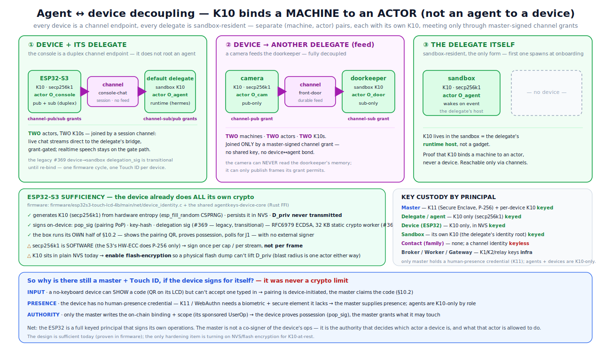
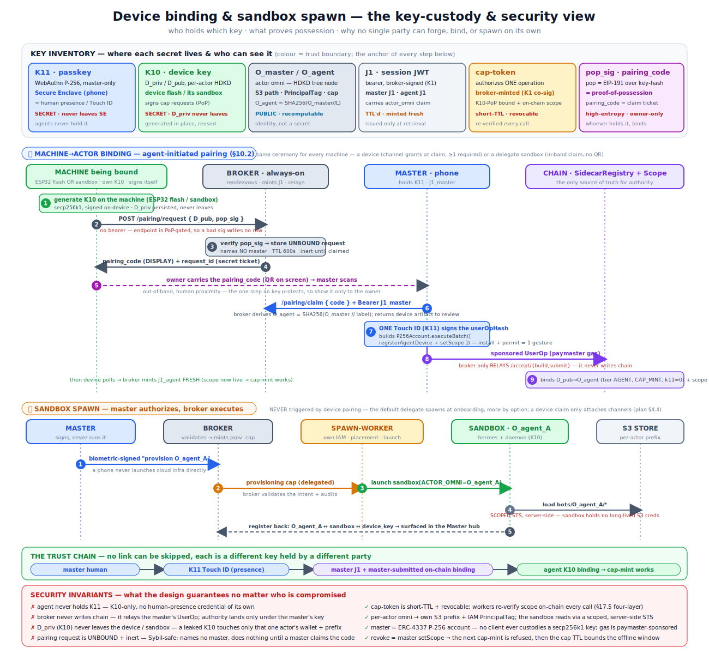

# Agent ↔ device decoupling — channels, gateways, contacts

**Status:** SHIPPED (all six phases' substrate landed; the live/hardware legs are operator-gated follow-ups — see the completion record at the end of §11). Authored from an owner design brief + the ByteDance definition study (`research/bytedance-agent-channel-model.md`, operator-internal); owner-reviewed — **§14 is the resolved-decisions record**. This is a **public spec** (it lives in `docs/spec/` because [arch.md §22e](../arch.md) canonicalizes it and links here); the [arch.md promotion map](#12-archmd-promotion-map) was the ship-time checklist. **Tracked by epic [#404](https://github.com/litentry/agentKeys/issues/404) (milestone M8)** — e2e suite [#405](https://github.com/litentry/agentKeys/issues/405), phases 1–6 [#406](https://github.com/litentry/agentKeys/issues/406)–[#411](https://github.com/litentry/agentKeys/issues/411). The §14 follow-ups (F2 long-poll, F3 spawn-at-submit inside #396, device-key hardening) are deliberately outside the epic.
**Relates to:** [`arch.md`](../arch.md) §5 (canonical names), §10.2 (pairing), §15.4 (email-service), §17.5/§17.6 (isolation + master-as-hub), §22c.4 (vendor device pairing), §22d (hooks + the #384 gate relay); the master-hub-topology + spawn-sandbox-on-pair design docs (`docs/plan/`, operator-internal — roles/context system + #377 sandbox lifecycle); [`agent-background-job-harness.md`](agent-background-job-harness.md); [`ses-email-architecture.md`](ses-email-architecture.md); the ByteDance ArkClaw read (`docs/research/bytedance.md`, operator-internal — Layer 4).

> **In one line:** a **channel** is a declarative, policy-bearing conduit (camera, display, mic, chat session, WeChat, a UI feed) that keyed actors **publish to / subscribe from** under master-signed grants. **Every device is a channel endpoint** (never a runtime host); **every delegate is sandbox-resident** (the first one spawns by default at onboarding); the two only ever meet *through* channels. Externally-authenticated humans (**contacts** — the family) are authorized at a **gateway** by policy, not keys; the **operator has global visibility** over everything, surfaced only in parent-control. This is AgentKeys' build-out of ArkClaw's Layer 4 — *Interaction Identity (Gateway/Policy)* — with authority kept sovereign.

---

## 1. Problem — pairing conflates three bindings

Today (§10.2 + #377) pairing one physical device does three things at once:

1. **machine → actor** — the device's K10 is registered under an `O_agent_X` omni (the binding ceremony);
2. **actor → runtime** — a sandbox is spawned for that actor (spawn-on-pair, kill-on-unpair, quota ≤1);
3. **device = the agent's user interface** — the device's mic/speaker/screen are assumed to be *the* way humans reach that delegate.

Binding (3) is the false assumption the owner brief attacks:

- The **chef** delegate needs daytime input ("the kids ate two cookies", "30 min of swimming") from family members who are *nowhere near* the kitchen device — they have WeChat.
- The **doorkeeper** delegate should consume frames from *multiple cameras* and answer "did the kids come home?" over a chat app. It needs **no device of its own** — it can stay alive in its sandbox.
- A **camera** should not be a delegate at all: it produces images and holds no runtime.
- A **3″ kitchen display** should just render a daily checklist some agent publishes — pure output, maybe a touch input to tick items.
- Many humans — kids, a helper, the owner — reach the *same* fleet of agents with *different* permissions, over channels whose platform identities are KYC-scarce (one WeChat bot per registered account).

The decoupling: keep (1) as the universal machine→actor ceremony; **detach (2) from pairing entirely** — the first delegate spawns at onboarding, more by option; **dissolve (3) into channels** — a device claim attaches channels, never a runtime. There is deliberately **no delegate-device class**: mechanically the runtime always ran in the sandbox, so rooting a delegate's identity in a device's K10 only complicated the model — the delegate's identity roots in its sandbox's own K10, the device is a sibling channel-endpoint actor, and the shipped #369 device→sandbox delegation-sig is a **legacy, transitional** mechanism (§11 migration).

## 2. Decisions (decision-first)

| # | Decision | Ideal | Adopted (compromise + mitigation) | Existing-in-code precedent |
|---|---|---|---|---|
| D1 | **What IS a channel?** | "channels are live processes" (the intuitive read) | **a channel is a declarative resource** `(channel_id, kind, direction(s), adapter, counterparty space, owner, policy)`; the *live* parts are its **adapter** (transport bridge) and — for async kinds — its **feed** (durable queue). Two transport shapes: **feed-backed** (async, durable S3/TOS) and **session** (direct streaming to a live adapter endpoint, e.g. the console's chat to its delegate's bridge — grant-gated the same, no durable feed) | a memory namespace is declarative; the memory worker is the process. Email already has the split: SES Lambda = adapter, `bots/<omni>/{inbound,sent}` = feed, email-service = gate (§15.4) |
| D2 | **Grant vocabulary (policy level 1)** | one `channel:<id>` grant + a read-only flag | **two service ids per channel — `channel-pub:<id>` and `channel-sub:<id>`** (produce into / consume from), because `AgentKeysScope.readOnly` is a dead flag and direction must live in the service id. Spelling **decided** (§14.1) | the #339 read/write split-by-service-id — canonically renamed `context-sub:<ns>` / `context-pub:<ns>` under D11 (wire ids `memory:<ns>` / `inbox:<ns>` frozen) |
| D3 | **Interaction constraints (policy levels 2/3)** | encode counterparty rules on-chain | **off-chain policy documents in the `policy` data class, enforced deterministically at channel workers/the gateway** (the PEP); on-chain stays coarse (L1 grants). Mitigation: workers re-verify grants on-chain per request, policy docs are master-only + never agent-loadable | #201 policy data class ("access-control on the access-control"); payment-service quotas + `payment_k11_threshold` (§15.5) |
| D4 | **KYC-scarce channels (WeChat/Telegram)** | one platform identity per agent (like email) | **one shared bot + a gateway worker** that holds the scarce credential, authenticates each human, and routes — the credential never enters any agent's environment | `agentkeys-gate` #384: the ONE Ark key held by a relay, per-user attribution + budgets + `GateTurn` audit. The gateway is its inbound-messaging sibling |
| D5 | **Family members** | make each family member an actor with keys | **`contact` — an externally-authenticated, keyless principal**: the *channel's transport* authenticates the human (weixin openid / telegram id today; voice-recognition on a console and app sessions are future authenticators), mapped + tiered in a **master-curated contact registry**, authorized by gateway policy (L3). The registry bootstraps from a **household template** — default tiers `owner / partner / elder / kid / helper / guest`; the small model *proposes* tier assignments, the master **confirms** (advisory-only, D10 rule) | ArkClaw layer 02 (org identity) — *the family is the organization, the master is its IdP*; provenance-stamping from the absorption inbox; the #322 classifier-advisory rule |
| D6 | **Device model** | a device class per purpose | **one device kind: a channel endpoint.** Every device binds via unchanged §10.2 to its **own** actor and receives ONLY `channel-pub/sub:<id>` grants (pub, sub, or both — duplex like the console). **A device claim must attach ≥1 channel** (accept card enforces, broker warns — §14.10). Devices never host a runtime, never root a delegate; the legacy #369 device→sandbox delegation-sig retires after the §11 migration | §10.2 already runs "on any VM / container / cloud sandbox / no-input device"; scope-at-claim already selects services (#249). The runtime *already* lives in the sandbox — only the identity root moves |
| D7 | **Feed storage** | a new message broker (MQTT/Kafka) | **S3/TOS-backed feeds under §17 rules, new `channel` data class** (own bucket + IAM role + worker, per the #201 closed-extension recipe). **Feed channels ARE the near-real-time tier (§14.12)**: the channel worker is the only write path, so it completes held consumer **long-polls in-process the instant an event lands** (write-through wakeup) — S3 is the durable record, never the notification path. Expected: **p50 sub-second producer→awake-consumer (~200–500 ms), p95 1–2 s**; a hibernated consumer adds its wake-on-event resume; the firmware 3 s poll is only the fallback cadence. `session`-kind channels are direct-transport (no feed) but identically grant-gated. Continuous media (realtime **speech/video**) stays OUT (the §22d.3a gate path) | per-data-class buckets §17.2; email inbound feed §15.4; the #201 config template; the F2 long-poll shape at the broker |
| D8 | **Feed ownership** | per-agent copies everywhere | **keyed by channel mintability** — *mintable* channel identities keep **per-actor feeds**; *scarce/shared* channels (WeChat, cameras, displays) get **operator-owned feeds** (`bots/<operator>/channel/<id>/…`) with delegates reading via the worker-mediated server-side-STS pattern | email per-actor inbox (§15.4) vs the A′ canonical-read (#295 P1: delegate holds no S3 creds; worker does an exact-object operator-STS read) |
| D9 | **Delegate lifecycle** | always-on agents ("keep alive to respond") | **the first (default) delegate spawns automatically at onboarding**; additional delegates spawn **by option** from parent-control; device pairing NEVER spawns. Availability-decoupling via durable feeds: events queue while the sandbox hibernates; per-delegate policy = `always-on` / **`wake-on-event`** / `scheduled`. A sandbox delegate pairs **headlessly** — the spawn request carries the master's claim, so the §10.2 rendezvous collapses in-band (no QR; QR is only for machines outside a master-authenticated context) | #377 spawn/kill lifecycle actions (ve_faas); spawn-sandbox-on-pair warm-pool + idle-eviction tiers; #278 one-UserOp register precedent for batching the bind |
| D10 | **Routing (which agent answers)** | an LLM picks the agent | **deterministic first** (`/alias` slash routing), tiny-model router **advisory-only** on top — it may pick among agents *this contact is already authorized to reach*, never widen authority; ambiguity → ask back | #322 classify worker + `/v1/cap/classify` (#207); the §17.6/#390 rule "classifier verdict is advisory, not authorizing" |
| D11 | **Direction vocabulary is UNIVERSAL** | rename the shipped `memory:<ns>`/`inbox:<ns>` wire ids now | **pub/sub is the one direction vocabulary everywhere** — channels AND the master↔delegate context flows. Canonical prose: delegate reads canonical context = **`context-sub:<ns>`**; delegate proposes to the inbox = **`context-pub:<ns>`**. **Wire ids `memory:<ns>` / `inbox:<ns>` stay frozen** (arch.md §5 rule — S3 buckets + on-chain service hashes don't rename); the wire rename joins the major-version cutover, superseding the earlier bare `context:` prefix idea | arch.md §5 `context system` row already freezes the code/wire spellings and defers the rename; the cutover bucket exists (master-hub §10/§14) |
| D12 | **Context flows vs channel feeds — one abstraction?** (owner question) | merge them into a single conduit substrate | **one grant vocabulary + event discipline, TWO substrates.** They share the shape (pub/sub grants, worker-mediated access, worker-stamped provenance) — that is D11. They must NOT share machinery: **context flows are curation-gated** (nothing enters canonical except through the master's curate step — the §17.6 invariant; content *shapes agents*) while **channel feeds are delivery-gated** (events flow to authorized subscribers with retention/GC; content *is interaction*, never becomes canonical by flowing). Merging would also collapse `DataClass::Memory` (shipped, wire-frozen) into the new `channel` class, breaking the #201 per-data-class isolation. The only bridge is the deferred feed→`resource` projection (§4.3) | §17.6 curation invariant; #201 closed-extension recipe; #339 shipped machinery |
| D13 | **Visibility model** | per-contact history ACLs on feeds | **operator-global, contact-zero-history.** The operator/master sees everything — every feed, every contact, all audit — **surfaced only in parent-control** (no in-channel notices, §14.7). Contacts receive only (a) live deliveries addressed to them and (b) **agent-mediated answers** ("did the kids come home?" → the doorkeeper answers from its own memory). No contact ever browses feed history — per-contact history ACLs are rejected: tier changes would raise retroactive-visibility questions with no clean answer, and the DB would need per-event audience stamps forever. Because no history access exists, **policy changes are forward-only by construction** — nothing to re-grant or claw back | the master-hub "global visibility" role (§17.6); the L3 rule that operator-grade data needs operator-grade auth |

## 2.5 The cast — every role &amp; principal at a glance

The decoupling introduces new nouns and re-scopes old ones. This is the full roster, sorted by **kind** — because the security model turns entirely on *keyed principal* vs *externally-authenticated (keyless) principal* vs *resource* vs *infra*. (The one-question-per-term definitions are §3; this is the map of who's who.)

| Role | Kind | Holds (keys) | Bound / authorized via | One line |
|---|---|---|---|---|
| **operator / master** | keyed principal (human's control identity) | **K11** (Secure Enclave, P-256) + a per-device **K10** | is the root; **K11** approves every mutation | owns the canonical data + authorizes every grant; **global visibility over every channel, feed, contact, and audit row — surfaced only in parent-control (D13)**; never proxies, never hosts an app |
| **actor** | **the identity unit** (not a role) | an `actor_omni` (+ a K10 on each machine that signs for it) | HDKD tree node (`O_master`, `O_master//agent-A`, `O_master//cam-frontdoor`) | answers *"which identity is this action attributed to?"* — EVERY grant, cap, S3 prefix, PrincipalTag, and audit row is keyed by an actor omni. The master, each delegate, and each device IS an actor; **role** (master / delegate / device) describes what grants that actor holds, not a different identity mechanism (arch.md §6.3) |
| **delegate** (`agent`) | keyed principal | **K10 only** (secp256k1) — no K11; the K10 lives in **its sandbox** | spawned (onboarding default / by option) + headless in-band claim + master grant | a scoped identity equipping exactly one AI runtime; **sandbox-resident by definition**; reachable only through channels |
| &nbsp;&nbsp;· **default delegate** | keyed principal | its sandbox's K10 | spawned automatically at onboarding | the one delegate every account starts with; more are added by option |
| **AI runtime** | external software (not our identity) | — | equipped *by* a delegate | the external AI app a delegate wraps (Hermes, Claude Code, xiaozhi) |
| **device** | keyed machine (an actor) | its **own K10** in flash/NVS — signs for itself | §10.2 pairing → its own actor; claim MUST attach **≥1 channel**; grants are ONLY `channel-pub/sub:<id>` | a physical box = a **channel endpoint** (pub, sub, or duplex — camera, display, the ESP32 console); never a runtime host, never a delegate root |
| **sandbox** | keyed machine | K10 — **its own; the delegate's identity root** | spawn-on-reason (§4.4) | the compute host a delegate's runtime runs in; ephemeral, wake-on-event |
| **channel** | **resource** (not a principal) | — | master creates + grants; carries its own **defaults** (retention, allowed kinds, cadence) in the registry | a declarative pub/sub conduit = adapter (+ durable feed for async kinds); mic, display, camera, chat session, weixin, UI feed |
| **channel adapter** | infra | — | per transport | bridges one transport to canonical channel events (SES Lambda, firmware task, the delegate's sandbox bridge) |
| **gateway** | infra (a shared adapter) | custodies the **scarce transport credential** (e.g. the one WeChat bot key) | per transport | **the capability boundary between externally-authenticated humans and agents**: authenticates contacts, enforces L2/L3 policy, stamps provenance, routes. A PEP, never an authority — grants stay master-signed + chain-verified |
| **contact** | **externally-authenticated principal (keyless)** | **none** — the transport authenticates them (weixin openid / tg id; future: voice-id on a console, app session) | master-curated registry + **tier** (household template, D5) | a family member; authorized by gateway policy (L3), never a keyed actor, never holds caps; **no history visibility (D13)** |
| **broker** | infra | K1 / K2 | always-on, **stateless** (§14.3): authority on-chain, registry docs in encrypted S3/TOS, TTL'd caches only | mints caps + JWTs, relays the master's UserOps — **never writes chain** |
| **worker** | infra | data-class key / KEK | per request | per-data-class PEP; re-verifies the on-chain grant on every call (§17.5 layer 2) |

**The one distinction that carries the security model:**

- **Keyed principals** — master, delegate, device, sandbox — prove who they are with a key **they hold and sign with**, and every one of them is an **actor**. This includes **every ESP32**: it generates, holds, and signs with **its own K10** on-device (secp256k1 via `agentkeys-device-core`; firmware [`net/device_identity.c`](../../firmware/esp32s3-touch-lcd-4b/main/net/device_identity.c)) — `pop_sig` at pairing, cap requests. (The #369 delegation-sig it also ships is the **legacy, transitional** mechanism — see §11 migration.) No external party signs on the device's behalf.
- **Externally-authenticated principals** — contacts (the family) — are authenticated *for* them by a channel's transport, hold no keys and no caps, and are authorized by L3 policy at the gateway. "Keyless" is the key-custody fact; "externally authenticated" is what actually happens.
- **Resources** (channels) and **infra** (broker / worker / gateway / adapters) are **not principals** — they carry the flows and enforce policy, but authority is only ever the master's on-chain, master-signed grant.

The topology — every device a channel endpoint, every delegate sandbox-resident, joined only by grants — is diagrammed here (the ESP32-sufficiency panel shows the device already does all its own crypto):



**ESP32 crypto sufficiency (verified against the firmware):** the design is sufficient for the device to be a full keyed principal *today* — it already does keygen + `pop_sig` (+ the legacy delegation signing) on-device. Two hardening items ride along (→ GH issue, §14.8): secp256k1 is **software** on the ESP32-S3 (the HW-ECC block does P-256 only), so a device must sign **once per cap / per stream, not per frame** (the cap authorizes a stream — §6 camera row); and K10 currently sits in **plain NVS**, so **flash-encryption must be enabled** for K10-at-rest (§9.6). Neither blocks the model — a leaked K10 is bounded to that one actor's prefix + wallet regardless.

## 3. Terminology (one question per term — the ArkClaw definition style)

Candidate arch.md §5 rows (promoted at ship time, not before):

| Term (canonical) | The one question it answers | Definition | Code/wire aliases (when built) |
|---|---|---|---|
| `channel` | *through which conduit does information enter or leave an agent, and under what constraints?* | a declarative, master-owned conduit resource: `(channel_id, kind, direction(s), adapter, counterparty space, owner, policy)`. Kinds span hardware modules (mic, speaker, display, touch, camera), **chat sessions** (a device's live chat to its delegate — `session` transport, no feed), messaging (weixin, telegram, email), and UI feeds (a served folder / SSE a client subscribes to) | `channel-pub:<id>` / `channel-sub:<id>` service ids; `DataClass::Channel` |
| `channel adapter` | *what bridges this transport to canonical channel events?* | the transport-specific live component: a gateway worker (weixin), the SES routing Lambda (email), a firmware task (mic/display/touch), the delegate's sandbox bridge (chat sessions, UI feeds) | per-kind worker crates / firmware modules |
| `channel feed` | *where do events rest while producer and consumer are decoupled in time?* | the durable per-channel queue (async kinds only): S3/TOS prefix `…/channel/<id>/{in,out}/` under the D8 owner, encrypted with the standard envelope; retention/GC per the channel's registry defaults; **history is operator-only (D13)**; `session` kinds are direct-transport, no feed | `$CHANNEL_BUCKET` |
| `gateway` | ***how capably can many externally-authenticated humans interact with agents through a channel?*** | the capability boundary for humans-without-keys: authenticates each contact via the transport (openid today; voice-id / app session later), enforces L2 (how the agent may behave) + L3 (what this contact may ask), stamps provenance, routes. Where the transport identity is scarce (one WeChat bot per KYC'd account), the gateway also custodies that ONE credential. **A PEP, never an authority** — grants stay master-signed + chain-verified | `agentkeys-worker-channel-weixin` (etc.) |
| `contact` | *which human is on the other end of this event, and what may they ask of which agent?* | an **externally-authenticated, keyless** principal in the master-curated contact registry: transport identities → display name + **tier** + per-agent reach. Default household template: `owner / partner / elder / kid / helper / guest` (D5 — model-proposed, master-confirmed; tiers are master-editable policy vocabulary, not wire-frozen). Never an actor: no omni, no keys, no caps; no feed-history visibility (D13) | contact registry doc in the `policy` data class |
| `device` | *is this box a conduit or a brain?* | **always a conduit**: a paired box (own K10, §10.2 ceremony) whose grants are ONLY `channel-pub/sub:<id>` — pub, sub, or duplex; claim attaches ≥1 channel; hosts no runtime | — |
| `default delegate` | *what answers when a fresh account starts talking?* | the delegate spawned automatically at onboarding; sandbox-resident like every delegate; additional delegates are added by option | lifecycle policy field |
| `context-sub:<ns>` / `context-pub:<ns>` | *in which direction may a delegate touch the master's canonical context?* | the D11 canonical prose names for the #339 grants: sub = read the canonical namespace (distribution), pub = propose into the inbox (absorption) — the same pub/sub vocabulary as channels, over the **curation-gated** context substrate (D12) | **wire-frozen aliases: `memory:<ns>` / `inbox:<ns>`** (rename = major-version cutover) |

**Naming collision — DECIDED (§14.2):** the new concept takes the bare word **`channel`**; arch.md §17.6's "the two channels" (distribution/absorption) are retitled **context flows**, and their grants adopt the pub/sub vocabulary as `context-sub:<ns>` / `context-pub:<ns>` (D11). The §5 alias rows record "the two channels (pre-2026-07 name for context flows)" and the frozen wire spellings.

**What lives where (the D12/comment-4 clarification):** `knowledge` (memory) is **agent-only** — recalled context, never channel data. The context system's `resource` kind is **also agent-facing** (static references an agent retrieves) — it is *not* the channel-served data. The channel-side counterpart of "static served data" is the **feed's retained doc** (`latest` + bounded history — e.g. the kitchen checklist a display renders), which lives in the `channel` data class, is visible to subscribers as the *current* doc, and whose *history* is operator-only (D13). The deferred feed→`resource` projection (§4.3) is the only bridge between the two.

## 4. Architecture

**Security baseline — how a machine binds and how a delegate's sandbox is spawned (keys + trust chain):** channels ride on top of the existing pairing + spawn ceremonies; the key-custody view (which party holds K10 / K11 / J1 / cap-token, what `pop_sig` + `pairing_code` prove, and why no single party can forge, bind, or spawn alone) is diagrammed in [`device-bind-sandbox-spawn-security.svg`](../assets/device-bind-sandbox-spawn-security.svg). A **device** reuses the same §10.2 binding unchanged — its claim attaches channel grants (≥1) and nothing else; a **delegate** is the spawn side (Phase Ⓑ), whose sandbox pairs headlessly (in-band claim, no QR).



### 4.1 The channel event

One canonical envelope, **stamped by the adapter/worker — never self-attributed by the payload** (the absorption-inbox provenance rule):

```
ChannelEvent {
  event_id, channel_id, direction: in|out,
  producer:  actor_omni (keyed)  XOR  contact_id + contact_tier (externally-authenticated, gateway-verified),
  kind: text | image | audio-clip | frame | command | doc,
  body | body_ref (S3 key into the feed),  ts,  correlation (conversation/turn id)
}
```

### 4.2 Flows

```
INBOUND (contact → agent):
  contact ──weixin──▶ GATEWAY worker            ──▶ channel feed ──▶ delegate
                       (holds the ONE bot cred;      (S3, durable;     (mints channel-sub cap;
                        authn openid → contact;       operator-owned)   wake-on-event or poll;
                        L3: may THIS contact                            event = DATA, never
                        reach THAT agent?; stamp)                       instructions)

INBOUND (keyed device → agent, feed-backed):
  camera (K10) ──channel-pub cap──▶ channel worker ──▶ feed ──▶ doorkeeper (channel-sub cap)

DUPLEX (keyed device ↔ its delegate, session kind — no feed):
  console (K10) ──channel-pub/sub caps──▶ the delegate's sandbox bridge (adapter)
                  (live chat streams direct; grant-gated the same; realtime SPEECH stays
                   on the §22d.3a gate path — the session kind carries text/commands)

OUTBOUND (agent → contact/device):
  delegate ──channel-pub cap──▶ channel worker / gateway ──L2 check──▶ transport ──▶ contact / display
                                 (counterparty allowed? reply-vs-initiate?          (+ copy to feed,
                                  quota? K11 step-up?)                               + audit row)
```

Four invariants carried over unchanged:

1. **Four-layer isolation (§17.5)** applies verbatim: broker cap-mint checks the `channel-pub/sub:<id>` grant; the channel worker independently re-verifies on-chain; IAM PrincipalTag + the new per-data-class `channel` bucket bound the blast radius. Stage-3 grows the matching negatives (cross-agent channel access → denied at mint; wrong direction → denied; contact not in registry → dropped at gateway).
2. **No credential ever reaches a delegate**: not the WeChat bot secret (gateway custody, #384 pattern), not S3 creds for operator-owned feeds (A′ server-side-STS pattern, #295 P1).
3. **Channel events are DATA, never instructions.** Inbound content is attacker-influenced (kids' messages; camera scenes; anything a stranger can send). It must never widen authority: the control plane stays hooks + caps (§22d), the router is advisory (D10), and events carry worker-stamped provenance + contact tier so the AI runtime can calibrate trust — but no gate ever *keys* on payload content.
4. **Hub-and-spoke discipline**: agents never message each other through channels (cross-delegate sharing stays hub-mediated per §17.6). A channel's counterparty space is humans + devices + external services — not sibling delegates.

### 4.3 Output feeds & UI channels

The display/checklist case ("pure output, maybe touch-to-tick") and the owner's "UI channels subscribe to served data, like the OpenViking resource folder":

- The agent `channel-pub`s a **doc/frame** into the feed; the feed retains `latest` + bounded history (**history readable by the operator only, D13**).
- Consumers (a display device, the parent-control UI, a sandbox-served folder) `channel-sub` with a narrow cap; liveness via long-poll/SSE at the worker; touch-to-tick is just an inbound `command` event on the same channel (duplex).
- Regular publishing ("checklist every morning") = the delegate's **background-job harness** scheduled task (already specced, #340) whose action is a channel-pub — Coze's 触发器, on our substrate.
- Deferred nicety: project a feed's retained doc into the context system's `resource` kind so context-reading UIs get feeds for free — do NOT build until a consumer exists (the only D12 bridge).

### 4.4 Delegate lifecycle (the #377 extension)

Spawn-on-pair is **retired as a concept**; spawn is **spawn-on-reason**, and device pairing is not a reason:

- **`onboarding`** — the **default delegate** spawns automatically when the account first comes alive (the master's register ceremony); its binding is a headless in-band claim (no QR) and can batch into the same accept ceremony.
- **`option`** — the master adds further delegates from parent-control ("add a delegate": pick runtime/persona → spawn + bind, one Touch ID).
- **`channel-event`** — wake a hibernated delegate when a subscribed feed goes non-empty.
- **`schedule`** / **`manual`** — background jobs; operator surgical.

Kill-on-unpair generalizes to **idle-eviction + delegate removal** per the spawn-sandbox-on-pair tier table (Pro dedicated / shared tiers). The doorkeeper is `wake-on-event` — *always-available without always-on*: durable feeds decouple the agent's availability from its interlocutors exactly the way §17.6's S3 + always-on broker decoupled the master's. **Devices only ever attach channels** — unbinding a device detaches its channels and spawns/kills nothing.

### 4.5 Flow budget — where the time goes, and the decided dispositions

Grounded against the shipped code paths ([`accept.rs`](../../crates/agentkeys-broker-server/src/handlers/accept.rs), [`poll.rs`](../../crates/agentkeys-broker-server/src/handlers/agent/poll.rs), [`claim.rs`](../../crates/agentkeys-broker-server/src/handlers/agent/claim.rs), [`resolve.rs`](../../crates/agentkeys-broker-server/src/handlers/agent/resolve.rs), firmware [`pairing.c`](../../firmware/esp32s3-touch-lcd-4b/main/net/pairing.c)) — every number is a code constant, not an estimate. The spawn leg belongs to onboarding, not device pairing; a device claim is pure channel attachment.

**Where the time goes today** (after the human's two gestures — scan + ONE Touch ID — which are the deliberate floor):

| # | Leg | Cost today | Source |
|---|---|---|---|
| 1 | K10 keygen (first boot) | off the human path — runs before the QR renders | `device_identity.c` |
| 2 | pairing request → QR | 1 RTT | §10.2 |
| 3 | claim | 1 RTT; the device artifact returns **inline** | `claim.rs` |
| 4 | accept submit → **chain inclusion** | **~1 Heima block ≈ 6 s today → ~2 s after the in-progress elastic-scaling upgrade**; the broker blocks the HTTP response in a 2 s receipt-poll loop (90 s timeout; a timeout also skips the #97 audit envelopes) | `accept.rs`; `research/heima-block-speed.md` (operator-internal) |
| 5 | device learns "claimed" + gets J1 | ≤3 s quantization (fixed poll: 3 s × 200 tries, one fresh ECDSA pop each) — overlaps leg 4, since J1 is minted at *claimed* | `pairing.c` `PAIRING_POLL_MS=3000`; `poll.rs` |
| 6 | scope-live discovery | lazy — the first cap-mint is rejected until inclusion, then retried | `poll.rs` doc-comment |
| 7 | **default-delegate sandbox spawn** (onboarding path only) | cold veFaaS spawn + image + hermes boot | `plan/spawn-sandbox-on-pair.md` (operator-internal), #396 in flight |
| 8 | first cap-mint | broker mint + worker 3-eth-call chain re-verify | §17.5 |

**Dispositions (owner, 2026-07-07):** the parachain team's **2 s block upgrade is in progress and carries the latency win** — so F1 (optimistic-ack) and F5 (block speed) are **not pursued here** (the optimistic-accept plan stays shelved as its own doc, where the timeout-skips-audit gap remains recorded). **F2 and F3 become GH issues** (file after this plan merges); **F4, F7, F8 are postponed**; F6 rode on F1 and is moot.

| # | Item | Disposition |
|---|---|---|
| F1 | Optimistic-ack (Mode B) | **not pursued** — superseded by the 2 s upgrade; `plan/optimistic-accept-reconcile.md` (operator-internal) stays shelved |
| F2 | Long-poll `/pairing/poll` (broker holds ≤25 s; firmware 3 s loop as fallback; fresh `pop_sig` per attempt stays) | **→ GH issue** |
| F3 | Spawn the default delegate at UserOp *submit* (overlapped under the block wait; failed reconcile ⇒ kill path; sandbox boots *installed-but-not-yet-permitted*) | **→ GH issue** (§14.9; decide inside #396 while the trigger is free) |
| F4 | Warm pool | postponed (spawn-plan open decision #3 stands) |
| F5 | 2 s blocks | **in progress — parachain team owns it** |
| F6 | Auto-ack on reconcile | moot (rode F1) |
| F7 | Scope-live fast retry | postponed |
| F8 | Accept-card preset grant templates | postponed — the structural half (device claim = channel attachment, no spawn leg) is simply the design (§4.4) |

**What we deliberately do NOT optimize (looks like fat, is load-bearing):**

- The **two-gesture floor**: scan = proximity + claim authorization; Touch ID = authority. Combine *screens*, never gestures.
- **J1 minted at retrieval** (no bearer at rest) and **fresh `pop_sig` per poll** (caps replay of the static poll tuple) — both deliberate in `poll.rs`.
- **Worker per-request chain re-verify** (3 `eth_call`s) — the defense against broker compromise. Cache the scoped STS per TTL if profiling ever demands; never skip the verify (the A′ posture).
- **No local shortcut** when master + delegate share a box (master-hub §9): fix latency with caches, never bypass authorization.
- **Optimistic *authority*** (Mode A) — forbidden. Any future ack may be optimistic; every effect gates on inclusion.

## 5. The policy model — one shape, every subject

The cap-token machinery is **unchanged**: a device mints caps exactly like a delegate does (K10-signed request → broker checks the on-chain grant → worker re-verifies on-chain → short-TTL, revocable cap). Channels never mint anything — they are resources, and their own constraints live as **defaults in the channel registry entry** (retention, allowed event kinds, publish cadence), enforced by the same worker. What generalizes is *who is constrained where*:

| Layer | Subject | Question | Mechanism | Enforced at | Precedent |
|---|---|---|---|---|---|
| **L1 — access** | any **keyed actor** — delegate **or device** | may this actor touch this channel at all, in which direction? | on-chain grant of `channel-pub:<id>` / `channel-sub:<id>` (per-direction service ids, D2) → cap-token per operation | broker cap-mint + worker chain re-verify (layers 1–2 of §17.5) | the #339 split — `context-sub/pub:<ns>` (wire: `memory:` / `inbox:`) |
| **L2 — interaction** | any **granted actor** | *how* may it behave inside the channel? | per-(actor, channel) policy doc: for a **delegate** — counterparty allow/deny, **reply-only vs initiate**, quotas, media rules, **K11 step-up** for high-risk sends; for a **device** — allowed event kinds, rate/bandwidth quotas, publish cadence, retention class | channel worker / gateway (PEP) | payment quotas + `payment_k11_threshold`; codex-review §7 ("sending messages externally" = canonical high-risk) |
| **L3 — audience** | a **contact** (externally-authenticated human) | may this contact reach this agent through this channel, and at what grain? | contact registry: **tier** (household template, D5) + per-agent reach + per-contact rate limits; operator-grade queries require operator-grade auth (session/K11), never just a matching openid; **no history visibility (D13)** | gateway, BEFORE anything reaches an agent | ArkClaw layer 02/04; the family-is-the-organization mapping |
| **channel defaults** | the **channel itself** (a resource) | what does this conduit carry at all? | registry-entry defaults: retention/GC, allowed kinds, cadence ceilings — the floor under every L2 doc | channel worker | §15 worker-per-data-class pattern |

**L3 scope, v1:** L3 is enforceable exactly where the transport can authenticate the human — **the weixin/telegram gateway** (platform accounts). That is deliberately the v1 scope *and* the big use case: WeChat is the primary way family members reach the whole system. Future contact authenticators extend the same L3 machinery without changing it: **voice-recognition on a console** (the console adapter authenticates the speaker as a contact — e.g. reply-to-kids vs reply-to-adults), and **app sessions** for a family-member view. Both are postponed (§13); email sender identity is spoofable without strict alignment, so email contacts are out of L3 v1 (email is deprioritized anyway, §13).

**Contact auto-setup (D5):** at gateway setup the master picks (or the small model proposes) a **household template** — `owner / partner / elder (owner's parents) / kid / helper (chef, cleaner) / guest` — which pre-creates the tier menu and default per-tier reach (kids → storyteller-class agents; helper → chef/cleaning agents; elder → family notifications; guest → nothing until upgraded). As each contact binds (§7.2), the model **proposes** a tier from the invite context; the **master confirms** — the classifier is advisory, never authorizing (D10), and helper sub-roles (chef vs cleaner) are per-agent *reach* entries, not extra tiers.

**The generalization invariant (mirrors the context system's):** the *machinery* is uniform across channel kinds — grants, caps, feeds, worker verification, audit; what varies per kind is the **policy vocabulary** (weixin: DM-vs-group, 48 h reply windows; display: publish cadence; camera: retention). One policy schema core `(counterparty, direction, quota, step-up threshold)` + kind-specific extensions — exactly how the context system varies gate strictness per type over one lifecycle (§17.6).

In one line: **keyed actors (delegates, devices) are authorized by L1 grants they prove with K10 and shaped by L2 policy; contacts are authorized by L3 policy the gateway enforces for them; channels themselves carry only defaults.**

## 6. Channel-kind constraint matrix

The brief's "constraints and mitigations", tabled (per-platform details re-verified at build time):

| Kind | Platform identity | Mintable per agent? | Constraints | Consequence (D4/D8) |
|---|---|---|---|---|
| **weixin** | **two drivers, one PEP (decided 2026-07-09):** iLink personal bot (`ilink` — experiment) / official account (`oa` — production) | ❌ one per KYC'd account either way; re-binding overwrites; `oa`: user-initiated reply windows (~48 h) + content review; `ilink`: DM-only, per-message `context_token` reply authorization | **shared gateway**; operator-owned feed; contacts authn'd by sender id (openid / ilink user id); `oa` replies ride the reply window — proactive pushes need template-message rights (L2 `initiate` right models this); `ilink` replies echo the stored `context_token` | the v1 priority channel |
| **telegram** | BotFather bots | ⚠️ bots are mintable, but the owning account is phone-KYC'd; bots cannot message a user first | gateway (shared account custody) even though bots could be per-agent; first-contact = user starts the bot (a natural contact-bind ceremony) | |
| **chat session (device ↔ its delegate)** | the device's K10 | ✅ | live text/commands streaming to the delegate's sandbox bridge; `session` transport — **no durable feed** (latency); grant-gated like every channel | duplex `channel-pub/sub` on the console; replaces the legacy #369 delegation as the device→delegate authorization |
| **realtime speech** | none (proximity) | n/a | ~1 s turn budget | **NOT a channel** — realtime voice keeps the §22d.3a gate path end-to-end (postponed as a channel concern, §14.6); channels carry text, commands, and `audio-clip` events only |
| **camera / sensor** | the device's K10 | ✅ (it IS a paired actor) | bandwidth/retention; scene content is untrusted input; long-poll delivery acceptable (§14.6) | device, pub-only grant; frames → operator-owned feed, envelope-encrypted; **history operator-only (D13)** |
| **display / e-ink** | the device's K10 | ✅ | pull-based; tiny screen | device, sub-only grant (+ optional pub for touch commands) |
| **UI feed (parent-control / sandbox folder)** | operator session | ✅ | session-authenticated; full history (operator) | sub via existing surfaces; SSE/long-poll at the worker |
| **email** | address on our domain | ✅ (SES aliasing, §15.4) | inbound = spam/phish surface; sender identity spoofable → no L3 contacts | **deprioritized (§13)** — the §15.4 email worker keeps running as-is outside the channel model until prioritized |

## 7. The WeChat gateway (concrete first instance — the v1 priority)

**Transport decision (owner, 2026-07-09): the FIRST EXPERIMENT runs on the Tencent iLink personal-bot API** (the MIT-licensed [`Tencent/openclaw-weixin`](https://github.com/Tencent/openclaw-weixin) wire protocol, re-implemented natively in the gateway worker — no OpenClaw agent runtime in the message path, which would blur the PEP boundary). Why: QR-scan a spare personal account in minutes vs. an entity-verified 服务号 in weeks; the long-poll needs **no public callback endpoint**; and the flagship chef scenario below (all-day family DMs + a proactive 16:00 send) fits the personal-bot DM model natively where the OA reply-window/template regime constrains it. **The 公众号 (`oa`) driver stays shipped as the production/compliance path** — flip `AGENTKEYS_WEIXIN_TRANSPORT` when contact scale or entity readiness demands; both drivers converge on one relay core (registry, L3, router, audit never fork per transport). Operator ceremonies for both live in the operator-internal wechat-gateway-setup doc.

One household bot; every family member subscribes to the same bot; the gateway behind it:

1. **Custody** — holds the bot credential the way `agentkeys-gate` holds the Ark key (#384): scarce, shared, never in any agent's environment; per-contact attribution + quotas; every relayed turn audited (new op_kinds via the §15.3b ritual).
2. **Contact bind ceremony** (mirrors pairing's claim shape): master invites a contact from parent-control → one-time bind code → the human sends it to the bot → gateway records `openid → pending` → master approves; the small model **proposes** the tier + reach from the household template (D5), the master **confirms**. No keys, no chain write — the registry is a master-authored `policy`-class doc.
3. **L3 + routing per message**: authenticate openid → contact; check reach; route: **`/alias` deterministic** (`/chef 今晚吃什么`) → else the **advisory router** (a #322 classify-worker extension) picks among the agents *this contact may reach*; ambiguous → ask back. The router can never name an agent the contact isn't authorized for (D10).
4. **Delivery**: stamped event → the target agent's subscribed feed → wake-on-event if hibernated → the agent's reply comes back as a channel-pub the gateway L2-checks (reply window, counterparty) and sends.

## 8. Worked examples (the brief's three)

- **Chef.** Family members text the bot all day ("two cookies", "30 min swim"); gateway authenticates each contact, stamps provenance, appends to the chef's subscribed `family-weixin` feed. At 16:00 a scheduled job wakes the chef: it consumes the day's events, computes the dinner energy budget, `channel-pub`s the menu to the `kitchen-display` feed, and sends the helper a summary (L2: helper is an allowlisted counterparty; initiate right granted for that one contact).
- **Doorkeeper.** The front-door camera (device, pub-only) publishes motion frames. The doorkeeper delegate (sandbox, wake-on-event) consumes, classifies, writes "kids home 15:42" into its `memory:<ns>`, and pubs a notification event that the gateway delivers to `partner`/`elder`-tier contacts. When a parent later asks "did the kids come back?", L3 admits the question, the router picks the doorkeeper, and it **answers from its own memory — contacts never browse the camera feed itself; the feed history is operator-only, in parent-control (D13)**.
- **Weekly spend stats.** The owner asks the bot for weekly agent costs. The gateway maps openid → `owner` tier, but operator-grade data still requires operator-grade auth: v1 answers with a deep link into parent-control (session-authenticated); a later option is a steward delegate explicitly granted a metering-read service over the #384 per-user usage rollups. Kids asking the same question are refused at L3.

## 9. Threat model deltas

1. **Prompt injection via channels** — the dominant new surface (kids' messages; camera scenes; anything a stranger can send). Mitigations: data-not-instructions posture (§4.2 invariant 3); worker-stamped provenance + tier on every event; L2 deterministic gates on all outbound effects; hooks/caps unchanged as the control plane. An injected agent can at worst emit within its granted channels, quotas, and counterparty lists.
2. **Gateway compromise** — blast radius = the bot credential + L2/L3 enforcement for that transport, **not authority**: it cannot mint grants (chain-verified at workers), cannot read feeds outside its channel role, cannot forge provenance *silently* (audit rows anchor). Same bounded-PEP posture as a compromised worker in §17.5.
3. **Contact impersonation** — platform-identity theft (a stolen phone) impersonates a contact. Tiers bound the damage (guest/kid tiers can't reach sensitive agents); owner-tier never substitutes for operator auth (L3 rule); per-contact anomaly quotas at the gateway.
4. **Family privacy** — contacts' messages are third-party personal data; **all audit belongs to the operator and is surfaced only in parent-control (§14.7 — no in-channel notices)**. Contacts have zero feed-history visibility (D13), which also removes the retroactive-visibility problem when tiers change: policy changes are forward-only by construction. Per-tier retention knobs on feeds; the kid-safety vs helper-privacy tension is the operator's to manage in parent-control.
5. **Device subversion** — a flashed camera can flood or poison frames: per-device quotas at the worker (L2-device row), pub-only scope bounds it, revocation = the standard per-actor scope revoke (atomic, §6.2).
6. **Device K10 at rest** — the device signs for itself (good), but on the ESP32-S3 the K10 sits in **plain NVS** today (firmware `net/device_identity.c`), so physical flash extraction lifts `D_priv`. Mitigation: enable ESP-IDF **flash/NVS encryption** (AES-256, key in eFuse) — tracked as a GH issue with the curve question (§14.8); even unencrypted, per-actor isolation bounds a lifted K10 to that one device's actor (channel grants only — it can never reach memory/creds).
7. **Template-tier mis-assignment** — the model proposing a wrong tier at contact-bind could over-grant reach. Bounded because the proposal is **advisory** (master confirms every assignment) and tiers gate *reach*, never operator-grade data or history (L3 + D13); the residual risk is master rubber-stamping — the confirm card must show the proposed reach diff, not just the tier name.

## 10. Reuse map (why this is mostly assembly)

| Existing primitive | Role in channels |
|---|---|
| §10.2 pairing + K10 + claim-time scope (#249) | registers devices (claim attaches ≥1 channel) + delegates (headless in-band claim) |
| the #339 direction split (`context-sub/pub`, wire `memory:`/`inbox:`) | the per-direction service-id pattern `channel-pub/sub:<id>` generalizes (D11) — same vocabulary, different substrate (D12) |
| #201 closed-extension recipe | the `channel` data class: bucket + IAM role + worker + stage-3 negatives |
| A′ server-side STS (#295 P1) | delegate reads of operator-owned feeds without holding S3 creds |
| `agentkeys-gate` #384 | scarce-shared-credential custody + per-user metering — the gateway's template |
| #322 classify worker + `/v1/cap/classify` (#207) | the advisory router + the contact-tier proposer (both advisory-only) |
| background-job harness (#340) | scheduled publishing (checklists, digests) |
| #377/#396 ve_faas spawn/kill | onboarding default-spawn + wake-on-event lifecycle |
| #369 device→sandbox delegation-sig | **legacy, transitional** — replaced by the `session` channel grant; retire after the §11 migration (one firmware cycle, §14.11) |
| payment quotas + `payment_k11_threshold` (§15.5) | the L2 quota + step-up shape |
| audit envelope + §15.3b op_kind ritual | channel send/receive/route/bind audit rows |
| email-service §15.4 + SES Lambda | unchanged for now — **deprioritized** (§13); becomes `kind=email` only when prioritized |

Net-new inventions are exactly three: the **ChannelEvent envelope + feeds**, the **contact registry + L3**, and the **gateway workers**.

## 11. Phases (implementation order — WeChat first)

| # | Phase | Delivers | Depends on |
|---|---|---|---|
| 1 | **Substrate** | `ChannelEvent` + channel registry (grants on-chain; registry docs in encrypted S3/TOS per §14.3; broker stateless) + `channel-pub/sub:<id>` builders in `agentkeys-protocol` (one-owner #203) + `DataClass::Channel` per the #201 recipe + channel worker skeleton + op_kinds + stage-3 negatives | — |
| 2 | **WeChat gateway MVP** (the priority — the main human interface) | bot custody + contact registry + household-template bootstrap + bind ceremony (model-proposed tier, master-confirmed) + L3 + `/alias` routing (deterministic only) + reply-window L2; targets the delegates that already run today | 1 |
| 3 | **Devices as channel endpoints** | claim-time channel attachment (≥1: accept card enforces, broker warns — §14.10); camera pub-only + display sub-only firmware paths; **`session` kind** for the console's chat (replaces #369 delegation for new binds); camera → doorkeeper demo with a *manually run* consumer; long-poll delivery (§14.6) | 1 |
| 4 | **Default delegate + lifecycle** | onboarding auto-spawn (headless in-band claim, one Touch ID with the register batch) + "add a delegate" option flow + spawn-on-reason (`channel-event` wake) extending #377/#396; **#369 migration**: existing device-rooted delegates re-bind (device → its own actor + session channel; delegate → sandbox K10) within **one firmware release cycle, one Touch ID per device (§14.11)**, then the delegation-sig path retires | 1, 3 |
| 5 | **Router + surfaces** | advisory router (#322 extension); parent-control channel/contact management + per-contact audit views (operator-only visibility, D13) | 2 |
| 6 | **Promotion** | arch.md §5/§17.6 edits per §12; threat-model spec update; user-manual entries | any shipped phase |

(Email-as-channel was dropped from the phase list — deprioritized, §13.) Per the plan-completion policy: any PR implementing a phase enumerates its rows and reports skipped items explicitly.

### Completion record (plan-completion policy)

**What landed** (per phase → PR):

- **e2e gate (#405)** — `e2e/channel-e2e-decoupling`… → `e2e/channel-e2e-demo.sh`, the independent regression gate on `_demo_lib.sh`; grows one step-family per phase (14 steps at phase 5), `--ci` green-with-skips, `--headless` strict, wired into `suite.sh --stage channel` + `e2e-ci.yml`.
- **Phase 1 substrate (#406)** — `DataClass::Channel`, `channel-pub/sub:<id>` grants + service builders, `/v1/cap/channel-{pub,sub}`, `ChannelEvent` envelope, `agentkeys-worker-channel` with the §14.12 NRT worker-held long-poll, channel-family audit op_kinds 100-102, the `channel` bucket+role+provision scripts, the §17.5 four-layer negatives.
- **Phase 2 WeChat gateway (#407)** — `agentkeys-worker-channel-weixin`: #384 bot-credential custody, the `contact` registry with household tiers, the L3 PEP, `/alias` routing, GatewayRelay/ContactBind op_kinds, D13 contact-zero-history; mock-driver e2e + the operator setup doc.
- **Phase 3 devices-as-endpoints (#408)** — the `is_device` accept signal + the §14.10 ≥1-channel broker warn, `ak_device_cap_pop_sig` (a device signs its own channel caps on-device), the `session` `ChannelKind`.
- **Phase 4 lifecycle (#409)** — **device pairing never spawns** (D9, `scope_is_device_only`); the #369 delegation-sig retirement switch (§14.11).
- **Phase 5 router + surface (#410)** — the advisory router (structurally can-never-widen), `routed_by` worker-stamping, the admin-gated D13-safe `GET /v1/gateway/contacts` operator view.
- **Phase 6 promotion (#411)** — arch.md §5/§15/§17.5/§22e canonical-name + endpoint + status rows, this record, the user-manual channel/contact/gateway/device entries, the threat-model deltas (§9).
- **iLink transport driver** (post-epic — the §7 transport decision) — the native `ilink` driver inside `agentkeys-worker-channel-weixin`: the `--login` QR ceremony, the resumable `getupdates` long-poll, in-channel decision replies with `context_token` echo, the stale-token (-14) loud-pause; the OA webhook and the iLink loop converge on one relay core; proven against a mock-iLink server in `tests/ilink_flow.rs`.

**What did NOT land** (operator/hardware-gated live legs, tracked as follow-ups, NOT silently dropped):

- **Live WeChat proof** — for the decided `ilink` experiment path: a spare personal account through the `--login` ceremony + a real DM round-trip (minutes of operator work; wechat-gateway-setup Path A). The `oa` live leg (a real 公众号 + IP whitelist; Path B) stays the production gate. CI remains on the mock drivers for both.
- **Outbound send / reply-window L2 + the model-driven tier PROPOSER** — the outbound half needs the app-secret + access-token lifecycle; the registry is master-authored today.
- **Camera/display/`session` firmware paths + a bound-device feed round-trip** — no camera on the `esp32s3-touch-lcd-4b`; firmware doesn't build in CI. The device-core FFI enabler ships; the firmware wiring is the release-cycle gate.
- **veFaaS-live lifecycle** — default-delegate onboarding auto-spawn, channel-event wake-on-reason, the #369 firmware re-bind cycle (needs VE keys + `SANDBOX_FUNCTION_ID` + Touch-ID onboarding).
- **The parent-control React UI** — channel/contact management panels + the feed-history browser (the backend read contract + the D13-safe view shipped in #410; the frontend is the follow-up).
- **`session`-kind sandbox-bridge wiring + the registry-from-config-data-class sync** — noted in the crate docs.

## 12. arch.md promotion map

At ship time (never before), fold into arch.md **in the same change as the first landed phase touching each row**:

| arch.md site | Change |
|---|---|
| §5 canonical names | add `channel`, `channel adapter`, `channel feed`, `gateway`, `contact`, `device` (= channel endpoint), `default delegate`, `context-sub/pub:<ns>` rows (the §3 table); record the §17.6 rename alias + the frozen `memory:`/`inbox:` wire spellings |
| §17.6 | retitle "the two channels" → **context flows** (§14.2); grants gain the `context-sub/pub` canonical prose names; loud alias note; record D12 (one vocabulary, two substrates — curation-gated context vs delivery-gated channels) |
| §15 | new `channel` worker family section + `DataClass::Channel` (email-service unchanged/deprioritized) |
| §10.2 / §22c.4 | claim-time **channel attachment (≥1 required)**; delegates bind headlessly from their sandboxes; #369 delegation marked legacy/transitional |
| §17.5 | channel-pub/sub as cap-gated services; new stage-3 negatives listed |
| §6.3 / new § | the keyed-vs-externally-authenticated principal split (`contact`); the family-is-the-organization framing + household tier template; the D13 visibility model (operator-global, contact-zero-history) |
| §22d | gateway = PEP placement note; router + tier-proposer advisory-only rule |

## 13. Deferred / out of scope

- **Email as a channel kind** — deprioritized (owner, 2026-07-07): the §15.4 email worker keeps running as-is outside the channel model until email becomes a priority.
- **Realtime speech as a channel** — stays on the §22d.3a gate path (one-place-end-to-end rule); the `session` kind carries text/commands, and voice *notes* are `audio-clip` feed events.
- **Voice-recognition contacts** (a console authenticating the speaker — reply-to-kids vs reply-to-adults) and a **family-member app view** (contact-scoped surface) — future L3 authenticators; if the app view ever ships, visibility is **forward-only** (D13 — no retroactive history).
- **Agent-to-agent channels / mesh** — excluded; hub-mediated only (§17.6).
- **Contact → co-master upgrade** (spouse becomes a second master, §22c.3) — an identity ceremony, not a channel feature.
- **Cross-operator channels** (two households bridging) — post-v1.
- **Feed-as-`resource` projection** into the context system — until a consumer exists (the only D12 bridge).
- **Per-agent Telegram bots** (mintable path skipping the gateway) — possible later; start shared for one custody model.
- **The D11 wire rename** (`memory:`/`inbox:` → `context-sub/pub:<ns>`) — rides the existing major-version cutover bucket (with the `agent→delegate` selector rename); prose/UX adopt the new names at promotion.

## 14. Decisions record (resolved by the owner, 2026-07-07)

1. **D2 naming spelling** — **`channel-pub:<id>` / `channel-sub:<id>`.**
2. **§17.6 rename** — **decided**: bare `channel` for the new concept; "context flows" + `context-sub/pub:<ns>` prose names for distribution/absorption; wire ids frozen (D11).
3. **Registry locus** — **the broker stays STATELESS**: top-level authority on-chain (the `channel-pub/sub:<id>` grants on `AgentKeysScope` — already the L1 design); channel definitions, contact registry, and L2/L3 policy docs as **encrypted objects in S3/TOS** under the `policy` data class (master-owned, worker-read). *Assessment (the requested push-back): no better-performing alternative needs broker state.* Per-decision object reads amortize behind a **TTL'd read-through cache** — a cache is not state (safe to lose, rebuilt on read; the daemon cap-cache posture); the only broker-held rows remain the **transient** §10.2 pairing/rendezvous entries (TTL'd, non-authoritative — the shipped shape). If gateway policy reads ever dominate latency, tune cache TTLs or give the gateway worker its own read-through cache — never authoritative broker state.
4. **Worker granularity** — **per-transport worker crates** sharing a `channel-core` lib (isolation-by-worker precedent).
5. **Contact registry class** — **`policy` data class** (master-only; agents see only the worker-stamped `(contact_id, tier, display_name)` on events, never the registry).
6. **Camera latency / realtime** — **long-poll is acceptable now**; realtime speech stays out of channels; the realtime leg is postponed.
7. **Family transparency** — **silent**: all audit belongs to the operator, surfaced **only in parent-control**; no in-channel disclosure notices (pairs with D13 operator-global / contact-zero-history).
8. **Device key curve + at-rest** — **keep secp256k1 for uniformity**; revisit P-256 only if per-cap signing latency proves a real UX cost; **mandate flash-encryption for K10-at-rest** before a consumer device ships. **→ keep tracked as a GH issue.**
9. **F3 (spawn at submit)** — **→ GH issue**; decide inside #396 while the trigger point is still free.
10. **≥1-channel enforcement** — **accept card enforces + broker warns** (a grant-less device actor is inert, not dangerous); revisit to hard-fail if inert bindings accumulate.
11. **#369 migration window** — **one firmware release cycle**; the re-bind is **one Touch ID per device**.
12. **Near-real-time on feed channels** — **YES, decided (2026-07-08, owner-delegated)**: feed channels serve NRT event delivery (doorbell frames, chat relay, notifications) via **worker-held long-poll + write-through wakeup** — every write already passes through the channel worker (cap-gated), so it completes held consumer polls in-process at write time; S3/TOS stays the durable record only. p50 sub-second for an awake consumer, p95 1–2 s; hibernated delegates add wake-on-event resume. NOT covered: continuous media streams (speech/video — §14.6 gate path). Scale-out caveat recorded, not built: with multiple worker replicas the wakeup needs a notify hop (Redis/SNS-class); today's one-worker-per-class deployment needs none.

Follow-up GH issues to file after this plan merges: **F2** (long-poll `/pairing/poll`), **F3** (default-delegate spawn at submit), **device-key hardening** (flash-encryption + the curve revisit).

## 15. References

- `research/bytedance-agent-channel-model.md` (operator-internal) — the definition study this plan's vocabulary is calibrated against (Coze publish-to-channel; HiAgent Canvas; ArkClaw Interaction Identity + personal-edition 消息渠道).
- `research/bytedance.md` §2/§7, `research/bytedance-codex-review.md` §7/§8 (both operator-internal) — the Layer-4/gateway framing + high-risk-review packaging borrowed here.
- [`../arch.md`](../arch.md) §5, §6, §10.2, §15.3b, §15.4, §15.5, §17.2/§17.5/§17.6, §22c, §22d.
- The master-hub-topology + spawn-sandbox-on-pair design docs (`docs/plan/`, operator-internal); [`agent-background-job-harness.md`](agent-background-job-harness.md); [`ses-email-architecture.md`](ses-email-architecture.md); [`threat-model-key-custody.md`](threat-model-key-custody.md).
