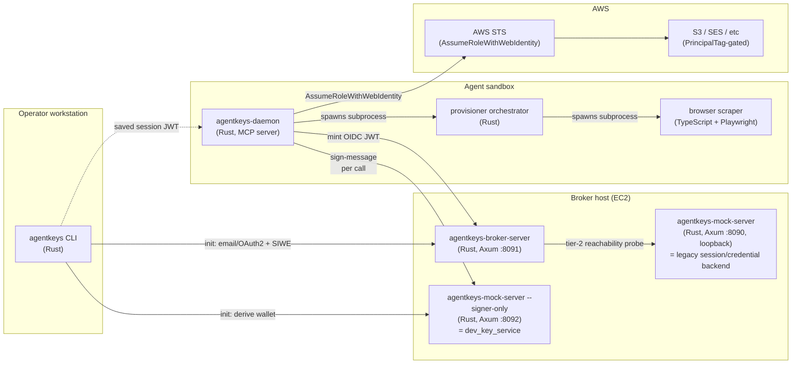
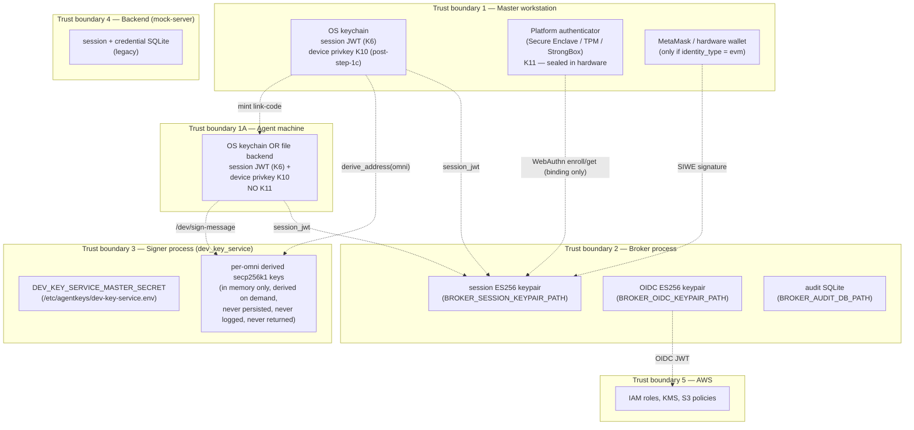
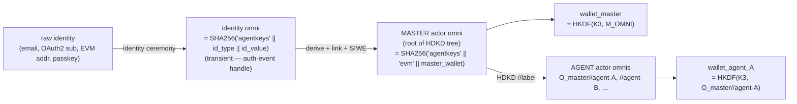
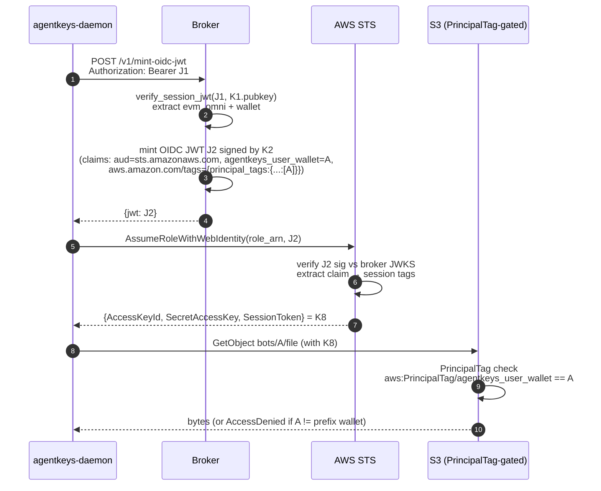
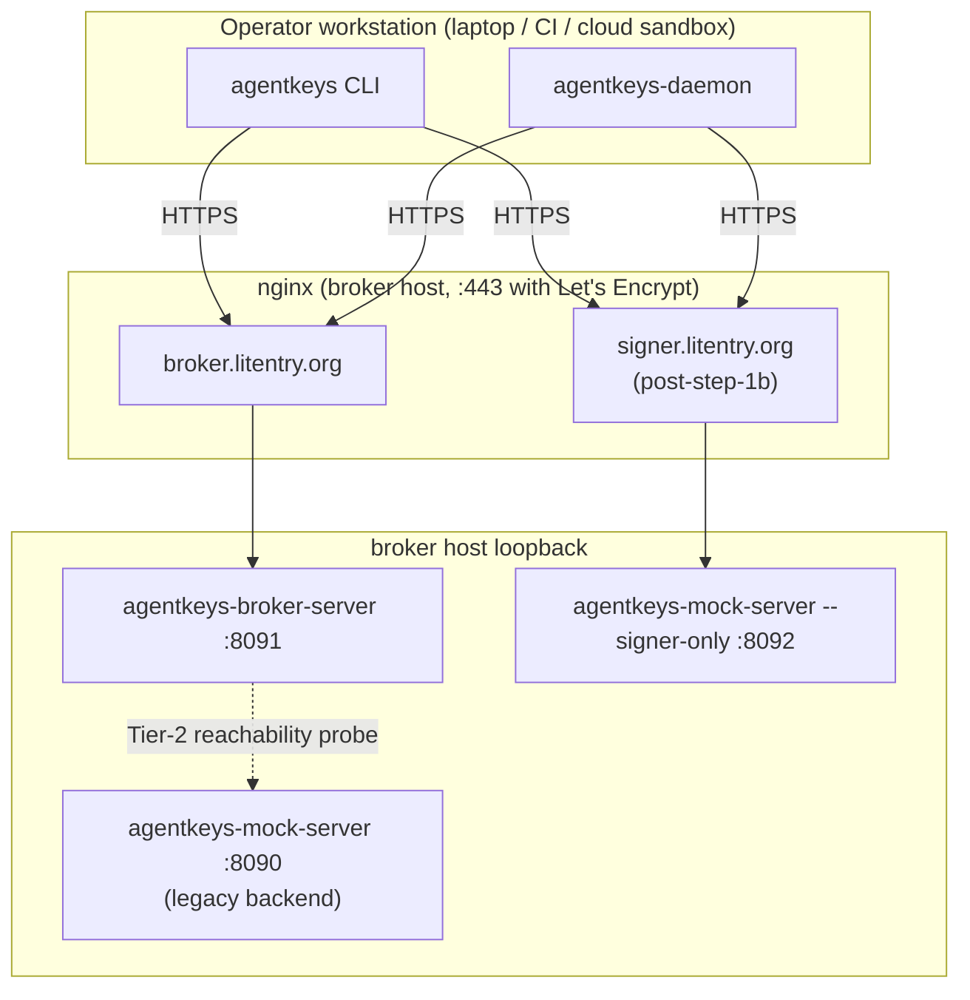

# AgentKeys — Architecture (broker, signer, daemon, key flows)

**Audience:** anyone who needs to reason about AgentKeys end-to-end —
new contributors, security reviewers, ops, design partners. Use this
as the single visual + textual reference. Diagrams are Mermaid where
possible so they render in GitHub and copy cleanly into Figma.

**Status:** canonical (post-issue-#74). Supersedes `docs/stage7-wip.md`
(archived). Component inventory and language choices were absorbed
from the prior `architecture.md` revision.

**Companion docs (canonical for their narrow surface; this doc links
to them rather than duplicating):**

- [`signer-protocol.md`](signer-protocol.md) — `/dev/*` wire contract
- [`threat-model-key-custody.md`](threat-model-key-custody.md) —
  retroactive-confidentiality + key custody position
- [`heima-gaps-vs-desired-architecture.md`](heima-gaps-vs-desired-architecture.md)
  — what current-Heima is missing vs the desired AgentKeys
  architecture
- [`credential-backend-interface.md`](credential-backend-interface.md)
  — 15-method `CredentialBackend` trait
- [`plans/issue-74-dev-key-service-plan.md`](plans/issue-74-dev-key-service-plan.md)
  — dev_key_service signer (issue #74 step 1)
- [`plans/issue-74-step-1c-device-key-auth.md`](plans/issue-74-step-1c-device-key-auth.md)
  — device-key auth on `/dev/*` (issue #74 step 1c, planned)

---

## 1. Component map



**Three independent trust boundaries, three independent products:**

| Service | Public hostname (typical) | Holds | Role |
|---|---|---|---|
| Broker | `broker.litentry.org` | ES256 OIDC keypair, ES256 session keypair, audit DB | Mints session JWTs after identity ceremony; mints OIDC JWTs from session JWTs; never holds AWS principals at runtime |
| Signer (`dev_key_service`) | `signer.litentry.org` (post-step-1b) | `DEV_KEY_SERVICE_MASTER_SECRET` (32 bytes hex) | Derives EVM wallets from `omni_account` and signs EIP-191 messages on the operator's behalf. Replaceable with a TEE worker post-step-2. |
| Backend (mock-server) | `127.0.0.1:8090` (loopback only) | Legacy session/credential SQLite | Tier-2 reachability target for the broker; legacy `/session/*` + `/credential/*` endpoints used by the daemon's pair-flow |

**Why three?** Compromise of any one process must NOT enable
impersonating the others. Broker compromise can't extract the master
secret (it's on the signer). Signer compromise can't mint session
JWTs (the keypair is on the broker). Backend compromise can't sign
EVM messages and can't mint cloud creds. The split is enforced by
process boundary and (at production deployment) by separate listener
+ host firewall.

---

## 2. Trust boundaries (where keys live, who can see them)



**Compromise-blast-radius table:**

| Boundary breached | What attacker gains | What they CANNOT do |
|---|---|---|
| **Master workstation** (host root, but no hardware presence) | Stolen session JWT (replay until exp); stolen K10 device key (sign on operator's behalf until rotation) | **Cannot complete WebAuthn ceremony** to bind a new device or rotate K10 — K11 sealed in Secure Enclave/TPM requires biometric/PIN. Cannot derive wallets for other operators; cannot mint session JWTs for new identities. |
| **Master workstation** (full compromise WITH hardware presence — e.g. attacker physically at machine and unlocks biometric) | Above, plus: rebind K10 to attacker-controlled pubkey, rotate device key, mint link codes for new agents | Same as above — bounded to this operator's omni; cannot reach other operators' material |
| **Agent machine** (sandbox VM, host root) | Stolen K10; stolen session JWT (replay until session-JWT TTL expires) | Cannot rebind without master-issued link code; master link-code issuance is gated by master J1 (which is gated by master K11). Cannot escalate to master compromise. |
| Broker process | Mint session JWTs for any omni; mint OIDC JWTs (gated by JWT auth, defeated by full broker compromise) | Cannot derive wallets; cannot sign EIP-191 messages; cannot AssumeRole (no AWS principal at broker). **Post-step-1c: cannot forge device signatures** because per-request K10 signature is verified at signer — broker compromise alone cannot make the signer accept an attacker request. |
| Signer process (current step-1) | Derive any wallet from any omni; sign any EIP-191 message for any omni | Cannot mint session JWTs; cannot mint OIDC JWTs; cannot reach AWS |
| Signer process (post-step-1c) | Above, AND can verify (but not forge) device-signed requests | Same as above; per-request device signatures still gate the call surface |
| Backend (mock-server) | Stale legacy session bearer; credential ciphertext (today's mock storage) | Cannot affect Stage 7 mint paths (broker verifies session JWTs locally post-issue-#71) |
| AWS account | Game over for that operator's data scope | None of the above; AWS compromise is its own incident class |

**Note on signer-process compromise.** Today's `dev_key_service` is
the **dev-stage** placeholder. Compromising the signer host = full
master-secret leak = every wallet for every operator is forge-able
forever. The TEE worker (issue #74 step 2) closes this: master secret
is sealed inside the enclave; host root no longer suffices.
Step-1c device-key auth additionally bounds the impact of broker
compromise on the signer call surface.

---

## 3. Key inventory

The complete list of cryptographic material in the system. Use this
as the source-of-truth when designing the Figma trust-flow diagram.

| # | Key | Type | Lives in | Role | Lifecycle |
|---|---|---|---|---|---|
| K1 | Broker session keypair | ES256 (P-256) | Broker process; pinned file at `BROKER_SESSION_KEYPAIR_PATH` (mode 0600); pubkey exported to `*.pub.pem` (mode 0644) for signer | Signs session JWTs (issued post-identity-ceremony, bound to omni + wallet) | Generated at first broker boot; preserved across re-deploys; manual rotation procedure TBD |
| K2 | Broker OIDC keypair | ES256 (P-256) | Broker process; pinned file at `BROKER_OIDC_KEYPAIR_PATH` (mode 0600); pubkey published at `<broker>/.well-known/jwks.json` | Signs OIDC JWTs minted by `/v1/mint-oidc-jwt` (consumed by AWS STS / GCP WIF / Tencent CAM via `AssumeRoleWithWebIdentity`) | Generated at first broker boot; rotation requires re-registering the OIDC provider in cloud IAM |
| K3 | Dev-signer master secret | 32 raw bytes (hex-encoded) | `/etc/agentkeys/dev-key-service.env` (mode 0600, owner agentkeys); auto-generated by `setup-broker-host.sh` | HKDF input for deriving per-actor-omni secp256k1 wallets (one per node in the HDKD actor tree — see §4) | Generated once on first broker-host setup; **never rotate** (rotation invalidates every previously-derived wallet); replaced by sealed enclave secret post-step-2 |
| K4 | Per-actor derived wallet | secp256k1 | Signer process (in memory only, derived on demand from K3 + actor_omni; never persisted, never logged, never returned over wire) | The managed EVM wallet for one node in the HDKD actor tree (master OR a specific agent). Different actor omni → different wallet → different AWS PrincipalTag → different S3 prefix. Used by signer to sign EIP-191 messages on that actor's behalf. | Deterministic; same `(K3, actor_omni)` always → same wallet; lifecycle == lifecycle of K3 |
| K5 | EVM-wallet (operator-held) | secp256k1 | Operator's MetaMask / hardware wallet / `cast wallet` | Identity authenticator for `identity_type = evm`; signs SIWE messages directly (this path bypasses K3/K4 entirely) | Operator-managed; outside AgentKeys' lifecycle |
| K6 | Session JWT | JWT (ES256 by K1) | Operator's OS keychain (via `agentkeys-core::session_store`) on the workstation; in daemon memory at runtime | Bearer credential for `/v1/mint-oidc-jwt`, `/v1/wallet/*`, post-step-1b also for `/dev/*` | TTL = `BROKER_SESSION_JWT_TTL_SECONDS` (default 18000s = 5h); re-mint requires re-running the identity ceremony |
| K7 | OIDC JWT | JWT (ES256 by K2) | Daemon memory only (transient — fetched per mint) | Web-identity token for `AssumeRoleWithWebIdentity` against AWS STS | TTL = `BROKER_OIDC_JWT_TTL_SECONDS` (bounded `[60, 3600]`, default 300s) |
| K8 | AWS temp credentials | STS access key + secret + session token | Daemon memory only (transient — refetched per provision/mint) | Direct AWS API access scoped by PrincipalTag = wallet | 1-hour TTL (STS default); short by design |
| K9 | DKIM keypair (per outbound domain) | Ed25519 | Stage 6 design — currently TEE-only, not yet implemented | **DKIM = DomainKeys Identified Mail (RFC 6376).** A per-domain signing key used to sign outbound email headers; the matching public key is published as a DNS TXT record at `<selector>._domainkey.<domain>`. Receiving mail servers fetch the pubkey via DNS, verify the signature, and use the result to decide whether the message originated from a server authorized for that domain — input to spam filtering, deliverability, and brand-impersonation defense. AgentKeys needs K9 because Stage 6 sends mail FROM operator-controlled sub-domains (e.g. for OpenRouter signups via plus-aliased addresses) and we hold the signing key ourselves rather than delegating to SES (so AWS never sees the plaintext content) — see [`heima-gaps §4`](heima-gaps-vs-desired-architecture.md). | TBD per Stage 6 spec ([`heima-gaps §4`](heima-gaps-vs-desired-architecture.md)) |
| K10 | Device key (planned, step-1c) | secp256k1 | **Master**: OS keychain (TouchID-backed on macOS, etc.) on the operator's workstation. **Agent**: OS keychain when available, else file backend at `~/.agentkeys/daemon-<wallet>/session.json` (mode 0600) — see §5a.4.2. Pubkey registered at the broker as a session JWT claim (`agentkeys_device_pubkey`). | Per-request signature on `/dev/sign-message` calls — eliminates broker-as-SPOF for signer auth | Generated at init stage 0 (per §5); bound by master init per §5a.1 OR agent bootstrap per §5a.2; rotated by `agentkeys device rotate` per §5a.3.2 or by re-init; TTL = session JWT TTL |
| K11 | WebAuthn platform-authenticator credential (planned v0.2, master only) | Per-RP credential (typically EC P-256 on macOS Secure Enclave / Windows TPM / Android StrongBox) | **Master only.** Sealed inside the platform authenticator's hardware boundary; cannot be exfiltrated even by host-OS root. Credential ID published at the broker as a session JWT claim (`agentkeys_webauthn_cred`). | Hardware-attested **user-presence proof at master binding ceremonies** (init per §5a.1, new-device per §5a.3.1, rotation per §5a.3.2). NOT used per-request — K10 covers per-request signing without biometric. | Created at master init; survives K10 rotations; revoked by removing the credential from the broker's bound list or by destroying the platform authenticator |

**Notation throughout the rest of this doc:** the K1–K11 indices
above are referenced directly so any flow can be unambiguously
mapped back to which key signed/verified/wrapped what.

### 3a. Canonical names (one concept, one canonical spelling)

Pinned to disambiguate the same value showing up under different
labels across components. **Use the canonical column** in every new
doc, runbook, CLI output, and commit message; the alias column lists
every spelling that exists today so a reader chasing one of them can
find their way back. Per `CLAUDE.md` →
"Terminology-source-of-truth rule", if you introduce a name not in
this table, either add the alias row here or rename the call site to
match the canonical name in the same change.

| Canonical name              | Identity                                                                                                                                                    | Aliases seen in the codebase / docs (NOT to introduce new ones)                                                                                                                                                                                                                                            |
|-----------------------------|-------------------------------------------------------------------------------------------------------------------------------------------------------------|------------------------------------------------------------------------------------------------------------------------------------------------------------------------------------------------------------------------------------------------------------------------------------------------------------|
| `master_wallet`             | K4 instance bound to one actor's actor_omni at init/SIWE-verify. Source = `JWT.agentkeys.wallet_address` of the persisted session JWT (K6).                  | `wallet_address` (JWT claim shape), `agentkeys_user_wallet` (OIDC JWT claim + AWS PrincipalTag key), `session_wallet` (CLI `agentkeys whoami` field), `MASTER_WALLET` (demo doc shell var), `session.wallet.0` (Rust field).                                                                                |
| `derived_address(omni)`     | K4 instance computed on demand by `/dev/derive-address` for any omni — `HKDF(K3, omni)`. NOT persisted to a session JWT; NOT in AWS PrincipalTag.            | `derived_address` (CLI `whoami` field), `ADDR_A` / `ADDR_B` (demo doc shell vars for the specific case `omni=actor_omni`), `SIGNER_DERIVE_ADDR` (`demo-show.sh` internal var).                                                                                                                              |
| `actor_omni`                | The durable per-actor omni — `SHA256("agentkeys"||"evm"||master_wallet)` once SIWE-bound. Carried in `JWT.agentkeys.omni_account`.                          | `omni_account` (JWT claim + CLI `whoami` field), `OMNI_A` / `OMNI_B` (demo doc shell vars), `evm_omni` (init-flow return field, transient name pre-SIWE).                                                                                                                                                  |
| `identity_omni`             | The transient identity omni — `SHA256("agentkeys"||identity_type||identity_value)`. Used internally by the broker between init and SIWE-verify; never in a post-SIWE JWT. | `identity_omni_email` / `identity_omni_oauth2` (demo doc when narrowing to a specific identity type), `identity omni` (init-flow CLI log line).                                                                                                                                                            |
| `K3` (= `master_secret`)    | The 32 bytes in `/etc/agentkeys/dev-key-service.env` that every K4 is HKDF-derived from. Single per-broker-host.                                            | `DEV_KEY_SERVICE_MASTER_SECRET` (env var name), `master_secret` (signer-side log).                                                                                                                                                                                                                         |
| `session JWT` (= K6)        | The bearer token at `~/.agentkeys/<id>/session.json` (or OS keychain). Signed by K1.                                                                        | `session_jwt` (JSON field name in broker responses), `evm_session_jwt` (init-flow internal var post-SIWE), `SESSION_JWT_A` / `SESSION_JWT_B` (demo doc shell vars).                                                                                                                                         |
| `OIDC JWT` (= K7)           | Per-mint short-lived JWT signed by K2; consumed by `AssumeRoleWithWebIdentity`.                                                                             | `oidc_jwt`, `JWT_A` / `JWT_B` (demo doc shell vars).                                                                                                                                                                                                                                                       |

The most common confusion this table resolves: **`master_wallet`
(persisted in the session JWT, used by AWS PrincipalTag) ≠
`derived_address(actor_omni)` (recomputed on each `/dev/derive-address`
call, never reaches AWS).** Both are valid K4 instances; only the
first is what AWS sees in `${aws:PrincipalTag/agentkeys_user_wallet}`.
The post-SIWE `actor_omni` itself is *not a wallet* — it's the 32-byte
SHA256 input that defines which K4 the signer derives.

---

## 4. Identity model

The system has two omni concepts that compose into an HDKD actor tree:



**Identity omni vs actor omni — different roles, different lifespans:**

- **Identity omni** = `SHA256("agentkeys" || identity_type || identity_value)`. Derived from the authenticator (email, OAuth2 sub, EVM addr, passkey). **Transient handle** for one auth event — the broker uses it to drive the wallet-binding round-trip, then discards it. Multiple identity omnis can map to the same master actor omni (a user with linked email + OAuth has two identity omnis but one master).
- **Actor omni** = `SHA256("agentkeys" || "evm" || lower(wallet))`. Derived from a wallet address. The **durable identity** the system reasons about: session JWTs, OIDC claims, audit attribution, AWS PrincipalTag are all keyed on actor omni.

For `identity_type = evm` (operator authenticates via their own EVM wallet via SIWE), the identity omni and master actor omni are equal — identity IS the wallet, no signer derivation needed.

### HDKD tree of actors (per-agent omni model)

Actor omnis form an HDKD tree rooted at the master. Every node has its own derived wallet:

```
O_master                                wallet_master = HKDF(K3, O_master)
├── O_master//agent-A                   wallet_agent_A = HKDF(K3, O_master//agent-A)
├── O_master//agent-B                   wallet_agent_B = HKDF(K3, O_master//agent-B)
│   └── O_master//agent-B//task-1       (future — sub-actors under agents)
└── ...
```

Hard derivation (`//N`) — child secret cannot be derived without the parent's master secret. Substrate / SLIP-0010 standard. Each node's wallet is a different EVM address; AWS PrincipalTag is per-actor-wallet for prefix isolation.

**Why per-agent omni (not shared with master):**
1. Per-agent compromise containment — leaked agent K10 touches only that agent's wallet/prefix.
2. First-class audit attribution — audit rows carry `acting_omni`, `parent_chain`, `derivation_path`.
3. Atomic revocation — revoke `O_master//agent-A` alone; master and other agents untouched.
4. Tree topology IS the data model — no binding-table abstraction needed.

The shared-omni-with-multiple-device-pubkeys model is a v1c shipping shortcut; v1.0 = HDKD per-agent omni. v1c is a degenerate v1.0 tree (no children).

---

## 4a. Mental model — four orthogonal axes

The system separates four concepts that earlier drafts collapsed:

| Axis | What it answers | Realized by | Lifecycle |
|---|---|---|---|
| **Identity** | Who is the human? | Identity omni (email / OAuth / EVM / passkey) | Recoverable via linked authenticators; identity omnis are ephemeral, masters are durable |
| **Actor** | Master, or which agent? | Actor omni — a node in the HDKD tree (`O_master`, `O_master//agent-A`) | Master derived from identity at first init; agents derived from master via `//<label>` |
| **Machine** | Which physical box is signing right now? | K10 device pubkey (per-machine, bound to one actor); K11 WebAuthn (master only) | Per-box at init/rotation |
| **Capability** | What is this actor allowed to do? | Wallet boundary (coarse — per-actor S3 prefix via PrincipalTag) + grants `Grant { issuer_wallet, child_wallet, scope, expires_at }` (fine) | Master-issued; expirable; revocable |

**Roles (master vs agent):** master and agent are distinct **roles on the actor axis**, not separate axes. Differences:

| | Master | Agent |
|---|---|---|
| HDKD position | Root | `//<label>` child of master |
| K11 (WebAuthn) | Yes — needed for binding ceremonies | No — agents have no human-presence credential |
| Bootstrap | Identity ceremony + WebAuthn enrollment | **Link-code from master, only** (no other path) |
| Spawns other actors | Yes (mints derivation certs + link codes) | No |
| Recovery on identity loss | Re-auth via any linked identity authenticator | Re-bootstrap via fresh link-code from master |

**Key non-conflations:**
- Identity ≠ actor — one human has many actors (master + N agents); HDKD tree expresses the relationship.
- Actor ≠ machine — one actor can run on many machines (master on laptop + phone); each machine has its own K10 binding under that actor's omni.
- Master ≠ agent — same axis (actor), distinct roles. Bootstrap path, K11 ownership, and revocation authority differ.

For agent-specific operator/contributor reference, see [`.omc/wiki/agent-role-and-usage-hdkd-per-agent-omni.md`](../../.omc/wiki/agent-role-and-usage-hdkd-per-agent-omni.md).

---

## 5. Cold-start (init) sequence

Init has three stages, with an actor-role branch at stage 2:

| Stage | What | Where |
|---|---|---|
| **0 — Device-key generation** | Daemon generates `(D_priv, D_pub) = K10` at startup. No network traffic. | Local (master OS keychain or agent file backend per §5a.4) |
| **1 — Identity ceremony** | **Master only.** Verify the human via email link / OAuth callback / EVM SIWE / passkey. Returns `binding_nonce` to the broker. **Agents skip this.** | Master ↔ broker |
| **2 — Binding ceremony** | Branches on actor role. **Master**: WebAuthn enrollment (K11 binds D_pub atomically inside the WebAuthn challenge). **Agent**: link-code redeem from master (no human, no WebAuthn). | Per role — see §5a.1 (master) / §5a.2 (agent) |
| **3 — J0 → J1 bridge** | **Master only.** Derive wallet via signer, link at broker, SIWE round-trip → mint long-lived EVM-omni JWT (J1). | Master ↔ broker ↔ signer |

```mermaid
sequenceDiagram
  autonumber
  participant Op as Operator
  participant CLI as agentkeys CLI
  participant KC as OS Keychain
  participant Brk as Broker
  participant PA as Platform authenticator (K11)
  participant Sig as Signer (dev_key_service)

  Note over CLI,KC: Stage 0 — generate K10 locally (no network)
  Op->>CLI: agentkeys init --email alice@x.com
  CLI->>KC: persist (D_priv, D_pub) = K10

  Note over CLI,Brk: Stage 1 — identity ceremony (master only)
  CLI->>Brk: POST /v1/auth/email/request {email}
  Brk-->>CLI: {request_id, binding_nonce}
  Op-->>Brk: clicks magic link → identity verified
  Brk-->>CLI: {status: "verified"}

  Note over CLI,PA: Stage 2 — master binding ceremony (WebAuthn)
  CLI->>PA: navigator.credentials.create({challenge: SHA256(binding_nonce || D_pub)})
  PA-->>CLI: WebAuthn attestation (K11 hardware-attested)
  CLI->>Brk: POST /v1/auth/bind/<request_id> {webauthn_attestation, D_pub}
  Brk-->>CLI: J0 (claims: agentkeys_device_pubkey=D_pub, agentkeys_webauthn_cred=K11_id)

  Note over CLI,Sig: Stage 3 — derive + link + SIWE → J1 (master only)
  CLI->>Sig: POST /dev/derive-address {O_master} (Bearer J0)
  Sig-->>CLI: {address: A = HKDF(K3, O_master)}
  CLI->>Brk: POST /v1/wallet/link {evm, A} (Bearer J0)
  CLI->>Brk: POST /v1/auth/wallet/start {address: A}
  Brk-->>CLI: {siwe_message: M}
  CLI->>Sig: POST /dev/sign-message {O_master, hex(M)} (Bearer J0)
  Sig-->>CLI: {signature: sig}
  CLI->>Brk: POST /v1/auth/wallet/verify {request_id, sig}
  Brk-->>CLI: J1 (long-lived; preserves K10 + K11 claims; adds wallet)
  CLI->>KC: persist J1
```

J1 is the long-lived bearer the master uses for all subsequent operations. Agent flow does not run stages 1 or 3 — it bootstraps via link-code from a master that has already completed this sequence. See §5a.

> **v1c interim status.** v1c ships bespoke per-identity PoP shapes (`pop_sig` field for email/oauth2; SIWE-payload `Device Pubkey` commit for evm) instead of the WebAuthn ceremony at stage 2. Wire shapes pinned in [step-1c plan](plans/issue-74-step-1c-device-key-auth.md). v0.2 collapses these into the WebAuthn ceremony shown above. The agent flow (§5a.2) is unchanged between v1c and v0.2.

---

## 5a. Per-actor binding ceremonies

Canonical reference for binding K10 to an actor omni — first-time init and re-binding flows. Roles split per §4a:

- **Master** = device with platform authenticator. Holds K11. Runs identity ceremony + WebAuthn binding. Spawns agents.
- **Agent** = VM / Linux / CI / `agent-infra/sandbox` container. No K11. **Bootstraps via link-code from a master, only** (no other path).

YubiKey-on-Linux as a master tier (roaming-authenticator binding lets a Linux box be a master) is deferred — see [issue #79](https://github.com/litentry/agentKeys/issues/79).

### 5a.1 Master init

Per §5 stages 0–3. Identity ceremonies vary per identity type but converge on the same WebAuthn binding ceremony at stage 2:

| Identity type | Stage 1 (identity ceremony) | Output | Stage 3 note |
|---|---|---|---|
| `email-link` | Broker emails magic link; operator clicks; broker confirms single-use within TTL | `(email, binding_nonce)` | Standard (derive + link + SIWE → J1) |
| `oauth2_google` | Broker redirects to Google; OAuth2 callback returns `code`; broker exchanges for ID token | `(google_sub, binding_nonce)` | Standard |
| `evm` | Broker generates SIWE-shaped identity-only payload; operator signs with EVM key (MetaMask / hardware wallet); broker ecrecover | `(evm_address, binding_nonce)` | **Collapses** — the user's own EVM key IS the wallet, no signer derivation, no second SIWE round-trip. Broker mints J1 directly with the verified EVM address. |
| `passkey-as-identity` | WebAuthn assertion against an existing platform-authenticator credential | `(webauthn_user_handle, binding_nonce)` | Standard (re-auth case, not first-time enroll) |

Stage 2 (master binding ceremony — WebAuthn enrollment per §5) is identical across all identity types. D_pub is committed atomically inside the WebAuthn challenge (`SHA256(binding_nonce || D_pub)`) — no separate `pop_sig` field needed.

**Q7 fix:** email-account compromise alone cannot rebind. An attacker who phished the email account can complete the identity ceremony but cannot complete the WebAuthn ceremony on the legitimate user's hardware (Touch ID / Hello requires the physical device).

### 5a.2 Agent bootstrap (link-code only — single path)

**Agents have exactly one bootstrap path:** a one-time link code minted by an authenticated master. There is no agent-runs-its-own-identity-ceremony, no agent-recovers-via-OAuth, no shared-bearer alternative. This is a deliberate simplification — one path = one test surface, one threat model.

```
ON MASTER (already initialized; holds J1_master):
1. CLI: agentkeys agent create --label agent-A
2. CLI → broker: POST /v1/agent/create
                  { parent_omni: O_master, label: "agent-A" }
                  Authorization: Bearer J1_master
3. Broker:
   - Verify J1_master
   - Derive O_agent_A = HDKD(O_master, "//agent-A")    [hard derivation]
   - Master signs derivation cert via WebAuthn get() against K11
     (proves master human authorized this agent's existence)
   - Persist (parent: O_master, child: O_agent_A, deriv_cert)
   - Mint one-time link code bound to O_agent_A (TTL 600s)
4. CLI: print link code (or auto-pipe to agent provisioner)

ON AGENT MACHINE (any VM / container / CI runner / cloud sandbox):
5. Stage 0 (per §5): daemon generates (D_priv_agent, D_pub_agent) at startup
                     persists D_priv per §5a.4
6. agentkeys-daemon --init-link-code <code> --broker-url B --signer-url S
7. Daemon → broker: POST /v1/auth/link-code/redeem
                     { link_code, device_pubkey: D_pub_agent,
                       pop_sig: sign(D_priv_agent, link_code || D_pub_agent) }
8. Broker:
   - Verify pop_sig (proves daemon holds D_priv_agent for D_pub_agent)
   - Mark link code consumed (single-use)
   - Bind (O_agent_A, D_pub_agent)
   - Mint J1_agent with claims:
       omni                    = O_agent_A
       parent_omni             = O_master
       derivation_path         = "//agent-A"
       agentkeys_device_pubkey = D_pub_agent
       agentkeys_user_wallet   = HKDF(K3, O_agent_A)  ← per-agent wallet
9. Daemon: persist J1_agent; enter MCP-stdio loop
```

**Trust chain:** `master human → master K11 → master J1 → derivation cert → agent J1`. The agent never holds K11 or any user-presence credential.

The agent's `pop_sig` is sufficient on its own (no WebAuthn equivalent) because the link code is single-use, TTL-bounded, and bound to a specific agent omni at mint time — possession of the code + matching D_priv proves the agent received the bearer from the master and holds the device key.

### 5a.3 Master device switch + device-key rotation

#### 5a.3.1 New master device (operator gets a new laptop)

```
ON NEW MASTER:
1. Stage 0: generate fresh (D_priv', D_pub') = K10' at daemon startup
2. CLI: agentkeys init --email alice@x.com  (or any identity)
3. Run stages 1–3 per §5 — WebAuthn enrollment binds NEW K11' on new hardware
4. Broker observes pre-existing (D_pub_old, K11_old) for same omni:
     (a) ADDS (D_pub', K11') alongside (multi-device, v0.2), OR
     (b) REPLACES old binding (single-device default)
5. New master persists J1' (D_priv' was persisted at stage 0)
```

**Cross-device confirmation (v0.2 target):** when broker observes pre-existing K11_old, it requires WebAuthn `get()` against K11_old (push to existing master) before binding K11' — defeats email-account-compromise → device-takeover.

#### 5a.3.2 Master device-key rotation (no identity re-auth)

```
ON MASTER (still has J1 + D_priv_old + K11):
1. CLI: agentkeys device rotate
2. CLI: generate (D_priv_new, D_pub_new); persist D_priv_new
3. CLI: WebAuthn get() against K11 over SHA256(D_pub_old || D_pub_new || rotation_nonce)
4. CLI → broker: POST /v1/wallet/device/rotate
                  { D_pub_old, D_pub_new, webauthn_assertion,
                    sig_new: sign(D_priv_new, rotation_nonce) }
                  Authorization: Bearer J1
5. Broker: verify J1 + WebAuthn (user-presence) + sig_new (new D_priv possession);
            replace binding (omni, D_pub_old) → (omni, D_pub_new);
            mint J1_new; revoke J1
6. CLI: persist J1_new; clear D_priv_old
```

If both D_priv_old AND K11 are lost → fall back to §5a.3.1 (re-do identity ceremony from new master device).

### 5a.4 Agent re-bootstrap + persistence

#### 5a.4.1 Agent re-bootstrap (fresh sandbox, agent restart)

```
ON MASTER:
1. agentkeys agent create --label agent-A   (or reuse existing label)
   → mints fresh link code; old D_pub_agent_old binding remains until
     explicit revoke via `agentkeys agent revoke --pubkey D_pub_old`
     (defensive cleanup, not required for security — the old pop_sig
     cannot be re-issued without the agent's old D_priv)

ON NEW AGENT:
2-9. Same as §5a.2 steps 5–9 (new D_pub binds under same O_agent_A)
```

Multiple concurrent device pubkeys under the same agent omni is the default — many concurrent VMs are typical for ephemeral-sandbox patterns.

#### 5a.4.2 Where D_priv lives on an agent machine

OS keychain when available (Linux GNOME Keyring, Windows Credential Locker). When unavailable — `agent-infra/sandbox`'s default Docker container exposes none — [`keyring-rs`](https://crates.io/crates/keyring) falls back to a file backend at `~/.agentkeys/daemon-<wallet>/session.json` (mode 0600). Reference: [`docs/spec/1-step-analysis.md`](1-step-analysis.md).

| Agent lifecycle | D_priv behavior | Operator action |
|---|---|---|
| **Long-lived sandbox** (single container instance for hours/days) | File persists across daemon restarts within the container | None |
| **Ephemeral sandbox** (container destroyed between sessions, e.g. nightly CI) | D_priv vanishes with the container | Master mints fresh link code per §5a.4.1; agent re-bootstraps. **No human re-presence required** — master's `agentkeysd` can auto-mint on agent-restart signal |
| **Hardened sandbox** (TPM / Secure Enclave passthrough, AWS Nitro Enclave) | D_priv pinned to hardware OR sealed to boot measurement | Survives container destruction; v0.2 enhancement |

**Why this is the right answer (not a workaround):** the master holds the long-lived authority; agents are short-lived consumers. The link-code-per-restart pattern mirrors `agent-infra/sandbox`'s two-tier orchestrator model — orchestrator holds the long-lived signing key; sandbox holds only short-TTL bearer credentials. Leaked sandbox env = at most one link-code-TTL of access, scoped to that agent's permissions.

### 5a.5 Trust shape across actor roles

| Compromise | Blast radius |
|---|---|
| **Master K10 leaked** (host root, no hardware presence) | Forge `/dev/*` calls under `O_master` until rotation. **Cannot rebind K10** (requires K11). **Cannot mint new agent omnis or link codes** (those gate on master J1, which itself gates on K11 at re-bind time). |
| **Master K10 + K11 hardware presence** (attacker physically at machine + biometric unlock) | Above plus: rebind K10, rotate, mint new agent omnis. Bounded to this human; cannot reach other masters. |
| **Agent K10 leaked** (sandbox host root) | Forge `/dev/*` calls under `O_agent_A` until link-code rotation OR session-JWT TTL expiry. **Cannot rebind without a fresh master-issued link code.** **Cannot escalate to master.** **Cannot reach other agents' wallets** (PrincipalTag enforcement at STS — different wallet, different prefix). |
| **Broker process** | Mint session/OIDC JWTs. **Cannot forge device signatures** — per-request K10 signature is verified at signer; broker compromise alone cannot make the signer accept an attacker request (post-step-1c). |
| **Signer process** (current step-1) | Derive any wallet, sign any message. Cannot mint JWTs, cannot reach AWS. Replaced by TEE worker per issue #74 step 2. |
| **AWS account** | This operator's data scope only. Per-actor PrincipalTag prefix isolation contains it further: agent A's compromise does not touch agent B's prefix. |

Per-actor isolation is what the HDKD per-agent omni model buys: agent compromise touches one wallet (one S3 prefix) and one omni (one audit slot), never the master and never other agents.

---
## 6. Per-mint sequence (issue #71 Option A — daemon-side)



**Three things AgentKeys validates here that a static-IAM-user
deployment cannot:**

1. **Per-omni cred scoping.** S3 enforces the prefix match against
   the assumed-role session's PrincipalTag — by AWS policy engine,
   not by app code.
2. **No long-lived AWS principal at the broker.** Issue #71 Option A
   moved the broker off `sts:AssumeRole` (which required broker IAM
   creds) onto `sts:AssumeRoleWithWebIdentity` (driven by JWT). The
   broker holds zero AWS material at runtime.
3. **Daemon-side mint.** The provisioner runs the entire
   STS-call client-side, only bouncing through the broker for the
   JWT. Broker compromise affects the JWT-signing surface, not the
   STS call itself.

---

## 7. Pluggable surfaces

The architecture is intentionally pluggable on four axes. Each axis
has a default v0/v0.1 implementation and a documented swap-in path.

| Axis | v0/v0.1 default | Future swap | Swap mechanism |
|---|---|---|---|
| **Auth method** (broker-side identity verification) | `wallet_sig` (SIWE) + `email_link` + `oauth2_google` | passkey, OAuth2/Apple, OAuth2/GitHub, custom OIDC | Trait-implementing plugin in [`crates/agentkeys-broker-server/src/plugins/auth/`](../../crates/agentkeys-broker-server/src/plugins/auth/); enabled via `BROKER_AUTH_METHODS` env var |
| **Signer backend** (`/dev/*` implementation) | `dev_key_service` HKDF (issue #74 step 1) | TEE worker (sealed master secret, attested mTLS — issue #74 step 2); future threshold-MPC | Replaces the binary behind `signer.<zone>` URL; wire shape pinned by [`signer-protocol.md`](signer-protocol.md) |
| **Audit destination** (mint + auth audit log) | SQLite at `BROKER_AUDIT_DB_PATH` | Heima parachain, Ethereum L2, permissioned chain (Hyperledger / Quorum / Aliyun BaaS), TEE-attested append-only log, AWS CloudTrail | Trait surface in [`crates/agentkeys-broker-server/src/plugins/audit/`](../../crates/agentkeys-broker-server/src/plugins/audit/) |
| **Vault backend** (where credential ciphertext lives — Stage 8) | `s3://agentkeys-vault/<wallet>/...` (PrincipalTag-gated) | IPFS / Filecoin / Arweave content-addressed multi-backend; on-chain pointer + hash | Per [`threat-model-key-custody.md` §4 + §9](threat-model-key-custody.md) |

**Pluggability is the point.** No single backend is load-bearing for
the architecture; the contracts (auth-plugin trait, signer-protocol,
audit trait, vault interface) are. This is what lets:

- A China-deployment operator point audit at a permissioned chain
  without touching the rest.
- A self-hosted operator skip the chain entirely (SQLite is a
  complete v0.1 audit destination per
  [§7 audit-destination row 4](#7-pluggable-surfaces)).
- The TEE worker swap into the signer slot post-issue-#74 step 2
  with zero daemon/CLI code change.

---

## 8. Cargo workspace

```
agentkeys/                                  # repo root
├── crates/
│   ├── agentkeys-types/                    # shared types (Identity, Session, ...)
│   ├── agentkeys-core/                     # CredentialBackend trait, signer_client,
│   │                                       #   init_flow, mock_client, session_store
│   ├── agentkeys-mock-server/              # backend (loopback) + signer (--signer-only)
│   │   ├── src/dev_key_service.rs          # K3/K4: HKDF + secp256k1 + EIP-191
│   │   └── src/handlers/dev_keys.rs        # /dev/derive-address + /dev/sign-message
│   ├── agentkeys-broker-server/            # K1/K2: session + OIDC JWT minting,
│   │                                       #   wallet-sig + email-link + OAuth2 plugins
│   ├── agentkeys-cli/                      # agentkeys binary (init, store, read, run,
│   │                                       #   provision, signer derive/sign, whoami)
│   ├── agentkeys-daemon/                   # daemon binary (MCP server, signer-flow init)
│   ├── agentkeys-mcp/                      # MCP adapter library (used by daemon)
│   └── agentkeys-provisioner/              # Rust orchestrator that spawns the TS scraper
└── provisioner-scripts/                    # TypeScript + Playwright scrapers
    └── src/scrapers/openrouter.ts          # one file per service (v0)
```

**One language per process, never per process.** All trust-boundary
code is Rust. The Playwright scraper is the one TypeScript exception
— it runs as a subprocess of the provisioner orchestrator and never
sees crypto material. Cross-language interaction is at the process
boundary (stdin/stdout JSON), never in-process FFI.

| Crate | Purpose |
|---|---|
| `agentkeys-types` | Shared types — `Session`, `WalletAddress`, `Scope`, `AuthToken`, `AgentIdentity`, audit + provision events |
| `agentkeys-core` | The library: `CredentialBackend` trait, `MockHttpClient`, `SignerClient` + `HttpSignerClient`, `init_flow` (broker email/OAuth2 → derive → link → SIWE chain), `session_store` (OS keychain + file fallback) |
| `agentkeys-mock-server` | Two binaries from one source: legacy backend (loopback `:8090`, `/session/*` + `/credential/*` + `/audit/*`) AND signer (`--signer-only` mode at `:8092`, `/dev/*` only) |
| `agentkeys-broker-server` | Stage 7 broker: `/v1/auth/{wallet,email,oauth2}/*`, `/v1/mint-{oidc-jwt,aws-creds}`, `/v1/wallet/{link,links,recover/lookup}`, `/v1/grant/*`, `/.well-known/{openid-configuration,jwks.json}`, `/healthz`, `/readyz`, `/metrics` |
| `agentkeys-cli` | The `agentkeys` binary — `init`, `store`, `read`, `run`, `provision`, `link`, `recover`, `revoke`, `teardown`, `usage`, `signer derive/sign`, `whoami`, `inbox` |
| `agentkeys-daemon` | The `agentkeys-daemon` binary — first-time bootstrap (signer-flow or pair-flow); MCP server over stdio post-bootstrap |
| `agentkeys-mcp` | MCP protocol adapter — used by the daemon to expose `agentkeys.provision`, etc., to the agent process |
| `agentkeys-provisioner` | Spawns the TS scraper subprocess, encrypts obtained creds, submits to backend |

---

## 9. Component inventory

| # | Component | Where it runs | Primary job |
|---|---|---|---|
| 1 | `agentkeys` CLI | Operator's workstation | `init`, `store`, `read`, `run`, `provision`, `signer ...`, `whoami`, `link`, `recover`, `revoke`, `teardown`, `usage`, `feedback` |
| 2 | `agentkeys-daemon` | Inside agent sandbox (or desktop / Pi / cloud LLM environment) | Stores session in OS keychain + file fallback, hosts MCP + CLI sockets, spawns provisioner as MCP tool |
| 3 | MCP adapter | Same process as #2 | Speaks MCP on stdio/socket, translates to daemon internal API |
| 4 | CLI adapter | Same process as #2 | Line-protocol on Unix socket for `agentkeys read` etc. |
| 5 | Broker (`agentkeys-broker-server`) | EC2 broker host | Stage 7 — auth ceremonies, session JWT minting, OIDC JWT minting, audit log |
| 6 | Signer (`agentkeys-mock-server --signer-only`) | EC2 broker host (separate listener at `:8092`) | dev_key_service — `/dev/derive-address` + `/dev/sign-message`; replaceable by TEE worker |
| 7 | Provisioner orchestrator | Inside agent sandbox, subprocess of #2 | Spawns browser automation, encrypts credentials |
| 8 | Browser automation scripts | Inside agent sandbox, child of #7 | Playwright/CDP signup flows for OpenRouter + future services |
| 9 | Ephemeral email integration | Inside agent sandbox, child of #7 | Reads verification codes from S3-backed inbound mail |
| 10 | Backend (mock-server) | EC2 broker host (loopback `:8090`) | Legacy `/session/*` + `/credential/*` + `/audit/*` (broker's Tier-2 reachability target; will be deprecated as callers migrate to the new flow) |
| 11 | Audit log indexer | Post-MVP; own host | Reads broker audit DB, exposes for `agentkeys usage` queries |
| 12 | Web GUI | Post-MVP, user's device, Tauri | Master management UI, live audit, wallet balance |
| 13 | TEE worker | Post-issue-#74 step 2 | Replaces #6 with sealed master secret + remote attestation |
| 14 | `@agentkeys/daemon` npm package | Cloud LLM environments (ChatGPT / Claude.ai) | TS wrapper around prebuilt #2 binary |

---

## 10. Language choices

**Rust for everything in the trust boundary.** Browser automation
(#8) is the one TypeScript exception — anti-bot tooling
(`playwright-extra`, `puppeteer-extra-plugin-stealth`,
`patchright`) is mature in TS, weak/absent in Rust.

| Component | Language | Reason |
|---|---|---|
| #1, #2, #3, #4, #5, #6, #7, #10, #13 | Rust | Security-critical; cross-compiles cleanly; the ecosystem (subxt, alloy, k256, jsonwebtoken, axum) covers our needs |
| #8, #9 | TypeScript + Playwright | One exception; ecosystem reality. Subprocess of #7 only — never in the cryptographic path |
| #11 | Rust (or TS Subsquid for v0.1) | Read-only, not in trust boundary; either is fine |
| #12 | Rust (Tauri backend) + TS (frontend) | Reuses #1 directly; UI layer is TS |
| #14 | TS wrapper of Rust binary | esbuild/biome/swc pattern; postinstall picks the right prebuilt #2 binary |

Approx Rust proportion: **~80% of lines, 100% of security-critical
path.**

---

## 11. Deployment topology



**Hard rules:**

- `broker.<zone>` and `signer.<zone>` are separate nginx server
  blocks with separate certs. They route to different loopback
  ports.
- The legacy backend at `:8090` is **never** publicly exposed; only
  the broker on the same host reaches it (Tier-2 probe + a few
  legacy-flow callbacks).
- Host firewall: drop public ingress to anything except `:443`.
  Nginx is the only public listener.
- Daemons that run remotely (operator's laptop, CI, cloud sandbox)
  reach `broker.<zone>` and `signer.<zone>` over public TLS.
  Daemons co-located on the broker host (atypical) can use loopback
  directly.

The full bring-up runbook lives in
[`scripts/setup-broker-host.sh`](../../scripts/setup-broker-host.sh)
(idempotent; auto-generates K3 on first run; preserves K1/K2/K3
across re-deploys). Operator-facing commentary in
[`operator-runbook-stage7.md`](../operator-runbook-stage7.md).

---

## 12. Cross-references

- **`/dev/*` wire contract** — [`signer-protocol.md`](signer-protocol.md)
- **K3 master-secret threat model** — [`threat-model-key-custody.md`](threat-model-key-custody.md)
  (note: doc primarily covers Stage 8 vault, but the
  retroactive-confidentiality argument applies to K3 by extension)
- **Broker pluggable trait surfaces** —
  [`plans/issue-64/PLAN.md`](plans/issue-64/PLAN.md) §3.5
- **dev_key_service plan** —
  [`plans/issue-74-dev-key-service-plan.md`](plans/issue-74-dev-key-service-plan.md)
- **Device-key auth plan (post-step-1b)** —
  [`plans/issue-74-step-1c-device-key-auth.md`](plans/issue-74-step-1c-device-key-auth.md)
- **Operator runbook** —
  [`../operator-runbook-stage7.md`](../operator-runbook-stage7.md)
- **End-to-end demo** —
  [`../stage7-demo-and-verification.md`](../stage7-demo-and-verification.md)
- **Cloud-side IAM + DNS + cert** —
  [`../cloud-setup.md`](../cloud-setup.md)
- **Stage 8 vault** —
  [`../stage8-wip.md`](../stage8-wip.md)
- **Heima vs current architecture gaps** —
  [`heima-gaps-vs-desired-architecture.md`](heima-gaps-vs-desired-architecture.md)
- **Pre-Stage-7 architecture history** —
  [`../archived/operator-runbook-pre-stage7.md`](../archived/operator-runbook-pre-stage7.md)
  (archived)

---

## 13. What's NOT in this doc

- **Per-endpoint request/response shapes.** Each endpoint surface
  has its own canonical doc — the broker's openapi-style table is
  in `plans/issue-64/PLAN.md`; the signer's is `signer-protocol.md`;
  the legacy backend's is `credential-backend-interface.md`.
- **Per-step environment-variable inventory.** That's
  `operator-runbook-stage7.md`.
- **Detailed threat model for retroactive confidentiality.** That's
  `threat-model-key-custody.md`.
- **Stage-by-stage build progression history.** That's
  `plans/development-stages.md`.
- **MetaMask / Foundry tooling instructions.** Removed in
  issue #74 step 1 — operators no longer hold local EVM keys
  unless they want to (`identity_type = evm` is supported but not
  required).

---

*This is a living document. Update it when the component map, key
inventory, trust-boundary table, or deployment topology changes.
For Figma-design use: the K-numbered key inventory (§3) and the
identity-model diagram (§4) are the most directly transferable.*
