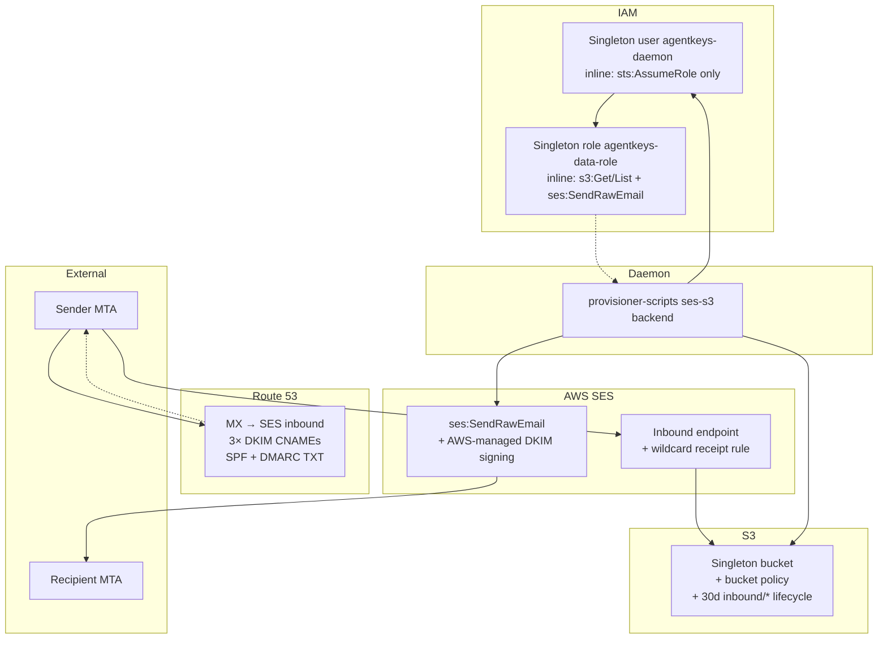

# SES-Based Email Architecture for AgentKeys

**Date:** 2026-04-18 (updated 2026-04-19 with hosted-default + PrincipalTag isolation)
**Status:** Design
**Stage:** **Stage 6** primary email backend — hosted `xxxxx@agentkeys-email.io` is the default for all users; BYO custom domain deferred to Stage 7+ (alternative: Google Workspace DWD for enterprise, see `docs/stage5-workspace-email-setup.md`)
**Related:**
- `docs/spec/email-signing-backends.md` — generalized backend comparison
- `docs/spec/credential-backend-interface.md` — the trait we're extending
- `wiki/email-system.md` — high-level wrap-up + usage isolation rules
- `wiki/blockchain-tee-architecture.md` §5 — audit model this spec inherits
- Issue [#11](https://github.com/litentry/agentKeys/issues/11) — biometric gate

---

## 1. Why a dedicated spec

Email is the **dominant human-in-the-loop channel** every external API signup, OTP verification, and password-reset path runs through. If agents are going to provision credentials at machine speed, the email primitive has to be:

1. **Per-agent isolated** — each agent's inbox is independent; compromising one doesn't leak others.
2. **Chain-immutable audit** — matches AgentKeys' headline security claim.
3. **Fast to provision** — inbox ready for first inbound mail within milliseconds.
4. **Cheap to scale** — thousands of throwaway inboxes per month without a seat-license model.
5. **No foreign admin-console step per inbox** — one-time domain onboarding only.
6. **Zero user setup in the default path** — Stage 6 target is "inbox exists the moment the agent is created; no DNS, no admin console, no Workspace subscription on the user side."
7. **Broker-not-proxy** — our backend mints credentials; the daemon calls SES and S3 directly via MCP. Per-operation compute on our side is zero. See [`wiki/hosted-first.md`](../../wiki/hosted-first.md) for the user-segmentation framework and [`wiki/knowledge-storage.md`](../../wiki/knowledge-storage.md) for the parallel deferred decision on knowledge storage.

Gmail Workspace with DWD satisfies 1 but fails 2–7. AgentMail (SaaS) satisfies 1, 3, 4, 6 but fails 2 and adds vendor lock. **AWS SES with our own thin inbox-abstraction layer satisfies all seven.** This spec defines that layer.

## 2. How we relate to AgentMail

AgentMail is a SaaS built on AWS SES; verified by DNS (`agentmail.to` MX → `inbound-smtp.us-east-1.amazonaws.com`) and by their open Zod schemas exposing `dkim_signing_type: 'AWS_SES' | 'BYODKIM'`. They **proxy** per-operation on the user's behalf: their servers parse MIME, compute threads, manage drafts/labels/webhooks. Compute cost scales with operation frequency.

We use the same SES primitives (inbound-to-S3, `SendRawEmail`, domain DKIM/MX/SPF) but **do not adopt the SaaS feature surface**. Per the broker-not-proxy principle (rule #4 in `wiki/blockchain-tee-architecture.md`), threading, labels, drafts, allow/block lists, webhook fan-out, and per-operation events live daemon-side (via MCP) or are absent until a real use case forces them in. Our backend is a credential broker + audit layer. Per-operation compute on our side is zero.

**One shape we kept:** `inbox_id` IS the email-address string (`abc123@agentkeys-email.io`), not an opaque uuid. Saves an ID↔address lookup on every call. That's it — everything else from AgentMail's model stays in AgentMail's backend.

## 3. Architectural goals

Three invariants this spec preserves, derived directly from the existing AgentKeys specs:

1. **The TEE is the sole holder of signing material** (`blockchain-tee-architecture.md` rule #2). In v0.1 the TEE holds the SES IAM access credentials + the DKIM signing key (under `BYODKIM`).
2. **The chain is the sole source of persistent truth** (rule #1). All email grants, inbox ownership records, and audit events are on-chain extrinsics.
3. **Clients hold only bearer tokens, never keys** (rule #3). Children call a broker over the wire; the broker — colocated with the authority — enforces policy.

The SES layer is plumbing under those invariants, not an exception.

## 4. Data model (minimal — broker-not-proxy)

Only two entities live on our side. Everything else — messages, threads, drafts, labels, attachments — lives daemon-side (parsed from raw MIME in S3 on demand) or not at all.

```rust
// Inbox: on-chain row tying a user wallet to an email address they own.
pub struct Inbox {
    pub inbox_address: EmailAddress,    // "abc123@agentkeys-email.io" — address IS the ID
    pub user_wallet:   WalletAddress,   // owner; maps to PrincipalTag for isolation
    pub agent_wallet:  WalletAddress,   // which child agent uses this inbox
    pub domain_id:     String,          // foreign key to Domain
    pub created_at:    SystemTime,
    pub deleted_at:    Option<SystemTime>, // soft delete; S3 lifecycle prunes raw mail
}

// Domain: operator-level configuration for a custom domain (hosted default: agentkeys-email.io).
pub struct Domain {
    pub domain_id:      String,         // "agentkeys-email.io"
    pub dkim_mode:      DkimMode,       // AwsSes (default) | TeeByoDkim (future)
    pub dkim_selector:  Option<String>, // only for TeeByoDkim
    pub status:         DomainStatus,   // NotStarted | Pending | Verifying | Verified | Failed
    pub created_at:     SystemTime,
    pub updated_at:     SystemTime,
}
```

That's it on our side. No `Message`, `Thread`, `Draft`, `AttachmentMetadata`, `EmailListEntry`, `Webhook` structs — if the daemon wants threading or labels or drafts, it stores that in its local state or in a JSON manifest file under the user's S3 prefix. Our backend never reads those concerns.

## 5. Events (minimal — on-chain extrinsics)

Three events cover everything our backend is responsible for. Per-message events (received, sent, delivered, bounced) are SES-native SNS notifications the daemon subscribes to directly; they are not our chain events.

```rust
pub enum EmailEvent {
    InboxCreated  { inbox_address, user_wallet, agent_wallet, timestamp },
    InboxDeleted  { inbox_address, timestamp },
    CredsMinted   { child_wallet, inbox_address, scope: Scope, expires_at, timestamp },
    //                                           ^ the audit record for every SES/S3 credential handed to a daemon
}
```

`CredsMinted` is the auditable event that backs "every credential access is public" for email — fires per mint, not per underlying SES/S3 call, which is the right granularity for the broker-not-proxy shape.

## 6. Receive pipeline (inbound)

One SES receipt rule writes raw MIME directly to S3. No Lambda. No MIME parsing. No metadata DB write. No per-email compute on our side.

```
External SMTP  →  SES MX (inbound-smtp.us-east-1.amazonaws.com)
                →  receipt rule: recipient matches *@agentkeys-email.io
                →  S3Action: put raw MIME at s3://agentkeys-mail/<user_wallet>/<inbox>/<msg_id>.eml
                (done — ~200 ms end-to-end, no AgentKeys compute)
```

Daemon side (not our concern, but for completeness): the daemon polls its S3 prefix or subscribes to an SNS topic SES writes to; it lists/gets objects with minted creds and parses MIME locally.

## 6.5 Architecture topology — singleton resources, logical per-user separation

Reference for engineers reading this spec who want to know *how the AWS resources actually map to AgentKeys users at runtime*. The whole stack is **singleton on the AWS side**: one IAM user, one role, one bucket, one SES domain identity, one wildcard receipt rule. Per-user state lives in our DB / on chain (the throwaway address) and as an S3 object key (`inbound/<msg_id>.eml`). No AWS resource is ever provisioned per AgentKeys user.

### Resource graph



### What scales how

| Singleton (one per AWS account) | Per AgentKeys user (logical) |
|---|---|
| 1 IAM user (long-lived access keys) | N throwaway inbox addresses (DB / on-chain) |
| 1 IAM role (1h temp creds via AssumeRole) | N raw `.eml` objects under `inbound/` (lifecycle-capped) |
| 1 S3 bucket | |
| 1 SES domain identity | |
| 1 SES wildcard receipt rule | |

### Why we deliberately avoid per-user IAM

AWS hard quotas:

| Resource | Default quota / account | What "per AgentKeys user" gives us |
|---|---|---|
| IAM users | 5,000 | Hard cap at 5k AgentKeys users |
| IAM roles | 1,000 | Hard cap at 1k |
| S3 buckets | 100 (raise to 1k) | Hard cap at 1k |

Singleton design moves the bottleneck from IAM (capped) to SES inbound rate (60 msg/sec/region default, raisable). Throughput math at 10k users × 5 throwaway inboxes × 2 verification mails: ~100k objects steady-state with 30d TTL = ~500MB total = ~$0.01/month S3 storage cost. Scales to millions without IAM changes.

### IAM trust chain

```
operator's long-lived AWS access keys (in 1Password)
  ↓ injected to daemon as AWS_ACCESS_KEY_ID + AWS_SECRET_ACCESS_KEY
IAM user "agentkeys-daemon"
  ├─ inline policy: only sts:AssumeRole on the role below
  ↓
sts:AssumeRole → temp creds (1h, auto-refreshed)
  ↓
IAM role "agentkeys-data-role"
  ├─ trust policy: trusts agentkeys-daemon (the user above)
  ├─ inline policy:
  │   ├─ s3:ListBucket on agentkeys-mail-${ACCOUNT_ID}
  │   ├─ s3:GetObject on agentkeys-mail-${ACCOUNT_ID}/*
  │   └─ ses:SendRawEmail on identity/<DOMAIN>
  ↓
runtime API calls: GetObject (read inbound mail) + SendRawEmail (send outbound)
```

The split exists so the long-lived secret (user access key) only does ONE thing — assume the role. The role holds all real permissions and only hands them out as 1h temp creds. Compromise of the access key is bounded to "attacker can call AssumeRole on the role"; rotating the key is `aws iam create-access-key` + delete-old, no role-side change.

### Stage 6 vs Stage 7 — same singleton design, different per-user isolation

| | Stage 6 interim (shipped) | Stage 7 target |
|---|---|---|
| Bucket policy | `AllowDaemonRead`: role reads whole bucket | `AllowDaemonReadOwnPrefix`: role reads only `${aws:PrincipalTag/agentkeys_user_wallet}/*` |
| Per-user enforcement | App-side: daemon filters by `To:` header | Cloud-side: S3 returns AccessDenied on cross-prefix reads |
| Auth flow | `sts:AssumeRole` from IAM user (static keys) | `sts:AssumeRoleWithWebIdentity` from OIDC JWT |
| AWS resource count | Same singletons | Same singletons (no new IAM per user) |
| Failure mode if app has a bug | User A could read user B's mail | AccessDenied from cloud — bug caught at the boundary |
| Where to read more | This spec + [`docs/cloud-setup.md`](../cloud-setup.md) | [`docs/cloud-setup.md` §4](../cloud-setup.md#4-oidc-federation-stage-7) + §10.4 PrincipalTag pattern below |

The migration from Stage 6 to Stage 7 is mostly a trust-policy rewrite + a `Resource`/`Condition` swap on the bucket policy (see §10.4). No new IAM resources, no per-user provisioning. Singleton stays singleton.

### What this spec does NOT cover (intentionally)

- **Operator setup specifics** (account ID, hosted zone ID, exact ARNs) live in [`docs/cloud-setup.md`](../cloud-setup.md), the operator-facing runbook. Reference that for the actual AWS CLI calls.
- **PrincipalTag enforcement details** are in §10.4 below + [`wiki/tag-based-access.md`](../../wiki/tag-based-access.md).
- **OIDC issuer key derivation + JWKS** are in §10.5 + [`wiki/oidc-federation.md`](../../wiki/oidc-federation.md).

## 7. Send pipeline (outbound)

Daemon mints credentials once; uses them to call SES directly. Our backend's involvement per-send: zero after the mint.

```
daemon  →  AgentKeys: mint SES send creds for this inbox (OIDC JWT exchange at STS)
        →  gets temp AWS creds (≤1h)

daemon  →  assemble MIME locally with the right From: <inbox_address>
        →  SES SendRawEmail with temp creds
           (IAM role condition pins ses:FromAddress to this daemon's inbox address;
            AWS_SES DKIM signs outbound with the domain's SES-managed key)
        →  SES delivers

(delivery / bounce / complaint notifications come from SES → SNS topic the daemon
 can subscribe to directly; we do not proxy them)
```

On our side, the only work per send is the initial credential mint, which is amortized across many sends within the 1-hour temp-cred lifetime. TEE-held BYODKIM is a future option (§15 open questions) if operator trust in SES-managed DKIM becomes insufficient; AWS_SES DKIM is the default.

## 8. Auth, scope, and TTL

Per the general `TokenAuthority` abstraction (see `docs/spec/email-signing-backends.md` §3 for the full trait):

```
Child bearer token              30 days (AgentKeys policy)
  └── EmailImpersonate grant    30 days (master approves under Touch ID)
      └── Live per-call policy check in the broker — no short-lived
          email access token needed, because SES authorizes AgentKeys'
          backend identity (the IAM role), not per-user identity.
```

The `grant.allowed_subjects` for an SES inbox grant is typically a pattern:

- `Exact("bot-42@agentkeys-email.io")` — one specific inbox
- `Prefix("bot-*@agentkeys-email.io")` — all inboxes with that prefix (owned by this child)
- `DomainWildcard("agentkeys-email.io")` — any inbox on this domain (master-only pattern)

`grant.allowed_scopes` is a small enum (more scopes are daemon-side concerns, not ours):

- `Read` — mint S3 read creds scoped to the inbox's prefix
- `Send` — mint SES send creds scoped to the inbox's `FromAddress`
- `Admin` — create/delete the inbox itself (master-only grant)

Touch ID gates the *creation* of a grant (master CLI, via the existing `approve_auth_request` path per #11). All subsequent `mint_creds` calls from the child are silent.

Higher-level concerns like drafts-with-human-approval, per-message reply/forward semantics, or HITL gating of high-value sends are **daemon-side**: the daemon's MCP can offer `draft_create` / `draft_approve` tools that store drafts in S3 and only call `mint Send creds` after approval. No server-side draft state.

## 9. AWS SES primitives we use

| Primitive | Use |
|---|---|
| **Verified identity (domain)** | `agentkeys-email.io` verified once; all inboxes live under it. |
| **DKIM records** | 3 CNAMEs if `AwsSes` type; 1 CNAME to our key fingerprint if `ByoDkim` (v0.1 TEE-held; **Ed25519 per RFC 8463**, derived from TEE master seed — see §10.5). |
| **MX** | `10 inbound-smtp.us-east-1.amazonaws.com` — single record, catches all inbound to the domain. |
| **Receipt rule** | One rule matching `*@agentkeys-email.io` → `S3Action` writes raw MIME directly to the bucket. No Lambda. |
| **SES SendRawEmail** | Outbound. IAM access is via OIDC federation from the TEE — no static access keys held anywhere. See §10.5. |
| **SES event destinations** (SNS) | Delivery / bounce / complaint notifications. Subscribed to by the daemon directly, not proxied by us. |
| **Mail-from subdomain** (optional) | `bounce.agentkeys-email.io` for bounce handling — adds 2 records. |
| **S3 for raw MIME** | `s3://agentkeys-mail/<user_wallet>/<inbox>/<message_id>.eml`. Bucket policy with `aws:PrincipalTag/agentkeys_user_wallet` enforces per-user isolation (§10.4). Lifecycle rule prunes > 90 days. |

## 10. Domain setup (one-time per custom domain)

> **Stage 6 default — `agentkeys-email.io`.** We (AgentKeys) operate this domain; users do not configure DNS. The records below are the one-time setup on AgentKeys' side and are preserved here so the pattern is reproducible for Stage 7+ bring-your-own-domain users.

DNS records needed for a fresh domain (AgentKeys-hosted default: `agentkeys-email.io`; user-owned BYO example shown as `agentkeys-email.io`):

| Record | Value | Purpose |
|---|---|---|
| `agentkeys-email.io. MX` | `10 inbound-smtp.us-east-1.amazonaws.com.` | Inbound |
| `_amazonses.agentkeys-email.io. TXT` | `<verification-token>` | SES domain verification |
| `<dkim1>._domainkey.agentkeys-email.io. CNAME` | `<dkim1>.dkim.amazonses.com.` | DKIM selector 1 (AWS_SES mode) |
| `<dkim2>._domainkey.agentkeys-email.io. CNAME` | `<dkim2>.dkim.amazonses.com.` | DKIM selector 2 |
| `<dkim3>._domainkey.agentkeys-email.io. CNAME` | `<dkim3>.dkim.amazonses.com.` | DKIM selector 3 |
| `agentkeys-email.io. TXT` (SPF) | `v=spf1 include:amazonses.com ~all` | Outbound authorization |
| `_dmarc.agentkeys-email.io. TXT` | `v=DMARC1; p=quarantine; rua=mailto:dmarc@wildmeta.ai` | DMARC |

For `BYODKIM` (v0.1, TEE-held key): one CNAME pointing to the TEE's registered DKIM pubkey fingerprint, replacing the three AWS-provided CNAMEs. DKIM-signing moves into the enclave.

Optionally, a MAIL FROM subdomain `bounce.agentkeys-email.io` with its own MX + SPF for bounce handling (adds 2 records).

State machine per domain: `NotStarted → Pending → Verifying → Verified` (or `Invalid` / `Failed`). Our backend polls SES's `GetIdentityVerificationAttributes` every ~60 s during `Verifying` and transitions the state.

We **deliver these records as a BIND zone file download** (same UX as AgentMail) so operators can drop into Route 53, Cloudflare, etc. with one import.

## 10.4. Per-user isolation on the shared `agentkeys-mail` bucket — PrincipalTag pattern

Stage 6 hosts every user's inbox in one AWS account, one S3 bucket, one IAM role. Per-user isolation is cryptographically enforced by AWS using the **PrincipalTag-from-JWT-claim** pattern. See [`wiki/tag-based-access.md`](../../wiki/tag-based-access.md) for the full mechanics.

### Summary of the mechanism

1. TEE mints OIDC JWT with `agentkeys_user_wallet: <wallet>` claim
2. `sts:AssumeRoleWithWebIdentity` (with `sts:TagSession` allowed on the role) maps the claim to a session tag
3. Bucket policy on `agentkeys-mail`:

```json
{
  "Version": "2012-10-17",
  "Statement": [
    {
      "Sid": "AllowListOwnPrefix",
      "Effect": "Allow",
      "Principal": { "AWS": "arn:aws:iam::<acct>:role/agentkeys-data-role" },
      "Action": "s3:ListBucket",
      "Resource": "arn:aws:s3:::agentkeys-mail",
      "Condition": { "StringLike": { "s3:prefix": "${aws:PrincipalTag/agentkeys_user_wallet}/*" } }
    },
    {
      "Sid": "AllowCrudOwnPrefix",
      "Effect": "Allow",
      "Principal": { "AWS": "arn:aws:iam::<acct>:role/agentkeys-data-role" },
      "Action": ["s3:GetObject", "s3:PutObject", "s3:DeleteObject"],
      "Resource": "arn:aws:s3:::agentkeys-mail/${aws:PrincipalTag/agentkeys_user_wallet}/*"
    },
    {
      "Sid": "DenyEverythingElse",
      "Effect": "Deny",
      "Principal": { "AWS": "arn:aws:iam::<acct>:role/agentkeys-data-role" },
      "NotAction": ["s3:GetObject", "s3:PutObject", "s3:DeleteObject", "s3:ListBucket"],
      "Resource": "*"
    }
  ]
}
```

4. Role trust policy requires the claim to be non-empty (`StringNotEquals aws:RequestTag/agentkeys_user_wallet ""`), so JWTs missing the claim cannot assume the role.

### Why this is the right primitive

Without PrincipalTag isolation, Stage 6 would force one of three compromises:

- **Per-user IAM role** — scales only to a few thousand users (AWS role quotas) and creates per-user operator state we have to manage
- **Per-user S3 bucket** — expensive at scale and the same quota problem
- **Our backend proxies every read/write** — violates rule #4 (broker-not-proxy), grows compute cost with operation frequency

PrincipalTag is the one path that keeps a single shared bucket, zero per-user state on our side, and cryptographic per-user isolation enforced by AWS itself.

---

## 10.5. Key derivation and cloud credentials (no static secrets)

Two TEE-derived key families serve the email backend, both sealed inside the enclave and derived deterministically from the TEE master seed:

```
TEE master seed  (sealed; disaster-recovery root; one per enclave)
 ├── derive("dkim/<domain>/<version>")   → Ed25519     (DKIM signing, per custom domain)
 │   purpose: sign DKIM-Signature header on every outbound MIME before SES carries it
 │   why Ed25519: RFC 8463; fast; we control both sides of the signing contract
 │
 └── derive("oidc/issuer/<version>")     → ES256        (ECDSA P-256; OIDC-issuer JWT signing)
     purpose: mint short-lived JWTs that AWS STS (+ GCP, Azure, …) exchange for temp creds
     why ES256: AWS OIDC accepts only RSA (RS256/384/512) and ECDSA (ES256/384/512) — NOT Ed25519
```

Both derivation algorithms are SLIP-0010 / BIP-32-style — the same primitive the TEE already uses for custodial wallet keys. Both keys survive TEE restart from master seed alone. Both rotate via version-bump in the path.

### Why the OIDC-issuer key exists

AWS SES API calls require IAM authentication. Rather than seal a long-lived IAM access key inside the TEE, we use the **AWS IAM OIDC federation** path:

1. TEE exposes itself as a conforming OIDC identity provider at `https://oidc.agentkeys.dev`
2. A thin HTTPS proxy in front of the TEE serves static `/.well-known/openid-configuration` + `/.well-known/jwks.json` (containing the TEE's public ES256 key); proxy holds no private material
3. When the backend needs to call SES, TEE mints a 5-minute JWT signed with the ES256 key, containing claims like `{iss, sub, aud=sts.amazonaws.com, exp, agentkeys_operation=ses.send}`
4. Backend calls `sts:AssumeRoleWithWebIdentity` with the JWT → AWS returns temp SES credentials (≤1h)
5. Backend makes SES API calls with temp creds; discards them after use

Net: **no static AWS credentials at rest anywhere in AgentKeys.** TEE compromise = all federated creds compromised (same as before). Anything short of TEE compromise = zero blast radius.

The same OIDC provider federates into GCP Workload Identity, Azure AD, Snowflake, Kubernetes, and any other external-OIDC consumer. One issuer, N clouds. See [`wiki/oidc-federation.md`](../../wiki/oidc-federation.md) for the generalization.

## 11. How this plugs into the three-layer abstraction

Recap from `docs/spec/email-signing-backends.md`:

| Layer | v0 (mock) | v0.1 (TEE + chain) |
|---|---|---|
| `TokenAuthority` | Mock backend holds static SES IAM keys + local AES key | TEE-derived **Ed25519 DKIM key** (per domain) + TEE-derived **ES256 OIDC-issuer key** (singleton) + temp SES creds minted per-request via `sts:AssumeRoleWithWebIdentity`; **no static cloud credentials sealed at rest** |
| `TokenBroker` | Mock backend (verifies session, checks grant, calls SES) | TEE (same, but chain-reads for grants; includes JWT minting for SES federation) |
| `GrantStore` | SQLite `email_grants` table | `pallet-email-grants` on chain |
| Audit sink | SQLite `ses_events` table | `pallet-email-audit` on chain |

Same daemon code for both. A `config.toml` toggle picks the backend.

## 12. v0 vs v0.1 specifics

| Concern | v0 | v0.1 |
|---|---|---|
| Inbox table | SQLite row per inbox | Chain pallet entry per inbox |
| Message metadata | (none — daemon-side only; no server metadata store) | (same — no backend metadata) |
| Raw MIME blob | S3 (AWS account: test) | S3 (AWS account: production) |
| DKIM key | SES-managed (AWS_SES) | SES-managed by default; **TEE-derived Ed25519** at `dkim/<domain>/v1` (BYODKIM) as a future option |
| OIDC-issuer key | n/a — mock uses static IAM keys | **TEE-derived ES256** at `oidc/issuer/v1`; published via HTTPS JWKS endpoint |
| SES IAM credentials | Static access key in `.env` on mock server | **Federated: no static creds.** Temp creds minted per-request via `sts:AssumeRoleWithWebIdentity`; creds live ≤1h |
| Audit events | SQLite table (operator-queryable) | On-chain extrinsics (publicly verifiable) |
| Scope grant | SQLite row | On-chain extrinsic |
| Grant revocation | `UPDATE row SET revoked_at=...` | On-chain revocation list (≤6s propagation) |

## 13. Comparison with AgentMail's SaaS model (why we don't just use them)

Both stacks run on SES under the hood. The divergence is at the *trust* layer:

| | AgentMail (SaaS proxy) | Our SES backend (broker, not proxy) |
|---|---|---|
| Shape | SaaS proxy — they parse MIME, store threads, run webhooks on your behalf | Credential broker — mint SES/S3 creds; daemon does every operation itself |
| Compute cost scaling | O(user operation frequency) | O(user count) — flat per user |
| Signing identity for DKIM | AWS_SES-managed or BYODKIM | AWS_SES (default) → TEE-held BYODKIM (future, §15) |
| Who reads inbox contents | AgentMail operators (for support) | Our TEE only at mint time; daemon reads S3 directly afterward |
| Who sees audit events | AgentMail dashboards | Anyone with a Heima node (on-chain `CredsMinted` extrinsics) |
| Outage domain | AgentMail + AWS | AWS alone |
| Per-inbox credential | Long-lived scoped API key | 30-day AgentKeys session token + grant; ephemeral SES/S3 creds per mint |
| Revocation latency | Unspecified (their SaaS) | ≤6s via chain revocation list |
| Attribution | Per-API-key in their logs | Per-child-wallet on-chain, publicly verifiable |
| Drafts, labels, threading, allow-block lists, per-operation webhooks, `client_id` idempotency, reply/forward semantics | Server-side, first-class in their API | **Daemon-side** via MCP, or absent until needed. Not our backend's concern. |
| Multi-tenancy unit | `Pod` (infrastructure-level) | Per-user + per-child grants (policy-level) |

AgentMail is a **good reference for the SES underpinnings** — but structurally they sit on the opposite side of the broker-not-proxy line. Their model accepts compute cost scaling with operation frequency in exchange for a richer server-side feature surface. Our model refuses that tradeoff: compute stays flat with user count, and per-operation concerns live daemon-side via MCP (where they don't pressure our backend and don't require us to see content).

## 14. Concrete build plan (1-2 weeks)

| Day | Milestone |
|---|---|
| 1 | Register `agentkeys-email.io`. SES domain verification. DNS: MX, DKIM (AWS_SES managed), SPF, DMARC. Request SES production access. |
| 2 | S3 bucket `agentkeys-mail` with per-user-prefix structure + `aws:PrincipalTag/agentkeys_user_wallet` bucket policy + lifecycle rules. SES receipt rule with `S3Action` writing raw MIME directly to the bucket (no Lambda). |
| 3 | IAM OIDC provider `oidc.agentkeys.dev` registered in our AWS account. IAM role `agentkeys-data-role` with trust policy pinned to TEE enclave + requiring non-empty `agentkeys_user_wallet` claim. Role permissions for `s3:GetObject`/`s3:ListBucket` (per prefix) and `ses:SendRawEmail` (with `ses:FromAddress` condition). |
| 4 | TEE-side ES256 OIDC-issuer key derivation at `oidc/issuer/v1` + JWT minter. Thin HTTPS proxy at `oidc.agentkeys.dev` serving static discovery doc + JWKS (Let's Encrypt). |
| 5 | `SesEmailAuthority` Rust impl: implements `mint_read_creds(inbox) -> STS response` and `mint_send_creds(inbox) -> STS response` via `sts:AssumeRoleWithWebIdentity`. Emits `CredsMinted` audit extrinsic per call. |
| 6 | Daemon MCP tools: `email.list` (S3 list), `email.get` (S3 get + MIME parse locally), `email.send` (assemble MIME + SES SendRawEmail). Each unwraps into `mint` + direct AWS call. |
| 7 | Replace `provisioner-scripts/src/lib/email.ts` imapflow-based fetcher with an S3-direct fetcher that uses minted read creds. |
| 8 | End-to-end test: create agent → SES delivers to `<agent>@agentkeys-email.io` → daemon reads from S3 via minted creds → warmup-verify deliverability on Gmail + Outlook. |
| 9 | `EmailImpersonate` grant type in GrantStore. Wire master CLI's Touch-ID gate to this grant type. |
| 10 | Operator runbook, migration notes, and zone-file download endpoint for Stage 7 BYO domains. |

Total: ~2 weeks. No Lambda, no DynamoDB, no server-side MIME parsing — the broker-not-proxy shape cuts roughly a week of work vs a SaaS-style build.

## 15. Open questions / follow-ups

1. **BYODKIM in v0.1 — how does the TEE register its Ed25519 DKIM pubkey with DNS?** Proposed: the TEE signs an attestation; the backend publishes the DKIM record to DNS (Route 53 API); the `Domain` row tracks `dkim_selector` pointing at the TEE-held key. No per-inbox rotation, but key rotation is a per-domain operation via path-version bump.

2. **OIDC-issuer hostname.** `oidc.agentkeys.dev`? `tee.agentkeys.io/oidc/`? Needs to be a stable HTTPS URL we control with a public-CA cert (Let's Encrypt works, satisfies AWS's default cert validation). Suggested: `oidc.agentkeys.dev` as a dedicated subdomain never repurposed.

3. **OIDC `sub` claim format.** Proposed: `enclave:<mrenclave>:<mrsigner>:agent:<child_wallet>`. Consumer trust policies (AWS role trust policy, GCP workload identity provider) condition on `sub` patterns to pin a specific enclave build. To finalize once the Heima TEE's attestation format is confirmed.

4. **Multi-region.** First v0.1 cut is `us-east-1` only. Global deployment means either (a) SES inbound in multiple regions with per-region DNS routing, or (b) one global ingress + cross-region S3 replication. Daemon-side threading/label state goes wherever the daemon runs.

5. **Abuse handling.** A child whose throwaway inbox starts receiving spam en masse should be disposable cheaply. Plan: cold-delete inboxes on explicit agent request; warm-delete (soft mark with retention) for everything else; S3 lifecycle prunes old messages.

6. **Inbox TTL.** Should inboxes auto-expire if unused for N days? Default proposal: 90d soft-delete, 180d hard-delete. Master can override per-grant.

7. **Agent-to-agent email.** Two AgentKeys-provisioned agents can email each other; both sides go through SES. Worth looking at a short-circuit (direct S3 → S3) in v0.2 if the volume justifies it.

8. **Disaster recovery.** S3 is durable; chain state is self-healing; TEE master seed is the root of all derived keys. No stateful middle tier to back up — the broker-not-proxy shape eliminates the mid-write-crash recovery problem entirely.

7. **User's personal Gmail integration.** Confirmed: we **do not** OAuth into users' Gmail. User's Gmail is a send-only target from our SES for identity + notifications + optional 2FA approvals. See `wiki/email-system.md` §usage-isolation.

## 16. Cross-references

- **[`wiki/oidc-federation.md`](../../wiki/oidc-federation.md)** — the generalized OIDC-provider design that §10.5 references; explains how the same ES256 key federates into AWS, GCP, Azure, Snowflake, K8s
- **[`docs/spec/threat-model-key-custody.md`](./threat-model-key-custody.md)** — generalizes this spec's "raw MIME in S3, metadata on chain" pattern to credential ciphertext too. The email pipeline is the precedent; Stage 8 generalizes it.
- **[`docs/stage8-wip.md`](../stage8-wip.md)** — the off-chain encrypted vault. Reuses this spec's S3 bucket pattern under a different prefix (`agentkeys-vault/<wallet>/...`).
- `docs/spec/email-signing-backends.md` — the generalized trait (needs an SES section added; this spec supplies the content)
- `docs/spec/credential-backend-interface.md` — the parent trait this extends
- `docs/stage5-workspace-email-setup.md` — alternative: Google DWD operator runbook (preserved for enterprise deployments)
- `docs/manual-test-stage5.md` §1 — demo path (currently uses dedicated personal Gmail; will migrate to SES once built)
- `wiki/email-system.md` — high-level architecture wrap-up + usage isolation
- `wiki/blockchain-tee-architecture.md` §5 — stateless-TEE-plus-chain rationale
- `wiki/session-token.md` §1 — 30-day TTL policy
- Issue [#11](https://github.com/litentry/agentKeys/issues/11) — biometric gate
- AWS docs consulted for §10.5: [`IAM OIDC provider`](https://docs.aws.amazon.com/IAM/latest/UserGuide/id_roles_providers_create_oidc.html), [`AssumeRoleWithWebIdentity`](https://docs.aws.amazon.com/STS/latest/APIReference/API_AssumeRoleWithWebIdentity.html) — signing algorithm list (RSA + ECDSA only) verified verbatim
