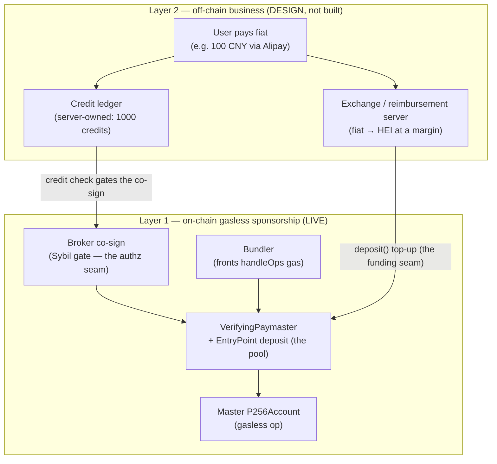

# Sponsored-gas credit & reimbursement model

**Status:** two layers, different maturity. The **on-chain gasless sponsorship** layer
is LIVE on Heima mainnet. The **off-chain prepaid-credit & reimbursement** layer
(fiat → credits → deposit top-up) is **DESIGN — not built**; this doc specs how it sits
on top of the live layer and where the two meet.

**Scope:** the technical structure only — how a credit-based business layer maps onto the
existing ERC-4337 sponsorship (paymaster / bundler / EntryPoint). **Explicitly out of
scope** (a separate concern, not addressed here and not legal/financial advice): foreign
exchange, KYC/AML, payment-rail integration, custody licensing, and any regulatory or tax
treatment of taking fiat and converting to crypto.

**Anchors:** [`arch.md`](../arch.md) (ERC-4337 master account + `agentkeys-bundler`),
[`chain-setup.md` §Wallets](../chain-setup.md#wallets-contracts--funding-map-prod--test)
(the funding map + tooling), [`deployed-contracts.md`](deployed-contracts.md).

## The two layers

The two layers meet at exactly **two seams** — an authorization seam (the broker co-sign)
and a funding seam (the paymaster deposit). Everything else is independent.

## Layer 1 — on-chain gasless sponsorship (LIVE)

Per sponsored op (today, no credit layer):

1. User signs once with the K11 passkey (Touch ID) — **pays nothing, no gas**.
2. **Broker co-signs** the paymaster `getHash` approval — the Sybil gate (threat-model §5):
   the paymaster sponsors *only* ops the broker approved. ([`handlers/cap.rs`](../../crates/agentkeys-broker-server/src/handlers/cap.rs) / the accept handler.)
3. **Bundler** broadcasts `EntryPoint.handleOps`, fronting the outer-tx gas from its
   submitter EOA.
4. **EntryPoint** runs the op, **charges the paymaster's deposit** for the gas, and
   **refunds the bundler EOA**.

The **deposit** (held inside the EntryPoint, keyed by the paymaster address) is the real
cost-bearer; it is pre-funded in bulk by the operator. The bundler EOA roughly cycles
(its gas is refunded out of the deposit). See the funding map for addresses + custody.

## Layer 2 — off-chain prepaid credit & reimbursement (DESIGN)

The business layer the operator runs *beside* the chain, never on it:

1. **Fiat in → credits.** User pays fiat (e.g. 100 CNY via Alipay) to the operator's
   account; the **exchange server** detects the inflow and credits the user N ops in a
   **server-owned credit ledger** (e.g. 1000 credits). Credits are an off-chain
   entitlement — the chain never sees fiat.
2. **Spend → op.** The user spends a credit to trigger a sponsored op. The credit check
   is enforced at the **authz seam** (next section) before the broker co-signs.
3. **Reimbursement top-up.** The exchange server converts part of the fiat reserve to HEI
   **at a margin** and calls `deposit()` to keep the paymaster pool above its floor. The
   margin (fiat charged − HEI gas cost − fees) is the revenue; the deposit is both the
   gas buffer and where the proceeds land.

This is the "Alipay" model: prepaid credits backed by a fiat→HEI reimbursement loop. The
per-op mechanics of layer 1 are unchanged — the user is still gasless on-chain; the credit
is purely the operator's accounting of *who is allowed* to consume sponsorship.

## The seams (where layer 2 hooks into layer 1)

| Seam | Layer-1 component | What layer 2 does | Build state |
|---|---|---|---|
| **Authorization** | broker co-sign (Sybil gate) | gate the co-sign on a credit balance: no credit → broker declines → paymaster won't sponsor → op fails (or falls back to user-paid). The broker is the only place that can refuse before gas is spent. | co-sign LIVE (gates device/scope today, **not credits**); the credit hook is **not built** |
| **Funding** | paymaster EntryPoint deposit | the exchange server's *only* on-chain write — `deposit()` top-ups from converted fiat | `deposit()` LIVE ([`heima-deploy-paymaster.sh`](../../scripts/heima-deploy-paymaster.sh)); automated reimbursement is **not built** |
| **Reconciliation** | deposit drawdown ↔ credit ledger | operator reconciles Σ sponsored ops (deposit drawdown, observable via the monitor) against credits spent | manual; no automated reconciliation built |

## Implemented vs not — read this before quoting the model

| Piece | State |
|---|---|
| ERC-4337 sponsorship (paymaster + bundler + EntryPoint), gasless accept | **LIVE** (Heima mainnet) |
| Broker co-sign Sybil gate | **LIVE** — gates on device binding + service scope |
| Credit ledger / fiat gateway / exchange-reimbursement server | **NOT BUILT** (design) |
| Credit → broker-co-sign authorization hook | **NOT BUILT** (design) |
| Automated fiat→HEI → `deposit()` reimbursement | **NOT BUILT** — today the deposit is topped up manually via `heima-deploy-paymaster.sh` |

Do not describe the credit/fiat layer as shipped. The chain side is real today; the
business side is an architecture, not code.

## Economic shape (illustrative — not committed pricing)

The deposit is a buffer, not a per-op settlement: the operator funds it ahead of demand
and refills as it drains. Profitability holds when, over a window, `fiat collected −
(HEI cost of the sponsored ops + conversion/rail fees) > 0`. The credit:op ratio
(1 credit = 1 op, or weighted by an op's gas) and the fiat price per credit are operator
policy set in the exchange server — not on-chain, not fixed here.

## Operational tie-ins

- **Fund the pool** (the only correct way): [`heima-deploy-paymaster.sh`](../../scripts/heima-deploy-paymaster.sh)
  calls `deposit()`. A plain transfer to the paymaster address does **nothing** — see the
  footgun in [`chain-setup.md` §Wallets](../chain-setup.md#wallets-contracts--funding-map-prod--test).
- **Monitor the pool + wallets:** [`check-wallet-balances.sh`](../../scripts/check-wallet-balances.sh)
  prints the deposit + every wallet (the signal the reimbursement loop would watch to
  decide when to top up).
- The sponsor/bundler EOA is funded by a plain transfer (`heima-fund-account.sh`); only
  the **deposit** uses `deposit()`.
