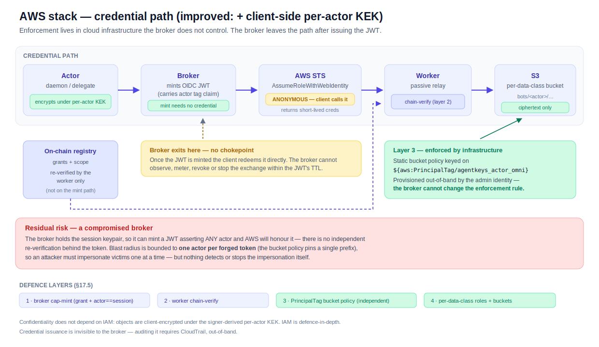
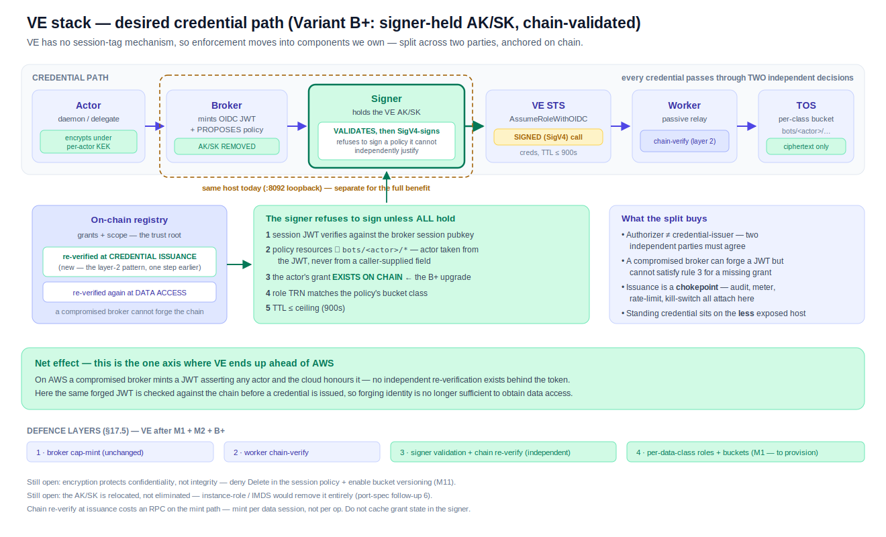

# AWS ∥ VE stack parity — the improved AWS stack vs the desired VE stack

**Status:** analysis + target design. The AWS column describes today's stack
plus one cloud-agnostic change (M2); the VE column describes the **target**
after M1 + M2 + B+, not what runs today.
**Scope:** the credential + storage plane (cap-mint → STS → worker → object
store). Chain, onboarding and the channel/gateway surfaces are cloud-agnostic
and out of scope. The signer is **in** scope — the target design adds a fourth
signer operation (`/dev/sign-sts`).
**Companion:** [`ve-sts-signing-split.md`](ve-sts-signing-split.md) is the
design decision this document measures against.

## Reading this in one minute

- A **leaked credential** is equally contained on both clouds. The session
  policy is baked into the credential, so it cannot be shed. This is the
  single most common misreading of the VE gap.
- The real divergence is **who can mint a credential wider than one actor**.
  On AWS that is prevented by cloud infrastructure; on VE it must be prevented
  by components we own.
- After the target work, **VE is ahead on isolation and credential control, and
  behind on operational tooling**. Neither stack dominates.
- **Confidentiality should not depend on IAM on either cloud.** That is what M2
  buys, and it is why the VE port is worth doing rather than routing around.

## The two paths

**AWS — enforcement in cloud infrastructure; the broker exits the path early.**

**VE (desired) — enforcement in components we own, split across two parties and
anchored on chain.**

## Table 1 — the credential path, step by step

| Step | AWS (improved) | VE (desired) |
|---|---|---|
| Actor requests data op | cap-mint, on-chain grant + `actor==session` | identical |
| Broker mints OIDC JWT | yes — carries the actor tag claim | yes — carries the actor claim |
| Session policy | optional scope-down (used by canonical/inbox/speech relays) | **mandatory**, per-actor, on every mint |
| Who calls STS | **the client**, anonymously (`AssumeRoleWithWebIdentity`) | **the signer**, SigV4-signed (`AssumeRoleWithOIDC`) |
| Standing cloud credential | **held by the platform, not by us**: the anonymous mint works only because AWS itself is the credential authority (STS root keys, IAM) — we custody nothing on the mint path, at the price of the platform sitting in the TCB (the ArkClaw critique) | **held by us**: a static AK/SK custodied by the signer — explicit, auditable, rotatable custody instead of implicit platform trust (eliminable only if VE supports instance-role/IMDS — unprobed) |
| Independent check before issuance | issuer signature + `aud` only — the asserted **actor claim** is never re-verified | **signer validates** JWT + policy⊆actor + **on-chain grant** + role class + TTL |
| Credential TTL | up to 3600s (the #441 speech relay pins 900s) | ≤900s, enforced by the signer |
| Enforcement at rest | static bucket policy on `${aws:PrincipalTag/…}` | per-class role ceiling + baked-in session policy |
| Worker re-verifies chain | yes (layer 2) | yes (layer 2) — **plus** at issuance |
| Object confidentiality | client-side per-actor KEK (M2) | client-side per-actor KEK (M2) |

> The credential authority never disappears — it is either the **platform**
> (AWS: implicit, zero operational cost, un-rotatable by us, inside the TCB)
> or **us** (VE: explicit, our burden, our audit trail). "Nobody holds a
> credential" is never a true state; two earlier revisions of this row claimed
> it and were wrong both times.

## Table 2 — the four defence layers

| Layer | AWS (improved) | VE (desired) | Verdict |
|---|---|---|---|
| 1 · cap-mint gate | on-chain grant, `actor==session`, K10 PoP | identical | parity |
| 2 · worker chain-verify | independent re-check at data access | identical | parity |
| 3 · per-actor isolation | static bucket policy, broker-independent, but **no re-verification of the asserted identity** | signer validation **+ on-chain grant re-verify** at issuance | **VE ahead** |
| 4 · per-data-class | one role per data-class bucket (vault/memory/config/channel) + the bucketless speech compute role | matching bucket roles (M1 — currently **one** `VE_DATA_ROLE`); speech stays gate-held on VE (#386) | parity once M1 lands |
| Confidentiality | client-side per-actor KEK | client-side per-actor KEK | parity (M2 lifts both) |
| Integrity | bucket policy + versioning | needs deny-`Delete` + versioning (M11) | parity once M11 lands |

## Table 3 — the rigorous test: per threat actor

| Threat | AWS (improved) | VE (desired) | Verdict |
|---|---|---|---|
| **Leaked storage credential** (normally minted) | one actor's prefix — session policy is baked in | one actor's prefix | **parity** |
| **Broker authors a wide policy** (bug) | pinned by the bucket policy | refused by the signer (rule 2); `ve_session_policy` is pure + unit-tested | parity |
| **Compromised broker** forges a JWT for a victim | AWS honours it — **victim's prefix obtained** | signer re-checks the chain; a forged identity without a grant obtains **nothing** | **VE ahead** |
| **Compromised broker**, victim *does* have a grant | victim's prefix | victim's prefix (scoped, TTL-bounded, audited) | parity — VE adds detection |
| **Compromised signer** | n/a (holds no cloud credential; still the KEK root) | KEK root **+** cloud credential | **AWS ahead** |
| **Compromised host** | same posture — the signer is co-located on the broker host on **both** stacks (`:8092` loopback, rendered by `setup-broker-host.sh`); yields session keypair + signer secret + IMDS instance-profile creds | same, **plus the static AK/SK** | near-parity — the host split matters more on VE |
| **Compromised worker** | ciphertext only | ciphertext only | parity |

The compromised-signer row is the honest price of Variant B: the signer becomes
more valuable. The host row carries a correction worth naming: co-location is
**today's posture on both stacks**, not a VE-specific caveat — the split
matters more on VE only because that host also holds the static AK/SK. Both are
addressable — IMDS removes the credential, separating the hosts restores the
boundary.

**One limit encryption does not remove (both clouds):** per-actor KEKs are
derived via the signer's `/dev/sign-message`, gated only on the session JWT —
which a compromised broker can forge. So for a victim who **does** hold a
grant, a compromised broker can fetch ciphertext under correctly-scoped creds
and separately derive the KEK to decrypt it, on AWS and VE alike. B+ narrows
this to actors with live on-chain grants; it does not remove it. Candidate
follow-up (lifts both clouds): extend the chain-verify — or a K11-bound
proof — to KEK derivation.

## Table 4 — where each stack wins

| | AWS (improved) | VE (desired) |
|---|---|---|
| **Wins** | No static cloud credential on the mint path · mature tooling (CloudTrail, policy simulator, CLI coverage) · enforcement provisioned by a *different* identity than the broker · larger operational track record | Independent re-verification of the asserted identity **against the chain** · credential issuance is a **chokepoint** (audit, meter, rate-limit, kill-switch) · per-actor scoping is structural, not conventional · shorter TTLs enforced centrally · data sovereignty / 备案 |
| **Loses** | Broker leaves the path after minting the JWT — issuance is unobservable and unstoppable in-band · no re-verification behind the token · credential-issuance audit only via CloudTrail, out-of-band | Signer concentrates KEK root + cloud credential · co-located with the broker today · thinner cloud tooling and weaker CI coverage of the credentialed path · two code paths to keep honest |

## Table 5 — operational maturity, concretely

The most-cited and least-specific difference, itemised. Most entries are from
the port spec's own live probes.

| Gap | Consequence |
|---|---|
| `AssumeRoleWithOIDC` not in the `ve` CLI | a failing mint cannot be reproduced from a shell — diagnosis is raw HTTP + SigV4 |
| TOS is not a `ve` CLI service | bucket provisioning via OpenAPI/console, not scriptable CLI |
| No CloudTrail equivalent surfaced | credential-issuance forensics must be built by us — why M9 audit is load-bearing on VE and optional on AWS |
| No policy simulator / access analyzer | over-broad policies cannot be proven absent statically — hence a *mechanically checkable* prefix rule instead of policy review |
| Semantics discovered empirically | port spec still carries "exact TRN/condition-key names: CONFIRM live"; lowercase `tos:prefix` is the only accepted spelling, found by trial and pinned in a unit test |
| Opaque errors | e.g. `OIDCProviderName` ≤20 chars surfaces as generic `InvalidParameter`, and `Get` does not enforce it |
| Instance-role / IMDS support unknown | follow-up 6 is *investigate*, not implement — we cannot yet promise the AK/SK is eliminable |
| `ve_sts_live` must stay operator-run | the issuer private key cannot be a CI secret, so the credentialed path is not gated every run |

## Table 6 — what the VE column depends on

| Id | Work | Kind | Blocks |
|---|---|---|---|
| **M1** | per-data-class VE roles (4 — vault/memory/config/channel; speech stays gate-held on VE per #386) | provisioning, **no code** | layer-4 parity; the signer's role-class rule |
| **M2** | client-side per-actor KEK for memory | code (daemon + worker + migration) | confidentiality parity — **lifts AWS too** |
| **B+** | signer-held AK/SK + validation + chain re-verify | code (signer endpoint, broker wiring) | layer-3; the chokepoint |
| **M11** | deny `Delete` in session policy + TOS versioning | provisioning + policy | integrity |
| host split | separate signer from broker host (co-located on **both** stacks today) | ops | makes B+'s separation physical |
| follow-up 6 | instance-role / IMDS instead of static AK/SK | investigation | removes the relocated credential |

Until **M2** lands, memory is the one data class where IAM *is* the
confidentiality boundary — so memory should not go live on VE ahead of it.
Config (which carries the channel registry) is already client-encrypted and is
safe to enable behind M1 + B+.

## Amendments this analysis implies

- [`../../arch.md`](../../arch.md) §17.5 — the four-layer table states layer 3
  as "AWS IAM PrincipalTag" and layer 4 as "each role reaches only its own
  bucket" with **no per-cloud qualification**. As written, the source of truth
  implies the VE stack has properties it does not have.
- [`../threat-model-key-custody.md`](../threat-model-key-custody.md) — the
  canonical position *"per-user isolation is cloud-enforced via PrincipalTag"*
  is not portable. Restate cloud-neutrally: confidentiality from the
  client-side per-actor KEK, authorization from the on-chain grant plus
  independent re-verification, cloud IAM as defence-in-depth.
- [`../ve-broker-runtime-port.md`](../ve-broker-runtime-port.md) — the
  isolation-fork trade-off ("asserted at mint time") is superseded by
  [`ve-sts-signing-split.md`](ve-sts-signing-split.md).

## Related

- [`ve-sts-signing-split.md`](ve-sts-signing-split.md) — the design decision
- [`../ve-broker-runtime-port.md`](../ve-broker-runtime-port.md) — the AWS→VE port
- [`../aws-speech-relay.md`](../aws-speech-relay.md) — #441, the doctrine for
  isolating a plane the cloud cannot scope per actor
- `docs/research/bytedance.md` (private repo — not in the OSS mirror) —
  ArkClaw, the vendor's own agent-IAM reference architecture
