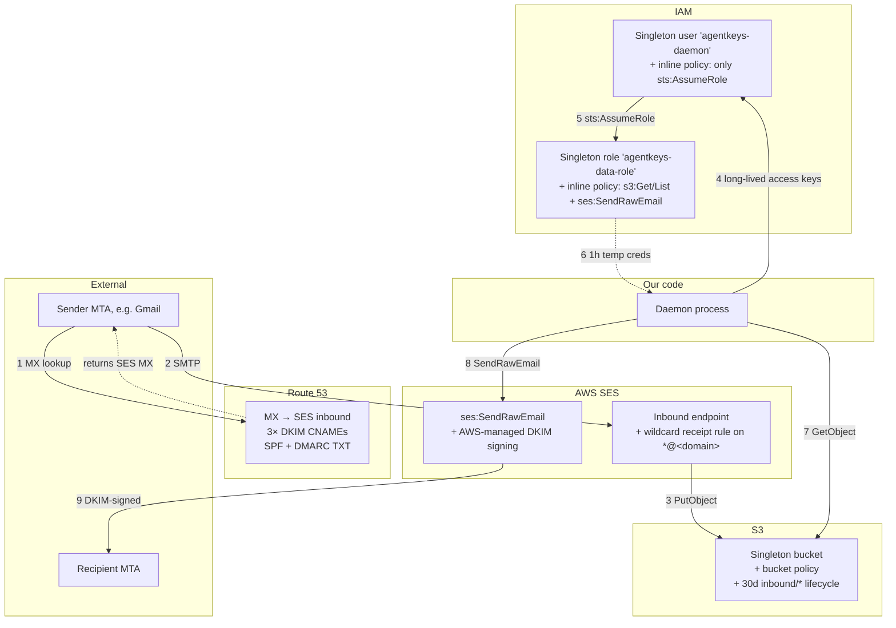

# Email System — Architecture, Backends, and Usage Isolation

**Status:** design consolidation (2026-04-18)
**Scope:** how AgentKeys handles email across Stage 5 (provisioning demo) and v0.1 (production)
**Companion specs:**
- `docs/spec/ses-email-architecture.md` — Stage 6 primary: SES data model, pipelines, DNS setup, key derivation, PrincipalTag isolation
- [oidc-federation](oidc-federation) — how the TEE federates as an OIDC identity provider into AWS/GCP/Azure/etc. (the "no static cloud credentials" story; SES IAM access rides on this)
- [tag-based-access](tag-based-access) — the JWT-claim → session-tag → bucket-policy mechanism enforcing per-user isolation on the shared `agentkeys-mail` bucket
- [hosted-first](hosted-first) — why `xxxxx@agentkeys-email.io` is the default; BYO custom domain is deferred to Stage 7+
- [knowledge-storage](knowledge-storage) — the parallel deferred decision for knowledge-base storage (GitHub / S3 / Drive / Ali Cloud)
- `docs/spec/email-signing-backends.md` — generalized three-layer backend comparison (DWD / TEE / SES)
- `docs/stage5-workspace-email-setup.md` — **advanced / deferred:** Google Workspace DWD operator runbook for enterprise BYO

---

## TL;DR

AgentKeys treats email as a credential-managed resource under the same `Authority` / `Broker` / `GrantStore` abstraction used for session tokens and API keys. Three email channels exist in the product, strictly separated by role:

1. **Agent mailbox** — hosted on AgentKeys infrastructure at `xxxxx@agentkeys-email.io` (Stage 6 default, zero setup). Service providers (OpenRouter, Anthropic, Brave, …) send OTPs here. Agent reads via minted creds directly from S3; we never proxy. Per-user isolation enforced by AWS via `aws:PrincipalTag/agentkeys_user_wallet` from the OIDC JWT claim.
2. **User identity / notification** — user's own Gmail (or whatever). We send TO this address; we NEVER read from it.
3. **User approval (optional 2FA)** — same address as #2. We send a magic-link or 6-digit code for high-value operations; user clicks/types; backend creates the grant. Alternative / supplement to Touch ID (#11) when the master Mac is unavailable.

**Three principles anchor the design:**
- **Hosted-first**: every user gets a working inbox at zero setup cost. See [hosted-first](hosted-first). BYO custom domain is deferred past Stage 7.
- **Send to the user's Gmail, never read from it**: agent-side mail lives on our SES; user-side mail stays fully under user control.
- **Broker, not proxy**: our backend mints ephemeral SES/S3 credentials; the daemon calls SES and S3 directly via MCP. Per-operation compute cost on our side is zero.

---

## Usage isolation — three email channels, three roles

```
┌──────────────────────────────────────────────────────────────┐
│  1. AGENT MAILBOX                                            │
│     <agent>@agentkeys-email.io  (our SES, v0.1)              │
│     Hosts: our infra. Agent reads via minted S3 creds.       │
│     Purpose: receive service-provider OTPs + confirmations.  │
│     User does NOT share this inbox.                          │
│                                                              │
│  2. USER IDENTITY / NOTIFICATION                             │
│     jane@gmail.com              (her own Gmail)              │
│     Hosts: Google. We SEND TO it via our SES. Never read.    │
│     Purpose: login identity + status notifications.          │
│                                                              │
│  3. USER APPROVAL (optional 2FA)                             │
│     Same as #2 (jane@gmail.com).                             │
│     Purpose: magic-link or 6-digit code for approvals when   │
│     Touch ID on master Mac isn't reachable. Send-only.       │
│                                                              │
└──────────────────────────────────────────────────────────────┘
```

### Why the separation matters

- **Audit attribution.** Agent mail is under our full control → every read logs per-child. The user's real Gmail never pollutes our audit trail.
- **Credential isolation.** Each agent has its own mailbox (native in SES; per-throwaway-user in DWD). No shared root credential reads multiple users' mail.
- **No per-user OAuth integration.** We never store refresh tokens into users' Gmail. Onboarding is zero-friction for users.
- **User stays in control.** Their personal inbox is untouched by their agents' work.

### What this rules out

- Reading the user's real Gmail for OTPs. Even if we could get OAuth consent, it collapses channels #1 and #2 into one inbox — bad for audit, bad for user experience, fragile against Google's policy changes.
- Using a service account or DWD to impersonate the user on their personal Gmail. Personal Gmail can't have DWD pointed at it; would require an OAuth app with install-wide consent, which Google restricts.

---

## Three-layer abstraction

The centralized-root-key + signed-short-lived-token-after-policy-check pattern (common to AWS STS, Google DWD, Kubernetes TokenRequest, OAuth2, Vault) decomposes into three concerns:

| Layer | Responsibility | Max TTL enforced here |
|---|---|---|
| `TokenAuthority` | Holds the signing key, produces tokens | Platform limit (e.g. Google 1h) |
| `GrantStore` | Durable long-lived authorization policy; Touch-ID-gated on create | AgentKeys policy (30d) |
| `TokenBroker` | Verifies session, checks grant, clamps TTL to `min(spec, grant, authority)`, calls authority, emits audit | — |

**Critical invariant: Broker is colocated with Authority** (same trust boundary). The daemon is a thin client calling broker over RPC; policy enforcement never lives behind the daemon (that would allow policy-skip attacks).

### Services × Versions matrix

Each cell: *Authority / Broker / GrantStore · max TTL*

| Service | v0 (mock) | v0.1 (Heima TEE) |
|---|---|---|
| Session tokens | MockBackend / MockBackend / SQLite · 30d | TEE / TEE / chain · 30d |
| Credential access | MockBackend (AES) / MockBackend / SQLite · — | TEE (shielding key) / TEE / chain · — |
| Email access | MockBackend (wraps SES or DWD) / MockBackend / SQLite · 30d grant | TEE (wraps SES or DWD) / TEE / chain · 30d grant |
| Pairing / AuthRequest | MockBackend / MockBackend / SQLite · 60s → 30d | TEE / TEE / chain · 60s → 30d |
| Audit events | MockBackend (appends rows) / MockBackend / SQLite · — | TEE (signs extrinsics) / TEE / chain · — |

### One-line rule per version

- **v0:** *"Mock backend is the authority AND broker. SQLite is the grant store."*
- **v0.1:** *"TEE is the authority AND broker. Chain is the grant store."*

Five services, one architectural shape.

---

## Backend options for the agent mailbox

Three credible implementations. Stage 5 picks one, v0.1 picks one, the abstraction allows switching.

| | Google Workspace DWD | AWS SES (self-hosted) | AgentMail (SaaS) |
|---|---|---|---|
| Mailbox infra | Google Workspace | Our AWS SES (own domain + MX + DKIM + Lambda) | AgentMail (also built on AWS SES under the hood — verified via DNS: `agentmail.to` MX → `inbound-smtp.us-east-1.amazonaws.com`, NS → Route 53) |
| Setup cost | ~20 min admin console (custom role + OU + SA + DWD) | 1-2 weeks code + 30 min DNS | ~5 min signup |
| Per-inbox credential | DWD JWT signing → 1h access token (exchange via `oauth2/token`) | Long-lived scoped bearer (we mint, we verify) | Scoped API key |
| Max token TTL | **1h (Google platform cap)** | **30d (our policy)** | Until revoked |
| Provisioning speed | ~60s (Workspace user replication across services) | <1ms (DB insert) | ~1s (HTTP) |
| Audit model | GCP Cloud Audit Logs (operator-controlled by Google) | Our pipeline (chain-immutable in v0.1) | AgentMail dashboard (operator-controlled by vendor) |
| Cost at 300 inboxes/mo | ~$1800 (seats) | ~$1 | pricing opaque |
| Vendor risk | Google (stable, but deprecation-prone historically) | AWS (very stable, 20yr service) | Startup (pivot / shutdown risk) |
| TEE fit in v0.1 | Open question: does Google accept TEE-attested pubkey as DWD client ID? | TEE holds AWS IAM creds (standard sealed-credential pattern) | TEE holds API key (simple) |
| Chain-immutable audit alignment | ❌ | ✅ | ❌ |

### Decision

**SES as primary for v0.1.** Matches chain-immutable audit model; cost scales; no foreign admin-console step after one-time DNS.

**DWD as a documented operator variant.** For environments with an existing Workspace subscription that don't want to build/maintain SES infra. Smaller operational footprint, at the cost of 1h access-token dance + operator-controlled audit.

**AgentMail is not shipped as a first-party backend.** The three-layer abstraction lets a customer plug in `AgentMailAuthority` if they want, but we don't own it because (a) fights our audit model, (b) vendor lock to a startup, (c) duplicates SES without advantage for our scale.

---

## SES architecture, one page (full spec: `docs/spec/ses-email-architecture.md`)

Minimal broker-not-proxy shape. Our infrastructure handles only credential minting, ingress routing, and audit. Every per-operation concern — MIME parsing, threading, labels, drafts, webhooks — lives in the daemon, not on our side.

| Piece | What it is |
|---|---|
| **Inbox** | On-chain row `(user_wallet, agent_wallet, inbox_address)`. `inbox_address` is the email itself — e.g. `abc123@agentkeys-email.io`. No server-side message/thread/label store. |
| **Receive** | SES receipt rule drops raw MIME to `s3://agentkeys-mail/<user_wallet>/<inbox>/<msg_id>.eml`. No Lambda. No parsing. No DB writes. Per-email compute on our side: zero. |
| **Send** | Daemon assembles MIME, calls the TEE to DKIM-sign the message (Ed25519 BYODKIM, key derived at `dkim/agentkeys-email.io/v1` — Rule #2 keeps the signing key inside the enclave), then mints temp SES creds via OIDC federation and calls `ses:SendRawEmail` directly. IAM role condition on `ses:FromAddress` pins the daemon to its own inbox address. Per-send compute on our side: one signature inside the TEE, zero app-layer compute. |
| **Read** | Daemon mints temp S3 creds with `PrincipalTag/agentkeys_user_wallet` from the JWT claim. Bucket policy conditions limit the daemon to its own user's prefix. Daemon lists/gets S3 objects and parses MIME client-side. Per-read compute on our side: zero. |
| **Domain (hosted default)** | We operate `agentkeys-email.io`; MX + SPF + DMARC + AWS_SES DKIM set once on our side. User-side DNS: none. |
| **OIDC federation** | TEE-derived ES256 issuer key at `derive("oidc/issuer/v1")`. JWT claims include `agentkeys_user_wallet` for PrincipalTag isolation. See [oidc-federation](oidc-federation). |
| **Per-user isolation** | `aws:PrincipalTag/agentkeys_user_wallet` conditions on both the S3 bucket policy (read) and IAM role / SES identity policy (send). One bucket + one role, cryptographic per-user separation. See [tag-based-access](tag-based-access). |
| **Audit** | Every credential mint emits an on-chain extrinsic: `(child, operation, inbox_address, ts)`. No per-operation audit on our side — CloudTrail is the AWS-side record; our chain log is the attribution-per-agent record. |

**Why SES wins over Gmail DWD for Stage 6:**
- Per-user isolation via PrincipalTag; one bucket/role scales to every user without per-user IAM state.
- 30-day AgentKeys session-token model matches policy; no 1-hour Google-access-token dance.
- Cost ~10–100× cheaper at agent scale.
- **No static cloud credentials at rest.** SES/S3 access comes from OIDC federation; the TEE's ES256 key generalizes to GCP/Azure/Ali Cloud/K8s via the same [oidc-federation](oidc-federation).

---

## Architecture topology — singleton scaling model

The SES email stack uses **singleton AWS resources** with logical or cryptographic per-user isolation, not per-user AWS resources. This is what makes it scale to millions of AgentKeys users without hitting IAM quotas.

### Resource graph



### Singleton vs per-user — what scales how

| Singleton — one per AWS account regardless of user count | Per-user — logical, no AWS resource per user |
|---|---|
| 1 IAM user `agentkeys-daemon` | N throwaway addresses `bot-<random>@<domain>` (DB / on-chain) |
| 1 IAM role `agentkeys-data-role` | N S3 objects under `inbound/<msg-id>.eml` (lifecycle-capped) |
| 1 S3 bucket | (no other AWS resources scale per user) |
| 1 SES domain identity | |
| 1 SES wildcard receipt rule on `*@<domain>` | |

### Why singleton — AWS quotas would cap per-user IAM

| Resource | AWS default quota | Implication if used per AgentKeys user |
|---|---|---|
| IAM users | 5,000 / account | Total user count capped at 5k |
| IAM roles | 1,000 / account | Total user count capped at 1k |
| S3 buckets | 100 (raisable to 1,000) | Capped at ~1k |
| SES verified identities | 10,000 / account | Plenty, but ops debt to manage |

Our design moves the bottleneck from IAM (hard cap) to SES inbound rate (60 msg/sec/region default, raisable on request). Storage math at 10k users × 5 throwaway inboxes × 2 verification mails: ~100k S3 objects steady-state with 30d TTL = ~500MB = ~$0.01/month.

### Trust chain

```
operator's long-lived AWS access keys (stored in 1Password)
  ↓ injected to daemon as AWS_ACCESS_KEY_ID + AWS_SECRET_ACCESS_KEY env
IAM user (agentkeys-daemon)
  ↓ sts:AssumeRole — only action this user can perform
IAM role (agentkeys-data-role)
  ↓ returns 1h temp creds (auto-refreshed)
S3 GetObject + ses:SendRawEmail API calls
```

Compromise of the long-lived access keys is bounded to "attacker can assume the role." Rotating the keys is one CLI call (`aws iam create-access-key` + delete the old one); the role and its permissions are untouched.

### Per-user isolation — Stage 6 vs Stage 7

| | Stage 6 interim (shipped today) | Stage 7 target |
|---|---|---|
| Bucket policy | `agentkeys-data-role` reads whole bucket | `agentkeys-data-role` only reads prefix matching `${aws:PrincipalTag/agentkeys_user_wallet}` |
| Per-user separation | App-side — daemon filters by `To:` header | Cloud-side — bucket policy denies cross-prefix reads |
| Failure mode if our app has a bug | User A could read user B's mail | `AccessDenied` from S3 |
| Auth flow | Long-lived IAM user → `sts:AssumeRole` | OIDC JWT (with `agentkeys_user_wallet` claim) → `sts:AssumeRoleWithWebIdentity` |
| AWS resources | Same singletons | Same singletons (no new IAM per user) |

Stage 7 is documented in [oidc-federation](oidc-federation) and [tag-based-access](tag-based-access). The migration from Stage 6 → 7 swaps the auth flow but keeps the singleton design — same one bucket, same one role, both paths.

---

## How we differ from AgentMail

AgentMail is a SaaS running on AWS SES. They proxy per-operation: agents call their API, their servers parse MIME, compute threads, manage drafts/labels/webhooks on the client's behalf. Their compute cost scales with user operation frequency.

We use the same underlying SES primitives (inbound to S3, SendRawEmail for outbound, domain DKIM/MX/SPF) but **do not adopt their SaaS feature surface**. Threading, labels, drafts, allow-block lists, webhook fan-out, and per-operation events are either (a) handled daemon-side via MCP, (b) deferred to the user's own tooling, or (c) absent until a real use-case forces them in. Our backend stays a credential broker and audit layer — no per-operation compute.

Single architectural learning we kept from AgentMail: `inbox_id` is the email address string itself (saves an ID↔address lookup). Everything else — drafts, labels, webhooks, the event taxonomy, server-side threading — lives outside our backend per the broker-not-proxy principle.

---

## TTL nesting

```
Child bearer token     = 30 days   (AgentKeys session-key policy, wiki/session-token.md §1)
  └── EmailImpersonate grant = 30 days   (our policy ceiling on email scope)
      └── Email access token = 1 hour   (only if DWD; SES has no short-lived token)
```

- **Access token** expires first (DWD: 1h; SES: N/A). Child re-requests silently from backend; no human involvement.
- **Grant** expires at 30d. Child's email ops start failing with `GRANT_EXPIRED`; master must re-approve (with Touch ID) to extend. No auto-renewal.
- **Bearer token** expires at 30d. Child re-authenticates via the standard AgentKeys re-auth path. Independent of the grant.

The 1-hour access-token dance is a Google/DWD constraint only. With SES, our backend authorizes operations live per-call; no short-lived token minting needed. The abstraction captures this as `authority.max_token_ttl()` — DWD returns 1h, SES returns 30d, callers clamp automatically.

---

## Touch ID gate (issue #11) — backend-agnostic

The gate fires at **`GrantStore::create`** (master-side, via `approve_auth_request`). Silent everywhere else:

| Action | Side | Gate |
|---|---|---|
| Create `EmailImpersonate` grant for a child | Master CLI | 🔒 Touch ID required |
| Change scope on an existing grant | Master CLI | 🔒 Touch ID required |
| Revoke a grant | Master CLI | 🔒 Touch ID required |
| Mint email access token (DWD path) | Child/daemon | 🔇 silent (grant-authorized) |
| Execute an email operation (list / get / send / trash) | Child/daemon | 🔇 silent |

Same rule as `agentkeys approve` (gated) vs `agentkeys read openrouter` (silent). The biometric prompt fires in the master CLI *before* it ever talks to the backend, so the gate inherits for every `TokenAuthority` implementation. DWD, SES, AgentMail — all share the same approval ceremony.

---

## Stage roadmap (2026-04-19)

| Stage | Email backend | User setup | Status |
|---|---|---|---|
| **5 (current)** | Dedicated personal Gmail + TOTP + app password | ~10 min one-time for the developer running the demo | Ships the live OpenRouter-provision demo |
| **6 (next)** | **Hosted `xxxxx@agentkeys-email.io`** — SES + TEE-held Ed25519 DKIM + ES256 OIDC + PrincipalTag isolation | **Zero** — inbox exists the moment the agent is created | Next stage after 5a/5b |
| **7** | Adds **bring-your-own custom domain** as an advanced opt-in (same architecture, different domain in the DKIM derivation path) | One-time DNS + BIND zone import on the user's domain | After 6 |
| Advanced (post-7) | Bring-your-own Workspace DWD (existing `docs/stage5-workspace-email-setup.md` runbook) | Workspace admin console setup | Enterprise deployment path |

### Why Stage 6 is hosted, not BYO

The BYO path we spec'd for Stage 5 Workspace DWD takes ~1 hour of admin-console clicking, requires a Workspace subscription ($6/user/month), and gates on "is the user a Google Workspace admin". That's enterprise friction; most users aren't enterprises.

The hosted default is zero-setup: AgentKeys operates the domain, the TEE holds the DKIM key, AWS enforces per-user isolation via PrincipalTag, and the user's agent gets a working inbox automatically. Cost on our side: pennies per user per month. See [hosted-first](hosted-first) for the full segmentation + parity argument (hosted and BYO share one architecture — migration is a cloud-account swap, not a code change).

---

## 2FA considerations for the dedicated demo Gmail

Gmail IMAP access chain:

> **App password** → requires **2FA enabled** → requires **second factor enrolled**

### Options for the second factor on a bot account

| Option | Ease | Suitable for |
|---|---|---|
| **TOTP via authenticator app** (recommended) | Enroll once into Google Authenticator / Authy / 1Password / Bitwarden | Long-term, CI-compatible |
| **Personal phone SMS** | Simplest, but ties to a person | Demo-only, not CI |
| **FIDO2 hardware key** | Overkill for demo | Very high-security accounts |

### Key insight

Once the app password is generated at [myaccount.google.com/apppasswords](https://myaccount.google.com/apppasswords), **the demo sees zero 2FA prompts**. App passwords bypass 2FA by design — they're Google's non-interactive credential, scoped to IMAP only, revocable anytime. The 2FA dance is one-time setup only.

---

## Open items / follow-ups

- ~~**Add SES as first-class backend spec**~~ — done: `docs/spec/ses-email-architecture.md` covers the data model, receive/send pipelines, DNS setup, key derivation (§10.5), and v0/v0.1 split. `docs/spec/email-signing-backends.md` still needs its SES row folded in.
- ~~**TEE as OIDC provider**~~ — done: [oidc-federation](oidc-federation) spec covers the ES256 key derivation, AWS-docs-verified algorithm constraints, JWT shape, consumer-registration recipes, and build cost.
- **Write `docs/spec/token-authority-model.md`** — the general three-layer spec, with this email instance as one of several (alongside session tokens, credentials, pairing).
- **BYODKIM-with-TEE detailed flow** — how the TEE registers its Ed25519 DKIM pubkey with DNS (Route 53 API? attestation step?), key rotation cadence, and what happens when DNS propagation lags enclave restart.
- **OIDC-issuer hostname decision** — `oidc.agentkeys.dev` proposed. Needs DNS + Let's Encrypt cert setup once we commit.
- **OIDC `sub` claim format decision** — proposed `enclave:<mrenclave>:<mrsigner>:agent:<child_wallet>`; finalize once Heima TEE attestation format is confirmed.
- **v0.1 open question:** will Google accept a TEE-attested public key as a DWD client ID? If no, the TEE-native DWD path degrades to "TEE holds GCP OAuth creds and calls `iamcredentials.signJwt`" — still better than raw Backend A because the policy check is inside the enclave, but weakens the "no key in Google's hands" property. Only relevant if DWD stays as the enterprise-alternative path. (Note: with OIDC federation into GCP Workload Identity, we can skip DWD entirely for any cloud consumer that accepts OIDC — making DWD a purely Google-specific workaround if we want Gmail integration specifically.)
- **Email-2FA approval flow spec** — the #11 biometric gate doc should grow a "mobile fallback via email" section with: message templates, magic-link vs 6-digit-code trade-off, TTL (≤ 10 min), replay protection via single-use nonce, CSRF on the magic-link endpoint.
- **Decide on AgentMail**: third-class backend (plugin-only) or drop entirely. Leaning drop, given their infra is SES and our SES impl gives us the things their SaaS does not (chain audit, per-child isolation via grants, no static cloud creds).

---

## Cross-references

- **`docs/spec/ses-email-architecture.md`** — **v0.1 primary**: full SES data model, receive + send pipelines, DNS setup, key derivation (§10.5 — Ed25519 DKIM + ES256 OIDC federation), v0/v0.1 split, build plan. The "how" of the SES path.
- **[oidc-federation](oidc-federation)** — how the TEE federates into AWS/GCP/Azure/Snowflake/K8s as an OIDC identity provider; the "no static cloud creds" story that SES inherits
- `docs/spec/email-signing-backends.md` — generalized three-layer backend comparison (DWD / TEE; needs SES row folded in)
- `docs/spec/credential-backend-interface.md` — existing `CredentialBackend` trait we're extending
- `docs/stage5-workspace-email-setup.md` — Workspace DWD operator runbook (alternative enterprise path)
- `docs/manual-test-stage5.md` §1 — Stage 5 demo entry point (uses the dedicated-Gmail path; will migrate to SES once built)
- [session-token](session-token) — 30-day session-key policy inherited for email grants
- [blockchain-tee-architecture](blockchain-tee-architecture) — stateless-TEE-plus-chain rationale (this spec inherits)
- [key-security](key-security) — two-tier storage model
- **AgentMail primary sources (for reference)**:
  - `github.com/agentmail-to/agentmail-schemas` — their public Zod schemas (where we verified `AWS_SES | BYODKIM` and the event taxonomy)
  - `github.com/agentmail-to/agentmail-mcp` — MCP tool surface (`get_message`, `send_message`, `reply_to_message`, …)
  - `docs.agentmail.to/custom-domains` — custom-domain DNS flow (BIND zone download pattern)
  - DNS evidence: `dig +short MX agentmail.to` → `10 inbound-smtp.us-east-1.amazonaws.com` (confirms AWS SES infra)
- Issue [#11](https://github.com/litentry/agentKeys/issues/11) — biometric gate for master CLI high-security actions
- Issue [#10](https://github.com/litentry/agentKeys/issues/10) — bearer-token terminology

