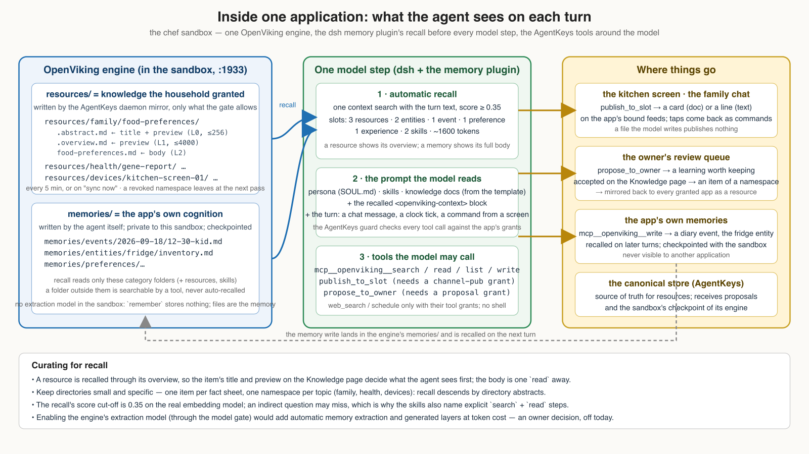
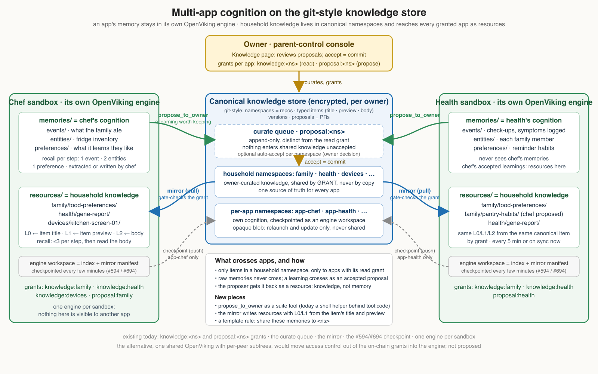

Where a household's knowledge lives, what each application's agent sees of it, and how something an agent learns can reach the other applications. Two stores, two vocabularies: the **canonical knowledge store** is AgentKeys' git-style repository of what the household knows; the **engine** inside each application's sandbox is OpenViking, which holds a bounded copy for retrieval and the agent's own memory. This page is the user-level map; the authoring guide for applications is [Family Application Templates](./family-application-templates.md), the provider model is [Memory Providers and Agents](./memory-providers-and-agents.md), and the normative model is [`../arch.md`](../arch.md) §17.6.

**Status:** shipped 2026-09-18 (resources layout, the `propose_to_owner` tool, knowledge docs in the prompt). Automatic push and store-side compaction are an epic in progress; the engine's extraction model stays off in the sandbox.

## The two stores

| | Canonical knowledge store | OpenViking engine |
|---|---|---|
| **Where** | AgentKeys' encrypted object store, one per owner | inside each application's sandbox, one engine per application |
| **What** | namespaces (`family`, `health`, `devices`, `app-chef`, …) of typed items: title, preview, body, versions | `resources/` (knowledge the app was granted) and `memories/` (what the app learned) |
| **Who writes** | the owner on the Knowledge page; an agent only through a proposal the owner accepts | the daemon mirror (resources) and the agent itself (memories) |
| **Access rule** | on-chain grants per application: `knowledge:<ns>` to read, `proposal:<ns>` to propose | structural: the engine only ever holds what the mirror was allowed to copy plus the app's own memory |
| **Survives** | forever, versioned | the sandbox's lifetime, checkpointed for relaunch and update |

The store is the truth and the engine is a working copy. Revoke a grant and the copy leaves the engine at the next mirror pass; relaunch a sandbox and the copy is rebuilt from the store.

## Inside one application

- **Resources are the granted knowledge.** For every item of a namespace the application may read, the daemon mirror writes a small directory into the engine's `resources/`: an abstract and an overview built from the item's **title and preview**, and the body. OpenViking's per-turn recall draws on those layers, so the title and preview curated on the Knowledge page are literally what the agent sees first; the body is one `read` away.
- **Memories are the agent's own cognition.** Its diary, inventories and learned preferences are files it writes into the engine's category folders (`memories/events/`, `memories/entities/`, `memories/preferences/`). Recall reads only those categories, which is why a template's skills name them. They are private to the sandbox and never reach another application.
- **Each turn starts with a recall.** Before every model step the memory plugin runs one context search with the turn's text and injects what scores above 0.35, within a budget of ten entries: three resources, two entities, one event, one preference, one experience, two skills, about 1600 tokens. A resource contributes its overview; a memory contributes its full body. The skills also name explicit `search` and `read` steps, because an indirect question can fall below the cut-off.
- **The engine's extraction model is off.** The sandbox runs OpenViking for search and ranking only, so `remember` and session commits extract nothing and no layers are generated. The mirror supplies the layers from the item's title and preview instead; the agent writes its memories as files. Turning the model on through the model gate would add automatic extraction and generated layers at token cost; it is an owner decision.

## Across applications

- **Household knowledge crosses by grant, never by copy.** An item of `family` reaches the chef and the health app because both hold `knowledge:family`; there is one source of truth and two mirrored copies.
- **Raw memories never cross.** What the chef learned stays in the chef's engine.
- **A learning crosses as a proposal.** When an agent judges something worth keeping beyond its sandbox, it calls `propose_to_owner`; the proposal lands in the owner's review queue under the agent's `proposal:<ns>` grant, append-only and rate-limited. Accepting it on the Knowledge page makes it an item of the namespace the owner chooses, and the next mirror pass delivers it to every granted application, the proposer included, as a resource: knowledge, not memory.
- **Per-app namespaces hold cognition, not shared knowledge.** `app-chef` holds the chef's checkpoint (its engine workspace as an opaque blob) so a relaunch keeps what it learned; it is never mirrored to another application.

## What goes where: a household's examples

| Content | Home | Reaches | Written by |
|---|---|---|---|
| Food preferences profile | `family` namespace → `viking://resources/family/food-preferences/` in every granted app | chef, health, … | the owner (Knowledge page) |
| Gene report | `health` namespace → `viking://resources/health/gene-report/` | the apps granted `health` | the owner (upload) |
| A device's static files | `devices` namespace → `viking://resources/devices/<device>/` | the apps that drive the device | the owner or the device's install |
| What the family ate today | chef's engine, `memories/events/<date>/` | chef only | chef, with `mcp__openviking__write` |
| The fridge inventory | chef's engine, `memories/entities/fridge/inventory.md` | chef only | chef |
| "No more pork" said in chat | a proposal to `family` → an item once accepted → a resource everywhere | every app granted `family` | chef proposes, the owner accepts |

## Operator notes

- The mirror runs every five minutes and on the console's "sync now"; a new grant or a revoked one lands within that window.
- The engine's version is pinned with the sandbox image (OpenViking 0.4.16); the CI suite `suite-7` proves the mirror layout on the same version.
- Devices' files belong under `resources/devices/`, not under `memories/`: a custom folder under `memories/` sits outside the recall categories and is never auto-recalled.
- Naming: on the store side the words are **knowledge** (`knowledge:<ns>`) and **proposal** (`proposal:<ns>`); on the engine side, OpenViking's **resources** and **memories**. The old `memories/<namespace>/` mirror layout is gone; a live sandbox migrates itself at its next pass.
